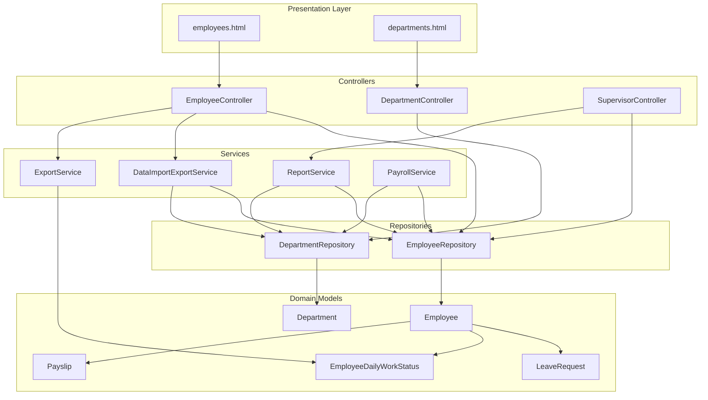
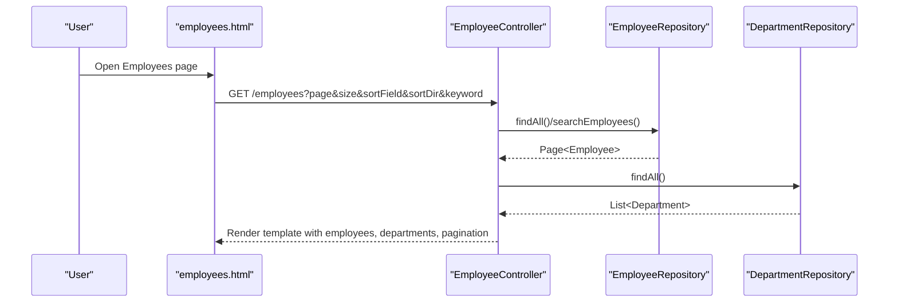
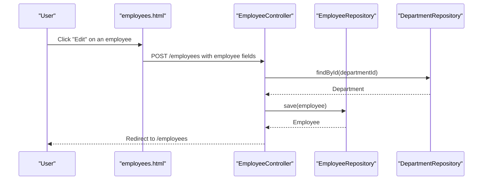
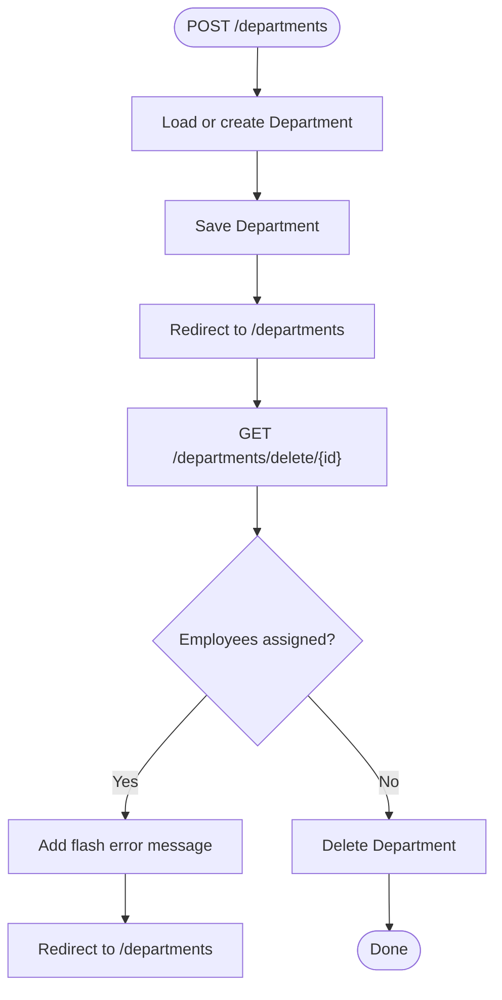
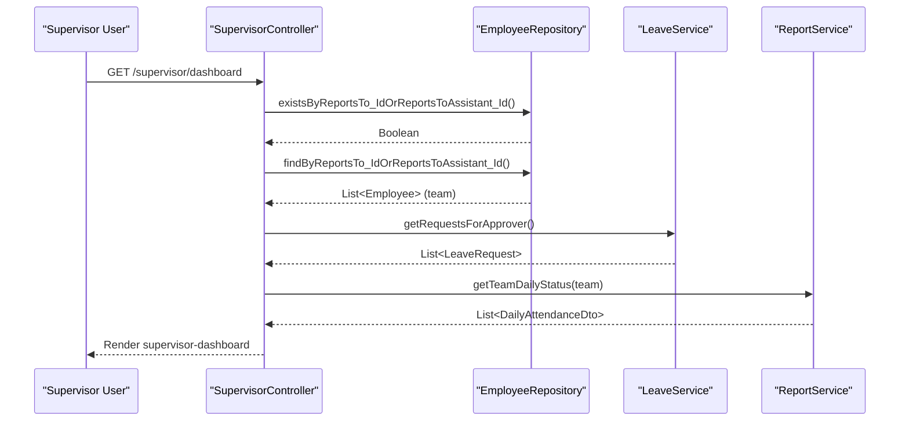
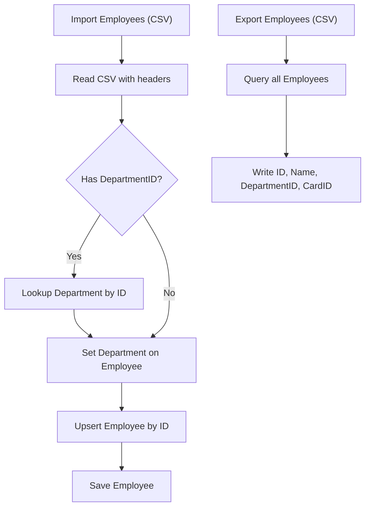
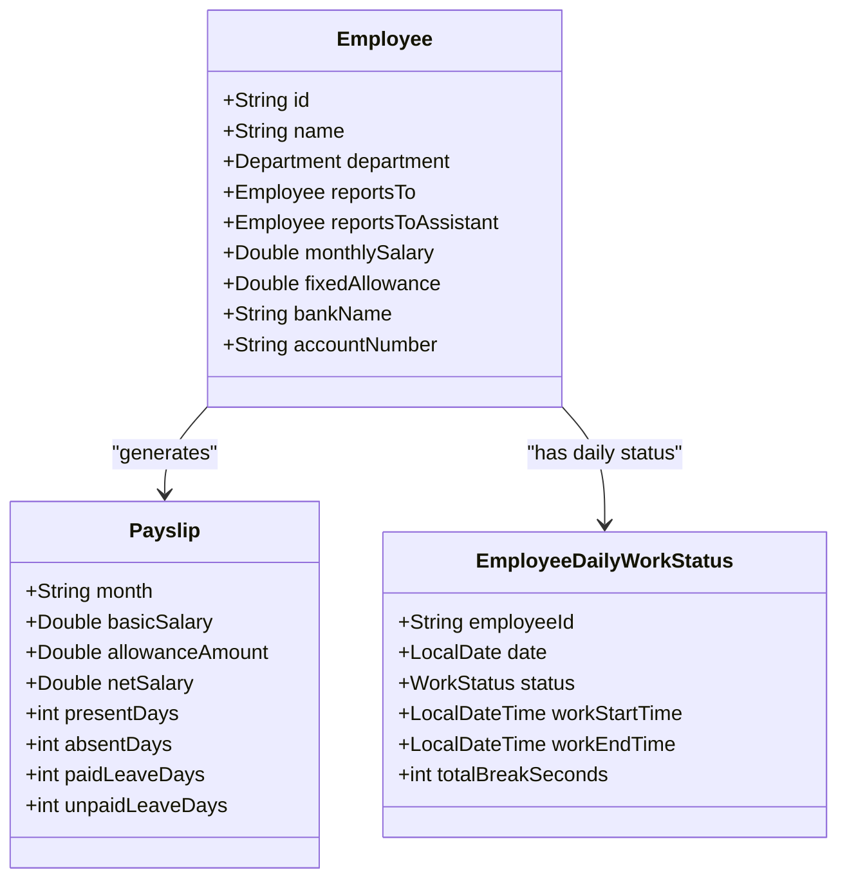
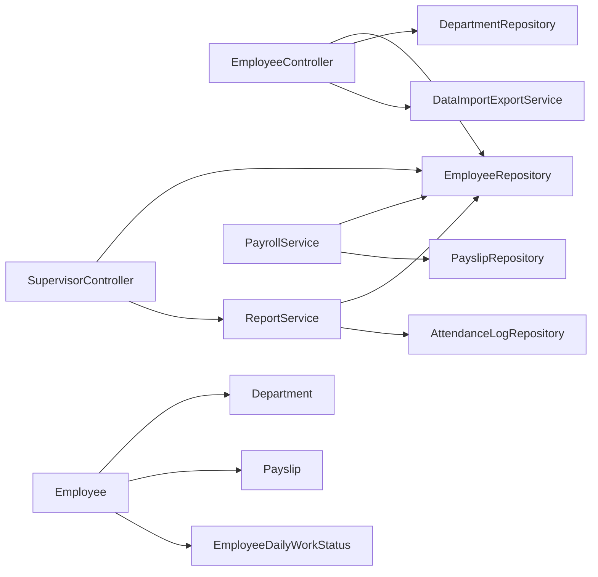
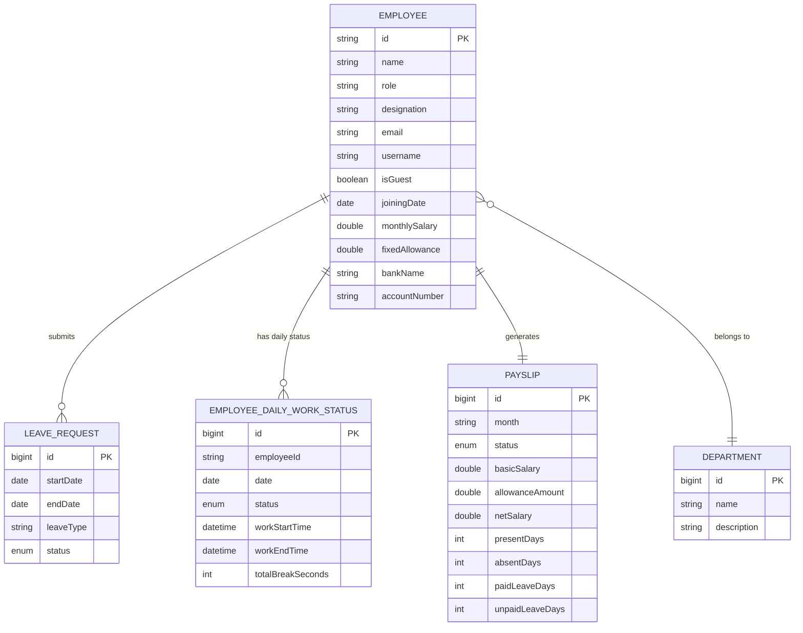

# Employee Management

<cite>
**Referenced Files in This Document**
- [Employee.java](file://src/main/java/root/cyb/mh/attendancesystem/model/Employee.java)
- [Department.java](file://src/main/java/root/cyb/mh/attendancesystem/model/Department.java)
- [EmployeeController.java](file://src/main/java/root/cyb/mh/attendancesystem/controller/EmployeeController.java)
- [DepartmentController.java](file://src/main/java/root/cyb/mh/attendancesystem/controller/DepartmentController.java)
- [EmployeeRepository.java](file://src/main/java/root/cyb/mh/attendancesystem/repository/EmployeeRepository.java)
- [DepartmentRepository.java](file://src/main/java/root/cyb/mh/attendancesystem/repository/DepartmentRepository.java)
- [DataImportExportService.java](file://src/main/java/root/cyb/mh/attendancesystem/service/DataImportExportService.java)
- [ExportService.java](file://src/main/java/root/cyb/mh/attendancesystem/service/ExportService.java)
- [SupervisorController.java](file://src/main/java/root/cyb/mh/attendancesystem/controller/SupervisorController.java)
- [EmployeeDailyWorkStatus.java](file://src/main/java/root/cyb/mh/attendancesystem/model/EmployeeDailyWorkStatus.java)
- [Payslip.java](file://src/main/java/root/cyb/mh/attendancesystem/model/Payslip.java)
- [PayrollService.java](file://src/main/java/root/cyb/mh/attendancesystem/service/PayrollService.java)
- [ReportService.java](file://src/main/java/root/cyb/mh/attendancesystem/service/ReportService.java)
- [employees.html](file://src/main/resources/templates/employees.html)
- [departments.html](file://src/main/resources/templates/departments.html)
- [LeaveRequest.java](file://src/main/java/root/cyb/mh/attendancesystem/model/LeaveRequest.java)
</cite>

## Table of Contents
1. [Introduction](#introduction)
2. [Project Structure](#project-structure)
3. [Core Components](#core-components)
4. [Architecture Overview](#architecture-overview)
5. [Detailed Component Analysis](#detailed-component-analysis)
6. [Dependency Analysis](#dependency-analysis)
7. [Performance Considerations](#performance-considerations)
8. [Troubleshooting Guide](#troubleshooting-guide)
9. [Conclusion](#conclusion)
10. [Appendices](#appendices)

## Introduction
This document explains the Skylink Custom Backend’s employee management capabilities. It covers:
- Employee CRUD operations and profile management
- Department hierarchy and bulk department assignment
- Supervisor-employee relationships and reporting structures
- Import/export of employee data and integrations with attendance/payroll
- Practical workflows, organizational chart maintenance, and data consistency requirements

## Project Structure
The employee management system is implemented with Spring MVC controllers, JPA repositories, domain models, and services. UI templates provide forms and dashboards for administration and supervision.

**Diagram sources**
- [EmployeeController.java:16-213](file://src/main/java/root/cyb/mh/attendancesystem/controller/EmployeeController.java#L16-L213)
- [DepartmentController.java:14-69](file://src/main/java/root/cyb/mh/attendancesystem/controller/DepartmentController.java#L14-L69)
- [SupervisorController.java:21-215](file://src/main/java/root/cyb/mh/attendancesystem/controller/SupervisorController.java#L21-L215)
- [DataImportExportService.java:16-925](file://src/main/java/root/cyb/mh/attendancesystem/service/DataImportExportService.java#L16-L925)
- [ExportService.java:22-579](file://src/main/java/root/cyb/mh/attendancesystem/service/ExportService.java#L22-L579)
- [ReportService.java:24-1185](file://src/main/java/root/cyb/mh/attendancesystem/service/ReportService.java#L24-L1185)
- [PayrollService.java:15-318](file://src/main/java/root/cyb/mh/attendancesystem/service/PayrollService.java#L15-L318)
- [EmployeeRepository.java:11-31](file://src/main/java/root/cyb/mh/attendancesystem/repository/EmployeeRepository.java#L11-L31)
- [DepartmentRepository.java:6-8](file://src/main/java/root/cyb/mh/attendancesystem/repository/DepartmentRepository.java#L6-L8)
- [Employee.java:13-62](file://src/main/java/root/cyb/mh/attendancesystem/model/Employee.java#L13-L62)
- [Department.java:15-21](file://src/main/java/root/cyb/mh/attendancesystem/model/Department.java#L15-L21)
- [LeaveRequest.java:15-53](file://src/main/java/root/cyb/mh/attendancesystem/model/LeaveRequest.java#L15-L53)
- [EmployeeDailyWorkStatus.java:12-44](file://src/main/java/root/cyb/mh/attendancesystem/model/EmployeeDailyWorkStatus.java#L12-L44)
- [Payslip.java:14-56](file://src/main/java/root/cyb/mh/attendancesystem/model/Payslip.java#L14-L56)

**Section sources**
- [EmployeeController.java:16-213](file://src/main/java/root/cyb/mh/attendancesystem/controller/EmployeeController.java#L16-L213)
- [DepartmentController.java:14-69](file://src/main/java/root/cyb/mh/attendancesystem/controller/DepartmentController.java#L14-L69)
- [employees.html:8-441](file://src/main/resources/templates/employees.html#L8-L441)
- [departments.html:8-142](file://src/main/resources/templates/departments.html#L8-L142)

## Core Components
- Employee entity defines identity, profile, payroll, and reporting relationships.
- Department entity stores organizational units.
- Controllers expose endpoints for listing, creating/updating, deleting, and bulk operations.
- Repositories provide typed queries for employees and departments.
- Services handle import/export, reporting, and payroll calculations.

**Section sources**
- [Employee.java:13-62](file://src/main/java/root/cyb/mh/attendancesystem/model/Employee.java#L13-L62)
- [Department.java:15-21](file://src/main/java/root/cyb/mh/attendancesystem/model/Department.java#L15-L21)
- [EmployeeController.java:32-162](file://src/main/java/root/cyb/mh/attendancesystem/controller/EmployeeController.java#L32-L162)
- [DepartmentController.java:22-67](file://src/main/java/root/cyb/mh/attendancesystem/controller/DepartmentController.java#L22-L67)
- [EmployeeRepository.java:11-31](file://src/main/java/root/cyb/mh/attendancesystem/repository/EmployeeRepository.java#L11-L31)
- [DepartmentRepository.java:6-8](file://src/main/java/root/cyb/mh/attendancesystem/repository/DepartmentRepository.java#L6-L8)

## Architecture Overview
The system follows layered architecture:
- Presentation: Thymeleaf templates render forms and lists.
- Controllers: Handle HTTP requests, bind parameters, and orchestrate services.
- Services: Encapsulate business logic for import/export, reporting, and payroll.
- Persistence: JPA repositories manage Employee and Department entities.

**Diagram sources**
- [employees.html:33-64](file://src/main/resources/templates/employees.html#L33-L64)
- [EmployeeController.java:32-64](file://src/main/java/root/cyb/mh/attendancesystem/controller/EmployeeController.java#L32-L64)
- [EmployeeRepository.java:11-31](file://src/main/java/root/cyb/mh/attendancesystem/repository/EmployeeRepository.java#L11-L31)
- [DepartmentRepository.java:6-8](file://src/main/java/root/cyb/mh/attendancesystem/repository/DepartmentRepository.java#L6-L8)

## Detailed Component Analysis

### Employee CRUD and Profile Management
- Listing: Paginated, sortable, and searchable by name/email/role/designation/ID/department.
- Create/Update: Supports setting department, roles, designations, supervisors, assistants, leave quota, salary, allowances, bank details, and optional login credentials.
- Delete: Removes employee by ID.
- Bulk actions: Select multiple employees and assign a department in bulk.

**Diagram sources**
- [employees.html:188-296](file://src/main/resources/templates/employees.html#L188-L296)
- [EmployeeController.java:66-139](file://src/main/java/root/cyb/mh/attendancesystem/controller/EmployeeController.java#L66-L139)
- [DepartmentRepository.java:6-8](file://src/main/java/root/cyb/mh/attendancesystem/repository/DepartmentRepository.java#L6-L8)
- [EmployeeRepository.java:11-31](file://src/main/java/root/cyb/mh/attendancesystem/repository/EmployeeRepository.java#L11-L31)

**Section sources**
- [EmployeeController.java:32-162](file://src/main/java/root/cyb/mh/attendancesystem/controller/EmployeeController.java#L32-L162)
- [employees.html:104-182](file://src/main/resources/templates/employees.html#L104-L182)

### Department Hierarchy Management
- Listing and sorting by ID/name/description.
- Create/update/delete departments.
- Prevent deletion if employees are assigned to the department.

**Diagram sources**
- [DepartmentController.java:40-67](file://src/main/java/root/cyb/mh/attendancesystem/controller/DepartmentController.java#L40-L67)
- [DepartmentRepository.java:6-8](file://src/main/java/root/cyb/mh/attendancesystem/repository/DepartmentRepository.java#L6-L8)

**Section sources**
- [DepartmentController.java:22-67](file://src/main/java/root/cyb/mh/attendancesystem/controller/DepartmentController.java#L22-L67)
- [departments.html:30-81](file://src/main/resources/templates/departments.html#L30-L81)

### Supervisor-employee Relationships and Reporting Structures
- An employee may have a primary supervisor and/or an assistant supervisor.
- Supervisors can view team members and pending leave/advance requests.
- Access control ensures only supervisors or admins see supervisor dashboards.

**Diagram sources**
- [SupervisorController.java:32-138](file://src/main/java/root/cyb/mh/attendancesystem/controller/SupervisorController.java#L32-L138)
- [EmployeeRepository.java:15-19](file://src/main/java/root/cyb/mh/attendancesystem/repository/EmployeeRepository.java#L15-L19)
- [LeaveRequest.java:15-53](file://src/main/java/root/cyb/mh/attendancesystem/model/LeaveRequest.java#L15-L53)

**Section sources**
- [Employee.java:22-29](file://src/main/java/root/cyb/mh/attendancesystem/model/Employee.java#L22-L29)
- [SupervisorController.java:32-138](file://src/main/java/root/cyb/mh/attendancesystem/controller/SupervisorController.java#L32-L138)

### Import/Export Functionality and Data Validation
- Export employees, departments, leave requests, devices, settings, and users to CSV.
- Import employees, departments, leave requests, devices, and settings from CSV.
- Data validation rules:
  - Employee ID must match device ID (critical for attendance linkage).
  - Optional password is hashed before storage.
  - Bulk department assignment requires valid department ID and non-empty employee list.
  - Department deletion prevents cascade if employees exist.

**Diagram sources**
- [DataImportExportService.java:96-127](file://src/main/java/root/cyb/mh/attendancesystem/service/DataImportExportService.java#L96-L127)
- [DataImportExportService.java:40-48](file://src/main/java/root/cyb/mh/attendancesystem/service/DataImportExportService.java#L40-L48)
- [EmployeeController.java:147-162](file://src/main/java/root/cyb/mh/attendancesystem/controller/EmployeeController.java#L147-L162)

**Section sources**
- [DataImportExportService.java:96-209](file://src/main/java/root/cyb/mh/attendancesystem/service/DataImportExportService.java#L96-L209)
- [EmployeeController.java:147-162](file://src/main/java/root/cyb/mh/attendancesystem/controller/EmployeeController.java#L147-L162)

### Attendance and Payroll Integration
- Attendance data feeds into reports and payroll calculations.
- PayrollService computes monthly payslips based on attendance, leaves, and schedules.
- ReportsService generates daily/weekly/monthly summaries and integrates live work status.

**Diagram sources**
- [Employee.java:13-62](file://src/main/java/root/cyb/mh/attendancesystem/model/Employee.java#L13-L62)
- [Payslip.java:14-56](file://src/main/java/root/cyb/mh/attendancesystem/model/Payslip.java#L14-L56)
- [EmployeeDailyWorkStatus.java:12-44](file://src/main/java/root/cyb/mh/attendancesystem/model/EmployeeDailyWorkStatus.java#L12-L44)

**Section sources**
- [PayrollService.java:39-92](file://src/main/java/root/cyb/mh/attendancesystem/service/PayrollService.java#L39-L92)
- [ReportService.java:47-100](file://src/main/java/root/cyb/mh/attendancesystem/service/ReportService.java#L47-L100)

### Practical Workflows

#### Workflow: Add Employee and Assign Department
- Open employees page, click “+ Add Employee”, fill form, select department and supervisors, submit.
- The controller resolves department and supervisor references and persists the employee.

**Section sources**
- [employees.html:188-296](file://src/main/resources/templates/employees.html#L188-L296)
- [EmployeeController.java:66-139](file://src/main/java/root/cyb/mh/attendancesystem/controller/EmployeeController.java#L66-L139)

#### Workflow: Bulk Department Assignment
- Select multiple employees, open “Bulk Actions → Assign Department”, choose department, submit.
- The controller updates all selected employees’ department in a single transaction.

**Section sources**
- [employees.html:19-26](file://src/main/resources/templates/employees.html#L19-L26)
- [EmployeeController.java:147-162](file://src/main/java/root/cyb/mh/attendancesystem/controller/EmployeeController.java#L147-L162)

#### Workflow: Supervisor Approve Leave
- Supervisor accesses dashboard, filters pending requests, approves or rejects with comments.
- Access control ensures only authorized supervisors can process requests.

**Section sources**
- [SupervisorController.java:173-210](file://src/main/java/root/cyb/mh/attendancesystem/controller/SupervisorController.java#L173-L210)

#### Workflow: Generate Monthly Payroll
- System iterates employees, aggregates attendance and approved leaves, computes deductions and net pay, persists payslips.

**Section sources**
- [PayrollService.java:39-92](file://src/main/java/root/cyb/mh/attendancesystem/service/PayrollService.java#L39-L92)

## Dependency Analysis
- Controllers depend on repositories and services.
- Services depend on repositories and models.
- Entities define relationships: Employee to Department, Employee to Employee (supervisor/assistant), Employee to Payslip and EmployeeDailyWorkStatus.

**Diagram sources**
- [EmployeeController.java:20-30](file://src/main/java/root/cyb/mh/attendancesystem/controller/EmployeeController.java#L20-L30)
- [SupervisorController.java:23-31](file://src/main/java/root/cyb/mh/attendancesystem/controller/SupervisorController.java#L23-L31)
- [PayrollService.java:18-37](file://src/main/java/root/cyb/mh/attendancesystem/service/PayrollService.java#L18-L37)
- [ReportService.java:26-45](file://src/main/java/root/cyb/mh/attendancesystem/service/ReportService.java#L26-L45)
- [Employee.java:22-29](file://src/main/java/root/cyb/mh/attendancesystem/model/Employee.java#L22-L29)
- [Payslip.java:20-22](file://src/main/java/root/cyb/mh/attendancesystem/model/Payslip.java#L20-L22)
- [EmployeeDailyWorkStatus.java:18-26](file://src/main/java/root/cyb/mh/attendancesystem/model/EmployeeDailyWorkStatus.java#L18-L26)

**Section sources**
- [EmployeeRepository.java:11-31](file://src/main/java/root/cyb/mh/attendancesystem/repository/EmployeeRepository.java#L11-L31)
- [DepartmentRepository.java:6-8](file://src/main/java/root/cyb/mh/attendancesystem/repository/DepartmentRepository.java#L6-L8)

## Performance Considerations
- Prefer paginated queries for large datasets (implemented for employee listing).
- Use bulk operations for department assignments to minimize round-trips.
- Optimize report generation by pre-filtering logs and leaves by date ranges.
- Cache frequently accessed configurations (e.g., global schedule) to avoid repeated reads.

[No sources needed since this section provides general guidance]

## Troubleshooting Guide
- Access Denied for Supervisor Dashboard: Ensure the current user is either a supervisor or has admin/HR role.
- Department Deletion Blocked: Remove employees from the department or reassign them before deletion.
- Bulk Department Assignment Fails: Verify department ID and that at least one employee is selected.
- Import Errors: Confirm CSV headers match expected fields and employee IDs match device IDs.

**Section sources**
- [SupervisorController.java:43-45](file://src/main/java/root/cyb/mh/attendancesystem/controller/SupervisorController.java#L43-L45)
- [DepartmentController.java:58-66](file://src/main/java/root/cyb/mh/attendancesystem/controller/DepartmentController.java#L58-L66)
- [EmployeeController.java:147-162](file://src/main/java/root/cyb/mh/attendancesystem/controller/EmployeeController.java#L147-L162)
- [DataImportExportService.java:96-127](file://src/main/java/root/cyb/mh/attendancesystem/service/DataImportExportService.java#L96-L127)

## Conclusion
The Skylink Custom Backend provides a comprehensive employee management solution with robust CRUD, hierarchical departments, supervisor workflows, and strong integrations with attendance and payroll. The system emphasizes data consistency, user-friendly bulk operations, and secure access controls.

[No sources needed since this section summarizes without analyzing specific files]

## Appendices

### Data Models Overview

**Diagram sources**
- [Employee.java:13-62](file://src/main/java/root/cyb/mh/attendancesystem/model/Employee.java#L13-L62)
- [Department.java:15-21](file://src/main/java/root/cyb/mh/attendancesystem/model/Department.java#L15-L21)
- [LeaveRequest.java:15-53](file://src/main/java/root/cyb/mh/attendancesystem/model/LeaveRequest.java#L15-L53)
- [EmployeeDailyWorkStatus.java:12-44](file://src/main/java/root/cyb/mh/attendancesystem/model/EmployeeDailyWorkStatus.java#L12-L44)
- [Payslip.java:14-56](file://src/main/java/root/cyb/mh/attendancesystem/model/Payslip.java#L14-L56)