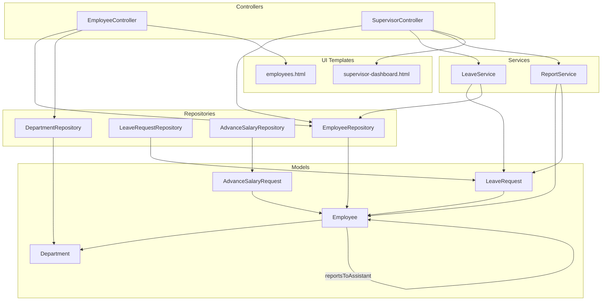
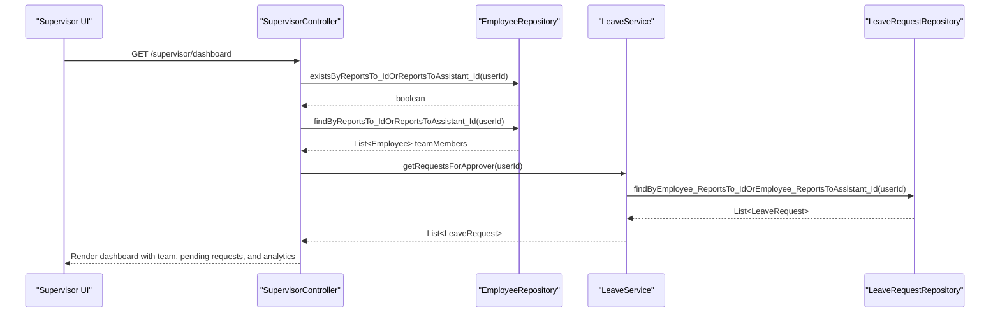
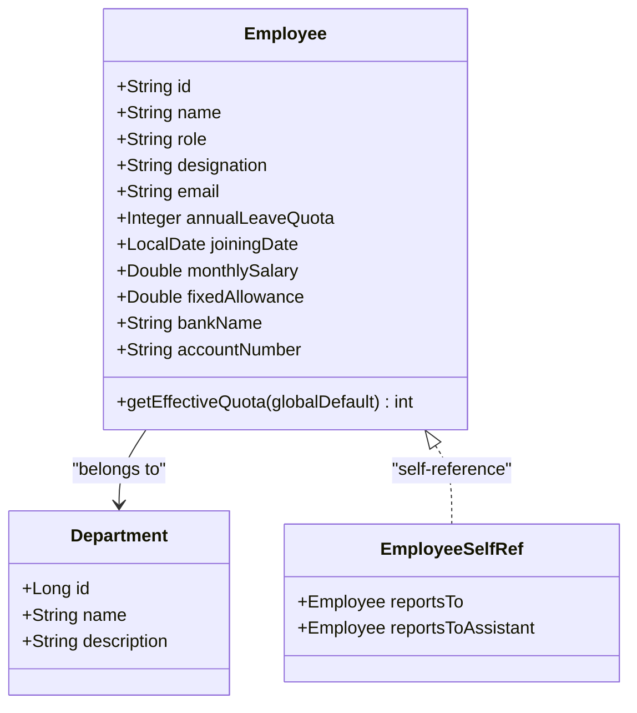
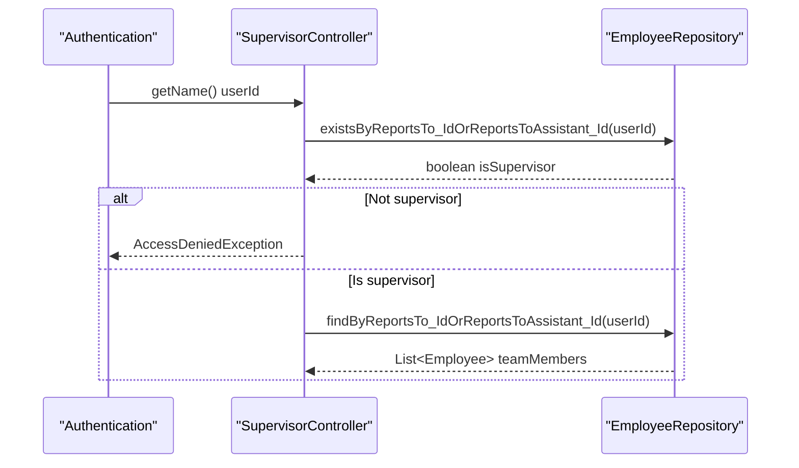
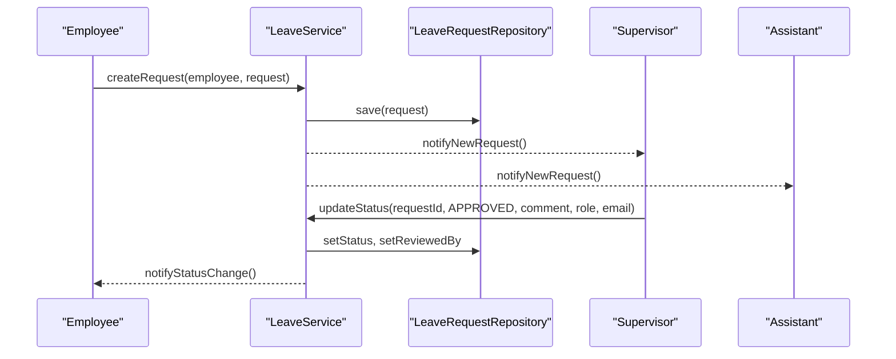
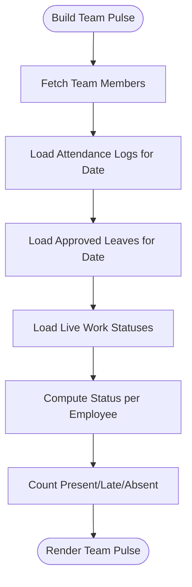
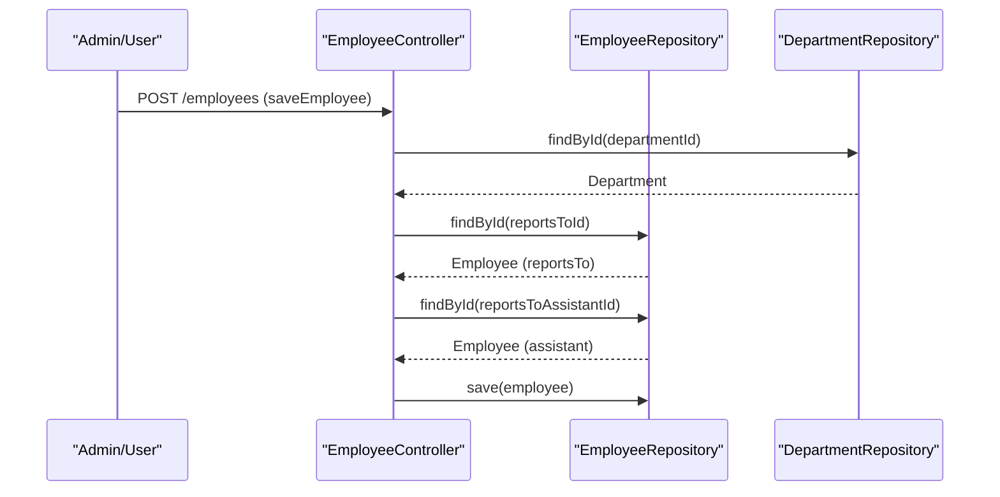
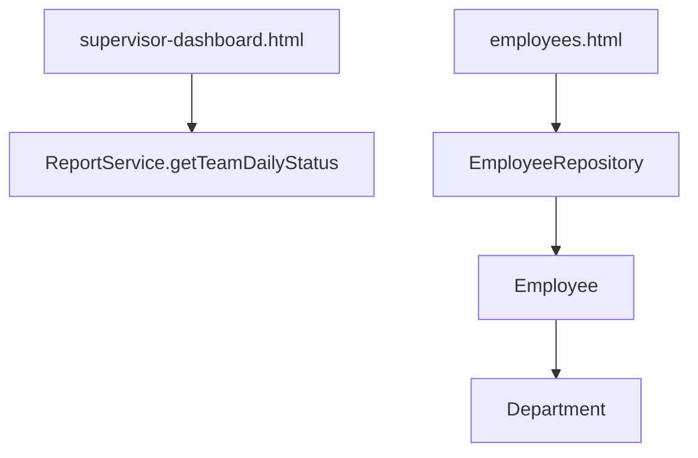
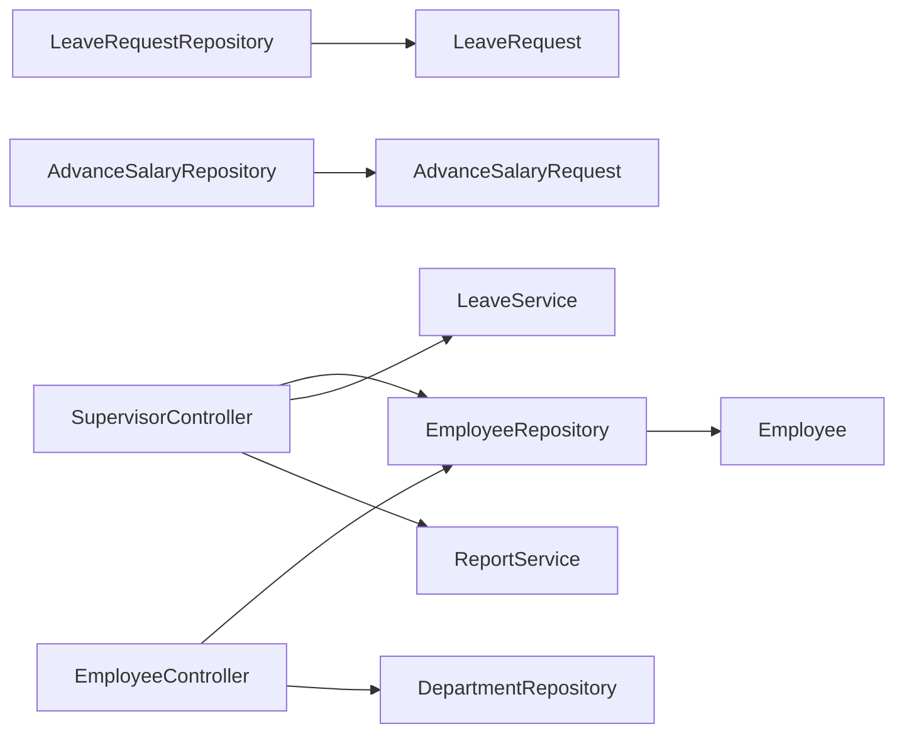

# Organizational Structure & Reporting

<cite>
**Referenced Files in This Document**
- [Employee.java](file://src/main/java/root/cyb/mh/attendancesystem/model/Employee.java)
- [Department.java](file://src/main/java/root/cyb/mh/attendancesystem/model/Department.java)
- [LeaveRequest.java](file://src/main/java/root/cyb/mh/attendancesystem/model/LeaveRequest.java)
- [AdvanceSalaryRequest.java](file://src/main/java/root/cyb/mh/attendancesystem/model/AdvanceSalaryRequest.java)
- [EmployeeRepository.java](file://src/main/java/root/cyb/mh/attendancesystem/repository/EmployeeRepository.java)
- [LeaveRequestRepository.java](file://src/main/java/root/cyb/mh/attendancesystem/repository/LeaveRequestRepository.java)
- [AdvanceSalaryRepository.java](file://src/main/java/root/cyb/mh/attendancesystem/repository/AdvanceSalaryRepository.java)
- [DepartmentRepository.java](file://src/main/java/root/cyb/mh/attendancesystem/repository/DepartmentRepository.java)
- [EmployeeController.java](file://src/main/java/root/cyb/mh/attendancesystem/controller/EmployeeController.java)
- [SupervisorController.java](file://src/main/java/root/cyb/mh/attendancesystem/controller/SupervisorController.java)
- [LeaveService.java](file://src/main/java/root/cyb/mh/attendancesystem/service/LeaveService.java)
- [ReportService.java](file://src/main/java/root/cyb/mh/attendancesystem/service/ReportService.java)
- [supervisor-dashboard.html](file://src/main/resources/templates/supervisor-dashboard.html)
- [employees.html](file://src/main/resources/templates/employees.html)
</cite>

## Table of Contents
1. [Introduction](#introduction)
2. [Project Structure](#project-structure)
3. [Core Components](#core-components)
4. [Architecture Overview](#architecture-overview)
5. [Detailed Component Analysis](#detailed-component-analysis)
6. [Dependency Analysis](#dependency-analysis)
7. [Performance Considerations](#performance-considerations)
8. [Troubleshooting Guide](#troubleshooting-guide)
9. [Conclusion](#conclusion)

## Introduction
This document explains how organizational structure and reporting relationships are modeled and enforced in the Skylink Custom Backend. It covers supervisor-employee relationships, reporting hierarchies, chain of command management, and delegation patterns. It also documents integrations with leave approvals, attendance monitoring, and performance tracking, along with administrative controls and policy enforcement.

## Project Structure
The organizational domain spans models, repositories, services, controllers, and UI templates:
- Models define Employee, Department, LeaveRequest, and AdvanceSalaryRequest entities and their relationships.
- Repositories expose queries for hierarchical lookups (reports-to and assistant).
- Services orchestrate workflows for leave approvals, attendance dashboards, and team analytics.
- Controllers enforce authorization and render supervisor dashboards and employee listings.
- Templates provide visualizations for team pulse, pending actions, and team directories.

**Diagram sources**
- [Employee.java:13-31](file://src/main/java/root/cyb/mh/attendancesystem/model/Employee.java#L13-L31)
- [Department.java:15-21](file://src/main/java/root/cyb/mh/attendancesystem/model/Department.java#L15-L21)
- [LeaveRequest.java:15-47](file://src/main/java/root/cyb/mh/attendancesystem/model/LeaveRequest.java#L15-L47)
- [AdvanceSalaryRequest.java:14-47](file://src/main/java/root/cyb/mh/attendancesystem/model/AdvanceSalaryRequest.java#L14-L47)
- [EmployeeRepository.java:12-31](file://src/main/java/root/cyb/mh/attendancesystem/repository/EmployeeRepository.java#L12-L31)
- [LeaveRequestRepository.java:10-33](file://src/main/java/root/cyb/mh/attendancesystem/repository/LeaveRequestRepository.java#L10-L33)
- [AdvanceSalaryRepository.java:10-27](file://src/main/java/root/cyb/mh/attendancesystem/repository/AdvanceSalaryRepository.java#L10-L27)
- [DepartmentRepository.java:6-8](file://src/main/java/root/cyb/mh/attendancesystem/repository/DepartmentRepository.java#L6-L8)
- [EmployeeController.java:18-139](file://src/main/java/root/cyb/mh/attendancesystem/controller/EmployeeController.java#L18-L139)
- [SupervisorController.java:21-139](file://src/main/java/root/cyb/mh/attendancesystem/controller/SupervisorController.java#L21-L139)
- [LeaveService.java:13-126](file://src/main/java/root/cyb/mh/attendancesystem/service/LeaveService.java#L13-L126)
- [ReportService.java:24-106](file://src/main/java/root/cyb/mh/attendancesystem/service/ReportService.java#L24-L106)
- [supervisor-dashboard.html:8-139](file://src/main/resources/templates/supervisor-dashboard.html#L8-L139)
- [employees.html:104-176](file://src/main/resources/templates/employees.html#L104-L176)

**Section sources**
- [Employee.java:13-62](file://src/main/java/root/cyb/mh/attendancesystem/model/Employee.java#L13-L62)
- [EmployeeRepository.java:12-31](file://src/main/java/root/cyb/mh/attendancesystem/repository/EmployeeRepository.java#L12-L31)
- [EmployeeController.java:18-139](file://src/main/java/root/cyb/mh/attendancesystem/controller/EmployeeController.java#L18-L139)
- [SupervisorController.java:21-139](file://src/main/java/root/cyb/mh/attendancesystem/controller/SupervisorController.java#L21-L139)
- [LeaveService.java:13-126](file://src/main/java/root/cyb/mh/attendancesystem/service/LeaveService.java#L13-L126)
- [ReportService.java:24-106](file://src/main/java/root/cyb/mh/attendancesystem/service/ReportService.java#L24-L106)
- [supervisor-dashboard.html:8-139](file://src/main/resources/templates/supervisor-dashboard.html#L8-L139)
- [employees.html:104-176](file://src/main/resources/templates/employees.html#L104-L176)

## Core Components
- Employee entity defines the reporting relationships:
  - reportsTo: direct supervisor
  - reportsToAssistant: backup supervisor
  - department: organizational unit
  - role and designation: job classification
  - annualLeaveQuota: per-employee leave entitlement (nullable)
- Hierarchical queries enable supervisors to discover team members via either primary or assistant role.
- LeaveService coordinates notifications and approval workflows for supervisors and assistants.
- ReportService aggregates attendance and live work status for team dashboards.
- SupervisorController enforces access checks and renders team dashboards with pending actions and analytics.
- EmployeeController supports editing reporting relationships and viewing team structure.

**Section sources**
- [Employee.java:22-29](file://src/main/java/root/cyb/mh/attendancesystem/model/Employee.java#L22-L29)
- [EmployeeRepository.java:15-19](file://src/main/java/root/cyb/mh/attendancesystem/repository/EmployeeRepository.java#L15-L19)
- [LeaveService.java:24-46](file://src/main/java/root/cyb/mh/attendancesystem/service/LeaveService.java#L24-L46)
- [ReportService.java:102-106](file://src/main/java/root/cyb/mh/attendancesystem/service/ReportService.java#L102-L106)
- [SupervisorController.java:32-139](file://src/main/java/root/cyb/mh/attendancesystem/controller/SupervisorController.java#L32-L139)
- [EmployeeController.java:66-139](file://src/main/java/root/cyb/mh/attendancesystem/controller/EmployeeController.java#L66-L139)

## Architecture Overview
The system implements a hierarchical organization with dual-reporting support (primary supervisor and assistant). Authorization ensures supervisors can only act on requests where they are the designated approver. Attendance and leave workflows integrate with the reporting hierarchy to deliver team insights and enforce policies.

**Diagram sources**
- [SupervisorController.java:32-139](file://src/main/java/root/cyb/mh/attendancesystem/controller/SupervisorController.java#L32-L139)
- [EmployeeRepository.java:15-19](file://src/main/java/root/cyb/mh/attendancesystem/repository/EmployeeRepository.java#L15-L19)
- [LeaveService.java:74-78](file://src/main/java/root/cyb/mh/attendancesystem/service/LeaveService.java#L74-L78)
- [LeaveRequestRepository.java:21-24](file://src/main/java/root/cyb/mh/attendancesystem/repository/LeaveRequestRepository.java#L21-L24)

## Detailed Component Analysis

### Employee Model and Reporting Relationships
- reportsTo: establishes the primary supervisor relationship.
- reportsToAssistant: establishes the backup supervisor relationship.
- Both relationships are self-referential Employee entities, enabling flexible delegation.
- Department ties employees to organizational units.
- Annual leave quota supports per-employee overrides.

**Diagram sources**
- [Employee.java:13-62](file://src/main/java/root/cyb/mh/attendancesystem/model/Employee.java#L13-L62)
- [Department.java:15-21](file://src/main/java/root/cyb/mh/attendancesystem/model/Department.java#L15-L21)

**Section sources**
- [Employee.java:22-29](file://src/main/java/root/cyb/mh/attendancesystem/model/Employee.java#L22-L29)
- [Employee.java:60-62](file://src/main/java/root/cyb/mh/attendancesystem/model/Employee.java#L60-L62)
- [Department.java:15-21](file://src/main/java/root/cyb/mh/attendancesystem/model/Department.java#L15-L21)

### Supervisor Authorization and Team Discovery
- SupervisorController validates that the authenticated user is either a primary or assistant supervisor of at least one team member.
- It retrieves team members using a dual-ID query supporting both roles.
- It aggregates pending leave and advance requests for unified review.

**Diagram sources**
- [SupervisorController.java:32-50](file://src/main/java/root/cyb/mh/attendancesystem/controller/SupervisorController.java#L32-L50)
- [EmployeeRepository.java:15-19](file://src/main/java/root/cyb/mh/attendancesystem/repository/EmployeeRepository.java#L15-L19)

**Section sources**
- [SupervisorController.java:32-50](file://src/main/java/root/cyb/mh/attendancesystem/controller/SupervisorController.java#L32-L50)
- [EmployeeRepository.java:15-19](file://src/main/java/root/cyb/mh/attendancesystem/repository/EmployeeRepository.java#L15-L19)

### Leave Approval Workflow and Notifications
- LeaveService creates requests and notifies both the primary supervisor and assistant.
- getRequestsForApprover returns requests where the approver is either the primary or assistant supervisor.
- updateStatus enforces HR-only modifications for non-PENDING requests and notifies the employee upon updates.

**Diagram sources**
- [LeaveService.java:24-46](file://src/main/java/root/cyb/mh/attendancesystem/service/LeaveService.java#L24-L46)
- [LeaveService.java:74-78](file://src/main/java/root/cyb/mh/attendancesystem/service/LeaveService.java#L74-L78)
- [LeaveService.java:84-121](file://src/main/java/root/cyb/mh/attendancesystem/service/LeaveService.java#L84-L121)
- [LeaveRequestRepository.java:21-24](file://src/main/java/root/cyb/mh/attendancesystem/repository/LeaveRequestRepository.java#L21-L24)

**Section sources**
- [LeaveService.java:24-46](file://src/main/java/root/cyb/mh/attendancesystem/service/LeaveService.java#L24-L46)
- [LeaveService.java:74-78](file://src/main/java/root/cyb/mh/attendancesystem/service/LeaveService.java#L74-L78)
- [LeaveService.java:84-121](file://src/main/java/root/cyb/mh/attendancesystem/service/LeaveService.java#L84-L121)
- [LeaveRequestRepository.java:21-24](file://src/main/java/root/cyb/mh/attendancesystem/repository/LeaveRequestRepository.java#L21-L24)

### Attendance Monitoring and Team Analytics
- ReportService generates daily, weekly, and monthly summaries for teams and individuals.
- getTeamDailyStatus computes real-time team pulse using attendance logs, approved leaves, and live work statuses.
- SupervisorController aggregates present/late counts and on-time rates for dashboard analytics.

**Diagram sources**
- [ReportService.java:102-106](file://src/main/java/root/cyb/mh/attendancesystem/service/ReportService.java#L102-L106)
- [ReportService.java:108-283](file://src/main/java/root/cyb/mh/attendancesystem/service/ReportService.java#L108-L283)
- [SupervisorController.java:67-116](file://src/main/java/root/cyb/mh/attendancesystem/controller/SupervisorController.java#L67-L116)

**Section sources**
- [ReportService.java:102-106](file://src/main/java/root/cyb/mh/attendancesystem/service/ReportService.java#L102-L106)
- [ReportService.java:108-283](file://src/main/java/root/cyb/mh/attendancesystem/service/ReportService.java#L108-L283)
- [SupervisorController.java:67-116](file://src/main/java/root/cyb/mh/attendancesystem/controller/SupervisorController.java#L67-L116)

### Team Management Workflows and Delegation Patterns
- EmployeeController supports assigning supervisors and assistants, updating department assignments, and bulk operations.
- The UI template employees.html displays reporting relationships and allows editing of reports-to and reports-to-assistant.
- SupervisorController dashboard consolidates pending actions and team metrics for oversight.

**Diagram sources**
- [EmployeeController.java:66-139](file://src/main/java/root/cyb/mh/attendancesystem/controller/EmployeeController.java#L66-L139)
- [DepartmentRepository.java:6-8](file://src/main/java/root/cyb/mh/attendancesystem/repository/DepartmentRepository.java#L6-L8)
- [EmployeeRepository.java:12-31](file://src/main/java/root/cyb/mh/attendancesystem/repository/EmployeeRepository.java#L12-L31)

**Section sources**
- [EmployeeController.java:66-139](file://src/main/java/root/cyb/mh/attendancesystem/controller/EmployeeController.java#L66-L139)
- [employees.html:104-176](file://src/main/resources/templates/employees.html#L104-L176)
- [SupervisorController.java:32-139](file://src/main/java/root/cyb/mh/attendancesystem/controller/SupervisorController.java#L32-L139)

### Organizational Chart Visualization and Practical Examples
- The supervisor dashboard template presents a “Team Pulse” widget showing live status indicators for team members, derived from ReportService.
- The employee listing template shows reporting relationships inline, aiding quick identification of supervisors and assistants.
- Example scenarios:
  - Adding a new employee with a supervisor and assistant.
  - Updating an employee’s supervisor to reflect a reorganization.
  - Viewing team attendance trends and on-time performance.

**Diagram sources**
- [supervisor-dashboard.html:114-159](file://src/main/resources/templates/supervisor-dashboard.html#L114-L159)
- [ReportService.java:102-106](file://src/main/java/root/cyb/mh/attendancesystem/service/ReportService.java#L102-L106)
- [employees.html:104-176](file://src/main/resources/templates/employees.html#L104-L176)
- [EmployeeRepository.java:12-31](file://src/main/java/root/cyb/mh/attendancesystem/repository/EmployeeRepository.java#L12-L31)

**Section sources**
- [supervisor-dashboard.html:114-159](file://src/main/resources/templates/supervisor-dashboard.html#L114-L159)
- [employees.html:104-176](file://src/main/resources/templates/employees.html#L104-L176)
- [ReportService.java:102-106](file://src/main/java/root/cyb/mh/attendancesystem/service/ReportService.java#L102-L106)

## Dependency Analysis
- EmployeeRepository exposes:
  - existsByReportsTo_IdOrReportsToAssistant_Id for authorization checks
  - findByReportsTo_IdOrReportsToAssistant_Id for team discovery
  - searchEmployees for cross-field lookups
- LeaveRequestRepository exposes:
  - findByEmployee_ReportsTo_IdOrEmployee_ReportsToAssistant_Id for supervisor visibility
- AdvanceSalaryRepository exposes:
  - findByEmployee_ReportsTo_IdOrEmployee_ReportsToAssistant_Id for supervisor visibility
- Controllers depend on repositories and services to enforce policies and render dashboards.

**Diagram sources**
- [EmployeeRepository.java:12-31](file://src/main/java/root/cyb/mh/attendancesystem/repository/EmployeeRepository.java#L12-L31)
- [LeaveRequestRepository.java:10-33](file://src/main/java/root/cyb/mh/attendancesystem/repository/LeaveRequestRepository.java#L10-L33)
- [AdvanceSalaryRepository.java:10-27](file://src/main/java/root/cyb/mh/attendancesystem/repository/AdvanceSalaryRepository.java#L10-L27)
- [SupervisorController.java:21-31](file://src/main/java/root/cyb/mh/attendancesystem/controller/SupervisorController.java#L21-L31)
- [EmployeeController.java:20-28](file://src/main/java/root/cyb/mh/attendancesystem/controller/EmployeeController.java#L20-L28)

**Section sources**
- [EmployeeRepository.java:12-31](file://src/main/java/root/cyb/mh/attendancesystem/repository/EmployeeRepository.java#L12-L31)
- [LeaveRequestRepository.java:10-33](file://src/main/java/root/cyb/mh/attendancesystem/repository/LeaveRequestRepository.java#L10-L33)
- [AdvanceSalaryRepository.java:10-27](file://src/main/java/root/cyb/mh/attendancesystem/repository/AdvanceSalaryRepository.java#L10-L27)
- [SupervisorController.java:21-31](file://src/main/java/root/cyb/mh/attendancesystem/controller/SupervisorController.java#L21-L31)
- [EmployeeController.java:20-28](file://src/main/java/root/cyb/mh/attendancesystem/controller/EmployeeController.java#L20-L28)

## Performance Considerations
- Team queries use dual-ID filters to avoid N+1 selects and reduce joins.
- ReportService aggregates attendance and live statuses efficiently by date ranges and pre-filtering logs.
- Pagination is supported in reporting APIs to limit payload sizes for large organizations.
- Recommendation: Index database columns used in hierarchical lookups (reportsTo.id, reportsToAssistant.id) to improve query performance.

## Troubleshooting Guide
- AccessDeniedException on supervisor dashboard indicates the user lacks supervisory or assistant role for any team member.
- If team members do not appear, verify that employees have valid reportsTo or reportsToAssistant assignments.
- Leave notifications not received:
  - Confirm employee has a non-null reportsTo or reportsToAssistant.
  - Verify HR users exist for broadcast notifications.
- Attendance anomalies:
  - Check approved leaves for the date and ensure attendance logs exist.
  - Validate work schedules and public holidays configurations.

**Section sources**
- [SupervisorController.java:43-45](file://src/main/java/root/cyb/mh/attendancesystem/controller/SupervisorController.java#L43-L45)
- [LeaveService.java:24-46](file://src/main/java/root/cyb/mh/attendancesystem/service/LeaveService.java#L24-L46)
- [ReportService.java:117-121](file://src/main/java/root/cyb/mh/attendancesystem/service/ReportService.java#L117-L121)

## Conclusion
The Skylink Custom Backend models organizational structure with robust supervisor-employee relationships and dual-reporting support. Controllers enforce authorization, services orchestrate leave and attendance workflows, and templates visualize team performance and pending actions. Together, these components provide a clear chain of command, efficient delegation patterns, and integrated administrative controls for policy enforcement and oversight.