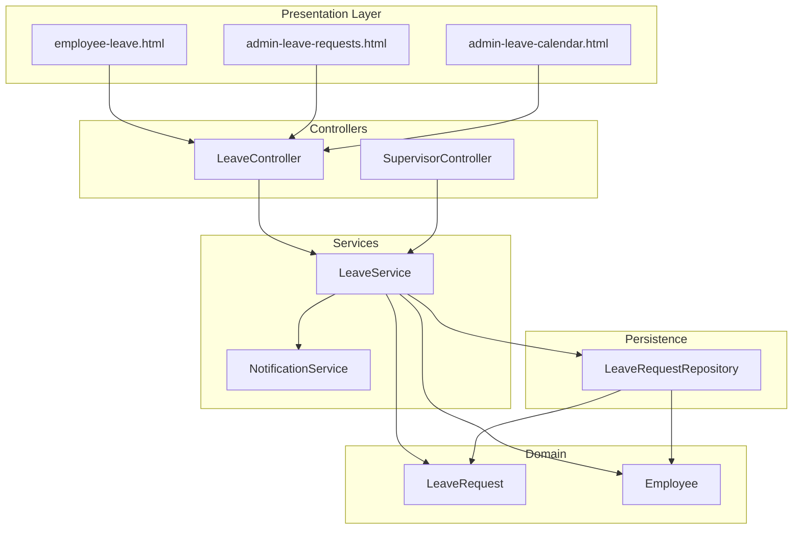
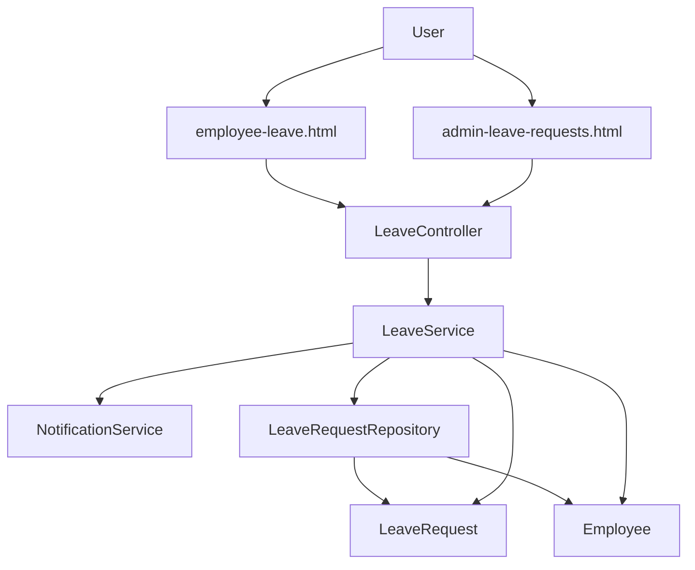
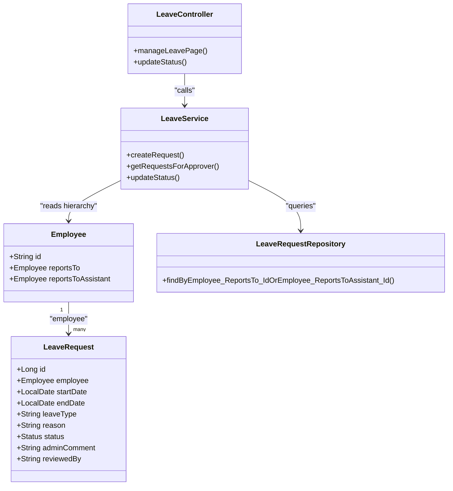
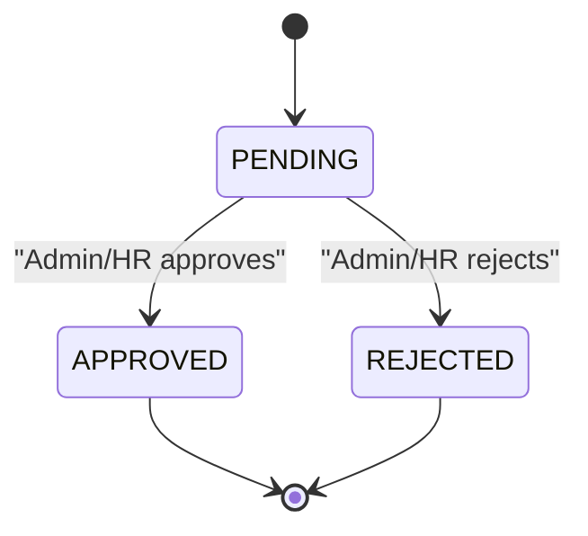
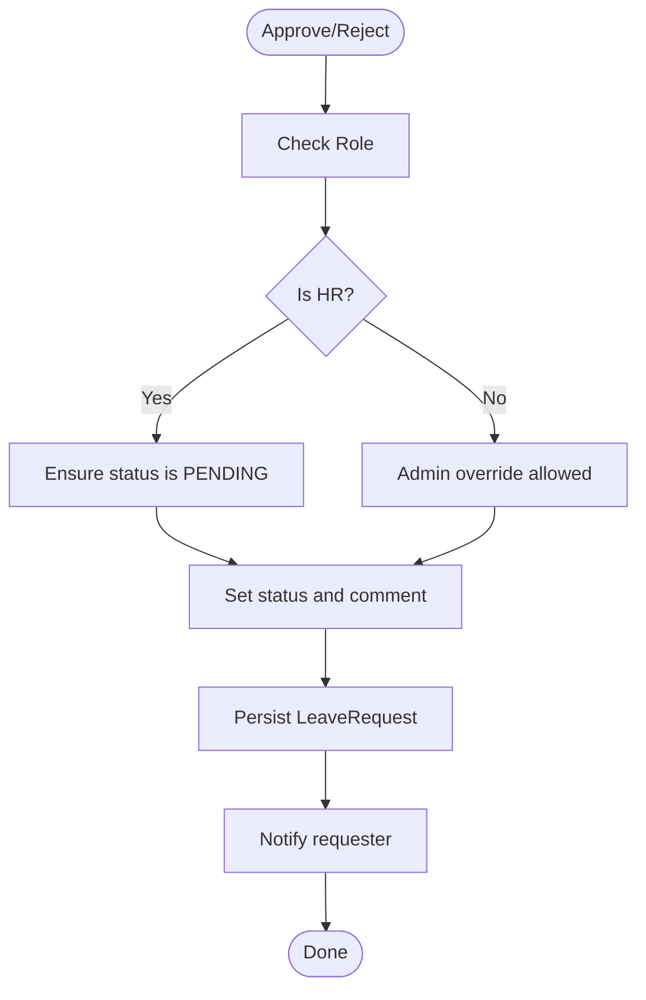
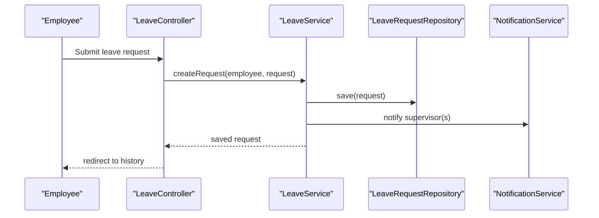
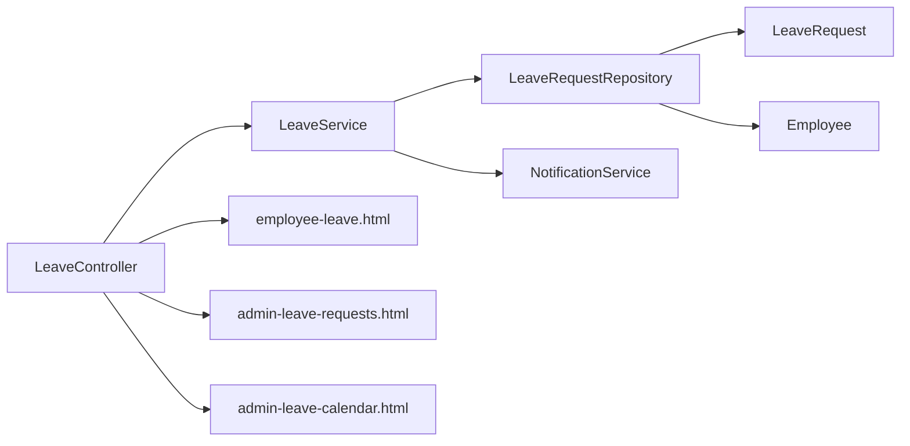

# Approval Workflows

<cite>
**Referenced Files in This Document**
- [LeaveController.java](file://src/main/java/root/cyb/mh/attendancesystem/controller/LeaveController.java)
- [LeaveService.java](file://src/main/java/root/cyb/mh/attendancesystem/service/LeaveService.java)
- [LeaveRequest.java](file://src/main/java/root/cyb/mh/attendancesystem/model/LeaveRequest.java)
- [LeaveRequestRepository.java](file://src/main/java/root/cyb/mh/attendancesystem/repository/LeaveRequestRepository.java)
- [Employee.java](file://src/main/java/root/cyb/mh/attendancesystem/model/Employee.java)
- [NotificationService.java](file://src/main/java/root/cyb/mh/attendancesystem/service/NotificationService.java)
- [SecurityConfig.java](file://src/main/java/root/cyb/mh/attendancesystem/config/SecurityConfig.java)
- [admin-leave-requests.html](file://src/main/resources/templates/admin-leave-requests.html)
- [employee-leave.html](file://src/main/resources/templates/employee-leave.html)
- [admin-leave-calendar.html](file://src/main/resources/templates/admin-leave-calendar.html)
- [SupervisorController.java](file://src/main/java/root/cyb/mh/attendancesystem/controller/SupervisorController.java)
</cite>

## Table of Contents
1. [Introduction](#introduction)
2. [Project Structure](#project-structure)
3. [Core Components](#core-components)
4. [Architecture Overview](#architecture-overview)
5. [Detailed Component Analysis](#detailed-component-analysis)
6. [Dependency Analysis](#dependency-analysis)
7. [Performance Considerations](#performance-considerations)
8. [Troubleshooting Guide](#troubleshooting-guide)
9. [Conclusion](#conclusion)
10. [Appendices](#appendices)

## Introduction
This document explains the leave approval workflows and hierarchical approval system implemented in the backend. It covers role-based approval routing (admin, HR, supervisor), permission enforcement, delegation via assistant supervisors, team-based visibility, approval decision logic, comment requirements, audit trail, and customization options. It also documents security checks, access control, and illustrates typical approval scenarios and status transitions.

## Project Structure
The approval workflow spans controllers, services, repositories, models, and Thymeleaf templates:
- Controllers handle HTTP endpoints for employees, supervisors, and administrators.
- Services encapsulate business logic for creation, retrieval, and status updates.
- Repositories provide data access for leave requests and related queries.
- Models define the domain entities and statuses.
- Templates render the UI for leave application, management, and calendar views.

**Diagram sources**
- [LeaveController.java:1-176](file://src/main/java/root/cyb/mh/attendancesystem/controller/LeaveController.java#L1-L176)
- [SupervisorController.java:1-215](file://src/main/java/root/cyb/mh/attendancesystem/controller/SupervisorController.java#L1-L215)
- [LeaveService.java:1-127](file://src/main/java/root/cyb/mh/attendancesystem/service/LeaveService.java#L1-L127)
- [LeaveRequestRepository.java:1-34](file://src/main/java/root/cyb/mh/attendancesystem/repository/LeaveRequestRepository.java#L1-L34)
- [LeaveRequest.java:1-54](file://src/main/java/root/cyb/mh/attendancesystem/model/LeaveRequest.java#L1-L54)
- [Employee.java:1-64](file://src/main/java/root/cyb/mh/attendancesystem/model/Employee.java#L1-L64)
- [NotificationService.java:1-78](file://src/main/java/root/cyb/mh/attendancesystem/service/NotificationService.java#L1-L78)
- [employee-leave.html:1-122](file://src/main/resources/templates/employee-leave.html#L1-L122)
- [admin-leave-requests.html:1-198](file://src/main/resources/templates/admin-leave-requests.html#L1-L198)
- [admin-leave-calendar.html](file://src/main/resources/templates/admin-leave-calendar.html)

**Section sources**
- [LeaveController.java:1-176](file://src/main/java/root/cyb/mh/attendancesystem/controller/LeaveController.java#L1-L176)
- [LeaveService.java:1-127](file://src/main/java/root/cyb/mh/attendancesystem/service/LeaveService.java#L1-L127)
- [LeaveRequestRepository.java:1-34](file://src/main/java/root/cyb/mh/attendancesystem/repository/LeaveRequestRepository.java#L1-L34)
- [LeaveRequest.java:1-54](file://src/main/java/root/cyb/mh/attendancesystem/model/LeaveRequest.java#L1-L54)
- [Employee.java:1-64](file://src/main/java/root/cyb/mh/attendancesystem/model/Employee.java#L1-L64)
- [NotificationService.java:1-78](file://src/main/java/root/cyb/mh/attendancesystem/service/NotificationService.java#L1-L78)
- [employee-leave.html:1-122](file://src/main/resources/templates/employee-leave.html#L1-L122)
- [admin-leave-requests.html:1-198](file://src/main/resources/templates/admin-leave-requests.html#L1-L198)
- [admin-leave-calendar.html](file://src/main/resources/templates/admin-leave-calendar.html)

## Core Components
- LeaveController: Exposes endpoints for employees to apply, supervisors/admins to review, and calendar rendering.
- LeaveService: Implements creation, retrieval, and status update logic with notifications and audit fields.
- LeaveRequest: Domain entity with status enumeration and audit fields.
- LeaveRequestRepository: JPA repository with finder methods for history, team visibility, and counts.
- Employee: Contains reporting hierarchy (reportsTo and reportsToAssistant) enabling delegation.
- NotificationService: Persists and pushes notifications to recipients.
- SecurityConfig: Enforces role-based access for protected endpoints.

**Section sources**
- [LeaveController.java:1-176](file://src/main/java/root/cyb/mh/attendancesystem/controller/LeaveController.java#L1-L176)
- [LeaveService.java:1-127](file://src/main/java/root/cyb/mh/attendancesystem/service/LeaveService.java#L1-L127)
- [LeaveRequest.java:1-54](file://src/main/java/root/cyb/mh/attendancesystem/model/LeaveRequest.java#L1-L54)
- [LeaveRequestRepository.java:1-34](file://src/main/java/root/cyb/mh/attendancesystem/repository/LeaveRequestRepository.java#L1-L34)
- [Employee.java:1-64](file://src/main/java/root/cyb/mh/attendancesystem/model/Employee.java#L1-L64)
- [NotificationService.java:1-78](file://src/main/java/root/cyb/mh/attendancesystem/service/NotificationService.java#L1-L78)
- [SecurityConfig.java:1-91](file://src/main/java/root/cyb/mh/attendancesystem/config/SecurityConfig.java#L1-L91)

## Architecture Overview
The system follows a layered architecture:
- Presentation: Thymeleaf templates render UI for employees, supervisors, and admins.
- Controllers: Handle HTTP requests, enforce roles, and delegate to services.
- Services: Encapsulate business rules and integrate with repositories and notification services.
- Persistence: JPA repositories query the database with criteria derived from roles and hierarchy.
- Security: Spring Security filter chain enforces role-based access per endpoint.

**Diagram sources**
- [LeaveController.java:1-176](file://src/main/java/root/cyb/mh/attendancesystem/controller/LeaveController.java#L1-L176)
- [LeaveService.java:1-127](file://src/main/java/root/cyb/mh/attendancesystem/service/LeaveService.java#L1-L127)
- [LeaveRequestRepository.java:1-34](file://src/main/java/root/cyb/mh/attendancesystem/repository/LeaveRequestRepository.java#L1-L34)
- [LeaveRequest.java:1-54](file://src/main/java/root/cyb/mh/attendancesystem/model/LeaveRequest.java#L1-L54)
- [Employee.java:1-64](file://src/main/java/root/cyb/mh/attendancesystem/model/Employee.java#L1-L64)
- [NotificationService.java:1-78](file://src/main/java/root/cyb/mh/attendancesystem/service/NotificationService.java#L1-L78)
- [employee-leave.html:1-122](file://src/main/resources/templates/employee-leave.html#L1-L122)
- [admin-leave-requests.html:1-198](file://src/main/resources/templates/admin-leave-requests.html#L1-L198)

## Detailed Component Analysis

### Role-Based Approval Routing
- Admin: Full visibility and override capability across all requests.
- HR: Can view and update only PENDING requests; cannot modify processed requests.
- Supervisor: Sees only requests from their team members (primary or assistant supervision).
- Assistant Supervisor: Delegation support; assistant can act on behalf of the primary supervisor.

**Diagram sources**
- [Employee.java:1-64](file://src/main/java/root/cyb/mh/attendancesystem/model/Employee.java#L1-L64)
- [LeaveRequest.java:1-54](file://src/main/java/root/cyb/mh/attendancesystem/model/LeaveRequest.java#L1-L54)
- [LeaveController.java:1-176](file://src/main/java/root/cyb/mh/attendancesystem/controller/LeaveController.java#L1-L176)
- [LeaveService.java:1-127](file://src/main/java/root/cyb/mh/attendancesystem/service/LeaveService.java#L1-L127)
- [LeaveRequestRepository.java:1-34](file://src/main/java/root/cyb/mh/attendancesystem/repository/LeaveRequestRepository.java#L1-L34)

**Section sources**
- [LeaveController.java:57-90](file://src/main/java/root/cyb/mh/attendancesystem/controller/LeaveController.java#L57-L90)
- [LeaveService.java:74-78](file://src/main/java/root/cyb/mh/attendancesystem/service/LeaveService.java#L74-L78)
- [LeaveRequestRepository.java:21-24](file://src/main/java/root/cyb/mh/attendancesystem/repository/LeaveRequestRepository.java#L21-L24)
- [Employee.java:22-29](file://src/main/java/root/cyb/mh/attendancesystem/model/Employee.java#L22-L29)

### Approval Decision Logic and Status Transitions
- Initial state: PENDING upon submission.
- Allowed transitions:
  - PENDING → APPROVED
  - PENDING → REJECTED
- HR constraint: Cannot change status of non-PENDING requests.
- Admin override: Can approve/reject regardless of current status.
- Audit trail: Maintained via adminComment and reviewedBy fields.

**Diagram sources**
- [LeaveRequest.java:48-52](file://src/main/java/root/cyb/mh/attendancesystem/model/LeaveRequest.java#L48-L52)
- [LeaveService.java:84-102](file://src/main/java/root/cyb/mh/attendancesystem/service/LeaveService.java#L84-L102)

**Section sources**
- [LeaveService.java:84-102](file://src/main/java/root/cyb/mh/attendancesystem/service/LeaveService.java#L84-L102)
- [LeaveRequest.java:39-46](file://src/main/java/root/cyb/mh/attendancesystem/model/LeaveRequest.java#L39-L46)

### Comment Requirements and Audit Trail
- Comment requirement: Required for REJECT actions in the UI; the backend stores the comment and the reviewer’s identity.
- Audit fields: adminComment captures reviewer comments; reviewedBy captures reviewer identity and role.

**Diagram sources**
- [admin-leave-requests.html:117-120](file://src/main/resources/templates/admin-leave-requests.html#L117-L120)
- [LeaveService.java:84-102](file://src/main/java/root/cyb/mh/attendancesystem/service/LeaveService.java#L84-L102)
- [LeaveRequest.java:39-46](file://src/main/java/root/cyb/mh/attendancesystem/model/LeaveRequest.java#L39-L46)

**Section sources**
- [admin-leave-requests.html:117-120](file://src/main/resources/templates/admin-leave-requests.html#L117-L120)
- [LeaveService.java:98-102](file://src/main/java/root/cyb/mh/attendancesystem/service/LeaveService.java#L98-L102)
- [LeaveRequest.java:39-46](file://src/main/java/root/cyb/mh/attendancesystem/model/LeaveRequest.java#L39-L46)

### Team-Based Approval Hierarchies and Delegation
- Team visibility: Supervisors see requests where the employee reports to them (primary) or to their assistant.
- Delegation: Assistant supervisor can act on behalf of the primary supervisor for approvals.

**Diagram sources**
- [LeaveController.java:46-55](file://src/main/java/root/cyb/mh/attendancesystem/controller/LeaveController.java#L46-L55)
- [LeaveService.java:24-46](file://src/main/java/root/cyb/mh/attendancesystem/service/LeaveService.java#L24-L46)
- [LeaveRequestRepository.java:1-34](file://src/main/java/root/cyb/mh/attendancesystem/repository/LeaveRequestRepository.java#L1-L34)
- [NotificationService.java:22-44](file://src/main/java/root/cyb/mh/attendancesystem/service/NotificationService.java#L22-L44)

**Section sources**
- [LeaveService.java:24-46](file://src/main/java/root/cyb/mh/attendancesystem/service/LeaveService.java#L24-L46)
- [LeaveRequestRepository.java:21-24](file://src/main/java/root/cyb/mh/attendancesystem/repository/LeaveRequestRepository.java#L21-L24)
- [SupervisorController.java:47-70](file://src/main/java/root/cyb/mh/attendancesystem/controller/SupervisorController.java#L47-L70)

### Escalation Procedures
- Escalation path: Requests escalate to HR and supervisors based on the reporting hierarchy. HR receives notifications for all new requests, ensuring awareness even if the immediate supervisor is unavailable.
- Override capability: Admin can override any decision, providing a final escalation path.

**Section sources**
- [LeaveService.java:39-43](file://src/main/java/root/cyb/mh/attendancesystem/service/LeaveService.java#L39-L43)
- [LeaveController.java:96-124](file://src/main/java/root/cyb/mh/attendancesystem/controller/LeaveController.java#L96-L124)

### Approval Workflow Customization Options
- Leave types: Configurable via the employee application form.
- Comment policy: Mandatory for rejections; optional for approvals.
- Visibility controls: Admin sees all, HR sees all, supervisors see only their team.
- Calendar integration: Approved leaves are rendered on a shared calendar with color coding by leave type.

**Section sources**
- [employee-leave.html:36-42](file://src/main/resources/templates/employee-leave.html#L36-L42)
- [admin-leave-requests.html:117-120](file://src/main/resources/templates/admin-leave-requests.html#L117-L120)
- [LeaveController.java:136-174](file://src/main/java/root/cyb/mh/attendancesystem/controller/LeaveController.java#L136-L174)

## Dependency Analysis
The approval workflow depends on:
- Controllers enforcing roles and delegating to services.
- Services orchestrating persistence and notifications.
- Repositories providing team-scoped queries and counts.
- Models defining statuses and audit fields.
- Templates driving UI behavior and constraints.

**Diagram sources**
- [LeaveController.java:1-176](file://src/main/java/root/cyb/mh/attendancesystem/controller/LeaveController.java#L1-L176)
- [LeaveService.java:1-127](file://src/main/java/root/cyb/mh/attendancesystem/service/LeaveService.java#L1-L127)
- [LeaveRequestRepository.java:1-34](file://src/main/java/root/cyb/mh/attendancesystem/repository/LeaveRequestRepository.java#L1-L34)
- [LeaveRequest.java:1-54](file://src/main/java/root/cyb/mh/attendancesystem/model/LeaveRequest.java#L1-L54)
- [Employee.java:1-64](file://src/main/java/root/cyb/mh/attendancesystem/model/Employee.java#L1-L64)
- [NotificationService.java:1-78](file://src/main/java/root/cyb/mh/attendancesystem/service/NotificationService.java#L1-L78)
- [employee-leave.html:1-122](file://src/main/resources/templates/employee-leave.html#L1-L122)
- [admin-leave-requests.html:1-198](file://src/main/resources/templates/admin-leave-requests.html#L1-L198)
- [admin-leave-calendar.html](file://src/main/resources/templates/admin-leave-calendar.html)

**Section sources**
- [LeaveController.java:1-176](file://src/main/java/root/cyb/mh/attendancesystem/controller/LeaveController.java#L1-L176)
- [LeaveService.java:1-127](file://src/main/java/root/cyb/mh/attendancesystem/service/LeaveService.java#L1-L127)
- [LeaveRequestRepository.java:1-34](file://src/main/java/root/cyb/mh/attendancesystem/repository/LeaveRequestRepository.java#L1-L34)
- [LeaveRequest.java:1-54](file://src/main/java/root/cyb/mh/attendancesystem/model/LeaveRequest.java#L1-L54)
- [Employee.java:1-64](file://src/main/java/root/cyb/mh/attendancesystem/model/Employee.java#L1-L64)
- [NotificationService.java:1-78](file://src/main/java/root/cyb/mh/attendancesystem/service/NotificationService.java#L1-L78)

## Performance Considerations
- Repository queries: Team-based retrieval uses composite conditions on supervisor IDs; ensure appropriate indexing on employee reporting fields.
- Notification throughput: Notifications are persisted and pushed asynchronously; monitor queue sizes and push delivery failures.
- Calendar rendering: Aggregation of approved leaves is O(n); consider pagination or caching for large datasets.

[No sources needed since this section provides general guidance]

## Troubleshooting Guide
Common issues and resolutions:
- Access denied for supervisors: Ensure the current user is linked as either primary supervisor or assistant supervisor for the target employee.
- HR cannot modify processed requests: Verify the request status is PENDING; otherwise, Admin override is required.
- Notifications not received: Check NotificationService persistence and WebSocket/push delivery logs.
- UI shows disabled actions: Confirm request status and user role; Admins can override regardless of status.

**Section sources**
- [LeaveController.java:74-84](file://src/main/java/root/cyb/mh/attendancesystem/controller/LeaveController.java#L74-L84)
- [LeaveService.java:89-94](file://src/main/java/root/cyb/mh/attendancesystem/service/LeaveService.java#L89-L94)
- [NotificationService.java:22-44](file://src/main/java/root/cyb/mh/attendancesystem/service/NotificationService.java#L22-L44)

## Conclusion
The approval workflow integrates role-based access, team-based visibility, delegation via assistant supervisors, and robust audit trails. HR and Admin roles enforce policy boundaries while supervisors retain operational control over their teams. The system supports customization through configurable leave types, mandatory comments for rejections, and calendar visibility for approved leaves.

[No sources needed since this section summarizes without analyzing specific files]

## Appendices

### Example Scenarios and Status Transitions
- Scenario A: Employee submits a sick leave request; supervisor reviews and approves; HR notified; calendar updated.
- Scenario B: Employee submits vacation leave; HR rejects with comment; employee notified; Admin can override if needed.
- Scenario C: Employee submits casual leave; assistant supervisor approves on behalf of primary supervisor; audit trail captures reviewer identity and role.

**Section sources**
- [employee-leave.html:36-63](file://src/main/resources/templates/employee-leave.html#L36-L63)
- [admin-leave-requests.html:65-79](file://src/main/resources/templates/admin-leave-requests.html#L65-L79)
- [LeaveService.java:104-121](file://src/main/java/root/cyb/mh/attendancesystem/service/LeaveService.java#L104-L121)
- [admin-leave-calendar.html](file://src/main/resources/templates/admin-leave-calendar.html)

### Security Checks and Access Control Enforcement
- Endpoint-level roles: Admin-only areas, HR-accessible settings, employee-only dashboards, and broad access for leave management.
- Runtime checks: Controllers verify supervisor status and role before allowing updates; HR updates are constrained to PENDING requests.

**Section sources**
- [SecurityConfig.java:27-47](file://src/main/java/root/cyb/mh/attendancesystem/config/SecurityConfig.java#L27-L47)
- [LeaveController.java:74-112](file://src/main/java/root/cyb/mh/attendancesystem/controller/LeaveController.java#L74-L112)