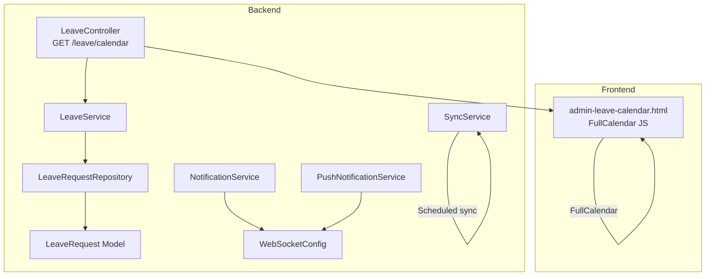
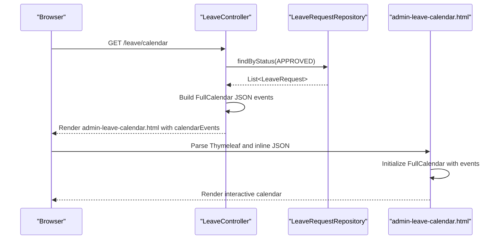
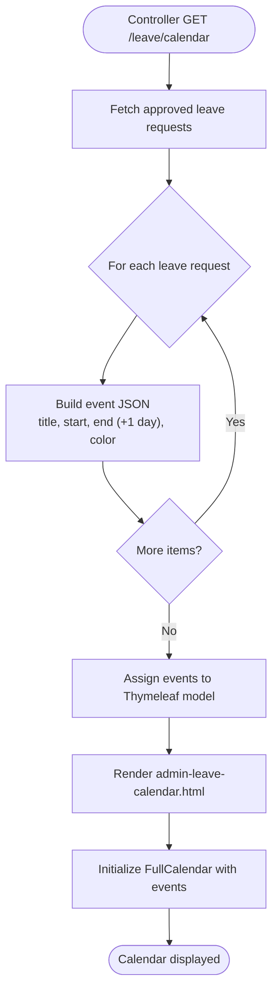
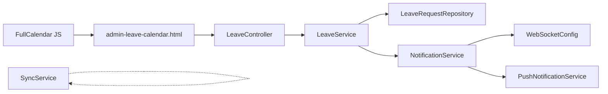

# Leave Calendar Management

<cite>
**Referenced Files in This Document**
- [LeaveController.java](file://src/main/java/root/cyb/mh/attendancesystem/controller/LeaveController.java)
- [LeaveService.java](file://src/main/java/root/cyb/mh/attendancesystem/service/LeaveService.java)
- [LeaveRequest.java](file://src/main/java/root/cyb/mh/attendancesystem/model/LeaveRequest.java)
- [LeaveRequestRepository.java](file://src/main/java/root/cyb/mh/attendancesystem/repository/LeaveRequestRepository.java)
- [admin-leave-calendar.html](file://src/main/resources/templates/admin-leave-calendar.html)
- [employee-dashboard.html](file://src/main/resources/templates/employee-dashboard.html)
- [supervisor-dashboard.html](file://src/main/resources/templates/supervisor-dashboard.html)
- [WebSocketConfig.java](file://src/main/java/root/cyb/mh/attendancesystem/config/WebSocketConfig.java)
- [NotificationService.java](file://src/main/java/root/cyb/mh/attendancesystem/service/NotificationService.java)
- [PushNotificationService.java](file://src/main/java/root/cyb/mh/attendancesystem/service/PushNotificationService.java)
- [SyncService.java](file://src/main/java/root/cyb/mh/attendancesystem/service/SyncService.java)
</cite>

## Table of Contents
1. [Introduction](#introduction)
2. [Project Structure](#project-structure)
3. [Core Components](#core-components)
4. [Architecture Overview](#architecture-overview)
5. [Detailed Component Analysis](#detailed-component-analysis)
6. [Dependency Analysis](#dependency-analysis)
7. [Performance Considerations](#performance-considerations)
8. [Troubleshooting Guide](#troubleshooting-guide)
9. [Conclusion](#conclusion)
10. [Appendices](#appendices)

## Introduction
This document describes the leave calendar management and visualization system built around FullCalendar integration. It covers how approved leave requests are fetched from the backend, transformed into calendar events, and rendered in the browser. It also documents color-coding by leave types, date range handling, and how the calendar fits into employee dashboards, team views, and administrative oversight. Finally, it outlines potential extensions for filtering, search, export, synchronization with external systems, and real-time updates.

## Project Structure
The leave calendar feature spans backend controllers and services, domain models, repositories, and Thymeleaf templates. FullCalendar is embedded in the admin calendar page and initialized with server-side generated JSON events.

**Diagram sources**
- [LeaveController.java:136-174](file://src/main/java/root/cyb/mh/attendancesystem/controller/LeaveController.java#L136-L174)
- [LeaveService.java:1-127](file://src/main/java/root/cyb/mh/attendancesystem/service/LeaveService.java#L1-L127)
- [LeaveRequestRepository.java:1-34](file://src/main/java/root/cyb/mh/attendancesystem/repository/LeaveRequestRepository.java#L1-L34)
- [LeaveRequest.java:1-54](file://src/main/java/root/cyb/mh/attendancesystem/model/LeaveRequest.java#L1-L54)
- [admin-leave-calendar.html:1-50](file://src/main/resources/templates/admin-leave-calendar.html#L1-L50)
- [WebSocketConfig.java:1-26](file://src/main/java/root/cyb/mh/attendancesystem/config/WebSocketConfig.java#L1-L26)
- [NotificationService.java:1-78](file://src/main/java/root/cyb/mh/attendancesystem/service/NotificationService.java#L1-L78)
- [PushNotificationService.java:1-111](file://src/main/java/root/cyb/mh/attendancesystem/service/PushNotificationService.java#L1-L111)
- [SyncService.java:1-21](file://src/main/java/root/cyb/mh/attendancesystem/service/SyncService.java#L1-L21)

**Section sources**
- [LeaveController.java:136-174](file://src/main/java/root/cyb/mh/attendancesystem/controller/LeaveController.java#L136-L174)
- [admin-leave-calendar.html:1-50](file://src/main/resources/templates/admin-leave-calendar.html#L1-L50)

## Core Components
- LeaveController: Exposes GET /leave/calendar to render the calendar page and POST endpoints for managing leave requests.
- LeaveService: Orchestrates leave lifecycle, notifications, and data access.
- LeaveRequestRepository: JPA repository for leave-related queries.
- LeaveRequest: Domain entity representing leave requests with status, dates, and type.
- admin-leave-calendar.html: Thymeleaf template embedding FullCalendar and initializing it with server-provided events.

Key responsibilities:
- Calendar rendering: Build FullCalendar-compatible JSON from approved leave requests.
- Event attributes: title, start, end, color.
- Color-coding: Different colors per leave type.
- Date range handling: FullCalendar’s exclusive end date is handled by adding one day to the end date.

**Section sources**
- [LeaveController.java:136-174](file://src/main/java/root/cyb/mh/attendancesystem/controller/LeaveController.java#L136-L174)
- [LeaveService.java:1-127](file://src/main/java/root/cyb/mh/attendancesystem/service/LeaveService.java#L1-L127)
- [LeaveRequestRepository.java:1-34](file://src/main/java/root/cyb/mh/attendancesystem/repository/LeaveRequestRepository.java#L1-L34)
- [LeaveRequest.java:1-54](file://src/main/java/root/cyb/mh/attendancesystem/model/LeaveRequest.java#L1-L54)
- [admin-leave-calendar.html:1-50](file://src/main/resources/templates/admin-leave-calendar.html#L1-L50)

## Architecture Overview
The calendar page is a server-rendered Thymeleaf template that embeds FullCalendar. The controller fetches approved leave records and constructs a JSON array of events. FullCalendar renders the calendar and displays event tooltips on click.

**Diagram sources**
- [LeaveController.java:136-174](file://src/main/java/root/cyb/mh/attendancesystem/controller/LeaveController.java#L136-L174)
- [LeaveRequestRepository.java:18-20](file://src/main/java/root/cyb/mh/attendancesystem/repository/LeaveRequestRepository.java#L18-L20)
- [admin-leave-calendar.html:25-46](file://src/main/resources/templates/admin-leave-calendar.html#L25-L46)

## Detailed Component Analysis

### Calendar Event Generation and Rendering
- Data source: Approved leave requests ordered by creation time.
- Event construction: title, start, end, color.
- Color-coding logic: Different leave types mapped to distinct colors.
- Date range logic: FullCalendar treats the end date as exclusive; the backend adds one day to the database end date to align with FullCalendar semantics.

**Diagram sources**
- [LeaveController.java:136-174](file://src/main/java/root/cyb/mh/attendancesystem/controller/LeaveController.java#L136-L174)
- [admin-leave-calendar.html:25-46](file://src/main/resources/templates/admin-leave-calendar.html#L25-L46)

**Section sources**
- [LeaveController.java:136-174](file://src/main/java/root/cyb/mh/attendancesystem/controller/LeaveController.java#L136-L174)
- [admin-leave-calendar.html:25-46](file://src/main/resources/templates/admin-leave-calendar.html#L25-L46)

### Color-Coding by Leave Types
- Default color applied to all events.
- Special colors for specific leave types (e.g., Sick, Casual).
- Extendable: Additional leave types can be mapped to new colors.

Implementation note: The color selection occurs during event JSON construction in the controller.

**Section sources**
- [LeaveController.java:154-161](file://src/main/java/root/cyb/mh/attendancesystem/controller/LeaveController.java#L154-L161)

### Date Range Display Logic
- FullCalendar end date is exclusive; therefore, the backend adds one day to the stored end date before sending to the client.
- This ensures the event appears for the full intended range.

**Section sources**
- [LeaveController.java:151-152](file://src/main/java/root/cyb/mh/attendancesystem/controller/LeaveController.java#L151-L152)

### Calendar Filtering Options
Current implementation:
- The calendar page does not expose client-side filters for leave types or date ranges.
- All approved leave events are shown.

Recommended enhancements (conceptual):
- Add dropdowns/selectors for leave types and date range.
- Use FullCalendar’s client-side filtering APIs to show/hide events dynamically.
- Debounced search input to narrow down displayed events.

[No sources needed since this section provides conceptual enhancements]

### Search Functionality
Current implementation:
- No dedicated search field on the calendar page.

Recommended enhancements (conceptual):
- Integrate a search input that narrows events by title or metadata.
- Combine with filtering to refine the calendar view.

[No sources needed since this section provides conceptual enhancements]

### Export Capabilities
Current implementation:
- No explicit export feature on the calendar page.

Recommended enhancements (conceptual):
- Provide CSV or ICS export of visible events.
- Respect current view (month/week/list) and selected filters.

[No sources needed since this section provides conceptual enhancements]

### Examples of Calendar Integration

#### Employee Dashboard Integration
- The employee dashboard template includes a “Leaves” statistic card, indicating leave presence on the dashboard.
- While the dashboard does not embed FullCalendar, it surfaces leave-related metrics for quick awareness.

**Section sources**
- [employee-dashboard.html:565-578](file://src/main/resources/templates/employee-dashboard.html#L565-L578)

#### Team View Integration
- The supervisor dashboard aggregates pending leave requests and links to the leave management page.
- The calendar complements this by offering a visual overview of approved leaves across the team.

**Section sources**
- [supervisor-dashboard.html:188-252](file://src/main/resources/templates/supervisor-dashboard.html#L188-L252)

#### Administrative Oversight
- The calendar page is labeled “Who’s Out Calendar,” emphasizing organizational visibility.
- It is linked as an active navigation item in the layout, suitable for executive or HR oversight.

**Section sources**
- [admin-leave-calendar.html:1-23](file://src/main/resources/templates/admin-leave-calendar.html#L1-L23)

### Calendar Synchronization and Real-Time Updates
- Notifications: When leave status changes, the system sends notifications via WebSocket and Web Push.
- Calendar refresh: The calendar page currently loads approved events on page load. There is no automatic real-time refresh.

Potential improvements (conceptual):
- WebSocket subscription to leave status updates to trigger calendar re-render.
- Polling or server-sent events for periodic refresh.
- Client-side caching and incremental updates to minimize network overhead.

**Section sources**
- [NotificationService.java:22-44](file://src/main/java/root/cyb/mh/attendancesystem/service/NotificationService.java#L22-L44)
- [WebSocketConfig.java:11-25](file://src/main/java/root/cyb/mh/attendancesystem/config/WebSocketConfig.java#L11-L25)
- [PushNotificationService.java:78-110](file://src/main/java/root/cyb/mh/attendancesystem/service/PushNotificationService.java#L78-L110)

## Dependency Analysis
The calendar feature depends on:
- LeaveController for data retrieval and template rendering.
- LeaveService for business logic and notifications.
- LeaveRequestRepository for persistence queries.
- FullCalendar library loaded in the template.
- WebSocket and Web Push infrastructure for real-time notifications.

**Diagram sources**
- [admin-leave-calendar.html:25-46](file://src/main/resources/templates/admin-leave-calendar.html#L25-L46)
- [LeaveController.java:136-174](file://src/main/java/root/cyb/mh/attendancesystem/controller/LeaveController.java#L136-L174)
- [LeaveService.java:1-127](file://src/main/java/root/cyb/mh/attendancesystem/service/LeaveService.java#L1-L127)
- [LeaveRequestRepository.java:1-34](file://src/main/java/root/cyb/mh/attendancesystem/repository/LeaveRequestRepository.java#L1-L34)
- [WebSocketConfig.java:1-26](file://src/main/java/root/cyb/mh/attendancesystem/config/WebSocketConfig.java#L1-L26)
- [NotificationService.java:1-78](file://src/main/java/root/cyb/mh/attendancesystem/service/NotificationService.java#L1-L78)
- [PushNotificationService.java:1-111](file://src/main/java/root/cyb/mh/attendancesystem/service/PushNotificationService.java#L1-L111)
- [SyncService.java:1-21](file://src/main/java/root/cyb/mh/attendancesystem/service/SyncService.java#L1-L21)

**Section sources**
- [LeaveController.java:1-176](file://src/main/java/root/cyb/mh/attendancesystem/controller/LeaveController.java#L1-L176)
- [LeaveService.java:1-127](file://src/main/java/root/cyb/mh/attendancesystem/service/LeaveService.java#L1-L127)
- [LeaveRequestRepository.java:1-34](file://src/main/java/root/cyb/mh/attendancesystem/repository/LeaveRequestRepository.java#L1-L34)
- [admin-leave-calendar.html:1-50](file://src/main/resources/templates/admin-leave-calendar.html#L1-L50)
- [WebSocketConfig.java:1-26](file://src/main/java/root/cyb/mh/attendancesystem/config/WebSocketConfig.java#L1-L26)
- [NotificationService.java:1-78](file://src/main/java/root/cyb/mh/attendancesystem/service/NotificationService.java#L1-L78)
- [PushNotificationService.java:1-111](file://src/main/java/root/cyb/mh/attendancesystem/service/PushNotificationService.java#L1-L111)
- [SyncService.java:1-21](file://src/main/java/root/cyb/mh/attendancesystem/service/SyncService.java#L1-L21)

## Performance Considerations
- Event volume: Large numbers of approved leaves can increase JSON payload size and rendering time.
- Recommendations:
  - Paginate or limit the number of returned events.
  - Lazy-load events per view or date range.
  - Debounce user interactions (filters, search) to avoid frequent re-renders.

[No sources needed since this section provides general guidance]

## Troubleshooting Guide
Common issues and resolutions:
- Calendar shows no events:
  - Verify that approved leave records exist and are recent.
  - Confirm the controller endpoint is reachable and the template receives the calendarEvents attribute.
- Incorrect date range:
  - Ensure FullCalendar end date semantics are respected (exclusive). The backend adds one day to the end date.
- Color not applied:
  - Check leave type values match the expected strings used for color mapping.
- Real-time updates not reflected:
  - Notifications are sent via WebSocket and Web Push, but the calendar page does not automatically refresh. Implement polling or WebSocket-driven refresh.

**Section sources**
- [LeaveController.java:136-174](file://src/main/java/root/cyb/mh/attendancesystem/controller/LeaveController.java#L136-L174)
- [admin-leave-calendar.html:25-46](file://src/main/resources/templates/admin-leave-calendar.html#L25-L46)
- [NotificationService.java:22-44](file://src/main/java/root/cyb/mh/attendancesystem/service/NotificationService.java#L22-L44)
- [WebSocketConfig.java:11-25](file://src/main/java/root/cyb/mh/attendancesystem/config/WebSocketConfig.java#L11-L25)
- [PushNotificationService.java:78-110](file://src/main/java/root/cyb/mh/attendancesystem/service/PushNotificationService.java#L78-L110)

## Conclusion
The leave calendar integrates approved leave requests into a FullCalendar-based visualization with color-coded leave types and accurate date ranges. It is embedded in the admin calendar page and complements employee and supervisor dashboards. Future enhancements can include client-side filtering, search, export, and real-time synchronization to keep the calendar consistently up-to-date.

## Appendices

### API and Template Reference
- Controller endpoint: GET /leave/calendar
- Template: admin-leave-calendar.html
- FullCalendar initialization and event binding

**Section sources**
- [LeaveController.java:136-174](file://src/main/java/root/cyb/mh/attendancesystem/controller/LeaveController.java#L136-L174)
- [admin-leave-calendar.html:25-46](file://src/main/resources/templates/admin-leave-calendar.html#L25-L46)