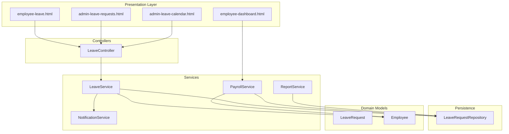
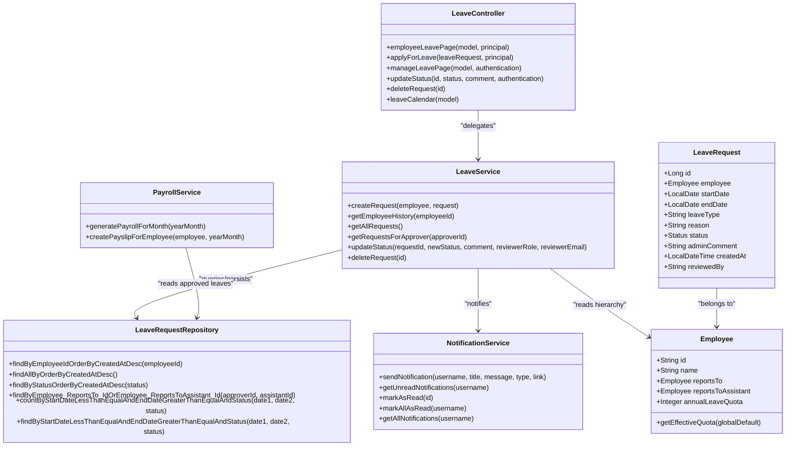
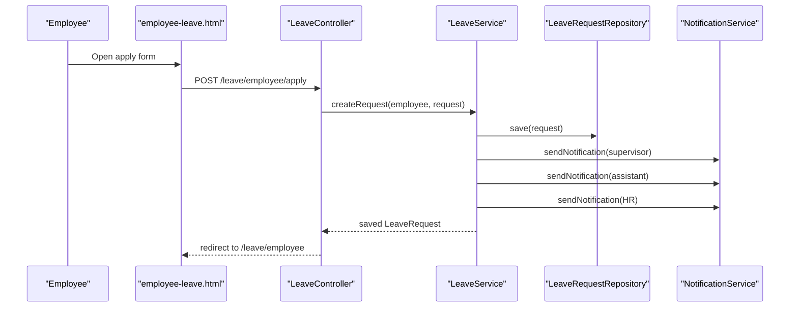
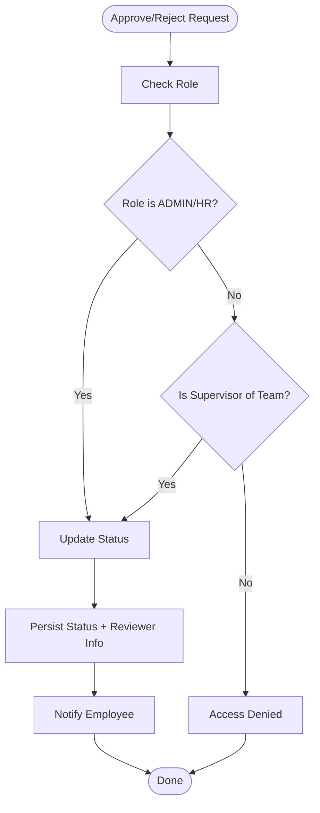
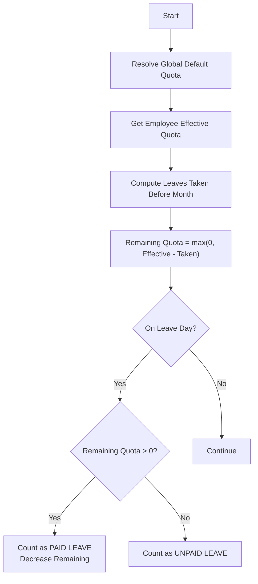
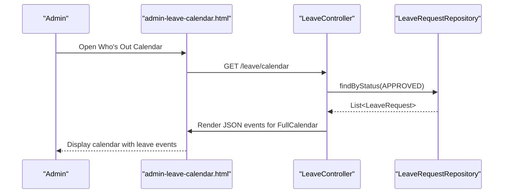
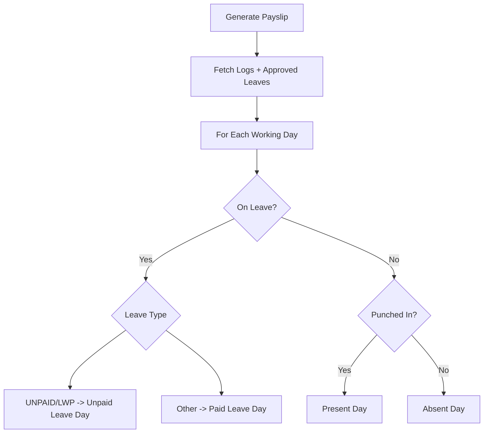
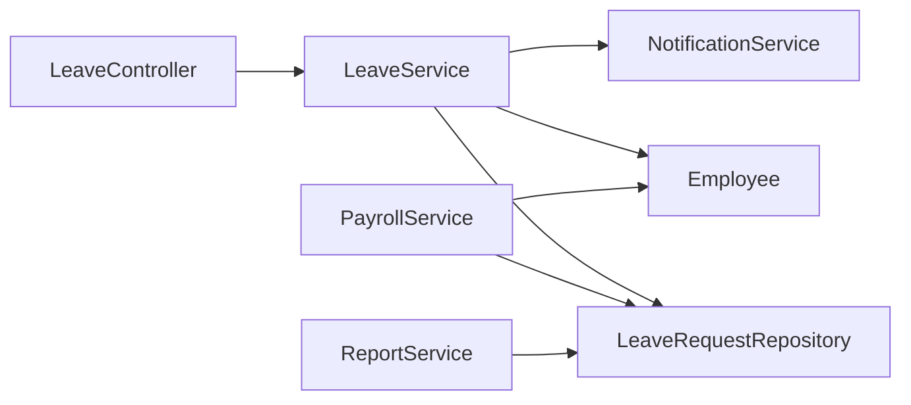

# Leave Management

<cite>
**Referenced Files in This Document**
- [LeaveController.java](file://src/main/java/root/cyb/mh/attendancesystem/controller/LeaveController.java)
- [LeaveService.java](file://src/main/java/root/cyb/mh/attendancesystem/service/LeaveService.java)
- [LeaveRequest.java](file://src/main/java/root/cyb/mh/attendancesystem/model/LeaveRequest.java)
- [LeaveRequestRepository.java](file://src/main/java/root/cyb/mh/attendancesystem/repository/LeaveRequestRepository.java)
- [Employee.java](file://src/main/java/root/cyb/mh/attendancesystem/model/Employee.java)
- [NotificationService.java](file://src/main/java/root/cyb/mh/attendancesystem/service/NotificationService.java)
- [PayrollService.java](file://src/main/java/root/cyb/mh/attendancesystem/service/PayrollService.java)
- [ReportService.java](file://src/main/java/root/cyb/mh/attendancesystem/service/ReportService.java)
- [admin-leave-requests.html](file://src/main/resources/templates/admin-leave-requests.html)
- [employee-leave.html](file://src/main/resources/templates/employee-leave.html)
- [admin-leave-calendar.html](file://src/main/resources/templates/admin-leave-calendar.html)
- [employee-dashboard.html](file://src/main/resources/templates/employee-dashboard.html)
- [settings.html](file://src/main/resources/templates/settings.html)
- [employees.html](file://src/main/resources/templates/employees.html)
- [EmployeeDashboardController.java](file://src/main/java/root/cyb/mh/attendancesystem/controller/EmployeeDashboardController.java)
</cite>

## Table of Contents
1. [Introduction](#introduction)
2. [Project Structure](#project-structure)
3. [Core Components](#core-components)
4. [Architecture Overview](#architecture-overview)
5. [Detailed Component Analysis](#detailed-component-analysis)
6. [Dependency Analysis](#dependency-analysis)
7. [Performance Considerations](#performance-considerations)
8. [Troubleshooting Guide](#troubleshooting-guide)
9. [Conclusion](#conclusion)
10. [Appendices](#appendices)

## Introduction
This document describes the leave management capabilities implemented in the Skylink Custom Backend. It covers how employees submit leave requests, how supervisors and HR process approvals, how leave calendars are synchronized, and how leave interacts with attendance tracking and payroll calculations. It also documents leave quota management, policy configuration, audit trails, and reporting.

## Project Structure
The leave management feature spans controllers, services, repositories, models, and Thymeleaf templates:
- Controllers expose endpoints for employees and administrators.
- Services encapsulate business logic for creation, approval, notifications, and integration with payroll/reporting.
- Repositories provide persistence and queries for leave requests.
- Models define the leave request entity and related domain objects.
- Templates render UI for applying for leave, viewing history, managing requests, and displaying the calendar.

**Diagram sources**
- [LeaveController.java:1-176](file://src/main/java/root/cyb/mh/attendancesystem/controller/LeaveController.java#L1-L176)
- [LeaveService.java:1-127](file://src/main/java/root/cyb/mh/attendancesystem/service/LeaveService.java#L1-L127)
- [LeaveRequestRepository.java:1-34](file://src/main/java/root/cyb/mh/attendancesystem/repository/LeaveRequestRepository.java#L1-L34)
- [LeaveRequest.java:1-54](file://src/main/java/root/cyb/mh/attendancesystem/model/LeaveRequest.java#L1-L54)
- [Employee.java:1-64](file://src/main/java/root/cyb/mh/attendancesystem/model/Employee.java#L1-L64)
- [NotificationService.java:1-78](file://src/main/java/root/cyb/mh/attendancesystem/service/NotificationService.java#L1-L78)
- [PayrollService.java:1-200](file://src/main/java/root/cyb/mh/attendancesystem/service/PayrollService.java#L1-L200)
- [ReportService.java:724-921](file://src/main/java/root/cyb/mh/attendancesystem/service/ReportService.java#L724-L921)
- [employee-leave.html:1-122](file://src/main/resources/templates/employee-leave.html#L1-L122)
- [admin-leave-requests.html:1-198](file://src/main/resources/templates/admin-leave-requests.html#L1-L198)
- [admin-leave-calendar.html:1-50](file://src/main/resources/templates/admin-leave-calendar.html#L1-L50)
- [employee-dashboard.html:846-869](file://src/main/resources/templates/employee-dashboard.html#L846-L869)

**Section sources**
- [LeaveController.java:1-176](file://src/main/java/root/cyb/mh/attendancesystem/controller/LeaveController.java#L1-L176)
- [LeaveService.java:1-127](file://src/main/java/root/cyb/mh/attendancesystem/service/LeaveService.java#L1-L127)
- [LeaveRequestRepository.java:1-34](file://src/main/java/root/cyb/mh/attendancesystem/repository/LeaveRequestRepository.java#L1-L34)
- [LeaveRequest.java:1-54](file://src/main/java/root/cyb/mh/attendancesystem/model/LeaveRequest.java#L1-L54)
- [Employee.java:1-64](file://src/main/java/root/cyb/mh/attendancesystem/model/Employee.java#L1-L64)
- [NotificationService.java:1-78](file://src/main/java/root/cyb/mh/attendancesystem/service/NotificationService.java#L1-L78)
- [PayrollService.java:1-200](file://src/main/java/root/cyb/mh/attendancesystem/service/PayrollService.java#L1-L200)
- [ReportService.java:724-921](file://src/main/java/root/cyb/mh/attendancesystem/service/ReportService.java#L724-L921)
- [employee-leave.html:1-122](file://src/main/resources/templates/employee-leave.html#L1-L122)
- [admin-leave-requests.html:1-198](file://src/main/resources/templates/admin-leave-requests.html#L1-L198)
- [admin-leave-calendar.html:1-50](file://src/main/resources/templates/admin-leave-calendar.html#L1-L50)
- [employee-dashboard.html:846-869](file://src/main/resources/templates/employee-dashboard.html#L846-L869)

## Core Components
- LeaveRequest entity captures leave type, date range, status, comments, timestamps, and who reviewed the request.
- LeaveService orchestrates request creation, notifications, retrieval, and status updates with role-aware constraints.
- LeaveController exposes endpoints for employees to apply and view history, and for managers/HR to approve/reject.
- LeaveRequestRepository provides JPA queries for listing, filtering, and counting leave requests.
- NotificationService persists and pushes notifications to recipients via database, WebSocket, and web push.
- PayrollService integrates approved leaves into monthly payroll computations, distinguishing paid vs unpaid leave.
- ReportService computes leave usage against quotas for dashboards and reports.

**Section sources**
- [LeaveRequest.java:1-54](file://src/main/java/root/cyb/mh/attendancesystem/model/LeaveRequest.java#L1-L54)
- [LeaveService.java:1-127](file://src/main/java/root/cyb/mh/attendancesystem/service/LeaveService.java#L1-L127)
- [LeaveController.java:1-176](file://src/main/java/root/cyb/mh/attendancesystem/controller/LeaveController.java#L1-L176)
- [LeaveRequestRepository.java:1-34](file://src/main/java/root/cyb/mh/attendancesystem/repository/LeaveRequestRepository.java#L1-L34)
- [NotificationService.java:1-78](file://src/main/java/root/cyb/mh/attendancesystem/service/NotificationService.java#L1-L78)
- [PayrollService.java:1-200](file://src/main/java/root/cyb/mh/attendancesystem/service/PayrollService.java#L1-L200)
- [ReportService.java:724-921](file://src/main/java/root/cyb/mh/attendancesystem/service/ReportService.java#L724-L921)

## Architecture Overview
Leave management follows a layered architecture:
- Presentation: Thymeleaf templates render forms and lists for employees and administrators.
- Controller: Handles HTTP requests, enforces roles, and delegates to services.
- Service: Implements business rules, notifications, and integrations.
- Persistence: JPA repositories manage LeaveRequest and related entities.

**Diagram sources**
- [LeaveController.java:1-176](file://src/main/java/root/cyb/mh/attendancesystem/controller/LeaveController.java#L1-L176)
- [LeaveService.java:1-127](file://src/main/java/root/cyb/mh/attendancesystem/service/LeaveService.java#L1-L127)
- [LeaveRequestRepository.java:1-34](file://src/main/java/root/cyb/mh/attendancesystem/repository/LeaveRequestRepository.java#L1-L34)
- [LeaveRequest.java:1-54](file://src/main/java/root/cyb/mh/attendancesystem/model/LeaveRequest.java#L1-L54)
- [Employee.java:1-64](file://src/main/java/root/cyb/mh/attendancesystem/model/Employee.java#L1-L64)
- [NotificationService.java:1-78](file://src/main/java/root/cyb/mh/attendancesystem/service/NotificationService.java#L1-L78)
- [PayrollService.java:1-200](file://src/main/java/root/cyb/mh/attendancesystem/service/PayrollService.java#L1-L200)

## Detailed Component Analysis

### Leave Request Lifecycle
- Creation: Employees submit requests with type, dates, and reason. Service sets status to pending and notifies supervisors, assistants, and HR.
- Approval: Managers/HR review and update status. HR can only change pending requests; admins can override any state. Notifications inform the requester.
- Deletion: Admins can delete requests (useful for testing corrections).

**Diagram sources**
- [employee-leave.html:1-122](file://src/main/resources/templates/employee-leave.html#L1-L122)
- [LeaveController.java:46-55](file://src/main/java/root/cyb/mh/attendancesystem/controller/LeaveController.java#L46-L55)
- [LeaveService.java:24-46](file://src/main/java/root/cyb/mh/attendancesystem/service/LeaveService.java#L24-L46)
- [LeaveRequestRepository.java:1-34](file://src/main/java/root/cyb/mh/attendancesystem/repository/LeaveRequestRepository.java#L1-L34)
- [NotificationService.java:22-44](file://src/main/java/root/cyb/mh/attendancesystem/service/NotificationService.java#L22-L44)

**Section sources**
- [LeaveService.java:24-121](file://src/main/java/root/cyb/mh/attendancesystem/service/LeaveService.java#L24-L121)
- [LeaveController.java:46-55](file://src/main/java/root/cyb/mh/attendancesystem/controller/LeaveController.java#L46-L55)
- [admin-leave-requests.html:65-79](file://src/main/resources/templates/admin-leave-requests.html#L65-L79)

### Approval Hierarchies and Role Enforcement
- Access control ensures only authorized users can approve:
  - Admins/HR can approve/reject any pending request.
  - Supervisors can act on team members they supervise (primary or assistant).
- On update, the service records reviewer identity and comment, then notifies the requester.

**Diagram sources**
- [LeaveController.java:57-124](file://src/main/java/root/cyb/mh/attendancesystem/controller/LeaveController.java#L57-L124)
- [LeaveService.java:84-121](file://src/main/java/root/cyb/mh/attendancesystem/service/LeaveService.java#L84-L121)

**Section sources**
- [LeaveController.java:57-124](file://src/main/java/root/cyb/mh/attendancesystem/controller/LeaveController.java#L57-L124)
- [LeaveService.java:84-121](file://src/main/java/root/cyb/mh/attendancesystem/service/LeaveService.java#L84-L121)

### Leave Types, Entitlements, and Quota Management
- Leave types are configurable in the employee UI and stored on the request.
- Quotas are managed per employee with a fallback to a global default:
  - Effective quota per employee is either a per-user override or the system default.
  - Reports and dashboards compute paid vs unpaid leave based on remaining quota for the year.

**Diagram sources**
- [ReportService.java:732-750](file://src/main/java/root/cyb/mh/attendancesystem/service/ReportService.java#L732-L750)
- [ReportService.java:895-921](file://src/main/java/root/cyb/mh/attendancesystem/service/ReportService.java#L895-L921)
- [Employee.java:60-62](file://src/main/java/root/cyb/mh/attendancesystem/model/Employee.java#L60-L62)
- [employee-dashboard.html:846-869](file://src/main/resources/templates/employee-dashboard.html#L846-L869)
- [settings.html:48-67](file://src/main/resources/templates/settings.html#L48-L67)

**Section sources**
- [Employee.java:60-62](file://src/main/java/root/cyb/mh/attendancesystem/model/Employee.java#L60-L62)
- [ReportService.java:732-750](file://src/main/java/root/cyb/mh/attendancesystem/service/ReportService.java#L732-L750)
- [ReportService.java:895-921](file://src/main/java/root/cyb/mh/attendancesystem/service/ReportService.java#L895-L921)
- [employee-dashboard.html:846-869](file://src/main/resources/templates/employee-dashboard.html#L846-L869)
- [settings.html:48-67](file://src/main/resources/templates/settings.html#L48-L67)

### Calendar Management and Synchronization
- The calendar endpoint aggregates approved leave requests and renders them on a FullCalendar view.
- Events are color-coded by leave type for quick recognition.

**Diagram sources**
- [admin-leave-calendar.html:1-50](file://src/main/resources/templates/admin-leave-calendar.html#L1-L50)
- [LeaveController.java:136-174](file://src/main/java/root/cyb/mh/attendancesystem/controller/LeaveController.java#L136-L174)
- [LeaveRequestRepository.java:18-28](file://src/main/java/root/cyb/mh/attendancesystem/repository/LeaveRequestRepository.java#L18-L28)

**Section sources**
- [LeaveController.java:136-174](file://src/main/java/root/cyb/mh/attendancesystem/controller/LeaveController.java#L136-L174)
- [admin-leave-calendar.html:1-50](file://src/main/resources/templates/admin-leave-calendar.html#L1-L50)

### Integration with Attendance Tracking and Payroll
- Payroll generation considers approved leaves to distinguish paid vs unpaid days:
  - For each day in the month, if an employee is on approved leave, classify as paid/unpaid based on leave type and remaining quota.
  - Absences without leave on working days increase absent counts.
- Reports and dashboards reflect paid/unpaid leave totals derived from these computations.

**Diagram sources**
- [PayrollService.java:94-194](file://src/main/java/root/cyb/mh/attendancesystem/service/PayrollService.java#L94-L194)
- [ReportService.java:732-750](file://src/main/java/root/cyb/mh/attendancesystem/service/ReportService.java#L732-L750)
- [ReportService.java:895-921](file://src/main/java/root/cyb/mh/attendancesystem/service/ReportService.java#L895-L921)

**Section sources**
- [PayrollService.java:94-194](file://src/main/java/root/cyb/mh/attendancesystem/service/PayrollService.java#L94-L194)
- [ReportService.java:732-750](file://src/main/java/root/cyb/mh/attendancesystem/service/ReportService.java#L732-L750)
- [ReportService.java:895-921](file://src/main/java/root/cyb/mh/attendancesystem/service/ReportService.java#L895-L921)

### Practical Examples

#### Example: Employee submits a leave request
- Steps:
  - Employee opens the apply tab, selects leave type, enters dates, and reasons.
  - Submission saves a pending request and sends notifications to supervisor, assistant, and HR.
- Outcome:
  - Request appears in manager’s “My Team’s Requests” list if applicable.

**Section sources**
- [employee-leave.html:30-67](file://src/main/resources/templates/employee-leave.html#L30-L67)
- [LeaveController.java:46-55](file://src/main/java/root/cyb/mh/attendancesystem/controller/LeaveController.java#L46-L55)
- [LeaveService.java:24-46](file://src/main/java/root/cyb/mh/attendancesystem/service/LeaveService.java#L24-L46)

#### Example: Supervisor approves a request
- Steps:
  - Supervisor views the request list, opens the action modal, and confirms approval.
  - Service updates status, records reviewer info, and notifies the employee.
- Outcome:
  - Employee receives a notification with the updated status and reviewer details.

**Section sources**
- [admin-leave-requests.html:65-79](file://src/main/resources/templates/admin-leave-requests.html#L65-L79)
- [LeaveController.java:92-124](file://src/main/java/root/cyb/mh/attendancesystem/controller/LeaveController.java#L92-L124)
- [LeaveService.java:84-121](file://src/main/java/root/cyb/mh/attendancesystem/service/LeaveService.java#L84-L121)

#### Example: Calendar synchronization
- Steps:
  - Admin navigates to the calendar page; backend fetches approved leaves and renders FullCalendar events.
  - Events are color-coded by leave type.
- Outcome:
  - Organization-wide visibility of who is off on specific dates.

**Section sources**
- [LeaveController.java:136-174](file://src/main/java/root/cyb/mh/attendancesystem/controller/LeaveController.java#L136-L174)
- [admin-leave-calendar.html:25-46](file://src/main/resources/templates/admin-leave-calendar.html#L25-L46)

#### Example: Reporting and quota usage
- Steps:
  - Dashboard computes annual quota, leaves taken, and splits into paid/unpaid using remaining quota logic.
  - Settings allow configuring default annual leave quota.
- Outcome:
  - Clear visibility of quota utilization per employee.

**Section sources**
- [EmployeeDashboardController.java:119-146](file://src/main/java/root/cyb/mh/attendancesystem/controller/EmployeeDashboardController.java#L119-L146)
- [employee-dashboard.html:846-869](file://src/main/resources/templates/employee-dashboard.html#L846-L869)
- [settings.html:48-67](file://src/main/resources/templates/settings.html#L48-L67)

## Dependency Analysis
- Controllers depend on services for business logic and on repositories for persistence.
- Services depend on repositories and notification services.
- Payroll and reporting services depend on leave data to compute paid/unpaid leave.

**Diagram sources**
- [LeaveController.java:1-176](file://src/main/java/root/cyb/mh/attendancesystem/controller/LeaveController.java#L1-L176)
- [LeaveService.java:1-127](file://src/main/java/root/cyb/mh/attendancesystem/service/LeaveService.java#L1-L127)
- [LeaveRequestRepository.java:1-34](file://src/main/java/root/cyb/mh/attendancesystem/repository/LeaveRequestRepository.java#L1-L34)
- [NotificationService.java:1-78](file://src/main/java/root/cyb/mh/attendancesystem/service/NotificationService.java#L1-L78)
- [PayrollService.java:1-200](file://src/main/java/root/cyb/mh/attendancesystem/service/PayrollService.java#L1-L200)
- [ReportService.java:724-921](file://src/main/java/root/cyb/mh/attendancesystem/service/ReportService.java#L724-L921)
- [Employee.java:1-64](file://src/main/java/root/cyb/mh/attendancesystem/model/Employee.java#L1-L64)

**Section sources**
- [LeaveController.java:1-176](file://src/main/java/root/cyb/mh/attendancesystem/controller/LeaveController.java#L1-L176)
- [LeaveService.java:1-127](file://src/main/java/root/cyb/mh/attendancesystem/service/LeaveService.java#L1-L127)
- [LeaveRequestRepository.java:1-34](file://src/main/java/root/cyb/mh/attendancesystem/repository/LeaveRequestRepository.java#L1-L34)
- [NotificationService.java:1-78](file://src/main/java/root/cyb/mh/attendancesystem/service/NotificationService.java#L1-L78)
- [PayrollService.java:1-200](file://src/main/java/root/cyb/mh/attendancesystem/service/PayrollService.java#L1-L200)
- [ReportService.java:724-921](file://src/main/java/root/cyb/mh/attendancesystem/service/ReportService.java#L724-L921)
- [Employee.java:1-64](file://src/main/java/root/cyb/mh/attendancesystem/model/Employee.java#L1-L64)

## Performance Considerations
- Bulk queries: Payroll and reporting fetch approved leaves and attendance logs in batches to minimize repeated round trips.
- Calendar rendering: Building JSON events server-side avoids heavy client-side computation.
- Notification delivery: Asynchronous WebSocket and web push delivery with logging to prevent blocking.

[No sources needed since this section provides general guidance]

## Troubleshooting Guide
- Access denied when approving:
  - Ensure the current user is either ADMIN/HR or supervises the requester.
- Cannot edit non-pending requests:
  - HR can only modify pending requests; otherwise, only admins can override.
- Notifications not received:
  - Verify notification storage and WebSocket/web push configurations; errors are logged but do not fail the request.
- Calendar shows incorrect dates:
  - Confirm FullCalendar end date is exclusive by adding one day to the backend end date.

**Section sources**
- [LeaveController.java:75-124](file://src/main/java/root/cyb/mh/attendancesystem/controller/LeaveController.java#L75-L124)
- [LeaveService.java:84-121](file://src/main/java/root/cyb/mh/attendancesystem/service/LeaveService.java#L84-L121)
- [NotificationService.java:22-44](file://src/main/java/root/cyb/mh/attendancesystem/service/NotificationService.java#L22-L44)
- [LeaveController.java:148-168](file://src/main/java/root/cyb/mh/attendancesystem/controller/LeaveController.java#L148-L168)

## Conclusion
The Skylink Custom Backend implements a robust leave management system with clear separation of concerns, role-based access controls, integrated notifications, calendar synchronization, and strong payroll integration. Leave quotas are enforced via effective quota logic, and reporting surfaces paid/unpaid leave usage for transparency.

## Appendices

### Audit Trail and Comments
- Each status update stores reviewer identity and optional admin comments for traceability.

**Section sources**
- [LeaveService.java:99-100](file://src/main/java/root/cyb/mh/attendancesystem/service/LeaveService.java#L99-L100)
- [admin-leave-requests.html:52-56](file://src/main/resources/templates/admin-leave-requests.html#L52-L56)

### Policy Configuration
- Default annual leave quota is configurable in settings and used when employees lack individual overrides.
- Per-employee overrides are visible and editable in the employees list.

**Section sources**
- [settings.html:48-67](file://src/main/resources/templates/settings.html#L48-L67)
- [employees.html:133-148](file://src/main/resources/templates/employees.html#L133-L148)
- [Employee.java:43-62](file://src/main/java/root/cyb/mh/attendancesystem/model/Employee.java#L43-L62)