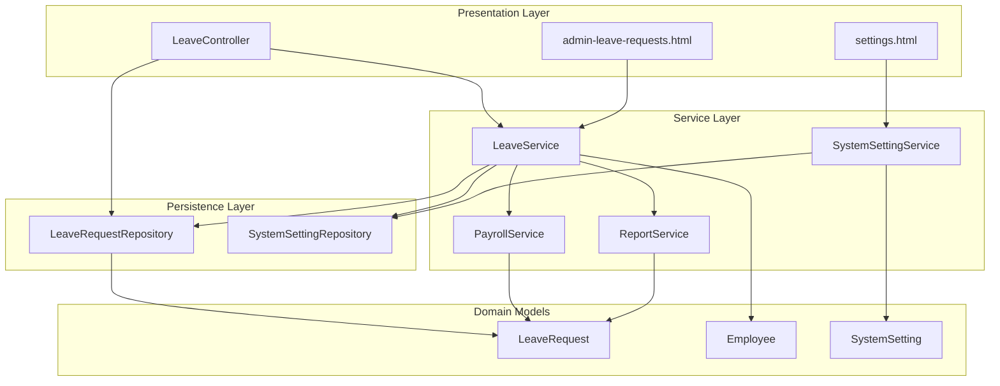
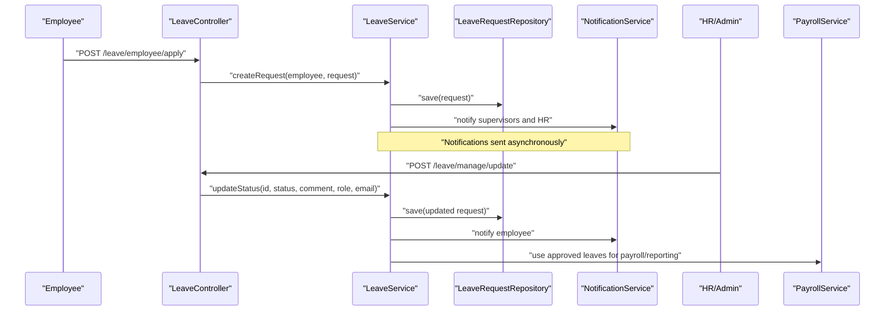
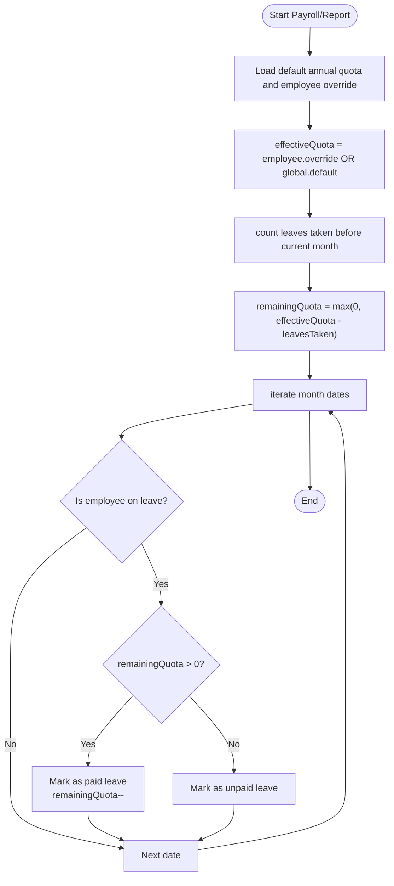
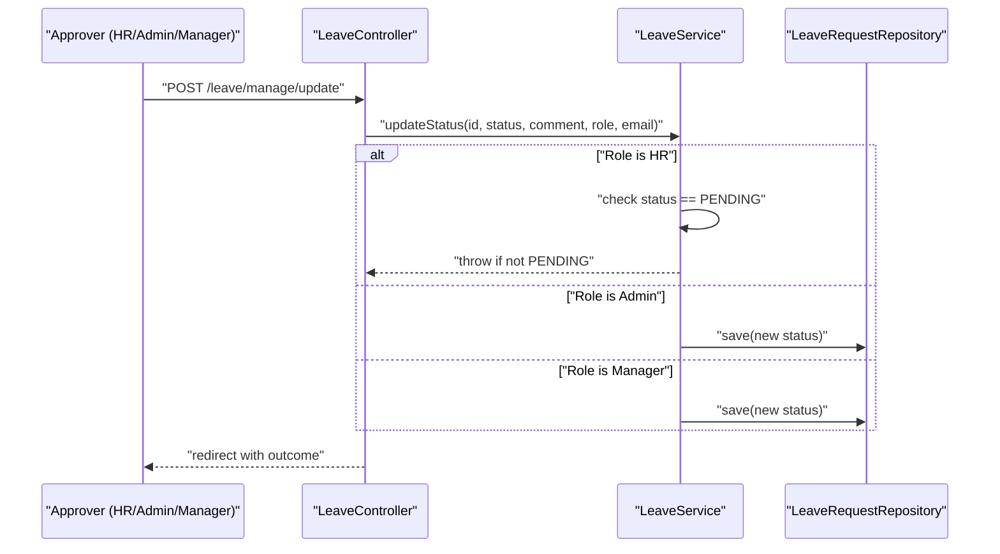
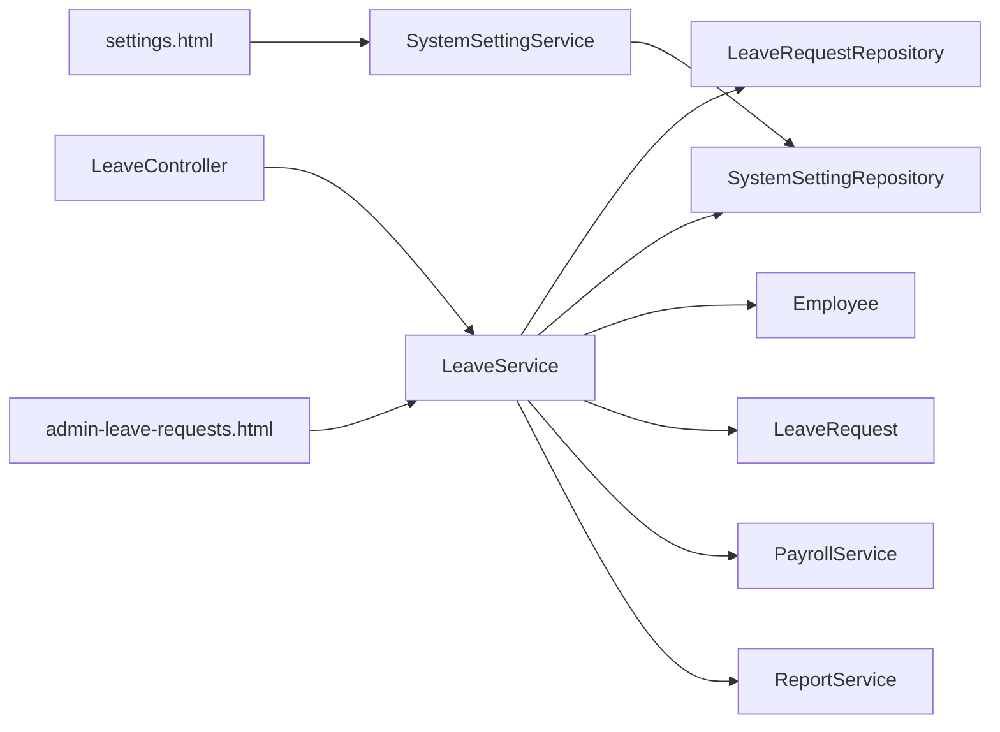

# Leave Policy Enforcement

<cite>
**Referenced Files in This Document**
- [LeaveController.java](file://src/main/java/root/cyb/mh/attendancesystem/controller/LeaveController.java)
- [LeaveService.java](file://src/main/java/root/cyb/mh/attendancesystem/service/LeaveService.java)
- [LeaveRequest.java](file://src/main/java/root/cyb/mh/attendancesystem/model/LeaveRequest.java)
- [LeaveRequestRepository.java](file://src/main/java/root/cyb/mh/attendancesystem/repository/LeaveRequestRepository.java)
- [Employee.java](file://src/main/java/root/cyb/mh/attendancesystem/model/Employee.java)
- [SystemSetting.java](file://src/main/java/root/cyb/mh/attendancesystem/model/SystemSetting.java)
- [SystemSettingService.java](file://src/main/java/root/cyb/mh/attendancesystem/service/SystemSettingService.java)
- [settings.html](file://src/main/resources/templates/settings.html)
- [admin-leave-requests.html](file://src/main/resources/templates/admin-leave-requests.html)
- [PayrollService.java](file://src/main/java/root/cyb/mh/attendancesystem/service/PayrollService.java)
- [ReportService.java](file://src/main/java/root/cyb/mh/attendancesystem/service/ReportService.java)
- [DemoDataService.java](file://src/main/java/root/cyb/mh/attendancesystem/service/DemoDataService.java)
</cite>

## Table of Contents
1. [Introduction](#introduction)
2. [Project Structure](#project-structure)
3. [Core Components](#core-components)
4. [Architecture Overview](#architecture-overview)
5. [Detailed Component Analysis](#detailed-component-analysis)
6. [Dependency Analysis](#dependency-analysis)
7. [Performance Considerations](#performance-considerations)
8. [Troubleshooting Guide](#troubleshooting-guide)
9. [Conclusion](#conclusion)
10. [Appendices](#appendices)

## Introduction
This document explains the leave policy enforcement mechanisms and business rule implementation in the Skylink attendance system. It covers leave type definitions, entitlement calculations, carry-forward policies, and usage limitations. It also documents policy validation during request processing, quota checking, conflict resolution, configuration options, rule customization, and compliance monitoring. Examples of policy scenarios, validation rules, and enforcement mechanisms are included, along with integration points to employee contracts, company policies, and regulatory requirements.

## Project Structure
The leave policy enforcement spans controllers, services, repositories, models, and UI templates:
- Controllers handle HTTP endpoints for employee leave applications and administrative approvals.
- Services encapsulate business logic for leave requests, notifications, and status updates.
- Repositories persist and query leave requests and system settings.
- Models define leave requests, employees, and system settings.
- Templates render UI for leave calendar, approvals, and settings.

**Diagram sources**
- [LeaveController.java:18-176](file://src/main/java/root/cyb/mh/attendancesystem/controller/LeaveController.java#L18-L176)
- [LeaveService.java:12-127](file://src/main/java/root/cyb/mh/attendancesystem/service/LeaveService.java#L12-L127)
- [LeaveRequestRepository.java:9-34](file://src/main/java/root/cyb/mh/attendancesystem/repository/LeaveRequestRepository.java#L9-L34)
- [LeaveRequest.java:11-54](file://src/main/java/root/cyb/mh/attendancesystem/model/LeaveRequest.java#L11-L54)
- [Employee.java:13-64](file://src/main/java/root/cyb/mh/attendancesystem/model/Employee.java#L13-L64)
- [SystemSetting.java:11-27](file://src/main/java/root/cyb/mh/attendancesystem/model/SystemSetting.java#L11-L27)
- [SystemSettingService.java:8-25](file://src/main/java/root/cyb/mh/attendancesystem/service/SystemSettingService.java#L8-L25)
- [settings.html:40-239](file://src/main/resources/templates/settings.html#L40-L239)
- [admin-leave-requests.html:46-62](file://src/main/resources/templates/admin-leave-requests.html#L46-L62)

**Section sources**
- [LeaveController.java:18-176](file://src/main/java/root/cyb/mh/attendancesystem/controller/LeaveController.java#L18-L176)
- [LeaveService.java:12-127](file://src/main/java/root/cyb/mh/attendancesystem/service/LeaveService.java#L12-L127)
- [LeaveRequestRepository.java:9-34](file://src/main/java/root/cyb/mh/attendancesystem/repository/LeaveRequestRepository.java#L9-L34)
- [LeaveRequest.java:11-54](file://src/main/java/root/cyb/mh/attendancesystem/model/LeaveRequest.java#L11-L54)
- [Employee.java:13-64](file://src/main/java/root/cyb/mh/attendancesystem/model/Employee.java#L13-L64)
- [SystemSetting.java:11-27](file://src/main/java/root/cyb/mh/attendancesystem/model/SystemSetting.java#L11-L27)
- [SystemSettingService.java:8-25](file://src/main/java/root/cyb/mh/attendancesystem/service/SystemSettingService.java#L8-L25)
- [settings.html:40-239](file://src/main/resources/templates/settings.html#L40-L239)
- [admin-leave-requests.html:46-62](file://src/main/resources/templates/admin-leave-requests.html#L46-L62)

## Core Components
- LeaveRequest: Defines leave application fields including dates, type, reason, status, and audit metadata.
- Employee: Stores employee identity, reporting hierarchy, salary, and annual leave quota (including effective quota calculation).
- SystemSetting/SystemSettingService: Centralized storage and retrieval of configurable policy keys (e.g., default annual leave quota).
- LeaveController: Exposes endpoints for employees to apply and view history, and for administrators/HR/managers to approve/reject.
- LeaveService: Implements request lifecycle, notifications, and status transitions with role-based checks.
- LeaveRequestRepository: Provides queries for leave history, pending requests, and calendar filtering.

Key policy-relevant elements:
- Leave type is stored as a string label on LeaveRequest.
- Effective annual leave quota per employee is derived from either employee-specific override or global default.
- Approval workflow enforces role-based constraints and prevents HR from modifying processed requests.

**Section sources**
- [LeaveRequest.java:11-54](file://src/main/java/root/cyb/mh/attendancesystem/model/LeaveRequest.java#L11-L54)
- [Employee.java:43-62](file://src/main/java/root/cyb/mh/attendancesystem/model/Employee.java#L43-L62)
- [SystemSetting.java:11-27](file://src/main/java/root/cyb/mh/attendancesystem/model/SystemSetting.java#L11-L27)
- [SystemSettingService.java:14-23](file://src/main/java/root/cyb/mh/attendancesystem/service/SystemSettingService.java#L14-L23)
- [LeaveController.java:33-174](file://src/main/java/root/cyb/mh/attendancesystem/controller/LeaveController.java#L33-L174)
- [LeaveService.java:24-121](file://src/main/java/root/cyb/mh/attendancesystem/service/LeaveService.java#L24-L121)
- [LeaveRequestRepository.java:12-32](file://src/main/java/root/cyb/mh/attendancesystem/repository/LeaveRequestRepository.java#L12-L32)

## Architecture Overview
The leave enforcement architecture integrates request creation, approval routing, and payroll/reporting impact. The system supports:
- Role-based access control for approvals (Admin, HR, Manager).
- Notification-driven workflow to supervisors and HR.
- Payroll and reporting logic that distinguishes paid vs unpaid leave based on quotas.

**Diagram sources**
- [LeaveController.java:46-124](file://src/main/java/root/cyb/mh/attendancesystem/controller/LeaveController.java#L46-L124)
- [LeaveService.java:24-121](file://src/main/java/root/cyb/mh/attendancesystem/service/LeaveService.java#L24-L121)
- [LeaveRequestRepository.java:12-32](file://src/main/java/root/cyb/mh/attendancesystem/repository/LeaveRequestRepository.java#L12-L32)
- [PayrollService.java:94-290](file://src/main/java/root/cyb/mh/attendancesystem/service/PayrollService.java#L94-L290)

## Detailed Component Analysis

### Leave Types and Definitions
- LeaveRequest stores a free-text leaveType field. Common examples observed in the codebase include labels such as “Sick” and “Casual,” indicating that the system treats leave types as configurable labels rather than strict enumerations.
- UI templates support color-coded calendars for leave types (e.g., “Sick” and “Casual”), enabling visibility and differentiation.

Policy implications:
- Define company-wide leave types via configuration or documentation aligned with the leaveType field.
- Treat “Sick” and “Casual” as examples; extend with “Vacation,” “Maternity,” “Paternity,” etc., as needed.

**Section sources**
- [LeaveRequest.java:31](file://src/main/java/root/cyb/mh/attendancesystem/model/LeaveRequest.java#L31)
- [LeaveController.java:156-159](file://src/main/java/root/cyb/mh/attendancesystem/controller/LeaveController.java#L156-L159)
- [DemoDataService.java:60-63](file://src/main/java/root/cyb/mh/attendancesystem/service/DemoDataService.java#L60-L63)

### Entitlement Calculations and Carry-Forward Policies
- Effective annual leave quota per employee is computed using Employee.getEffectiveQuota(defaultGlobal), where defaultGlobal is sourced from system settings.
- Carry-forward is not explicitly modeled in the codebase; however, the effective quota mechanism allows annual entitlement to be set globally and overridden per employee.

Policy configuration:
- Default annual leave quota is configured via settings.html and retrieved by SystemSettingService.getValue(key, default).
- Employees can have individual overrides via Employee.annualLeaveQuota.

Compliance note:
- Carry-forward must be explicitly defined in company policy and reflected in entitlement logic if required. The current implementation does not include a dedicated carry-forward calculation.

**Section sources**
- [Employee.java:60-62](file://src/main/java/root/cyb/mh/attendancesystem/model/Employee.java#L60-L62)
- [settings.html:51-56](file://src/main/resources/templates/settings.html#L51-L56)
- [SystemSettingService.java:14-18](file://src/main/java/root/cyb/mh/attendancesystem/service/SystemSettingService.java#L14-L18)

### Usage Limitations and Quota Checking
- During payroll/reporting, the system computes paid vs unpaid leave based on an effective quota and leaves taken prior to the current period.
- ReportService demonstrates the logic: effectiveQuota minus leaves taken before the month determines remaining quota, allocating paid leave up to the quota and unpaid leave beyond it.

Enforcement mechanism:
- Quota is enforced post-approval in reporting/payroll calculations, not at request time. This implies that approvals do not block requests exceeding quota; instead, unpaid leave is recorded during pay computation.

**Diagram sources**
- [ReportService.java:732-750](file://src/main/java/root/cyb/mh/attendancesystem/service/ReportService.java#L732-L750)

**Section sources**
- [ReportService.java:732-750](file://src/main/java/root/cyb/mh/attendancesystem/service/ReportService.java#L732-L750)
- [PayrollService.java:256-257](file://src/main/java/root/cyb/mh/attendancesystem/service/PayrollService.java#L256-L257)

### Policy Validation During Request Processing
- Request creation sets initial status to PENDING and routes notifications to supervisors and HR.
- Approval workflow enforces:
  - HR cannot modify requests already processed (status != PENDING).
  - Admins can override statuses without restriction.
  - Managers can only see and act on team members they supervise.

Conflict resolution:
- If an HR attempts to change a non-PENDING request, an exception is thrown, preventing invalid state transitions.
- Notifications inform stakeholders of status changes.

**Diagram sources**
- [LeaveController.java:92-124](file://src/main/java/root/cyb/mh/attendancesystem/controller/LeaveController.java#L92-L124)
- [LeaveService.java:84-102](file://src/main/java/root/cyb/mh/attendancesystem/service/LeaveService.java#L84-L102)

**Section sources**
- [LeaveController.java:92-124](file://src/main/java/root/cyb/mh/attendancesystem/controller/LeaveController.java#L92-L124)
- [LeaveService.java:84-102](file://src/main/java/root/cyb/mh/attendancesystem/service/LeaveService.java#L84-L102)

### Policy Configuration Options and Rule Customization
- Default annual leave quota is configurable via settings.html and persisted via SystemSettingService.
- UI toggles daily rate basis and late penalty rules influence payroll computations, indirectly affecting unpaid leave impacts.

Customization examples:
- Adjust defaultAnnualLeaveQuota to reflect statutory or contractual entitlements.
- Configure dailyRateBasis and late penalty thresholds to align with company policy.
- Extend leaveType labels to match organizational taxonomy.

**Section sources**
- [settings.html:51-56](file://src/main/resources/templates/settings.html#L51-L56)
- [SystemSettingService.java:14-23](file://src/main/java/root/cyb/mh/attendancesystem/service/SystemSettingService.java#L14-L23)
- [settings.html:65-81](file://src/main/resources/templates/settings.html#L65-L81)
- [settings.html:105-120](file://src/main/resources/templates/settings.html#L105-L120)

### Compliance Monitoring and Reporting
- Approved leave events are rendered on a calendar with color coding for visibility.
- Reports distinguish paid vs unpaid leave based on quota logic, supporting compliance audits.

Monitoring indicators:
- Calendar color coding for “Sick” and “Casual.”
- ReportService’s paid/unpaid leave counters for monthly summaries.

**Section sources**
- [LeaveController.java:136-174](file://src/main/java/root/cyb/mh/attendancesystem/controller/LeaveController.java#L136-L174)
- [ReportService.java:741-749](file://src/main/java/root/cyb/mh/attendancesystem/service/ReportService.java#L741-L749)

### Integration with Employee Contracts, Company Policies, and Regulatory Requirements
- Employee.annualLeaveQuota enables contract-specific overrides.
- SystemSetting defaultAnnualLeaveQuota aligns with company policy or regulatory caps.
- PayrollService and ReportService integrate leave outcomes into financial calculations and reporting, ensuring compliance with internal policies and potential regulatory requirements.

Integration points:
- Contractual overrides via Employee.annualLeaveQuota.
- Policy alignment via SystemSetting defaultAnnualLeaveQuota.
- Payroll impact via unpaidLeaveDays deductions.

**Section sources**
- [Employee.java:43](file://src/main/java/root/cyb/mh/attendancesystem/model/Employee.java#L43)
- [SystemSettingService.java:14-18](file://src/main/java/root/cyb/mh/attendancesystem/service/SystemSettingService.java#L14-L18)
- [PayrollService.java:256-257](file://src/main/java/root/cyb/mh/attendancesystem/service/PayrollService.java#L256-L257)

## Dependency Analysis
The following diagram maps key dependencies among components involved in leave policy enforcement:

**Diagram sources**
- [LeaveController.java:25-29](file://src/main/java/root/cyb/mh/attendancesystem/controller/LeaveController.java#L25-L29)
- [LeaveService.java:16-22](file://src/main/java/root/cyb/mh/attendancesystem/service/LeaveService.java#L16-L22)
- [LeaveRequestRepository.java:9](file://src/main/java/root/cyb/mh/attendancesystem/repository/LeaveRequestRepository.java#L9)
- [SystemSettingService.java:8](file://src/main/java/root/cyb/mh/attendancesystem/service/SystemSettingService.java#L8)
- [settings.html:40-239](file://src/main/resources/templates/settings.html#L40-L239)

**Section sources**
- [LeaveController.java:25-29](file://src/main/java/root/cyb/mh/attendancesystem/controller/LeaveController.java#L25-L29)
- [LeaveService.java:16-22](file://src/main/java/root/cyb/mh/attendancesystem/service/LeaveService.java#L16-L22)
- [LeaveRequestRepository.java:9](file://src/main/java/root/cyb/mh/attendancesystem/repository/LeaveRequestRepository.java#L9)
- [SystemSettingService.java:8](file://src/main/java/root/cyb/mh/attendancesystem/service/SystemSettingService.java#L8)
- [settings.html:40-239](file://src/main/resources/templates/settings.html#L40-L239)

## Performance Considerations
- Leave calendar rendering aggregates approved leaves and constructs JSON for FullCalendar. For large datasets, consider server-side pagination or filtering to reduce payload size.
- Payroll/reporting loops iterate monthly dates and leave records; ensure indexes on LeaveRequest.employee_id, LeaveRequest.status, and date ranges to optimize queries.
- Notification dispatch occurs asynchronously; avoid blocking operations in the request thread.

## Troubleshooting Guide
Common issues and resolutions:
- Access denied for managers: Ensure the approver is linked as primary supervisor or assistant; otherwise, access is denied.
- HR cannot modify processed requests: Verify the request status is PENDING before attempting updates.
- Approved leave not reflected in payroll: Confirm the leave status is APPROVED and that the payroll/reporting cycle runs after approval.

**Section sources**
- [LeaveController.java:74-80](file://src/main/java/root/cyb/mh/attendancesystem/controller/LeaveController.java#L74-L80)
- [LeaveService.java:89-94](file://src/main/java/root/cyb/mh/attendancesystem/service/LeaveService.java#L89-L94)
- [LeaveRequest.java:48-52](file://src/main/java/root/cyb/mh/attendancesystem/model/LeaveRequest.java#L48-L52)

## Conclusion
The Skylink system implements a flexible leave policy framework centered on:
- Configurable annual leave quotas (global default and employee overrides),
- Role-based approval workflows with clear validation rules,
- Post-approval quota enforcement reflected in payroll and reporting as paid vs unpaid leave,
- Visibility through calendar and UI templates.

To strengthen compliance:
- Define explicit carry-forward and usage rules,
- Integrate pre-approval quota checks if needed,
- Align defaultAnnualLeaveQuota with statutory or contractual obligations.

## Appendices

### Appendix A: Example Policy Scenarios
- Scenario 1: Employee with override quota applies for leave exceeding quota in a given month. Outcome: Leaves within quota are paid; excess is unpaid.
- Scenario 2: HR attempts to edit a non-PENDING request. Outcome: Operation fails with an exception.
- Scenario 3: Manager approves a request for a team member under supervision. Outcome: Status updated and employee notified.

**Section sources**
- [ReportService.java:732-750](file://src/main/java/root/cyb/mh/attendancesystem/service/ReportService.java#L732-L750)
- [LeaveService.java:89-94](file://src/main/java/root/cyb/mh/attendancesystem/service/LeaveService.java#L89-L94)
- [LeaveController.java:74-80](file://src/main/java/root/cyb/mh/attendancesystem/controller/LeaveController.java#L74-L80)