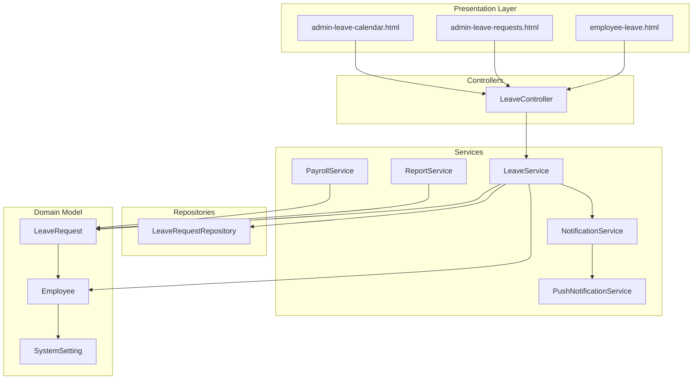
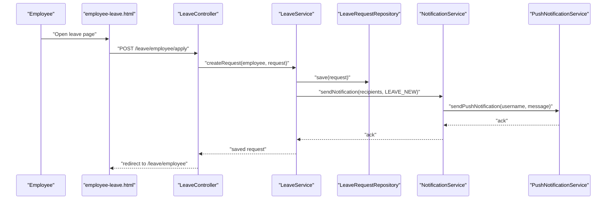
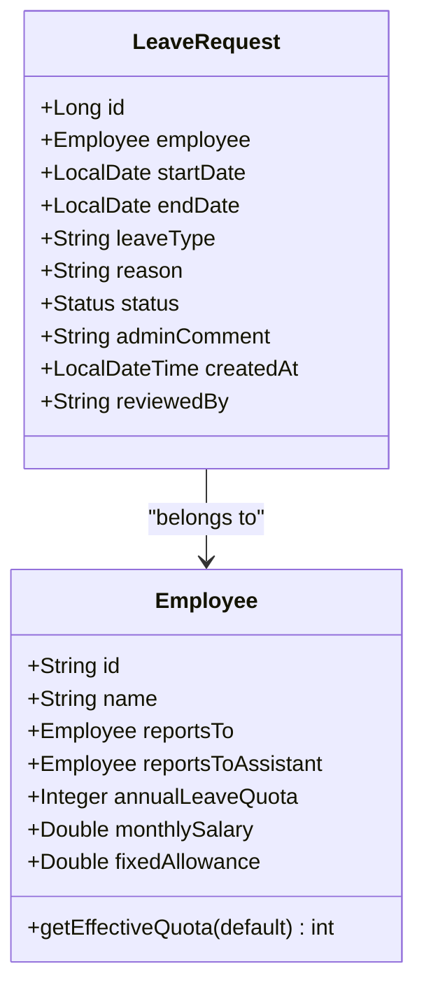
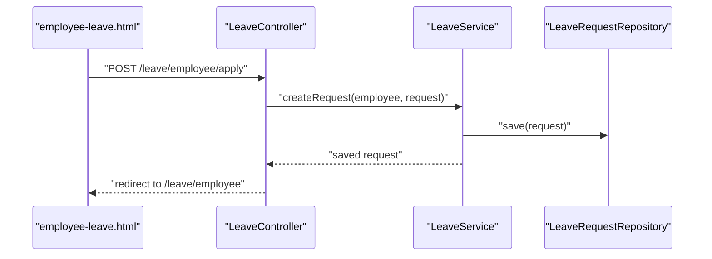
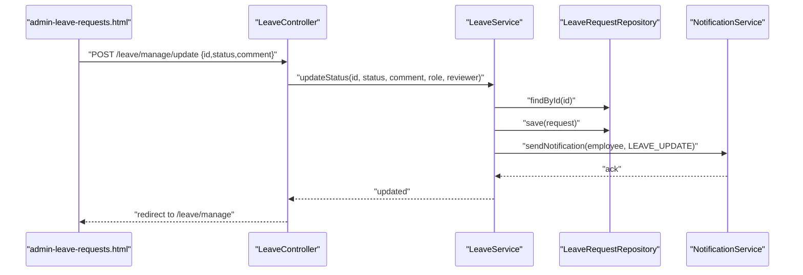
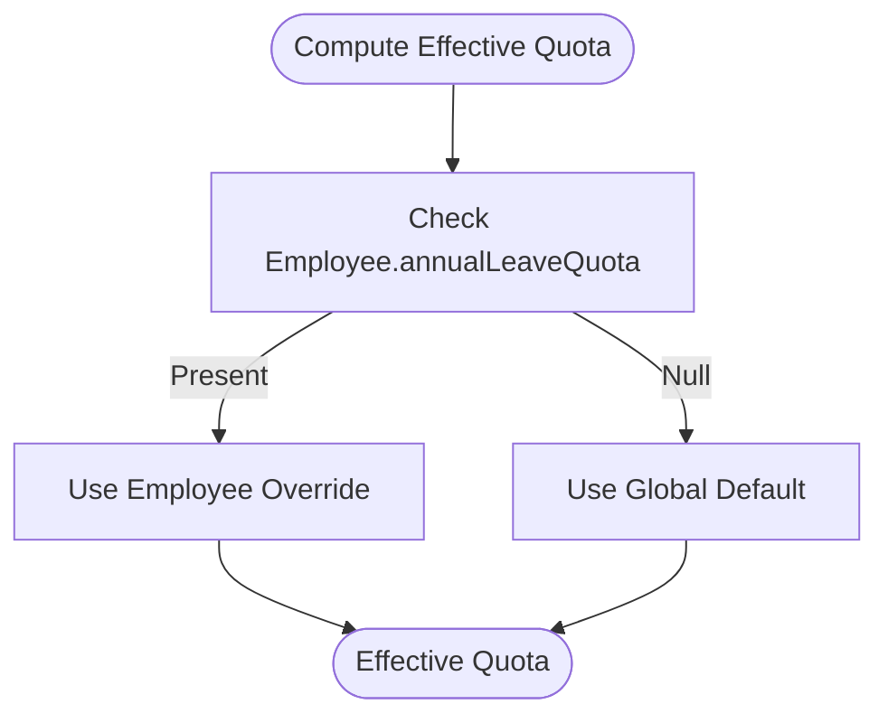
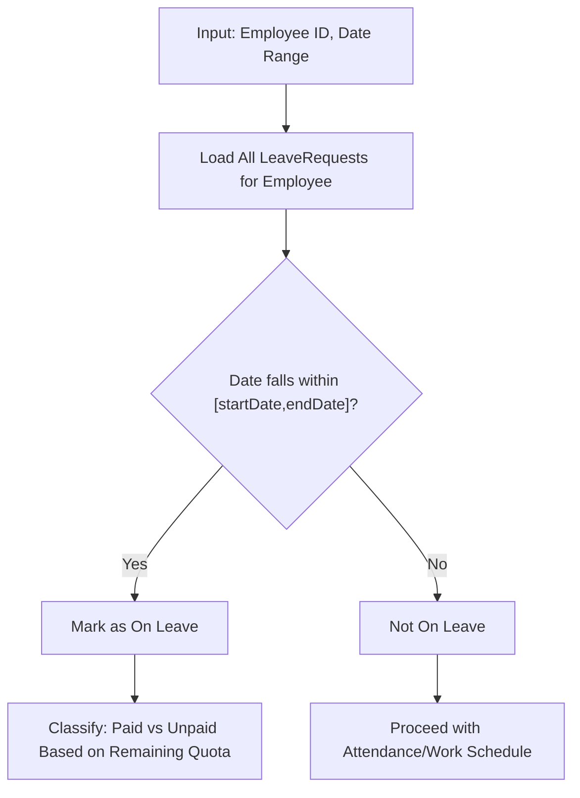
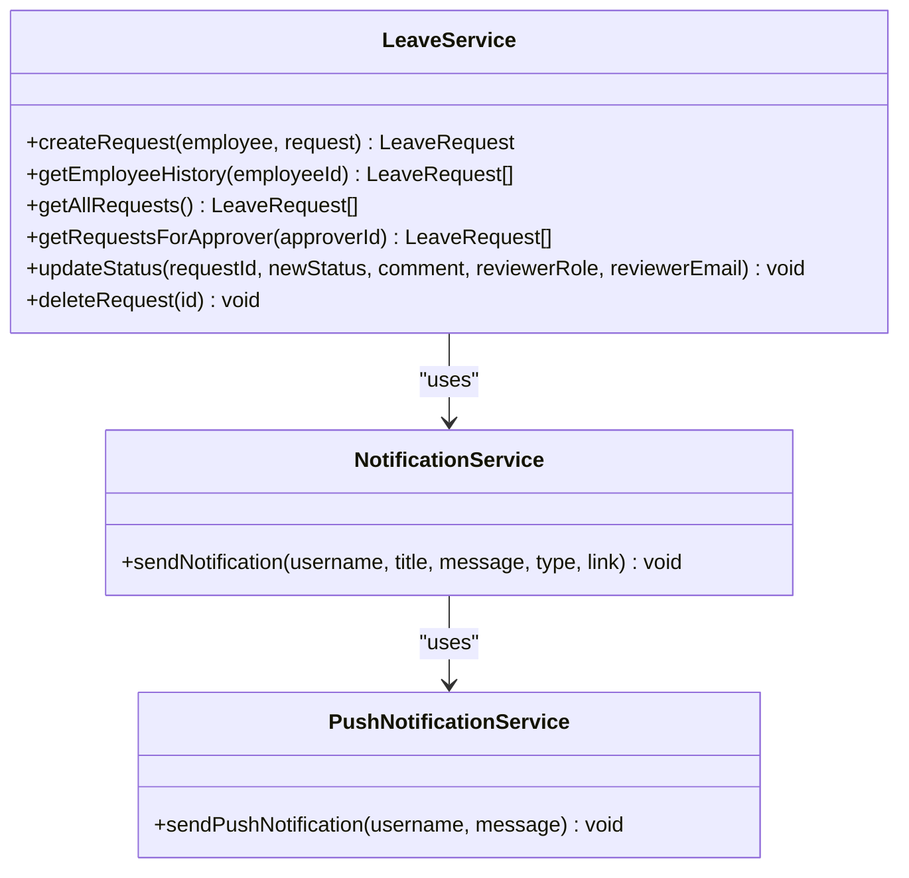
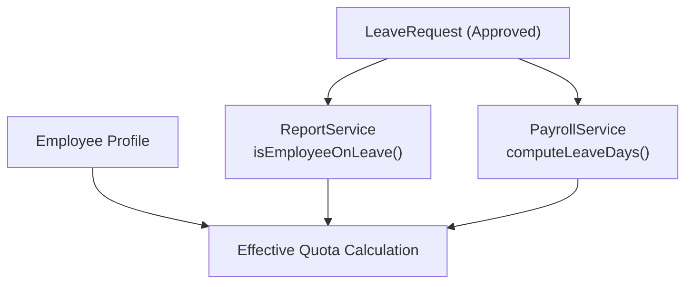
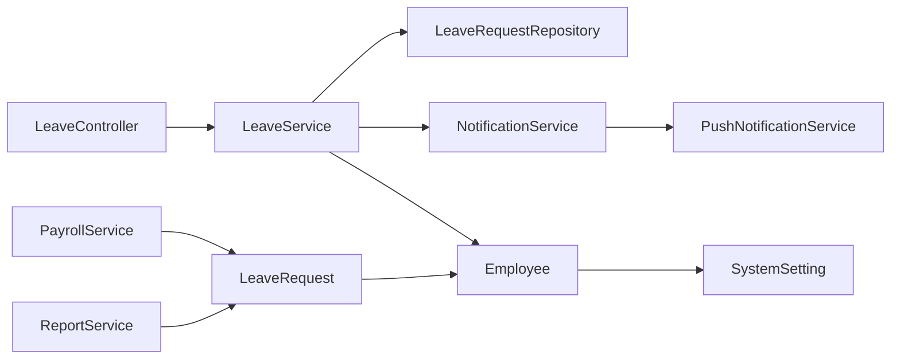

# Leave Request Processing

<cite>
**Referenced Files in This Document**
- [LeaveRequest.java](file://src/main/java/root/cyb/mh/attendancesystem/model/LeaveRequest.java)
- [Employee.java](file://src/main/java/root/cyb/mh/attendancesystem/model/Employee.java)
- [LeaveController.java](file://src/main/java/root/cyb/mh/attendancesystem/controller/LeaveController.java)
- [LeaveService.java](file://src/main/java/root/cyb/mh/attendancesystem/service/LeaveService.java)
- [LeaveRequestRepository.java](file://src/main/java/root/cyb/mh/attendancesystem/repository/LeaveRequestRepository.java)
- [NotificationService.java](file://src/main/java/root/cyb/mh/attendancesystem/service/NotificationService.java)
- [PushNotificationService.java](file://src/main/java/root/cyb/mh/attendancesystem/service/PushNotificationService.java)
- [employee-leave.html](file://src/main/resources/templates/employee-leave.html)
- [admin-leave-requests.html](file://src/main/resources/templates/admin-leave-requests.html)
- [admin-leave-calendar.html](file://src/main/resources/templates/admin-leave-calendar.html)
- [PayrollService.java](file://src/main/java/root/cyb/mh/attendancesystem/service/PayrollService.java)
- [ReportService.java](file://src/main/java/root/cyb/mh/attendancesystem/service/ReportService.java)
- [EmployeeDashboardController.java](file://src/main/java/root/cyb/mh/attendancesystem/controller/EmployeeDashboardController.java)
- [SystemSetting.java](file://src/main/java/root/cyb/mh/attendancesystem/model/SystemSetting.java)
</cite>

## Table of Contents
1. [Introduction](#introduction)
2. [Project Structure](#project-structure)
3. [Core Components](#core-components)
4. [Architecture Overview](#architecture-overview)
5. [Detailed Component Analysis](#detailed-component-analysis)
6. [Dependency Analysis](#dependency-analysis)
7. [Performance Considerations](#performance-considerations)
8. [Troubleshooting Guide](#troubleshooting-guide)
9. [Conclusion](#conclusion)
10. [Appendices](#appendices)

## Introduction
This document explains the end-to-end leave request processing workflow in the Skylink Attendance System. It covers the lifecycle from employee application submission to approval or rejection, including validation rules, leave type restrictions, date range validation, overlap detection with existing approved leave, and the service-layer business logic for calculations, entitlement verification, and policy enforcement. It also documents integrations with employee profiles, attendance tracking, and payroll systems, along with practical examples of creating, modifying, canceling, and deleting leave requests.

## Project Structure
The leave processing capability spans model, controller, service, repository, and UI template layers. The primary domain entity is LeaveRequest, associated with Employee. Controllers expose endpoints for employees and administrators, while services encapsulate business logic and notifications. Repositories provide persistence and queries. Templates render forms and dashboards for leave management and visibility.

**Diagram sources**
- [LeaveController.java:1-176](file://src/main/java/root/cyb/mh/attendancesystem/controller/LeaveController.java#L1-L176)
- [LeaveService.java:1-127](file://src/main/java/root/cyb/mh/attendancesystem/service/LeaveService.java#L1-L127)
- [LeaveRequestRepository.java:1-34](file://src/main/java/root/cyb/mh/attendancesystem/repository/LeaveRequestRepository.java#L1-L34)
- [LeaveRequest.java:1-54](file://src/main/java/root/cyb/mh/attendancesystem/model/LeaveRequest.java#L1-L54)
- [Employee.java:1-64](file://src/main/java/root/cyb/mh/attendancesystem/model/Employee.java#L1-L64)
- [NotificationService.java:1-78](file://src/main/java/root/cyb/mh/attendancesystem/service/NotificationService.java#L1-L78)
- [PushNotificationService.java:1-111](file://src/main/java/root/cyb/mh/attendancesystem/service/PushNotificationService.java#L1-L111)
- [ReportService.java:724-921](file://src/main/java/root/cyb/mh/attendancesystem/service/ReportService.java#L724-L921)
- [PayrollService.java:119-267](file://src/main/java/root/cyb/mh/attendancesystem/service/PayrollService.java#L119-L267)
- [employee-leave.html:1-122](file://src/main/resources/templates/employee-leave.html#L1-L122)
- [admin-leave-requests.html:1-198](file://src/main/resources/templates/admin-leave-requests.html#L1-L198)
- [admin-leave-calendar.html:1-50](file://src/main/resources/templates/admin-leave-calendar.html#L1-L50)

**Section sources**
- [LeaveController.java:1-176](file://src/main/java/root/cyb/mh/attendancesystem/controller/LeaveController.java#L1-L176)
- [LeaveService.java:1-127](file://src/main/java/root/cyb/mh/attendancesystem/service/LeaveService.java#L1-L127)
- [LeaveRequestRepository.java:1-34](file://src/main/java/root/cyb/mh/attendancesystem/repository/LeaveRequestRepository.java#L1-L34)
- [LeaveRequest.java:1-54](file://src/main/java/root/cyb/mh/attendancesystem/model/LeaveRequest.java#L1-L54)
- [Employee.java:1-64](file://src/main/java/root/cyb/mh/attendancesystem/model/Employee.java#L1-L64)
- [NotificationService.java:1-78](file://src/main/java/root/cyb/mh/attendancesystem/service/NotificationService.java#L1-L78)
- [PushNotificationService.java:1-111](file://src/main/java/root/cyb/mh/attendancesystem/service/PushNotificationService.java#L1-L111)
- [ReportService.java:724-921](file://src/main/java/root/cyb/mh/attendancesystem/service/ReportService.java#L724-L921)
- [PayrollService.java:119-267](file://src/main/java/root/cyb/mh/attendancesystem/service/PayrollService.java#L119-L267)
- [employee-leave.html:1-122](file://src/main/resources/templates/employee-leave.html#L1-L122)
- [admin-leave-requests.html:1-198](file://src/main/resources/templates/admin-leave-requests.html#L1-L198)
- [admin-leave-calendar.html:1-50](file://src/main/resources/templates/admin-leave-calendar.html#L1-L50)

## Core Components
- LeaveRequest: Domain entity representing a leave application with fields for employee, dates, type, reason, status, comments, timestamps, and reviewer metadata.
- Employee: Employee profile containing reporting hierarchy, payroll attributes, and annual leave quota override.
- LeaveController: Exposes endpoints for employees to submit requests and for administrators/managers to approve/reject/view requests and to render calendars.
- LeaveService: Orchestrates request creation, status updates, notifications, and retrieval. Enforces role-based policies for HR/Admin actions.
- LeaveRequestRepository: JPA repository providing queries for history, team requests, and approved leave counts/dates.
- NotificationService and PushNotificationService: Persist notifications, stream them via WebSocket, and deliver web push notifications.
- ReportService and PayrollService: Integrate leave with attendance and payroll by checking on-leave status and computing deductions.

**Section sources**
- [LeaveRequest.java:1-54](file://src/main/java/root/cyb/mh/attendancesystem/model/LeaveRequest.java#L1-L54)
- [Employee.java:1-64](file://src/main/java/root/cyb/mh/attendancesystem/model/Employee.java#L1-L64)
- [LeaveController.java:1-176](file://src/main/java/root/cyb/mh/attendancesystem/controller/LeaveController.java#L1-L176)
- [LeaveService.java:1-127](file://src/main/java/root/cyb/mh/attendancesystem/service/LeaveService.java#L1-L127)
- [LeaveRequestRepository.java:1-34](file://src/main/java/root/cyb/mh/attendancesystem/repository/LeaveRequestRepository.java#L1-L34)
- [NotificationService.java:1-78](file://src/main/java/root/cyb/mh/attendancesystem/service/NotificationService.java#L1-L78)
- [PushNotificationService.java:1-111](file://src/main/java/root/cyb/mh/attendancesystem/service/PushNotificationService.java#L1-L111)
- [ReportService.java:724-921](file://src/main/java/root/cyb/mh/attendancesystem/service/ReportService.java#L724-L921)
- [PayrollService.java:119-267](file://src/main/java/root/cyb/mh/attendancesystem/service/PayrollService.java#L119-L267)

## Architecture Overview
The system follows a layered architecture:
- Presentation: Thymeleaf templates render employee and admin views.
- Controllers: Handle HTTP requests, enforce roles, and delegate to services.
- Services: Encapsulate business logic, notifications, and cross-cutting concerns.
- Persistence: JPA repositories manage LeaveRequest and related entities.
- Integrations: Attendance and payroll services consume approved leave data.

**Diagram sources**
- [LeaveController.java:46-55](file://src/main/java/root/cyb/mh/attendancesystem/controller/LeaveController.java#L46-L55)
- [LeaveService.java:24-46](file://src/main/java/root/cyb/mh/attendancesystem/service/LeaveService.java#L24-L46)
- [LeaveRequestRepository.java:1-34](file://src/main/java/root/cyb/mh/attendancesystem/repository/LeaveRequestRepository.java#L1-L34)
- [NotificationService.java:22-44](file://src/main/java/root/cyb/mh/attendancesystem/service/NotificationService.java#L22-L44)
- [PushNotificationService.java:79-109](file://src/main/java/root/cyb/mh/attendancesystem/service/PushNotificationService.java#L79-L109)
- [employee-leave.html:34-64](file://src/main/resources/templates/employee-leave.html#L34-L64)

**Section sources**
- [LeaveController.java:1-176](file://src/main/java/root/cyb/mh/attendancesystem/controller/LeaveController.java#L1-L176)
- [LeaveService.java:1-127](file://src/main/java/root/cyb/mh/attendancesystem/service/LeaveService.java#L1-L127)
- [LeaveRequestRepository.java:1-34](file://src/main/java/root/cyb/mh/attendancesystem/repository/LeaveRequestRepository.java#L1-L34)
- [NotificationService.java:1-78](file://src/main/java/root/cyb/mh/attendancesystem/service/NotificationService.java#L1-L78)
- [PushNotificationService.java:1-111](file://src/main/java/root/cyb/mh/attendancesystem/service/PushNotificationService.java#L1-L111)
- [employee-leave.html:1-122](file://src/main/resources/templates/employee-leave.html#L1-L122)

## Detailed Component Analysis

### LeaveRequest Entity and Validation Rules
- Fields: employee, startDate, endDate, leaveType, reason, status (default PENDING), adminComment, createdAt, reviewedBy.
- Validation rules observed in UI and service:
  - Required fields: leaveType, startDate, endDate, reason.
  - Date range validation: end date must be on or after start date.
  - Leave type restrictions: predefined options include Sick, Casual, Vacation, Other.
  - Overlap detection: approved leave overlaps are detected during payroll/reporting by scanning LeaveRequest records for the employee within the requested date range.

**Diagram sources**
- [LeaveRequest.java:1-54](file://src/main/java/root/cyb/mh/attendancesystem/model/LeaveRequest.java#L1-L54)
- [Employee.java:1-64](file://src/main/java/root/cyb/mh/attendancesystem/model/Employee.java#L1-L64)

**Section sources**
- [LeaveRequest.java:1-54](file://src/main/java/root/cyb/mh/attendancesystem/model/LeaveRequest.java#L1-L54)
- [employee-leave.html:36-60](file://src/main/resources/templates/employee-leave.html#L36-L60)
- [LeaveRequestRepository.java:26-32](file://src/main/java/root/cyb/mh/attendancesystem/repository/LeaveRequestRepository.java#L26-L32)

### Employee Application Submission Workflow
- Employee fills out the form on the employee leave page, selecting leave type, start/end dates, and reason.
- On submit, the controller resolves the current employee and delegates to the service to persist the request and notify supervisors, assistant supervisors, and HR.

**Diagram sources**
- [employee-leave.html:34-64](file://src/main/resources/templates/employee-leave.html#L34-L64)
- [LeaveController.java:46-55](file://src/main/java/root/cyb/mh/attendancesystem/controller/LeaveController.java#L46-L55)
- [LeaveService.java:24-46](file://src/main/java/root/cyb/mh/attendancesystem/service/LeaveService.java#L24-L46)
- [LeaveRequestRepository.java:1-34](file://src/main/java/root/cyb/mh/attendancesystem/repository/LeaveRequestRepository.java#L1-L34)

**Section sources**
- [employee-leave.html:1-122](file://src/main/resources/templates/employee-leave.html#L1-L122)
- [LeaveController.java:46-55](file://src/main/java/root/cyb/mh/attendancesystem/controller/LeaveController.java#L46-L55)
- [LeaveService.java:24-46](file://src/main/java/root/cyb/mh/attendancesystem/service/LeaveService.java#L24-L46)

### Approval/Rejection Workflow
- Managers and HR can view team requests and approve or reject them.
- HR can only modify pending requests; Admins can override any status.
- On update, the service sets status, admin comment, reviewer metadata, persists, and notifies the employee.

**Diagram sources**
- [admin-leave-requests.html:106-129](file://src/main/resources/templates/admin-leave-requests.html#L106-L129)
- [LeaveController.java:92-124](file://src/main/java/root/cyb/mh/attendancesystem/controller/LeaveController.java#L92-L124)
- [LeaveService.java:84-121](file://src/main/java/root/cyb/mh/attendancesystem/service/LeaveService.java#L84-L121)
- [LeaveRequestRepository.java:1-34](file://src/main/java/root/cyb/mh/attendancesystem/repository/LeaveRequestRepository.java#L1-L34)
- [NotificationService.java:22-44](file://src/main/java/root/cyb/mh/attendancesystem/service/NotificationService.java#L22-L44)

**Section sources**
- [admin-leave-requests.html:1-198](file://src/main/resources/templates/admin-leave-requests.html#L1-L198)
- [LeaveController.java:58-124](file://src/main/java/root/cyb/mh/attendancesystem/controller/LeaveController.java#L58-L124)
- [LeaveService.java:84-121](file://src/main/java/root/cyb/mh/attendancesystem/service/LeaveService.java#L84-L121)

### Leave Type Restrictions and Entitlement Verification
- Leave types are selected from predefined options in the UI.
- Entitlement verification uses Employee.annualLeaveQuota with a fallback to a global default quota. The effective quota is computed per employee and applied during monthly reporting and payroll calculations.

**Diagram sources**
- [Employee.java:60-62](file://src/main/java/root/cyb/mh/attendancesystem/model/Employee.java#L60-L62)
- [ReportService.java:732-735](file://src/main/java/root/cyb/mh/attendancesystem/service/ReportService.java#L732-L735)
- [PayrollService.java:119-122](file://src/main/java/root/cyb/mh/attendancesystem/service/PayrollService.java#L119-L122)

**Section sources**
- [employee-leave.html:36-42](file://src/main/resources/templates/employee-leave.html#L36-L42)
- [Employee.java:43-62](file://src/main/java/root/cyb/mh/attendancesystem/model/Employee.java#L43-L62)
- [ReportService.java:732-735](file://src/main/java/root/cyb/mh/attendancesystem/service/ReportService.java#L732-L735)
- [PayrollService.java:119-122](file://src/main/java/root/cyb/mh/attendancesystem/service/PayrollService.java#L119-L122)

### Overlap Detection with Existing Leave Requests
- Overlap detection is performed by scanning approved leave requests for the same employee within the requested date range.
- Payroll and reporting services iterate through leave requests to determine whether a given date falls within an approved leave period and classify it as paid or unpaid based on remaining quota.

**Diagram sources**
- [LeaveRequestRepository.java:26-32](file://src/main/java/root/cyb/mh/attendancesystem/repository/LeaveRequestRepository.java#L26-L32)
- [PayrollService.java:160-169](file://src/main/java/root/cyb/mh/attendancesystem/service/PayrollService.java#L160-L169)
- [ReportService.java:1116-1121](file://src/main/java/root/cyb/mh/attendancesystem/service/ReportService.java#L1116-L1121)

**Section sources**
- [LeaveRequestRepository.java:26-32](file://src/main/java/root/cyb/mh/attendancesystem/repository/LeaveRequestRepository.java#L26-L32)
- [PayrollService.java:160-169](file://src/main/java/root/cyb/mh/attendancesystem/service/PayrollService.java#L160-L169)
- [ReportService.java:1116-1121](file://src/main/java/root/cyb/mh/attendancesystem/service/ReportService.java#L1116-L1121)

### Service Layer Business Logic and Policy Enforcement
- Creation: Sets status to PENDING, saves, and sends notifications to supervisor, assistant supervisor, and HR.
- Retrieval: Provides employee history, all requests for admin, and team requests for approvers.
- Updates: Enforces HR-only modification of pending requests; Admins can override any status; updates reviewer metadata and comments.
- Deletion: Admins can delete requests for correction/testing.

**Diagram sources**
- [LeaveService.java:1-127](file://src/main/java/root/cyb/mh/attendancesystem/service/LeaveService.java#L1-L127)
- [NotificationService.java:1-78](file://src/main/java/root/cyb/mh/attendancesystem/service/NotificationService.java#L1-L78)
- [PushNotificationService.java:1-111](file://src/main/java/root/cyb/mh/attendancesystem/service/PushNotificationService.java#L1-L111)

**Section sources**
- [LeaveService.java:24-125](file://src/main/java/root/cyb/mh/attendancesystem/service/LeaveService.java#L24-L125)
- [LeaveController.java:92-131](file://src/main/java/root/cyb/mh/attendancesystem/controller/LeaveController.java#L92-L131)

### Integration with Employee Profiles, Attendance Tracking, and Payroll
- Employee profile integration: LeaveService uses employee reporting hierarchy to route notifications and to compute effective quotas.
- Attendance tracking: ReportService and PayrollService detect on-leave days and classify them as paid/unpaid based on remaining quota.
- Payroll integration: PayrollService computes daily rates and applies deductions for unpaid leave days determined by approved leave overlaps.

**Diagram sources**
- [ReportService.java:732-735](file://src/main/java/root/cyb/mh/attendancesystem/service/ReportService.java#L732-L735)
- [ReportService.java:1116-1121](file://src/main/java/root/cyb/mh/attendancesystem/service/ReportService.java#L1116-L1121)
- [PayrollService.java:160-169](file://src/main/java/root/cyb/mh/attendancesystem/service/PayrollService.java#L160-L169)
- [Employee.java:60-62](file://src/main/java/root/cyb/mh/attendancesystem/model/Employee.java#L60-L62)

**Section sources**
- [ReportService.java:732-735](file://src/main/java/root/cyb/mh/attendancesystem/service/ReportService.java#L732-L735)
- [ReportService.java:1116-1121](file://src/main/java/root/cyb/mh/attendancesystem/service/ReportService.java#L1116-L1121)
- [PayrollService.java:160-169](file://src/main/java/root/cyb/mh/attendancesystem/service/PayrollService.java#L160-L169)
- [Employee.java:60-62](file://src/main/java/root/cyb/mh/attendancesystem/model/Employee.java#L60-L62)

### Practical Examples

- Creating a leave request:
  - Navigate to the employee leave page, select leave type, enter start/end dates, provide reason, and submit.
  - The system persists the request with status PENDING and notifies supervisors and HR.

- Modifying a leave request:
  - Approver selects Approve or Reject from the admin management page; rejection requires a comment.
  - HR can only update pending requests; Admins can override any status.

- Canceling a leave request:
  - Not explicitly modeled as a separate status in the domain; deletion is supported for Admins in testing mode.

- Deleting a leave request:
  - Admins can delete requests for correction/testing via the management page.

**Section sources**
- [employee-leave.html:34-64](file://src/main/resources/templates/employee-leave.html#L34-L64)
- [admin-leave-requests.html:65-91](file://src/main/resources/templates/admin-leave-requests.html#L65-L91)
- [LeaveController.java:126-131](file://src/main/java/root/cyb/mh/attendancesystem/controller/LeaveController.java#L126-L131)
- [LeaveService.java:84-121](file://src/main/java/root/cyb/mh/attendancesystem/service/LeaveService.java#L84-L121)

## Dependency Analysis
The following diagram shows key dependencies among components involved in leave processing.

**Diagram sources**
- [LeaveController.java:1-176](file://src/main/java/root/cyb/mh/attendancesystem/controller/LeaveController.java#L1-L176)
- [LeaveService.java:1-127](file://src/main/java/root/cyb/mh/attendancesystem/service/LeaveService.java#L1-L127)
- [LeaveRequestRepository.java:1-34](file://src/main/java/root/cyb/mh/attendancesystem/repository/LeaveRequestRepository.java#L1-L34)
- [NotificationService.java:1-78](file://src/main/java/root/cyb/mh/attendancesystem/service/NotificationService.java#L1-L78)
- [PushNotificationService.java:1-111](file://src/main/java/root/cyb/mh/attendancesystem/service/PushNotificationService.java#L1-L111)
- [LeaveRequest.java:1-54](file://src/main/java/root/cyb/mh/attendancesystem/model/LeaveRequest.java#L1-L54)
- [Employee.java:1-64](file://src/main/java/root/cyb/mh/attendancesystem/model/Employee.java#L1-L64)
- [PayrollService.java:119-267](file://src/main/java/root/cyb/mh/attendancesystem/service/PayrollService.java#L119-L267)
- [ReportService.java:724-921](file://src/main/java/root/cyb/mh/attendancesystem/service/ReportService.java#L724-L921)
- [SystemSetting.java:1-27](file://src/main/java/root/cyb/mh/attendancesystem/model/SystemSetting.java#L1-L27)

**Section sources**
- [LeaveController.java:1-176](file://src/main/java/root/cyb/mh/attendancesystem/controller/LeaveController.java#L1-L176)
- [LeaveService.java:1-127](file://src/main/java/root/cyb/mh/attendancesystem/service/LeaveService.java#L1-L127)
- [LeaveRequestRepository.java:1-34](file://src/main/java/root/cyb/mh/attendancesystem/repository/LeaveRequestRepository.java#L1-L34)
- [NotificationService.java:1-78](file://src/main/java/root/cyb/mh/attendancesystem/service/NotificationService.java#L1-L78)
- [PushNotificationService.java:1-111](file://src/main/java/root/cyb/mh/attendancesystem/service/PushNotificationService.java#L1-L111)
- [LeaveRequest.java:1-54](file://src/main/java/root/cyb/mh/attendancesystem/model/LeaveRequest.java#L1-L54)
- [Employee.java:1-64](file://src/main/java/root/cyb/mh/attendancesystem/model/Employee.java#L1-L64)
- [PayrollService.java:119-267](file://src/main/java/root/cyb/mh/attendancesystem/service/PayrollService.java#L119-L267)
- [ReportService.java:724-921](file://src/main/java/root/cyb/mh/attendancesystem/service/ReportService.java#L724-L921)
- [SystemSetting.java:1-27](file://src/main/java/root/cyb/mh/attendancesystem/model/SystemSetting.java#L1-L27)

## Performance Considerations
- Query efficiency: Use dedicated repository methods for common filters (history, pending, team requests) to avoid N+1 and reduce database load.
- Notification throughput: Batch notifications when possible and ensure WebSocket destinations are targeted to minimize fan-out overhead.
- Reporting and payroll scans: For large datasets, consider indexing LeaveRequest by employee and date ranges to optimize overlap checks.
- Frontend rendering: Calendar rendering uses approved leave aggregation; pre-aggregate data server-side to keep client rendering responsive.

## Troubleshooting Guide
- Access denied for approving requests:
  - Ensure the approver has the correct role or is a supervisor/assistant of the requester. The controller enforces strict role checks for POST updates.
- HR cannot modify processed requests:
  - HR can only update pending requests; attempting to change non-pending requests throws an illegal state error.
- Notifications not received:
  - Verify NotificationService persistence and WebSocket routing; check PushNotificationService initialization and subscription cleanup for invalid endpoints.
- Overlapping leave not reflected in payroll:
  - Confirm approved leave exists for the employee within the date range and that reporting/payroll services scan LeaveRequest correctly.

**Section sources**
- [LeaveController.java:103-112](file://src/main/java/root/cyb/mh/attendancesystem/controller/LeaveController.java#L103-L112)
- [LeaveService.java:89-94](file://src/main/java/root/cyb/mh/attendancesystem/service/LeaveService.java#L89-L94)
- [NotificationService.java:22-44](file://src/main/java/root/cyb/mh/attendancesystem/service/NotificationService.java#L22-L44)
- [PushNotificationService.java:79-109](file://src/main/java/root/cyb/mh/attendancesystem/service/PushNotificationService.java#L79-L109)

## Conclusion
The leave request processing system integrates cleanly across presentation, service, and persistence layers, with robust role-based controls, notifications, and strong integrations with attendance and payroll. The design supports clear validation rules, entitlement computation, and overlap detection, enabling accurate reporting and financial impact assessment.

## Appendices

### UI Pages and Their Roles
- Employee leave page: Allows employees to apply for leave and view history.
- Admin leave management: Displays requests for approval/rejection and supports bulk actions.
- Leave calendar: Visualizes approved leaves for organizational awareness.

**Section sources**
- [employee-leave.html:1-122](file://src/main/resources/templates/employee-leave.html#L1-L122)
- [admin-leave-requests.html:1-198](file://src/main/resources/templates/admin-leave-requests.html#L1-L198)
- [admin-leave-calendar.html:1-50](file://src/main/resources/templates/admin-leave-calendar.html#L1-L50)

### Annual Leave Quota and Dashboard Integration
- Employee dashboard displays annual leave quota usage and splits between paid and unpaid leaves, derived from reporting over approved leave records.

**Section sources**
- [EmployeeDashboardController.java:123-143](file://src/main/java/root/cyb/mh/attendancesystem/controller/EmployeeDashboardController.java#L123-L143)
- [ReportService.java:732-735](file://src/main/java/root/cyb/mh/attendancesystem/service/ReportService.java#L732-L735)