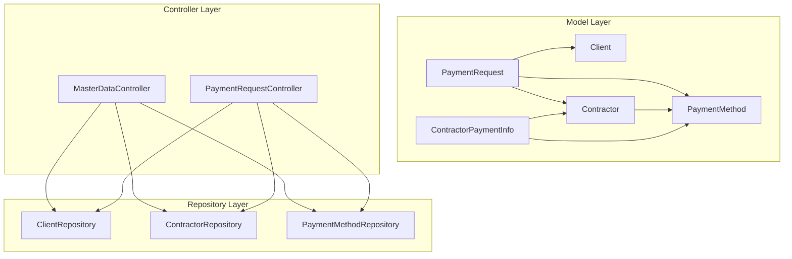
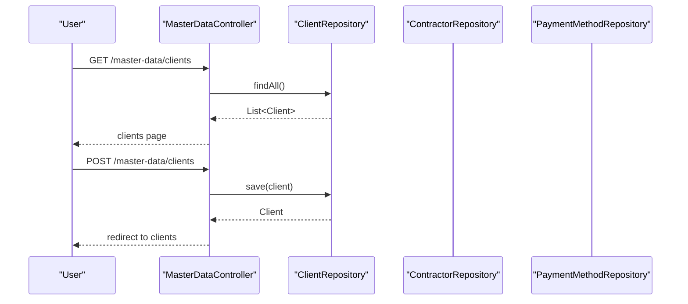
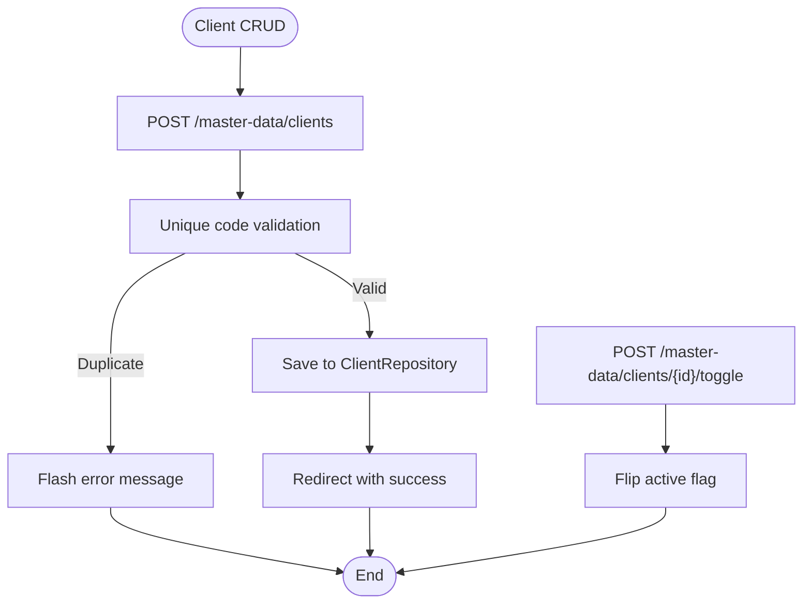
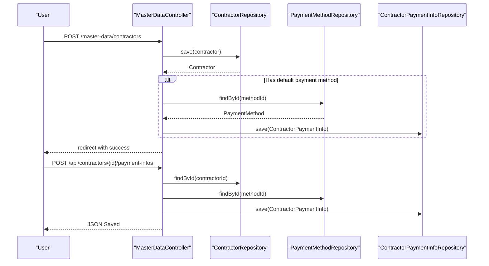
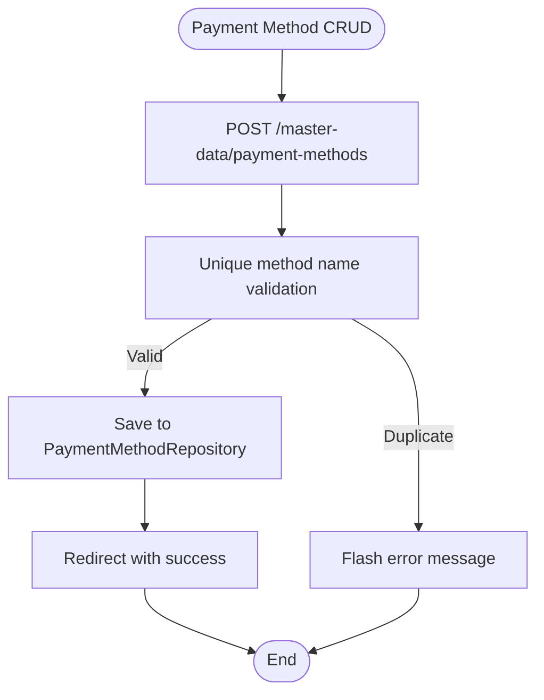
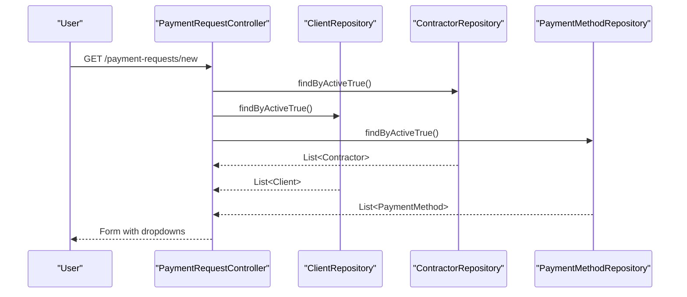
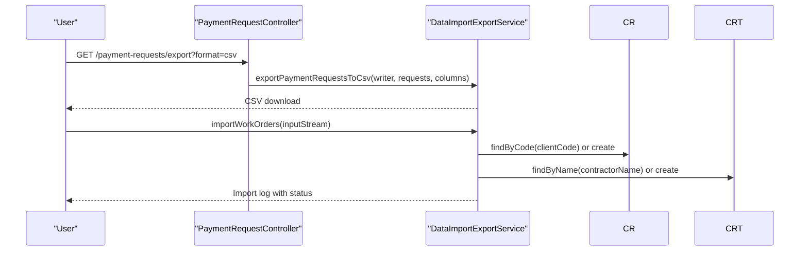
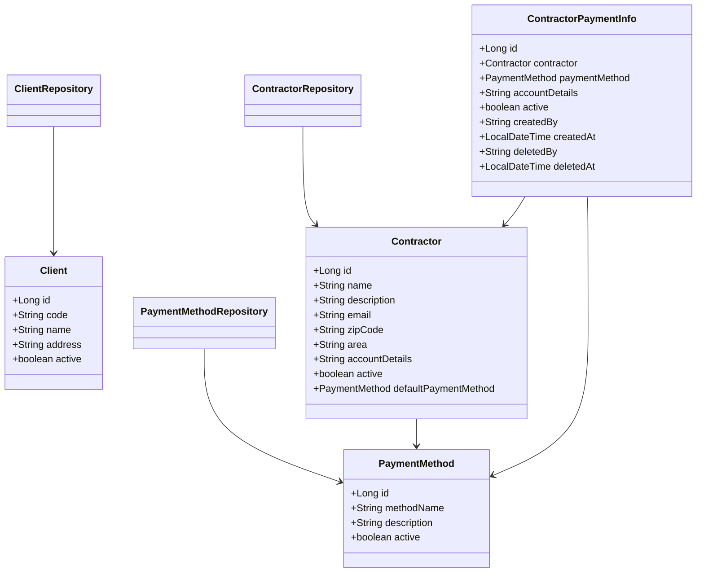

# Master Data Management

<cite>
**Referenced Files in This Document**
- [MasterDataController.java](file://src/main/java/root/cyb/mh/attendancesystem/controller/MasterDataController.java)
- [Client.java](file://src/main/java/root/cyb/mh/attendancesystem/model/Client.java)
- [Contractor.java](file://src/main/java/root/cyb/mh/attendancesystem/model/Contractor.java)
- [ContractorPaymentInfo.java](file://src/main/java/root/cyb/mh/attendancesystem/model/ContractorPaymentInfo.java)
- [PaymentMethod.java](file://src/main/java/root/cyb/mh/attendancesystem/model/PaymentMethod.java)
- [PaymentRequest.java](file://src/main/java/root/cyb/mh/attendancesystem/model/PaymentRequest.java)
- [ClientRepository.java](file://src/main/java/root/cyb/mh/attendancesystem/repository/ClientRepository.java)
- [ContractorRepository.java](file://src/main/java/root/cyb/mh/attendancesystem/repository/ContractorRepository.java)
- [PaymentMethodRepository.java](file://src/main/java/root/cyb/mh/attendancesystem/repository/PaymentMethodRepository.java)
- [PaymentRequestController.java](file://src/main/java/root/cyb/mh/attendancesystem/controller/PaymentRequestController.java)
- [DataImportExportService.java](file://src/main/java/root/cyb/mh/attendancesystem/service/DataImportExportService.java)
- [payment-methods.html](file://src/main/resources/templates/master-data/payment-methods.html)
</cite>

## Table of Contents
1. [Introduction](#introduction)
2. [Project Structure](#project-structure)
3. [Core Components](#core-components)
4. [Architecture Overview](#architecture-overview)
5. [Detailed Component Analysis](#detailed-component-analysis)
6. [Dependency Analysis](#dependency-analysis)
7. [Performance Considerations](#performance-considerations)
8. [Troubleshooting Guide](#troubleshooting-guide)
9. [Conclusion](#conclusion)

## Introduction
This document describes the master data management system for payment operations, focusing on the maintenance of clients, contractors, and payment methods used in payment requests. It explains validation rules, active/inactive status management, hierarchical relationships, CRUD operations, bulk import/export capabilities, data integrity constraints, integration with payment request forms, and data quality controls including duplicate detection and audit trails.

## Project Structure
The master data management spans three layers:
- Model layer: Entities representing clients, contractors, payment methods, contractor payment accounts, and payment requests
- Repository layer: JPA repositories for persistence and specialized queries
- Controller layer: REST endpoints for CRUD operations, toggling status, dashboards, and AJAX endpoints for contractor payment info

**Diagram sources**
- [MasterDataController.java:1-1639](file://src/main/java/root/cyb/mh/attendancesystem/controller/MasterDataController.java#L1-L1639)
- [Client.java:1-25](file://src/main/java/root/cyb/mh/attendancesystem/model/Client.java#L1-L25)
- [Contractor.java:1-49](file://src/main/java/root/cyb/mh/attendancesystem/model/Contractor.java#L1-L49)
- [ContractorPaymentInfo.java:1-39](file://src/main/java/root/cyb/mh/attendancesystem/model/ContractorPaymentInfo.java#L1-L39)
- [PaymentMethod.java:1-22](file://src/main/java/root/cyb/mh/attendancesystem/model/PaymentMethod.java#L1-L22)
- [PaymentRequest.java:1-117](file://src/main/java/root/cyb/mh/attendancesystem/model/PaymentRequest.java#L1-L117)
- [ClientRepository.java:1-14](file://src/main/java/root/cyb/mh/attendancesystem/repository/ClientRepository.java#L1-L14)
- [ContractorRepository.java:1-43](file://src/main/java/root/cyb/mh/attendancesystem/repository/ContractorRepository.java#L1-L43)
- [PaymentMethodRepository.java:1-12](file://src/main/java/root/cyb/mh/attendancesystem/repository/PaymentMethodRepository.java#L1-L12)
- [PaymentRequestController.java:1-688](file://src/main/java/root/cyb/mh/attendancesystem/controller/PaymentRequestController.java#L1-L688)

**Section sources**
- [MasterDataController.java:1-1639](file://src/main/java/root/cyb/mh/attendancesystem/controller/MasterDataController.java#L1-L1639)
- [Client.java:1-25](file://src/main/java/root/cyb/mh/attendancesystem/model/Client.java#L1-L25)
- [Contractor.java:1-49](file://src/main/java/root/cyb/mh/attendancesystem/model/Contractor.java#L1-L49)
- [ContractorPaymentInfo.java:1-39](file://src/main/java/root/cyb/mh/attendancesystem/model/ContractorPaymentInfo.java#L1-L39)
- [PaymentMethod.java:1-22](file://src/main/java/root/cyb/mh/attendancesystem/model/PaymentMethod.java#L1-L22)
- [PaymentRequest.java:1-117](file://src/main/java/root/cyb/mh/attendancesystem/model/PaymentRequest.java#L1-L117)
- [ClientRepository.java:1-14](file://src/main/java/root/cyb/mh/attendancesystem/repository/ClientRepository.java#L1-L14)
- [ContractorRepository.java:1-43](file://src/main/java/root/cyb/mh/attendancesystem/repository/ContractorRepository.java#L1-L43)
- [PaymentMethodRepository.java:1-12](file://src/main/java/root/cyb/mh/attendancesystem/repository/PaymentMethodRepository.java#L1-L12)
- [PaymentRequestController.java:1-688](file://src/main/java/root/cyb/mh/attendancesystem/controller/PaymentRequestController.java#L1-L688)

## Core Components
- Client: Unique code, name, optional address, active flag
- Contractor: Unique name, optional description, contact fields, default payment method, account details, active flag, geographic fields
- PaymentMethod: Unique method name, optional description, active flag
- ContractorPaymentInfo: Links contractor to payment method with account details; supports soft-deletion with audit fields
- PaymentRequest: References client, contractor, and payment method; tracks amounts, statuses, and audit timestamps

Validation and constraints:
- Unique constraints enforced at persistence level for client code and contractor name
- Active flag controls visibility and selection in dropdowns
- Soft-deletion pattern for contractor payment info via active flag and audit fields

Integration with payment requests:
- PaymentRequestController exposes active master data lists for form dropdowns
- PaymentRequest references master data entities and maintains denormalized fields for historical reporting

**Section sources**
- [Client.java:14-23](file://src/main/java/root/cyb/mh/attendancesystem/model/Client.java#L14-L23)
- [Contractor.java:14-47](file://src/main/java/root/cyb/mh/attendancesystem/model/Contractor.java#L14-L47)
- [PaymentMethod.java:14-20](file://src/main/java/root/cyb/mh/attendancesystem/model/PaymentMethod.java#L14-L20)
- [ContractorPaymentInfo.java:14-37](file://src/main/java/root/cyb/mh/attendancesystem/model/ContractorPaymentInfo.java#L14-L37)
- [PaymentRequest.java:33-73](file://src/main/java/root/cyb/mh/attendancesystem/model/PaymentRequest.java#L33-L73)
- [PaymentRequestController.java:138-144](file://src/main/java/root/cyb/mh/attendancesystem/controller/PaymentRequestController.java#L138-L144)

## Architecture Overview
The system follows a layered architecture:
- Controllers expose endpoints for master data CRUD, status toggling, and dashboards
- Services coordinate business logic (not shown in detail here)
- Repositories encapsulate persistence and query logic
- Models define domain entities and relationships

**Diagram sources**
- [MasterDataController.java:138-304](file://src/main/java/root/cyb/mh/attendancesystem/controller/MasterDataController.java#L138-L304)
- [ClientRepository.java:1-14](file://src/main/java/root/cyb/mh/attendancesystem/repository/ClientRepository.java#L1-L14)

**Section sources**
- [MasterDataController.java:1-1639](file://src/main/java/root/cyb/mh/attendancesystem/controller/MasterDataController.java#L1-L1639)
- [ClientRepository.java:1-14](file://src/main/java/root/cyb/mh/attendancesystem/repository/ClientRepository.java#L1-L14)

## Detailed Component Analysis

### Client Management
- Purpose: Maintain client records with unique codes, searchable by name/code/address/id
- Validation: Unique constraint on code; errors surfaced via flash attributes
- Status: Toggle active/inactive via dedicated endpoint
- Dashboards: Analytics endpoints compute financial metrics and trends

**Diagram sources**
- [MasterDataController.java:274-304](file://src/main/java/root/cyb/mh/attendancesystem/controller/MasterDataController.java#L274-L304)
- [ClientRepository.java:12-12](file://src/main/java/root/cyb/mh/attendancesystem/repository/ClientRepository.java#L12-L12)

**Section sources**
- [MasterDataController.java:138-304](file://src/main/java/root/cyb/mh/attendancesystem/controller/MasterDataController.java#L138-L304)
- [Client.java:14-23](file://src/main/java/root/cyb/mh/attendancesystem/model/Client.java#L14-L23)
- [ClientRepository.java:1-14](file://src/main/java/root/cyb/mh/attendancesystem/repository/ClientRepository.java#L1-L14)

### Contractor Management
- Purpose: Maintain contractor records with unique names, optional default payment method and account details
- Validation: Unique constraint on name; default payment method auto-synchronizes with contractor payment info
- Status: Toggle active/inactive via dedicated endpoint
- Payment Info: Manage multiple payment accounts per contractor with soft-deletion and audit fields
- Dashboards: Contractor-specific analytics including payment history and statistics

**Diagram sources**
- [MasterDataController.java:69-112](file://src/main/java/root/cyb/mh/attendancesystem/controller/MasterDataController.java#L69-L112)
- [MasterDataController.java:683-706](file://src/main/java/root/cyb/mh/attendancesystem/controller/MasterDataController.java#L683-L706)
- [Contractor.java:23-31](file://src/main/java/root/cyb/mh/attendancesystem/model/Contractor.java#L23-L31)
- [ContractorPaymentInfo.java:14-21](file://src/main/java/root/cyb/mh/attendancesystem/model/ContractorPaymentInfo.java#L14-L21)

**Section sources**
- [MasterDataController.java:38-112](file://src/main/java/root/cyb/mh/attendancesystem/controller/MasterDataController.java#L38-L112)
- [Contractor.java:14-47](file://src/main/java/root/cyb/mh/attendancesystem/model/Contractor.java#L14-L47)
- [ContractorPaymentInfo.java:1-39](file://src/main/java/root/cyb/mh/attendancesystem/model/ContractorPaymentInfo.java#L1-L39)
- [ContractorRepository.java:1-43](file://src/main/java/root/cyb/mh/attendancesystem/repository/ContractorRepository.java#L1-L43)

### Payment Method Management
- Purpose: Maintain payment methods with unique names
- Validation: Unique constraint on method name; errors surfaced via flash attributes
- Status: Toggle active/inactive via dedicated endpoint
- Integration: Used in payment request forms and dashboards

**Diagram sources**
- [MasterDataController.java:315-344](file://src/main/java/root/cyb/mh/attendancesystem/controller/MasterDataController.java#L315-L344)
- [PaymentMethod.java:14-15](file://src/main/java/root/cyb/mh/attendancesystem/model/PaymentMethod.java#L14-L15)

**Section sources**
- [MasterDataController.java:306-344](file://src/main/java/root/cyb/mh/attendancesystem/controller/MasterDataController.java#L306-L344)
- [PaymentMethod.java:1-22](file://src/main/java/root/cyb/mh/attendancesystem/model/PaymentMethod.java#L1-L22)
- [PaymentMethodRepository.java:1-12](file://src/main/java/root/cyb/mh/attendancesystem/repository/PaymentMethodRepository.java#L1-L12)
- [payment-methods.html:26-45](file://src/main/resources/templates/master-data/payment-methods.html#L26-L45)

### Integration with Payment Request Forms
- Dropdowns: PaymentRequestController supplies active master data lists for contractor, client, payment method, and company selections
- Data integrity: PaymentRequest stores both foreign keys and denormalized fields for reporting and historical views

**Diagram sources**
- [PaymentRequestController.java:246-258](file://src/main/java/root/cyb/mh/attendancesystem/controller/PaymentRequestController.java#L246-L258)
- [PaymentRequestController.java:138-144](file://src/main/java/root/cyb/mh/attendancesystem/controller/PaymentRequestController.java#L138-L144)

**Section sources**
- [PaymentRequestController.java:138-144](file://src/main/java/root/cyb/mh/attendancesystem/controller/PaymentRequestController.java#L138-L144)
- [PaymentRequest.java:33-73](file://src/main/java/root/cyb/mh/attendancesystem/model/PaymentRequest.java#L33-L73)

### Bulk Import/Export Capabilities
- Payment request exports: CSV and PDF generation with configurable columns
- Work order imports: Automatic creation of clients and contractors if missing during import
- Audit trail: Import logs track processing status and errors

**Diagram sources**
- [PaymentRequestController.java:149-194](file://src/main/java/root/cyb/mh/attendancesystem/controller/PaymentRequestController.java#L149-L194)
- [DataImportExportService.java:234-257](file://src/main/java/root/cyb/mh/attendancesystem/service/DataImportExportService.java#L234-L257)
- [DataImportExportService.java:750-884](file://src/main/java/root/cyb/mh/attendancesystem/service/DataImportExportService.java#L750-L884)

**Section sources**
- [PaymentRequestController.java:149-194](file://src/main/java/root/cyb/mh/attendancesystem/controller/PaymentRequestController.java#L149-L194)
- [DataImportExportService.java:211-398](file://src/main/java/root/cyb/mh/attendancesystem/service/DataImportExportService.java#L211-L398)
- [DataImportExportService.java:800-925](file://src/main/java/root/cyb/mh/attendancesystem/service/DataImportExportService.java#L800-L925)

### Data Quality Controls and Duplicate Detection
- Unique constraints: Client code and Contractor name enforced at persistence level
- Duplicate prevention: Import logic creates missing clients/contractors only once and reuses existing records
- Audit fields: ContractorPaymentInfo captures creator/deleted-by timestamps for transparency

**Section sources**
- [Client.java:14-15](file://src/main/java/root/cyb/mh/attendancesystem/model/Client.java#L14-L15)
- [Contractor.java:14-15](file://src/main/java/root/cyb/mh/attendancesystem/model/Contractor.java#L14-L15)
- [ContractorPaymentInfo.java:29-37](file://src/main/java/root/cyb/mh/attendancesystem/model/ContractorPaymentInfo.java#L29-L37)
- [DataImportExportService.java:844-865](file://src/main/java/root/cyb/mh/attendancesystem/service/DataImportExportService.java#L844-L865)

## Dependency Analysis
The following diagram shows key dependencies among master data entities and their repositories:

**Diagram sources**
- [Client.java:1-25](file://src/main/java/root/cyb/mh/attendancesystem/model/Client.java#L1-L25)
- [Contractor.java:1-49](file://src/main/java/root/cyb/mh/attendancesystem/model/Contractor.java#L1-L49)
- [PaymentMethod.java:1-22](file://src/main/java/root/cyb/mh/attendancesystem/model/PaymentMethod.java#L1-L22)
- [ContractorPaymentInfo.java:1-39](file://src/main/java/root/cyb/mh/attendancesystem/model/ContractorPaymentInfo.java#L1-L39)
- [ClientRepository.java:1-14](file://src/main/java/root/cyb/mh/attendancesystem/repository/ClientRepository.java#L1-L14)
- [ContractorRepository.java:1-43](file://src/main/java/root/cyb/mh/attendancesystem/repository/ContractorRepository.java#L1-L43)
- [PaymentMethodRepository.java:1-12](file://src/main/java/root/cyb/mh/attendancesystem/repository/PaymentMethodRepository.java#L1-L12)

**Section sources**
- [Client.java:1-25](file://src/main/java/root/cyb/mh/attendancesystem/model/Client.java#L1-L25)
- [Contractor.java:1-49](file://src/main/java/root/cyb/mh/attendancesystem/model/Contractor.java#L1-L49)
- [PaymentMethod.java:1-22](file://src/main/java/root/cyb/mh/attendancesystem/model/PaymentMethod.java#L1-L22)
- [ContractorPaymentInfo.java:1-39](file://src/main/java/root/cyb/mh/attendancesystem/model/ContractorPaymentInfo.java#L1-L39)
- [ClientRepository.java:1-14](file://src/main/java/root/cyb/mh/attendancesystem/repository/ClientRepository.java#L1-L14)
- [ContractorRepository.java:1-43](file://src/main/java/root/cyb/mh/attendancesystem/repository/ContractorRepository.java#L1-L43)
- [PaymentMethodRepository.java:1-12](file://src/main/java/root/cyb/mh/attendancesystem/repository/PaymentMethodRepository.java#L1-L12)

## Performance Considerations
- Indexing: Unique constraints on client code and contractor name provide efficient lookup and duplicate detection
- Query optimization: Repository methods use JPQL and native queries for analytics dashboards; consider adding database indexes for frequently filtered fields
- Pagination: Controllers support sorting and filtering; ensure appropriate pagination for large datasets
- Soft deletion: ContractorPaymentInfo uses active flag to avoid costly cascading deletes

## Troubleshooting Guide
Common issues and resolutions:
- Duplicate client code or contractor name: Validation errors are returned via flash attributes; ensure uniqueness before saving
- Contractor payment info mismatch: Ensure the contractor payment info belongs to the contractor before setting as default
- Access restrictions: Certain endpoints require ADMIN or HR roles; verify user roles for successful access
- Import failures: Review import logs for detailed error messages and retry after correcting data formats

**Section sources**
- [MasterDataController.java:71-87](file://src/main/java/root/cyb/mh/attendancesystem/controller/MasterDataController.java#L71-L87)
- [MasterDataController.java:711-732](file://src/main/java/root/cyb/mh/attendancesystem/controller/MasterDataController.java#L711-L732)
- [DataImportExportService.java:877-883](file://src/main/java/root/cyb/mh/attendancesystem/service/DataImportExportService.java#L877-L883)

## Conclusion
The master data management system provides robust CRUD operations, status toggling, and integration with payment request workflows. It enforces data integrity through unique constraints, supports bulk import/export, and offers comprehensive dashboards for analytics. The design balances security with usability, ensuring controlled access and transparent audit trails for master data changes.