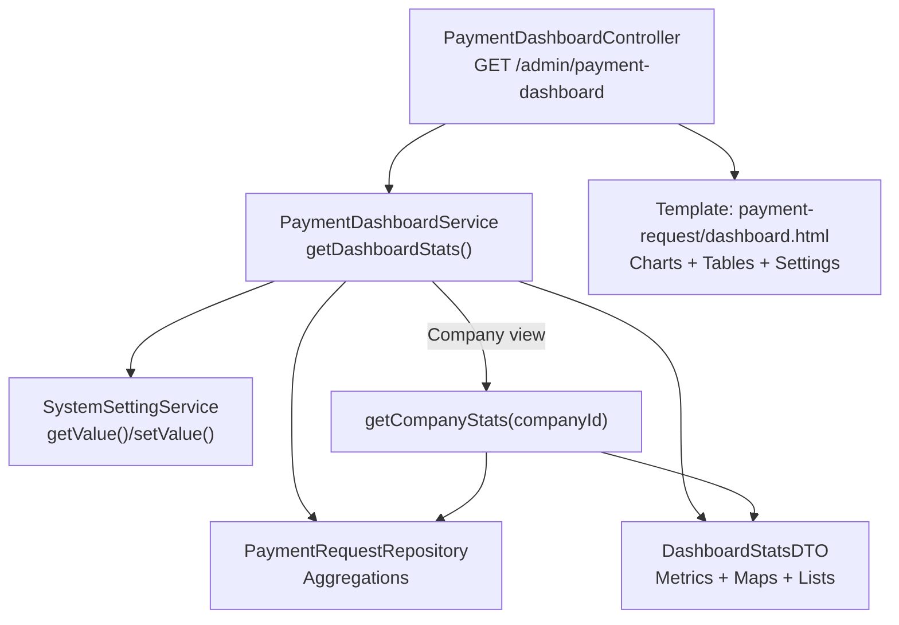
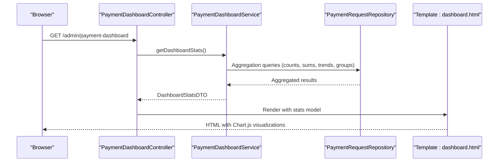
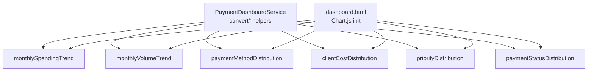
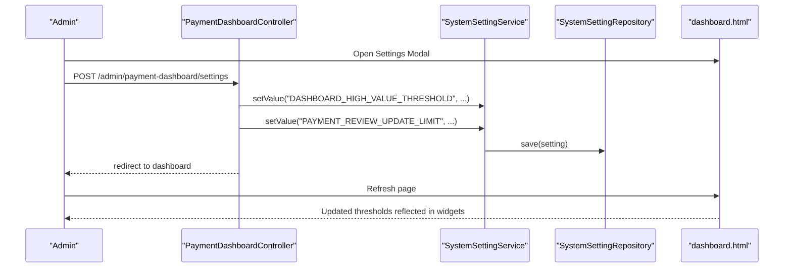
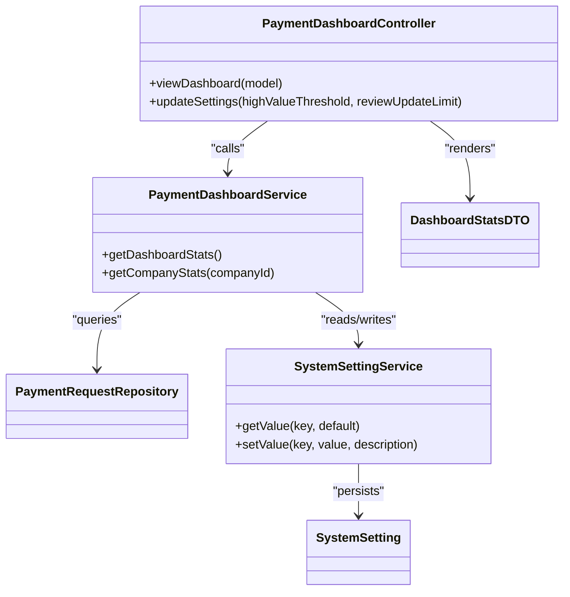
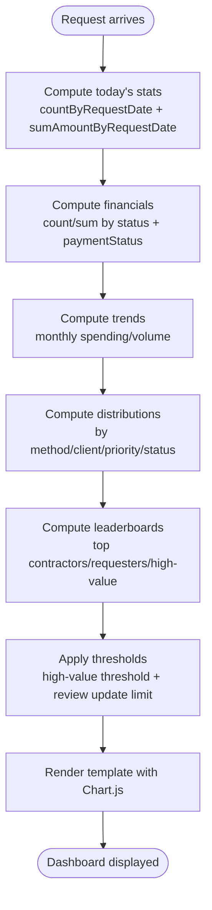

# Payment Dashboard

<cite>
**Referenced Files in This Document**
- [PaymentDashboardController.java](file://src/main/java/root/cyb/mh/attendancesystem/controller/PaymentDashboardController.java)
- [PaymentDashboardService.java](file://src/main/java/root/cyb/mh/attendancesystem/service/PaymentDashboardService.java)
- [DashboardStatsDTO.java](file://src/main/java/root/cyb/mh/attendancesystem/model/dto/DashboardStatsDTO.java)
- [PaymentRequestRepository.java](file://src/main/java/root/cyb/mh/attendancesystem/repository/PaymentRequestRepository.java)
- [SystemSettingService.java](file://src/main/java/root/cyb/mh/attendancesystem/service/SystemSettingService.java)
- [SystemSettingRepository.java](file://src/main/java/root/cyb/mh/attendancesystem/repository/SystemSettingRepository.java)
- [SystemSetting.java](file://src/main/java/root/cyb/mh/attendancesystem/model/SystemSetting.java)
- [dashboard.html](file://src/main/resources/templates/payment-request/dashboard.html)
- [DataImportExportService.java](file://src/main/java/root/cyb/mh/attendancesystem/service/DataImportExportService.java)
- [PaymentHistoryController.java](file://src/main/java/root/cyb/mh/attendancesystem/controller/PaymentHistoryController.java)
</cite>

## Table of Contents
1. [Introduction](#introduction)
2. [Project Structure](#project-structure)
3. [Core Components](#core-components)
4. [Architecture Overview](#architecture-overview)
5. [Detailed Component Analysis](#detailed-component-analysis)
6. [Dependency Analysis](#dependency-analysis)
7. [Performance Considerations](#performance-considerations)
8. [Troubleshooting Guide](#troubleshooting-guide)
9. [Conclusion](#conclusion)
10. [Appendices](#appendices)

## Introduction
This document describes the payment dashboard functionality, focusing on dashboard statistics, KPI tracking, real-time payment metrics, aggregated visualizations, payment status distributions, and performance indicators. It also covers customization options, filters, and export features, along with configuration examples, metric calculations, and data refresh mechanisms. The dashboard integrates with payment analytics and supports reporting dashboards tailored for different user roles.

## Project Structure
The payment dashboard spans a controller, a service, a DTO, a repository, and a Thymeleaf template. It also integrates with system settings and export services for customization and reporting.

**Diagram sources**
- [PaymentDashboardController.java:22-27](file://src/main/java/root/cyb/mh/attendancesystem/controller/PaymentDashboardController.java#L22-L27)
- [PaymentDashboardService.java:23-102](file://src/main/java/root/cyb/mh/attendancesystem/service/PaymentDashboardService.java#L23-L102)
- [PaymentRequestRepository.java:32-127](file://src/main/java/root/cyb/mh/attendancesystem/repository/PaymentRequestRepository.java#L32-L127)
- [SystemSettingService.java:14-23](file://src/main/java/root/cyb/mh/attendancesystem/service/SystemSettingService.java#L14-L23)
- [dashboard.html:10-528](file://src/main/resources/templates/payment-request/dashboard.html#L10-L528)
- [DashboardStatsDTO.java:10-59](file://src/main/java/root/cyb/mh/attendancesystem/model/dto/DashboardStatsDTO.java#L10-L59)

**Section sources**
- [PaymentDashboardController.java:12-27](file://src/main/java/root/cyb/mh/attendancesystem/controller/PaymentDashboardController.java#L12-L27)
- [PaymentDashboardService.java:14-102](file://src/main/java/root/cyb/mh/attendancesystem/service/PaymentDashboardService.java#L14-L102)
- [DashboardStatsDTO.java:10-59](file://src/main/java/root/cyb/mh/attendancesystem/model/dto/DashboardStatsDTO.java#L10-L59)
- [PaymentRequestRepository.java:32-127](file://src/main/java/root/cyb/mh/attendancesystem/repository/PaymentRequestRepository.java#L32-L127)
- [SystemSettingService.java:14-23](file://src/main/java/root/cyb/mh/attendancesystem/service/SystemSettingService.java#L14-L23)
- [dashboard.html:10-528](file://src/main/resources/templates/payment-request/dashboard.html#L10-L528)

## Core Components
- PaymentDashboardController: Exposes the dashboard endpoint and settings update endpoint. It delegates data retrieval to the service and renders the Thymeleaf template.
- PaymentDashboardService: Orchestrates aggregation queries, computes derived metrics, and prepares structured DTOs for rendering.
- DashboardStatsDTO: Holds all dashboard metrics, distributions, leaderboards, and configuration values.
- PaymentRequestRepository: Provides SQL-backed aggregations for counts, sums, averages, trends, and grouped distributions.
- SystemSettingService and SystemSetting: Persist and retrieve dashboard configuration keys such as thresholds and limits.
- Template dashboard.html: Renders widgets, charts, leaderboards, and a settings modal backed by Chart.js.

Key responsibilities:
- Real-time metrics: requests today, requested amount today, action items, urgent pending.
- Financial KPIs: paid this month, average request size, unpaid approved liability, rejection rate.
- Visualizations: monthly spending trend, monthly volume trend, payment method distribution, client cost distribution, priority distribution, payment status distribution.
- Leaderboards: top contractors, top requesters, high-value requests.
- Configuration: high-value threshold and review update limit adjustable via settings modal.
- Export: while the dashboard itself does not export, the broader system supports exporting payment history in CSV/PDF.

**Section sources**
- [PaymentDashboardController.java:22-38](file://src/main/java/root/cyb/mh/attendancesystem/controller/PaymentDashboardController.java#L22-L38)
- [PaymentDashboardService.java:23-102](file://src/main/java/root/cyb/mh/attendancesystem/service/PaymentDashboardService.java#L23-L102)
- [DashboardStatsDTO.java:10-59](file://src/main/java/root/cyb/mh/attendancesystem/model/dto/DashboardStatsDTO.java#L10-L59)
- [PaymentRequestRepository.java:32-127](file://src/main/java/root/cyb/mh/attendancesystem/repository/PaymentRequestRepository.java#L32-L127)
- [dashboard.html:28-311](file://src/main/resources/templates/payment-request/dashboard.html#L28-L311)

## Architecture Overview
The dashboard follows a layered architecture:
- Presentation: Thymeleaf template renders metrics and charts.
- Controller: Handles GET and POST requests for dashboard and settings.
- Service: Computes metrics and distributions using repository queries.
- Persistence: JPA repositories encapsulate SQL aggregations.

**Diagram sources**
- [PaymentDashboardController.java:22-27](file://src/main/java/root/cyb/mh/attendancesystem/controller/PaymentDashboardController.java#L22-L27)
- [PaymentDashboardService.java:23-102](file://src/main/java/root/cyb/mh/attendancesystem/service/PaymentDashboardService.java#L23-L102)
- [PaymentRequestRepository.java:32-127](file://src/main/java/root/cyb/mh/attendancesystem/repository/PaymentRequestRepository.java#L32-L127)
- [dashboard.html:417-524](file://src/main/resources/templates/payment-request/dashboard.html#L417-L524)

## Detailed Component Analysis

### Dashboard Statistics and KPIs
- Daily KPIs: requests today, amount requested today, my action items, urgent pending requests.
- Financial KPIs: pending requests/amount, total approved, total paid amount, paid this month, average request amount, unpaid approved liability, rejection rate.
- Derived metrics: rejection rate computed from approved/rejected/pending totals.

Metric calculation highlights:
- Paid this month: sum of paid amounts within the current month-to-date.
- Average request amount: global average across all payment requests.
- Unpaid approved liability: sum of approved but not yet paid amounts.
- Rejection rate: percentage of rejected requests among total approved/rejected/pending.

**Section sources**
- [PaymentDashboardService.java:23-67](file://src/main/java/root/cyb/mh/attendancesystem/service/PaymentDashboardService.java#L23-L67)
- [PaymentRequestRepository.java:67-76](file://src/main/java/root/cyb/mh/attendancesystem/repository/PaymentRequestRepository.java#L67-L76)

### Aggregated Data Visualization
The template renders six Chart.js visualizations:
- Monthly spending trend (line chart): approved spend per month over the last six months.
- Monthly volume trend (bar chart): total request count per month over the last six months.
- Payment methods distribution (pie chart).
- Client cost distribution (doughnut chart).
- Priority distribution (horizontal bar chart).
- Payment status distribution (vertical bar chart).

Rendering logic:
- Chart data is injected via Thymeleaf expressions from the stats DTO maps.
- Responsive options and legends are configured centrally.

**Diagram sources**
- [PaymentDashboardService.java:104-149](file://src/main/java/root/cyb/mh/attendancesystem/service/PaymentDashboardService.java#L104-L149)
- [dashboard.html:426-521](file://src/main/resources/templates/payment-request/dashboard.html#L426-L521)

**Section sources**
- [PaymentDashboardService.java:68-86](file://src/main/java/root/cyb/mh/attendancesystem/service/PaymentDashboardService.java#L68-L86)
- [PaymentRequestRepository.java:77-106](file://src/main/java/root/cyb/mh/attendancesystem/repository/PaymentRequestRepository.java#L77-L106)
- [dashboard.html:146-226](file://src/main/resources/templates/payment-request/dashboard.html#L146-L226)

### Payment Status Distribution Charts
- Payment status distribution: counts of payment statuses (e.g., paid/unpaid/liability).
- Priority distribution: counts of request priorities (low/normal/high/urgent).
- Client cost distribution: sum of amounts per client.
- Payment method distribution: counts of requests per payment method.

These are computed via grouped queries and mapped to ordered maps for consistent chart rendering.

**Section sources**
- [PaymentRequestRepository.java:92-106](file://src/main/java/root/cyb/mh/attendancesystem/repository/PaymentRequestRepository.java#L92-L106)
- [PaymentDashboardService.java:104-149](file://src/main/java/root/cyb/mh/attendancesystem/service/PaymentDashboardService.java#L104-L149)

### Performance Indicators
- Rejection rate: computed from total approved/rejected/pending counts.
- Average request size: global average amount.
- Unpaid approved liability: approved but unpaid exposure.
- Paid this month: month-to-date paid amount.

These indicators support operational monitoring and risk assessment.

**Section sources**
- [PaymentDashboardService.java:50-67](file://src/main/java/root/cyb/mh/attendancesystem/service/PaymentDashboardService.java#L50-L67)
- [PaymentRequestRepository.java:67-76](file://src/main/java/root/cyb/mh/attendancesystem/repository/PaymentRequestRepository.java#L67-L76)

### Dashboard Customization and Filters
- Settings modal: adjust high-value threshold and review update limit.
- Settings persistence: stored via SystemSettingService and SystemSettingRepository.
- Filters: the broader system supports filtering payment history by contractor, client, payment method, work order, requester, priority, status, payment status, and PPW status. These filters inform the dashboard’s underlying data and can be applied to refine analytics.

**Diagram sources**
- [PaymentDashboardController.java:29-38](file://src/main/java/root/cyb/mh/attendancesystem/controller/PaymentDashboardController.java#L29-L38)
- [SystemSettingService.java:20-23](file://src/main/java/root/cyb/mh/attendancesystem/service/SystemSettingService.java#L20-L23)
- [SystemSettingRepository.java:8](file://src/main/java/root/cyb/mh/attendancesystem/repository/SystemSettingRepository.java#L8)
- [dashboard.html:373-412](file://src/main/resources/templates/payment-request/dashboard.html#L373-L412)

**Section sources**
- [PaymentDashboardController.java:29-38](file://src/main/java/root/cyb/mh/attendancesystem/controller/PaymentDashboardController.java#L29-L38)
- [SystemSettingService.java:14-23](file://src/main/java/root/cyb/mh/attendancesystem/service/SystemSettingService.java#L14-L23)
- [SystemSetting.java:16-26](file://src/main/java/root/cyb/mh/attendancesystem/model/SystemSetting.java#L16-L26)
- [PaymentHistoryController.java:104-138](file://src/main/java/root/cyb/mh/attendancesystem/controller/PaymentHistoryController.java#L104-L138)

### Export Features
- The dashboard does not directly export its charts or tables.
- The broader system supports exporting payment history to CSV or PDF with customizable columns. This capability complements the dashboard by enabling downstream reporting and archival.

**Section sources**
- [DataImportExportService.java:234-318](file://src/main/java/root/cyb/mh/attendancesystem/service/DataImportExportService.java#L234-L318)
- [PaymentHistoryController.java:39-102](file://src/main/java/root/cyb/mh/attendancesystem/controller/PaymentHistoryController.java#L39-L102)

### Role-Based Access and Reporting
- The dashboard endpoint is protected for ADMIN role.
- The controller exposes a company-scoped view via getCompanyStats, enabling strategic insights per company with additional metrics and leaderboards.

**Section sources**
- [PaymentDashboardController.java:13](file://src/main/java/root/cyb/mh/attendancesystem/controller/PaymentDashboardController.java#L13)
- [PaymentDashboardService.java:151-280](file://src/main/java/root/cyb/mh/attendancesystem/service/PaymentDashboardService.java#L151-L280)

## Dependency Analysis
The dashboard’s dependencies are intentionally decoupled:
- Controller depends on Service.
- Service depends on Repository and SystemSettingService.
- Template depends on DTO fields and Chart.js.

**Diagram sources**
- [PaymentDashboardController.java:12-38](file://src/main/java/root/cyb/mh/attendancesystem/controller/PaymentDashboardController.java#L12-L38)
- [PaymentDashboardService.java:14-102](file://src/main/java/root/cyb/mh/attendancesystem/service/PaymentDashboardService.java#L14-L102)
- [PaymentRequestRepository.java:10-12](file://src/main/java/root/cyb/mh/attendancesystem/repository/PaymentRequestRepository.java#L10-L12)
- [SystemSettingService.java:9-23](file://src/main/java/root/cyb/mh/attendancesystem/service/SystemSettingService.java#L9-L23)
- [DashboardStatsDTO.java:10-59](file://src/main/java/root/cyb/mh/attendancesystem/model/dto/DashboardStatsDTO.java#L10-L59)
- [SystemSetting.java:16-26](file://src/main/java/root/cyb/mh/attendancesystem/model/SystemSetting.java#L16-L26)

**Section sources**
- [PaymentDashboardController.java:12-38](file://src/main/java/root/cyb/mh/attendancesystem/controller/PaymentDashboardController.java#L12-L38)
- [PaymentDashboardService.java:14-102](file://src/main/java/root/cyb/mh/attendancesystem/service/PaymentDashboardService.java#L14-L102)
- [SystemSettingService.java:9-23](file://src/main/java/root/cyb/mh/attendancesystem/service/SystemSettingService.java#L9-L23)

## Performance Considerations
- Aggregation queries: The repository uses optimized SQL aggregations and grouped selects to minimize round trips and computation overhead.
- Trend computations: Monthly grouping and ordering are performed server-side to avoid large in-memory transformations.
- Rendering: Chart.js consumes precomputed maps and lists, keeping client-side rendering efficient.
- Recommendations:
  - Indexes on frequently filtered columns (requestDate, status, paymentStatus, priority) improve query performance.
  - Pagination for leaderboards (already used for top contractors/top requesters) prevents oversized result sets.
  - Consider caching thresholds and periodic recomputation for heavy queries if traffic increases.

[No sources needed since this section provides general guidance]

## Troubleshooting Guide
Common issues and resolutions:
- Empty or stale metrics:
  - Verify repository queries return expected rows for the given date range and filters.
  - Confirm system settings keys exist or fallback defaults are acceptable.
- Chart rendering anomalies:
  - Ensure DTO maps are populated and not null; the template expects non-null maps.
  - Validate Chart.js initialization runs after DOMContentLoaded.
- Settings not applying:
  - Confirm POST route persists values and redirects to the dashboard.
  - Check that the settings modal posts to the correct endpoint with required fields.

**Section sources**
- [PaymentDashboardController.java:29-38](file://src/main/java/root/cyb/mh/attendancesystem/controller/PaymentDashboardController.java#L29-L38)
- [SystemSettingService.java:14-23](file://src/main/java/root/cyb/mh/attendancesystem/service/SystemSettingService.java#L14-L23)
- [dashboard.html:417-524](file://src/main/resources/templates/payment-request/dashboard.html#L417-L524)

## Conclusion
The payment dashboard delivers a comprehensive set of real-time KPIs, visualizations, and leaderboards, driven by efficient repository aggregations and configurable settings. It supports role-based access, integrates with broader export capabilities, and provides a foundation for deeper analytics and reporting across organizations and companies.

[No sources needed since this section summarizes without analyzing specific files]

## Appendices

### Example: Metric Calculation Flow

**Diagram sources**
- [PaymentDashboardService.java:23-102](file://src/main/java/root/cyb/mh/attendancesystem/service/PaymentDashboardService.java#L23-L102)
- [PaymentRequestRepository.java:32-127](file://src/main/java/root/cyb/mh/attendancesystem/repository/PaymentRequestRepository.java#L32-L127)
- [dashboard.html:417-524](file://src/main/resources/templates/payment-request/dashboard.html#L417-L524)

### Example: Dashboard Configuration Keys
- DASHBOARD_HIGH_VALUE_THRESHOLD: numeric threshold for high-value requests.
- PAYMENT_REVIEW_UPDATE_LIMIT: maximum allowed status updates for HR/supervisors.

Persistence and retrieval are handled by SystemSettingService and SystemSettingRepository.

**Section sources**
- [SystemSettingService.java:14-23](file://src/main/java/root/cyb/mh/attendancesystem/service/SystemSettingService.java#L14-L23)
- [SystemSettingRepository.java:8](file://src/main/java/root/cyb/mh/attendancesystem/repository/SystemSettingRepository.java#L8)
- [SystemSetting.java:16-26](file://src/main/java/root/cyb/mh/attendancesystem/model/SystemSetting.java#L16-L26)