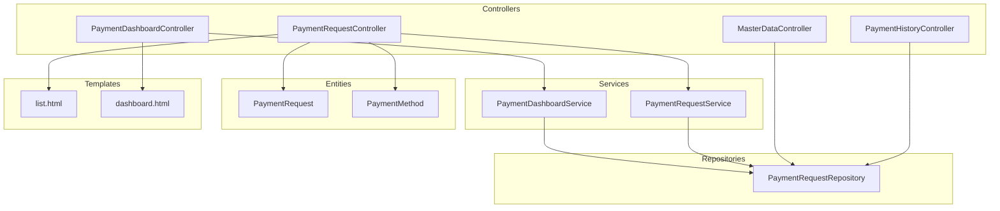
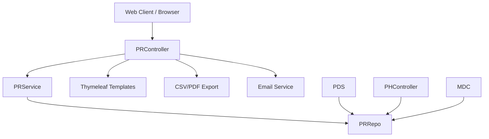
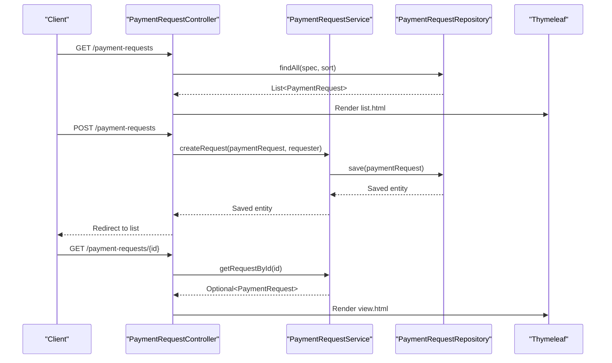
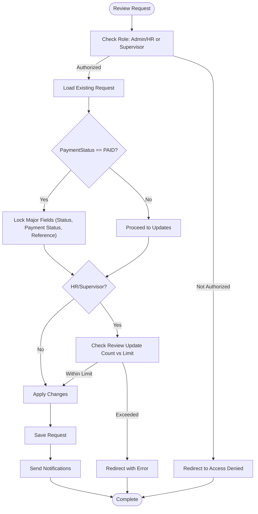
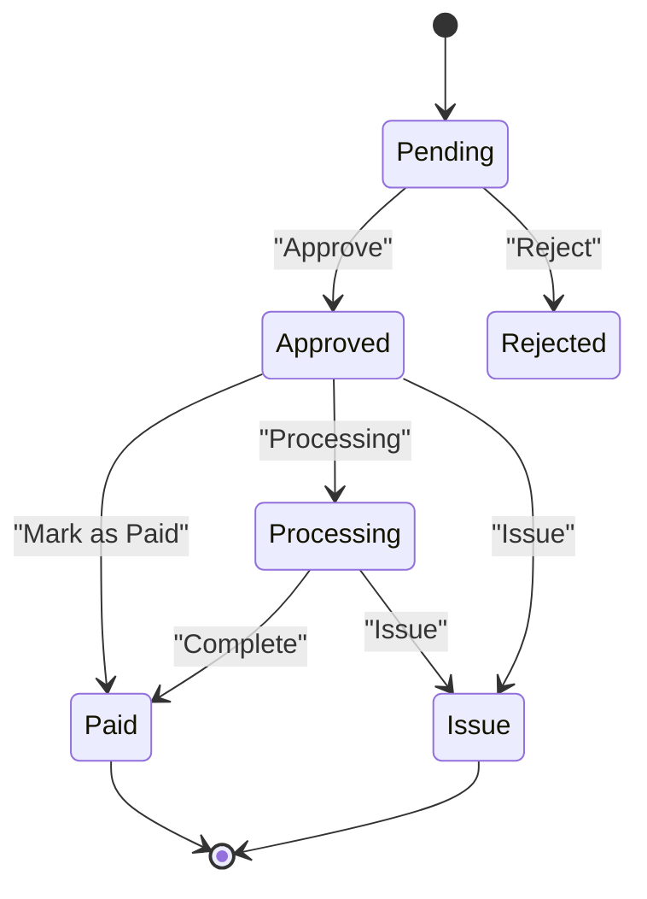
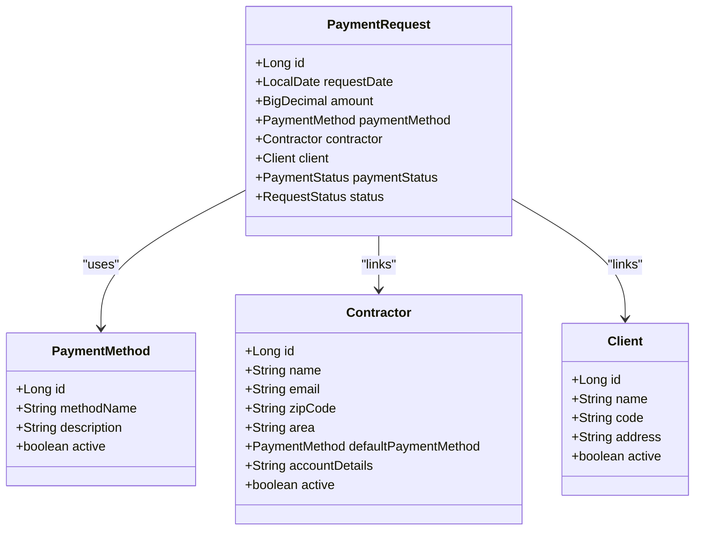
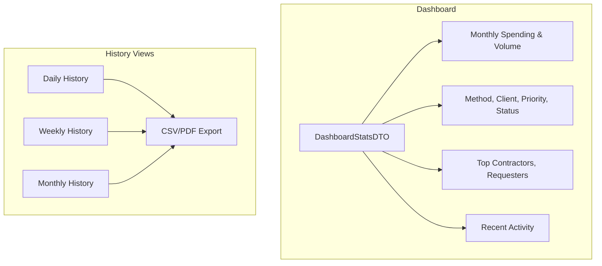
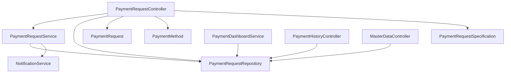

# Payment Operations

<cite>
**Referenced Files in This Document**
- [PaymentRequestController.java](file://src/main/java/root/cyb/mh/attendancesystem/controller/PaymentRequestController.java)
- [PaymentRequestService.java](file://src/main/java/root/cyb/mh/attendancesystem/service/PaymentRequestService.java)
- [PaymentRequest.java](file://src/main/java/root/cyb/mh/attendancesystem/model/PaymentRequest.java)
- [PaymentRequestRepository.java](file://src/main/java/root/cyb/mh/attendancesystem/repository/PaymentRequestRepository.java)
- [PaymentDashboardController.java](file://src/main/java/root/cyb/mh/attendancesystem/controller/PaymentDashboardController.java)
- [PaymentDashboardService.java](file://src/main/java/root/cyb/mh/attendancesystem/service/PaymentDashboardService.java)
- [PaymentHistoryController.java](file://src/main/java/root/cyb/mh/attendancesystem/controller/PaymentHistoryController.java)
- [MasterDataController.java](file://src/main/java/root/cyb/mh/attendancesystem/controller/MasterDataController.java)
- [PaymentMethod.java](file://src/main/java/root/cyb/mh/attendancesystem/model/PaymentMethod.java)
- [PaymentStatus.java](file://src/main/java/root/cyb/mh/attendancesystem/model/enums/PaymentStatus.java)
- [RequestStatus.java](file://src/main/java/root/cyb/mh/attendancesystem/model/enums/RequestStatus.java)
- [PaymentRequestSpecification.java](file://src/main/java/root/cyb/mh/attendancesystem/specification/PaymentRequestSpecification.java)
- [dashboard.html](file://src/main/resources/templates/payment-request/dashboard.html)
- [list.html](file://src/main/resources/templates/payment-request/list.html)
</cite>

## Table of Contents
1. [Introduction](#introduction)
2. [Project Structure](#project-structure)
3. [Core Components](#core-components)
4. [Architecture Overview](#architecture-overview)
5. [Detailed Component Analysis](#detailed-component-analysis)
6. [Dependency Analysis](#dependency-analysis)
7. [Performance Considerations](#performance-considerations)
8. [Troubleshooting Guide](#troubleshooting-guide)
9. [Conclusion](#conclusion)
10. [Appendices](#appendices)

## Introduction
This document provides comprehensive payment operations documentation for the Skylink Custom Backend. It covers payment request management, master data maintenance, payment method tracking, and financial reporting. The system implements robust workflows for payment creation, approval processes, payment scheduling, and integration with accounting systems through export capabilities and reconciliation procedures. Security, audit trails, and compliance are addressed through role-based access control, restriction logic, and configurable update limits.

## Project Structure
The payment operations module is organized around Spring MVC controllers, services, repositories, JPA entities, and Thymeleaf templates. Controllers handle HTTP requests and render views, services encapsulate business logic, repositories manage persistence and complex queries, and entities define the data model. The structure supports filtering, sorting, exporting, and dashboard analytics.

**Diagram sources**
- [PaymentRequestController.java:30-688](file://src/main/java/root/cyb/mh/attendancesystem/controller/PaymentRequestController.java#L30-L688)
- [PaymentRequestService.java:14-269](file://src/main/java/root/cyb/mh/attendancesystem/service/PaymentRequestService.java#L14-L269)
- [PaymentRequestRepository.java:10-742](file://src/main/java/root/cyb/mh/attendancesystem/repository/PaymentRequestRepository.java#L10-L742)
- [PaymentRequest.java:13-117](file://src/main/java/root/cyb/mh/attendancesystem/model/PaymentRequest.java#L13-L117)
- [PaymentMethod.java:6-22](file://src/main/java/root/cyb/mh/attendancesystem/model/PaymentMethod.java#L6-L22)
- [PaymentDashboardController.java:11-40](file://src/main/java/root/cyb/mh/attendancesystem/controller/PaymentDashboardController.java#L11-L40)
- [PaymentDashboardService.java:14-282](file://src/main/java/root/cyb/mh/attendancesystem/service/PaymentDashboardService.java#L14-L282)
- [PaymentHistoryController.java:23-265](file://src/main/java/root/cyb/mh/attendancesystem/controller/PaymentHistoryController.java#L23-L265)
- [MasterDataController.java:13-800](file://src/main/java/root/cyb/mh/attendancesystem/controller/MasterDataController.java#L13-L800)
- [list.html:1-431](file://src/main/resources/templates/payment-request/list.html#L1-L431)
- [dashboard.html:1-528](file://src/main/resources/templates/payment-request/dashboard.html#L1-L528)

**Section sources**
- [PaymentRequestController.java:30-688](file://src/main/java/root/cyb/mh/attendancesystem/controller/PaymentRequestController.java#L30-L688)
- [PaymentRequestService.java:14-269](file://src/main/java/root/cyb/mh/attendancesystem/service/PaymentRequestService.java#L14-L269)
- [PaymentRequestRepository.java:10-742](file://src/main/java/root/cyb/mh/attendancesystem/repository/PaymentRequestRepository.java#L10-L742)
- [PaymentRequest.java:13-117](file://src/main/java/root/cyb/mh/attendancesystem/model/PaymentRequest.java#L13-L117)
- [PaymentMethod.java:6-22](file://src/main/java/root/cyb/mh/attendancesystem/model/PaymentMethod.java#L6-L22)
- [PaymentDashboardController.java:11-40](file://src/main/java/root/cyb/mh/attendancesystem/controller/PaymentDashboardController.java#L11-L40)
- [PaymentDashboardService.java:14-282](file://src/main/java/root/cyb/mh/attendancesystem/service/PaymentDashboardService.java#L14-L282)
- [PaymentHistoryController.java:23-265](file://src/main/java/root/cyb/mh/attendancesystem/controller/PaymentHistoryController.java#L23-L265)
- [MasterDataController.java:13-800](file://src/main/java/root/cyb/mh/attendancesystem/controller/MasterDataController.java#L13-L800)
- [list.html:1-431](file://src/main/resources/templates/payment-request/list.html#L1-L431)
- [dashboard.html:1-528](file://src/main/resources/templates/payment-request/dashboard.html#L1-L528)

## Core Components
- PaymentRequestController: Manages payment request lifecycle including listing, filtering, creating, reviewing, deleting, exporting, downloading invoices, sending emails, adding employee notes, and viewing proof attachments. Implements role-based access control and view constraints.
- PaymentRequestService: Handles request creation, updates, retrieval, team requests, and notifications for admins, HR, supervisors, and requesters.
- PaymentRequest entity: Defines the payment request data model with fields for requester, contractor, client, payment method, amounts, statuses, approvals, and audit fields.
- PaymentRequestRepository: Provides JPA repository with extensive aggregation queries for dashboards, analytics, and reporting.
- PaymentDashboardController and PaymentDashboardService: Deliver payment dashboard statistics, trends, distributions, leaderboards, and configurable thresholds.
- PaymentHistoryController: Supports daily, weekly, and monthly history views with export to CSV/PDF and summary calculations.
- MasterDataController: Maintains master data for contractors, clients, and payment methods, including toggling active states and analytics dashboards.
- PaymentMethod entity: Represents payment methods (e.g., CashApp, Zelle) used for payments.
- Enums: PaymentStatus and RequestStatus define the state machine for payment and approval workflows.

**Section sources**
- [PaymentRequestController.java:30-688](file://src/main/java/root/cyb/mh/attendancesystem/controller/PaymentRequestController.java#L30-L688)
- [PaymentRequestService.java:14-269](file://src/main/java/root/cyb/mh/attendancesystem/service/PaymentRequestService.java#L14-L269)
- [PaymentRequest.java:13-117](file://src/main/java/root/cyb/mh/attendancesystem/model/PaymentRequest.java#L13-L117)
- [PaymentRequestRepository.java:10-742](file://src/main/java/root/cyb/mh/attendancesystem/repository/PaymentRequestRepository.java#L10-L742)
- [PaymentDashboardController.java:11-40](file://src/main/java/root/cyb/mh/attendancesystem/controller/PaymentDashboardController.java#L11-L40)
- [PaymentDashboardService.java:14-282](file://src/main/java/root/cyb/mh/attendancesystem/service/PaymentDashboardService.java#L14-L282)
- [PaymentHistoryController.java:23-265](file://src/main/java/root/cyb/mh/attendancesystem/controller/PaymentHistoryController.java#L23-L265)
- [MasterDataController.java:13-800](file://src/main/java/root/cyb/mh/attendancesystem/controller/MasterDataController.java#L13-L800)
- [PaymentMethod.java:6-22](file://src/main/java/root/cyb/mh/attendancesystem/model/PaymentMethod.java#L6-L22)
- [PaymentStatus.java:3-8](file://src/main/java/root/cyb/mh/attendancesystem/model/enums/PaymentStatus.java#L3-L8)
- [RequestStatus.java:3-7](file://src/main/java/root/cyb/mh/attendancesystem/model/enums/RequestStatus.java#L3-L7)

## Architecture Overview
The system follows a layered architecture:
- Presentation Layer: Controllers expose REST endpoints and render Thymeleaf templates for web UI.
- Business Logic Layer: Services orchestrate operations, enforce business rules, and coordinate with repositories.
- Persistence Layer: Repositories manage JPA entities and execute complex queries for analytics and reporting.
- Data Model: Entities represent domain objects with JPA annotations and enums define state values.

**Diagram sources**
- [PaymentRequestController.java:30-688](file://src/main/java/root/cyb/mh/attendancesystem/controller/PaymentRequestController.java#L30-L688)
- [PaymentRequestService.java:14-269](file://src/main/java/root/cyb/mh/attendancesystem/service/PaymentRequestService.java#L14-L269)
- [PaymentRequestRepository.java:10-742](file://src/main/java/root/cyb/mh/attendancesystem/repository/PaymentRequestRepository.java#L10-L742)
- [PaymentDashboardService.java:14-282](file://src/main/java/root/cyb/mh/attendancesystem/service/PaymentDashboardService.java#L14-L282)
- [PaymentHistoryController.java:23-265](file://src/main/java/root/cyb/mh/attendancesystem/controller/PaymentHistoryController.java#L23-L265)
- [MasterDataController.java:13-800](file://src/main/java/root/cyb/mh/attendancesystem/controller/MasterDataController.java#L13-L800)

## Detailed Component Analysis

### Payment Request Management
Payment request management encompasses creation, review, approval, payment processing, and archival. The controller enforces role-based access and view constraints, while the service manages state transitions and notifications.

**Diagram sources**
- [PaymentRequestController.java:65-147](file://src/main/java/root/cyb/mh/attendancesystem/controller/PaymentRequestController.java#L65-L147)
- [PaymentRequestService.java:29-90](file://src/main/java/root/cyb/mh/attendancesystem/service/PaymentRequestService.java#L29-L90)
- [PaymentRequestRepository.java:10-742](file://src/main/java/root/cyb/mh/attendancesystem/repository/PaymentRequestRepository.java#L10-L742)
- [list.html:1-431](file://src/main/resources/templates/payment-request/list.html#L1-L431)

Key features:
- Filtering and sorting across multiple attributes (contractor, client, payment method, priority, status, payment status, PPW status).
- Role-based visibility: Admin/HR sees all requests; employees see self/team requests based on view parameter.
- Export functionality supporting CSV and PDF with customizable column selection.
- Invoice generation and email delivery for paid requests.
- Proof attachment upload and secure viewing.

**Section sources**
- [PaymentRequestController.java:65-194](file://src/main/java/root/cyb/mh/attendancesystem/controller/PaymentRequestController.java#L65-L194)
- [PaymentRequestService.java:29-90](file://src/main/java/root/cyb/mh/attendancesystem/service/PaymentRequestService.java#L29-L90)
- [PaymentRequestSpecification.java:14-93](file://src/main/java/root/cyb/mh/attendancesystem/specification/PaymentRequestSpecification.java#L14-L93)
- [list.html:25-135](file://src/main/resources/templates/payment-request/list.html#L25-L135)

### Approval Processes and Restrictions
The review endpoint enforces strict approval logic:
- Admins can approve/reject and edit major fields.
- HR/supervisors face restrictions: locked status for PAID requests, update limits, and restricted field changes.
- Automatic check status updates for reviewers.
- Notifications for status changes and payment status updates.

**Diagram sources**
- [PaymentRequestController.java:333-517](file://src/main/java/root/cyb/mh/attendancesystem/controller/PaymentRequestController.java#L333-L517)
- [PaymentRequestService.java:127-204](file://src/main/java/root/cyb/mh/attendancesystem/service/PaymentRequestService.java#L127-L204)

**Section sources**
- [PaymentRequestController.java:333-517](file://src/main/java/root/cyb/mh/attendancesystem/controller/PaymentRequestController.java#L333-L517)
- [PaymentRequestService.java:127-204](file://src/main/java/root/cyb/mh/attendancesystem/service/PaymentRequestService.java#L127-L204)

### Payment Scheduling and Tracking
Payment scheduling is managed through payment status tracking and PPW status updates:
- PaymentStatus enum supports PAID, UNPAID, ISSUE, and CASH_APP_REQUESTED.
- PPWStatus tracks PPW update progress.
- Dashboard displays unpaid approved liabilities and monthly paid amounts.
- Export and history views support scheduling analysis.

**Diagram sources**
- [PaymentStatus.java:3-8](file://src/main/java/root/cyb/mh/attendancesystem/model/enums/PaymentStatus.java#L3-L8)
- [RequestStatus.java:3-7](file://src/main/java/root/cyb/mh/attendancesystem/model/enums/RequestStatus.java#L3-L7)
- [PaymentRequest.java:75-98](file://src/main/java/root/cyb/mh/attendancesystem/model/PaymentRequest.java#L75-L98)

**Section sources**
- [PaymentStatus.java:3-8](file://src/main/java/root/cyb/mh/attendancesystem/model/enums/PaymentStatus.java#L3-L8)
- [RequestStatus.java:3-7](file://src/main/java/root/cyb/mh/attendancesystem/model/enums/RequestStatus.java#L3-L7)
- [PaymentRequest.java:75-98](file://src/main/java/root/cyb/mh/attendancesystem/model/PaymentRequest.java#L75-L98)

### Master Data Maintenance
Master data includes contractors, clients, and payment methods:
- Contractors: CRUD operations, default payment method assignment, and payment info management.
- Clients: CRUD operations and global analytics dashboards.
- Payment Methods: CRUD operations, toggling active status, and detailed analytics.

**Diagram sources**
- [PaymentMethod.java:6-22](file://src/main/java/root/cyb/mh/attendancesystem/model/PaymentMethod.java#L6-L22)
- [PaymentRequest.java:33-74](file://src/main/java/root/cyb/mh/attendancesystem/model/PaymentRequest.java#L33-L74)
- [MasterDataController.java:307-673](file://src/main/java/root/cyb/mh/attendancesystem/controller/MasterDataController.java#L307-L673)

**Section sources**
- [MasterDataController.java:307-673](file://src/main/java/root/cyb/mh/attendancesystem/controller/MasterDataController.java#L307-L673)
- [PaymentMethod.java:6-22](file://src/main/java/root/cyb/mh/attendancesystem/model/PaymentMethod.java#L6-L22)
- [PaymentRequest.java:33-74](file://src/main/java/root/cyb/mh/attendancesystem/model/PaymentRequest.java#L33-L74)

### Financial Reporting and Analytics
The dashboard and history controllers provide comprehensive reporting:
- Dashboard: Daily stats, financial metrics, trends, distributions, leaderboards, and recent activity.
- History: Daily, weekly, and monthly views with export capabilities.
- Analytics: Aggregations for payment methods, clients, priorities, payment statuses, and contractor/client distributions.

**Diagram sources**
- [PaymentDashboardService.java:23-102](file://src/main/java/root/cyb/mh/attendancesystem/service/PaymentDashboardService.java#L23-L102)
- [PaymentHistoryController.java:39-102](file://src/main/java/root/cyb/mh/attendancesystem/controller/PaymentHistoryController.java#L39-L102)
- [dashboard.html:146-311](file://src/main/resources/templates/payment-request/dashboard.html#L146-L311)

**Section sources**
- [PaymentDashboardService.java:23-102](file://src/main/java/root/cyb/mh/attendancesystem/service/PaymentDashboardService.java#L23-L102)
- [PaymentHistoryController.java:39-102](file://src/main/java/root/cyb/mh/attendancesystem/controller/PaymentHistoryController.java#L39-L102)
- [dashboard.html:146-311](file://src/main/resources/templates/payment-request/dashboard.html#L146-L311)

### Practical Examples

#### Example 1: Creating a Payment Request
- Navigate to New Request form.
- Select contractor, client, payment method, and enter amount and work order number.
- Submit request; system auto-sets request date and status to PENDING.
- Admins and HR receive notifications; supervisor receives team notification.

**Section sources**
- [PaymentRequestController.java:246-281](file://src/main/java/root/cyb/mh/attendancesystem/controller/PaymentRequestController.java#L246-L281)
- [PaymentRequestService.java:29-42](file://src/main/java/root/cyb/mh/attendancesystem/service/PaymentRequestService.java#L29-L42)
- [list.html:18-23](file://src/main/resources/templates/payment-request/list.html#L18-L23)

#### Example 2: Approving a Payment Request
- Supervisor/HR reviews request; checks status and payment status.
- Applies restrictions: locks major fields if PAID; enforces update limits.
- Updates check status, payment status, PPW status, and remarks.
- Sends notifications to requester on changes.

**Section sources**
- [PaymentRequestController.java:333-517](file://src/main/java/root/cyb/mh/attendancesystem/controller/PaymentRequestController.java#L333-L517)
- [PaymentRequestService.java:127-204](file://src/main/java/root/cyb/mh/attendancesystem/service/PaymentRequestService.java#L127-L204)

#### Example 3: Generating Financial Reports
- Use dashboard settings to configure high-value threshold and review update limits.
- Export payment requests to CSV/PDF from the list view.
- Access daily/weekly/monthly history with export options.

**Section sources**
- [PaymentDashboardController.java:22-38](file://src/main/java/root/cyb/mh/attendancesystem/controller/PaymentDashboardController.java#L22-L38)
- [PaymentRequestController.java:149-194](file://src/main/java/root/cyb/mh/attendancesystem/controller/PaymentRequestController.java#L149-L194)
- [PaymentHistoryController.java:39-102](file://src/main/java/root/cyb/mh/attendancesystem/controller/PaymentHistoryController.java#L39-L102)

#### Example 4: Managing Payment Methods
- Admin/HR maintains payment methods and toggles active status.
- Payment method dashboard shows usage, success rates, retention, and growth metrics.

**Section sources**
- [MasterDataController.java:307-344](file://src/main/java/root/cyb/mh/attendancesystem/controller/MasterDataController.java#L307-L344)
- [MasterDataController.java:447-673](file://src/main/java/root/cyb/mh/attendancesystem/controller/MasterDataController.java#L447-L673)

### Compliance and Audit Trails
- Role-based access control ensures only authorized users can review or approve requests.
- Restriction logic prevents unauthorized changes to paid requests and limits HR/supervisor updates.
- System setting controls for high-value thresholds and review update limits.
- Audit fields include timestamps, last modified, and email sent metadata.
- Notifications provide traceability for status changes.

**Section sources**
- [PaymentRequestController.java:385-426](file://src/main/java/root/cyb/mh/attendancesystem/controller/PaymentRequestController.java#L385-L426)
- [PaymentRequest.java:25-26](file://src/main/java/root/cyb/mh/attendancesystem/model/PaymentRequest.java#L25-L26)
- [PaymentRequest.java:107-111](file://src/main/java/root/cyb/mh/attendancesystem/model/PaymentRequest.java#L107-L111)

## Dependency Analysis
The payment operations module exhibits strong separation of concerns with clear dependencies:
- Controllers depend on services for business logic and repositories for persistence.
- Services depend on repositories and notification services.
- Entities define relationships and constraints.
- Specifications encapsulate filtering logic for consistent query building.

**Diagram sources**
- [PaymentRequestController.java:30-688](file://src/main/java/root/cyb/mh/attendancesystem/controller/PaymentRequestController.java#L30-L688)
- [PaymentRequestService.java:14-269](file://src/main/java/root/cyb/mh/attendancesystem/service/PaymentRequestService.java#L14-L269)
- [PaymentRequestRepository.java:10-742](file://src/main/java/root/cyb/mh/attendancesystem/repository/PaymentRequestRepository.java#L10-L742)
- [PaymentRequestSpecification.java:14-93](file://src/main/java/root/cyb/mh/attendancesystem/specification/PaymentRequestSpecification.java#L14-L93)
- [PaymentDashboardService.java:14-282](file://src/main/java/root/cyb/mh/attendancesystem/service/PaymentDashboardService.java#L14-L282)
- [PaymentHistoryController.java:23-265](file://src/main/java/root/cyb/mh/attendancesystem/controller/PaymentHistoryController.java#L23-L265)
- [MasterDataController.java:13-800](file://src/main/java/root/cyb/mh/attendancesystem/controller/MasterDataController.java#L13-L800)

**Section sources**
- [PaymentRequestController.java:30-688](file://src/main/java/root/cyb/mh/attendancesystem/controller/PaymentRequestController.java#L30-L688)
- [PaymentRequestService.java:14-269](file://src/main/java/root/cyb/mh/attendancesystem/service/PaymentRequestService.java#L14-L269)
- [PaymentRequestRepository.java:10-742](file://src/main/java/root/cyb/mh/attendancesystem/repository/PaymentRequestRepository.java#L10-L742)
- [PaymentRequestSpecification.java:14-93](file://src/main/java/root/cyb/mh/attendancesystem/specification/PaymentRequestSpecification.java#L14-L93)
- [PaymentDashboardService.java:14-282](file://src/main/java/root/cyb/mh/attendancesystem/service/PaymentDashboardService.java#L14-L282)
- [PaymentHistoryController.java:23-265](file://src/main/java/root/cyb/mh/attendancesystem/controller/PaymentHistoryController.java#L23-L265)
- [MasterDataController.java:13-800](file://src/main/java/root/cyb/mh/attendancesystem/controller/MasterDataController.java#L13-L800)

## Performance Considerations
- Use pagination and sorting parameters to limit result sets in list and history views.
- Leverage JPA Specifications for efficient filtering and avoid N+1 queries by using joins and projections.
- Dashboard aggregations utilize native SQL queries for trend analysis; ensure proper indexing on date and status columns.
- Export operations stream data to reduce memory overhead; consider chunking for large exports.
- Cache frequently accessed master data (contractors, clients, payment methods) to minimize database hits.

## Troubleshooting Guide
Common issues and resolutions:
- Access Denied: Ensure user roles include ADMIN, HR, or appropriate supervisor hierarchy for accessing requests and performing reviews.
- Locked Status Paid: When a request is marked PAID, major fields become immutable for HR/Supervisors; only internal notes and comments can be updated.
- Update Limit Reached: HR/Supervisors are limited to a configurable number of status updates; adjust settings via dashboard settings.
- Invoice Generation: Invoices are generated only for PAID requests; verify payment status before attempting download.
- Email Delivery: Confirm email configuration and requester contact details; last email sent metadata is tracked.

**Section sources**
- [PaymentRequestController.java:381-426](file://src/main/java/root/cyb/mh/attendancesystem/controller/PaymentRequestController.java#L381-L426)
- [PaymentRequestController.java:540-582](file://src/main/java/root/cyb/mh/attendancesystem/controller/PaymentRequestController.java#L540-L582)
- [PaymentDashboardController.java:29-38](file://src/main/java/root/cyb/mh/attendancesystem/controller/PaymentDashboardController.java#L29-L38)

## Conclusion
The Skylink Custom Backend provides a robust, secure, and auditable payment operations framework. It supports comprehensive payment request lifecycle management, master data maintenance, advanced analytics, and export capabilities. The modular design, enforced access controls, and configurable policies ensure compliance and operational efficiency. Integrations with accounting systems are facilitated through standardized export formats and reconciliation-friendly data structures.

## Appendices

### API Definitions
- List Payment Requests: GET /payment-requests with filters and sorting parameters.
- Export Requests: GET /payment-requests/export with format and column selection.
- Create Request: POST /payment-requests with payment request payload.
- Review Request: POST /payment-requests/{id}/review with status and payment status updates.
- Download Invoice: GET /payment-requests/{id}/invoice for paid requests.
- Send Invoice Email: POST /payment-requests/{id}/send-email with email address.
- Add Employee Note: POST /payment-requests/{id}/employee-note with note content.
- View Proof: GET /payment-requests/{id}/proof for uploaded proof attachments.

**Section sources**
- [PaymentRequestController.java:65-194](file://src/main/java/root/cyb/mh/attendancesystem/controller/PaymentRequestController.java#L65-L194)
- [PaymentRequestController.java:283-686](file://src/main/java/root/cyb/mh/attendancesystem/controller/PaymentRequestController.java#L283-L686)

### Dashboard Functionality
- Key widgets: Requests Today, Amount Requested Today, My Action Items, Urgent Pending.
- Financial deep dive: Paid This Month, Average Request Size, Approved Liability, Rejection Rate.
- Charts: 6-month spending trend, 6-month volume trend, payment methods distribution, client cost distribution, priority distribution, payment status distribution.
- Leaderboards: Top 5 Contractors, Top 5 Requesters, High Value Requests.
- Recent Activity table with navigation to individual requests.

**Section sources**
- [PaymentDashboardController.java:22-28](file://src/main/java/root/cyb/mh/attendancesystem/controller/PaymentDashboardController.java#L22-L28)
- [dashboard.html:10-528](file://src/main/resources/templates/payment-request/dashboard.html#L10-L528)

### Export Capabilities
- Supported formats: CSV and PDF.
- Column customization: date, requester, work order, amount, contractor, client, method, account details, priority, status, payment status, PPW status, reason, payment reference number, internal notes.
- Export endpoints: Payment requests list export and history export (daily/weekly/monthly).

**Section sources**
- [PaymentRequestController.java:149-194](file://src/main/java/root/cyb/mh/attendancesystem/controller/PaymentRequestController.java#L149-L194)
- [PaymentHistoryController.java:39-102](file://src/main/java/root/cyb/mh/attendancesystem/controller/PaymentHistoryController.java#L39-L102)
- [list.html:137-248](file://src/main/resources/templates/payment-request/list.html#L137-L248)

### Reconciliation Procedures
- Use export endpoints to obtain standardized payment data for reconciliation.
- Monthly history views provide aggregated data for period-end closing.
- Payment status tracking enables identification of outstanding and issued payments.
- Audit fields (timestamps, last modified, email sent metadata) support trail verification.

**Section sources**
- [PaymentHistoryController.java:180-223](file://src/main/java/root/cyb/mh/attendancesystem/controller/PaymentHistoryController.java#L180-L223)
- [PaymentRequest.java:25-26](file://src/main/java/root/cyb/mh/attendancesystem/model/PaymentRequest.java#L25-L26)
- [PaymentRequest.java:107-111](file://src/main/java/root/cyb/mh/attendancesystem/model/PaymentRequest.java#L107-L111)