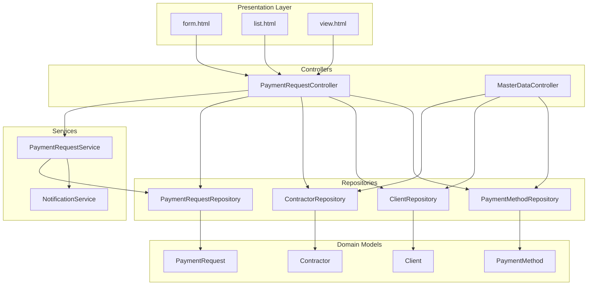
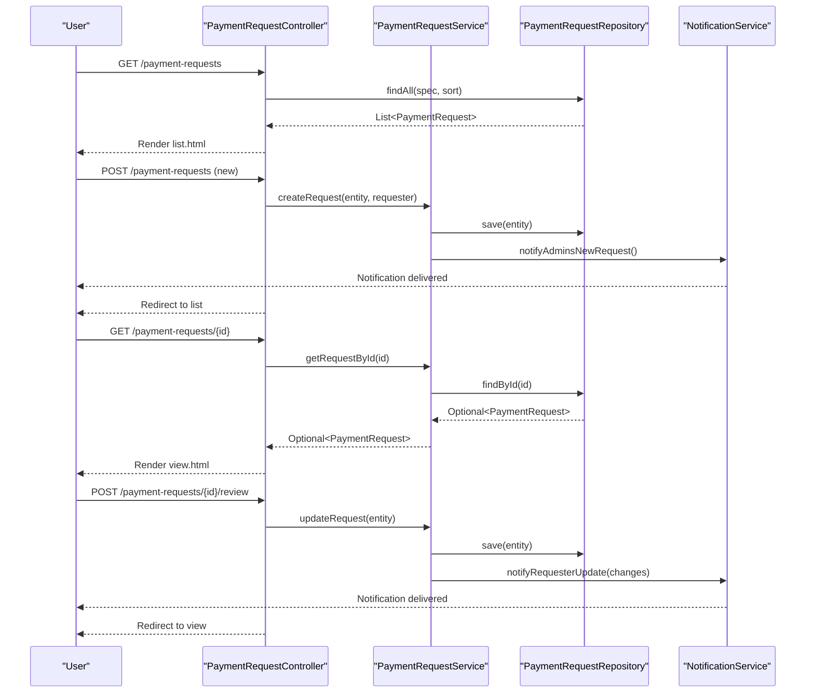
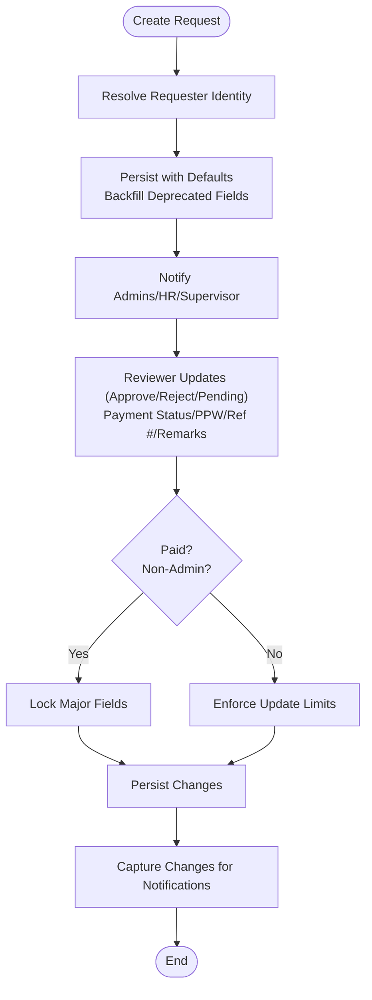
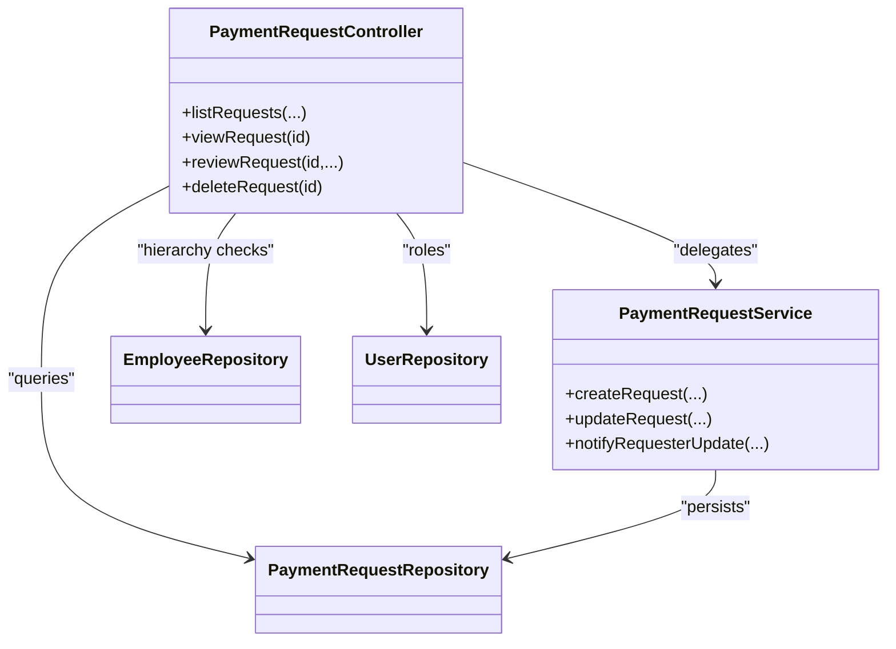
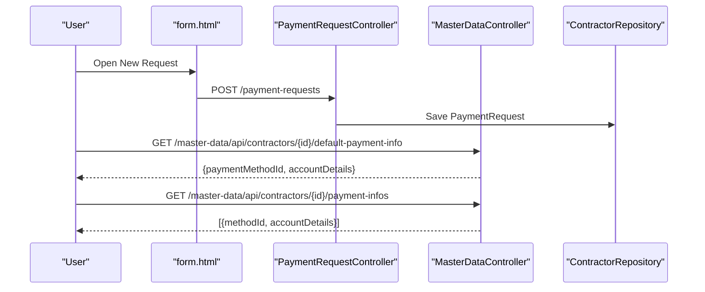
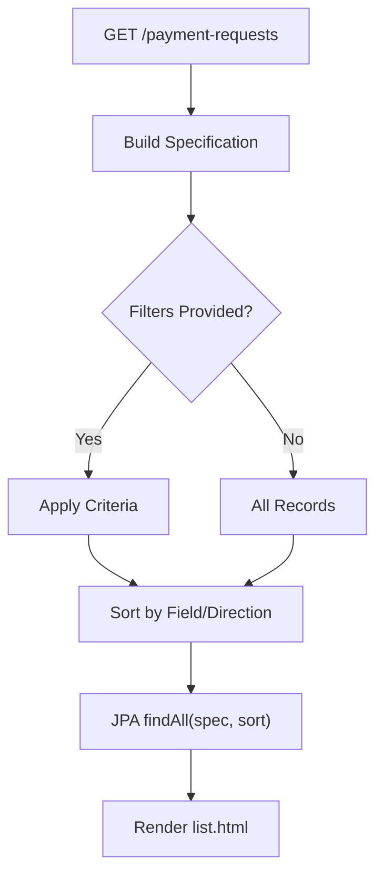
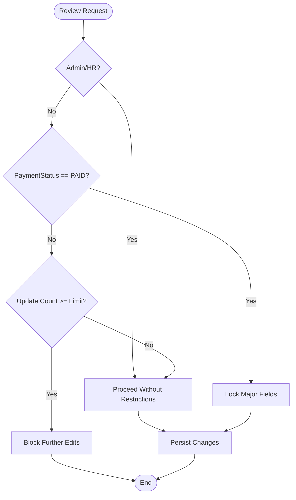
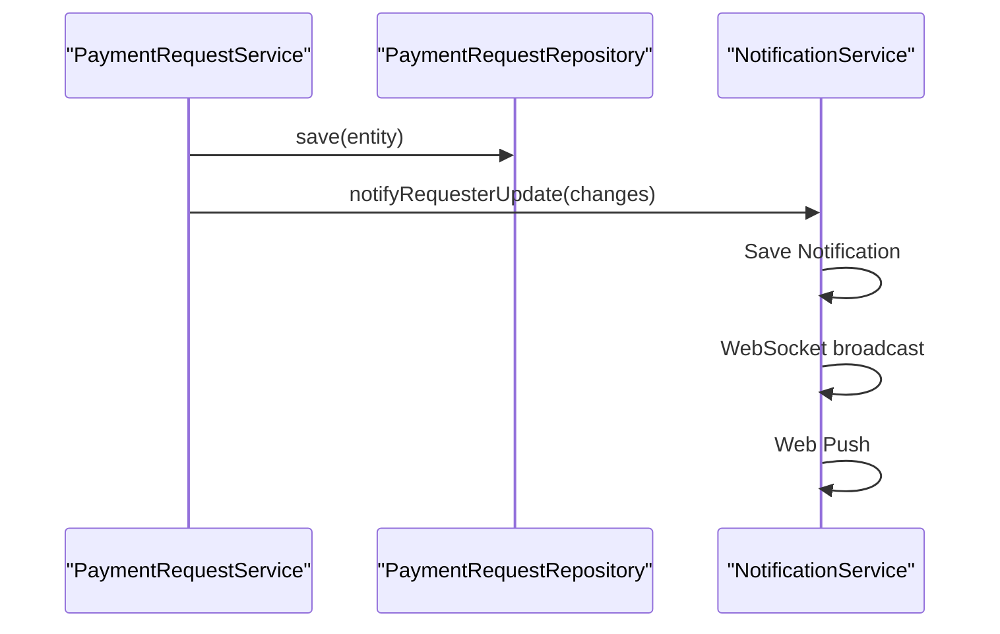
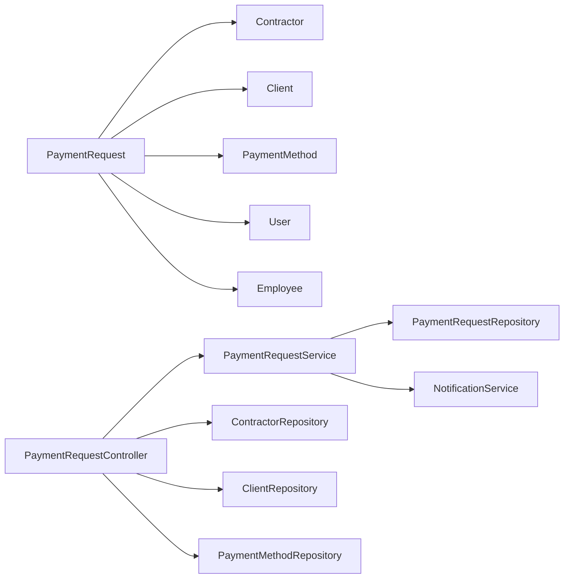

# Payment Request Management

<cite>
**Referenced Files in This Document**
- [PaymentRequestController.java](file://src/main/java/root/cyb/mh/attendancesystem/controller/PaymentRequestController.java)
- [PaymentRequestService.java](file://src/main/java/root/cyb/mh/attendancesystem/service/PaymentRequestService.java)
- [PaymentRequest.java](file://src/main/java/root/cyb/mh/attendancesystem/model/PaymentRequest.java)
- [PaymentRequestRepository.java](file://src/main/java/root/cyb/mh/attendancesystem/repository/PaymentRequestRepository.java)
- [PaymentRequestSpecification.java](file://src/main/java/root/cyb/mh/attendancesystem/specification/PaymentRequestSpecification.java)
- [form.html](file://src/main/resources/templates/payment-request/form.html)
- [list.html](file://src/main/resources/templates/payment-request/list.html)
- [view.html](file://src/main/resources/templates/payment-request/view.html)
- [MasterDataController.java](file://src/main/java/root/cyb/mh/attendancesystem/controller/MasterDataController.java)
- [Contractor.java](file://src/main/java/root/cyb/mh/attendancesystem/model/Contractor.java)
- [Client.java](file://src/main/java/root/cyb/mh/attendancesystem/model/Client.java)
- [PaymentMethod.java](file://src/main/java/root/cyb/mh/attendancesystem/model/PaymentMethod.java)
- [NotificationService.java](file://src/main/java/root/cyb/mh/attendancesystem/service/NotificationService.java)
- [RequestStatus.java](file://src/main/java/root/cyb/mh/attendancesystem/model/enums/RequestStatus.java)
- [PaymentStatus.java](file://src/main/java/root/cyb/mh/attendancesystem/model/enums/PaymentStatus.java)
</cite>

## Table of Contents
1. [Introduction](#introduction)
2. [Project Structure](#project-structure)
3. [Core Components](#core-components)
4. [Architecture Overview](#architecture-overview)
5. [Detailed Component Analysis](#detailed-component-analysis)
6. [Dependency Analysis](#dependency-analysis)
7. [Performance Considerations](#performance-considerations)
8. [Troubleshooting Guide](#troubleshooting-guide)
9. [Conclusion](#conclusion)
10. [Appendices](#appendices)

## Introduction
This document explains the payment request management functionality in the Skylink backend. It covers the complete lifecycle from creation to tracking, including multi-tier approvals with role-based access control (Admin, HR, Supervisors), form validation and master data integration (contractors, clients, payment methods), filtering/sorting/search, bulk operations, security restrictions, update limits, and notification mechanisms. Practical examples illustrate creation, status updates, rejections, and audit trails.

## Project Structure
The payment request feature spans controllers, services, repositories, JPA entities, specifications, and Thymeleaf templates:
- Controllers handle HTTP endpoints for listing, creating, reviewing, exporting, and managing requests.
- Services encapsulate business logic, notifications, and access control checks.
- Repositories provide data access and advanced analytics queries.
- Specifications define dynamic filters for listing and search.
- Templates render forms, lists, and detail views with filtering, sorting, and actions.

**Diagram sources**
- [PaymentRequestController.java:30-688](file://src/main/java/root/cyb/mh/attendancesystem/controller/PaymentRequestController.java#L30-L688)
- [PaymentRequestService.java:14-269](file://src/main/java/root/cyb/mh/attendancesystem/service/PaymentRequestService.java#L14-L269)
- [PaymentRequestRepository.java:10-742](file://src/main/java/root/cyb/mh/attendancesystem/repository/PaymentRequestRepository.java#L10-L742)
- [form.html:1-283](file://src/main/resources/templates/payment-request/form.html#L1-L283)
- [list.html:1-431](file://src/main/resources/templates/payment-request/list.html#L1-L431)
- [view.html:1-425](file://src/main/resources/templates/payment-request/view.html#L1-L425)
- [MasterDataController.java:1-800](file://src/main/java/root/cyb/mh/attendancesystem/controller/MasterDataController.java#L1-L800)
- [PaymentRequest.java:14-117](file://src/main/java/root/cyb/mh/attendancesystem/model/PaymentRequest.java#L14-L117)
- [Contractor.java:6-49](file://src/main/java/root/cyb/mh/attendancesystem/model/Contractor.java#L6-L49)
- [Client.java:6-25](file://src/main/java/root/cyb/mh/attendancesystem/model/Client.java#L6-L25)
- [PaymentMethod.java:6-22](file://src/main/java/root/cyb/mh/attendancesystem/model/PaymentMethod.java#L6-L22)

**Section sources**
- [PaymentRequestController.java:30-688](file://src/main/java/root/cyb/mh/attendancesystem/controller/PaymentRequestController.java#L30-L688)
- [PaymentRequestService.java:14-269](file://src/main/java/root/cyb/mh/attendancesystem/service/PaymentRequestService.java#L14-L269)
- [PaymentRequestRepository.java:10-742](file://src/main/java/root/cyb/mh/attendancesystem/repository/PaymentRequestRepository.java#L10-L742)
- [form.html:1-283](file://src/main/resources/templates/payment-request/form.html#L1-L283)
- [list.html:1-431](file://src/main/resources/templates/payment-request/list.html#L1-L431)
- [view.html:1-425](file://src/main/resources/templates/payment-request/view.html#L1-L425)
- [MasterDataController.java:1-800](file://src/main/java/root/cyb/mh/attendancesystem/controller/MasterDataController.java#L1-L800)

## Core Components
- PaymentRequest entity captures requester identity, contractor/client/method associations, amounts, priorities, reasons, review fields, approvals, PPW status, internal notes, email tracking, and optional payment proof path.
- PaymentRequestController orchestrates listing, filtering/sorting, creation, viewing, review decisions, deletion of rejected requests, invoice generation, email sending, and proof viewing.
- PaymentRequestService handles creation, persistence, notifications, and access-controlled retrieval for team and supervisors.
- PaymentRequestRepository provides CRUD, analytics, and advanced queries for dashboards and reporting.
- PaymentRequestSpecification defines dynamic filters for date range, contractor, client, payment method, work order number, requester name, priority, approval status, payment status, and PPW status.
- Thymeleaf templates provide the UI for creating, listing, and reviewing requests with search, export, and action controls.

**Section sources**
- [PaymentRequest.java:14-117](file://src/main/java/root/cyb/mh/attendancesystem/model/PaymentRequest.java#L14-L117)
- [PaymentRequestController.java:65-688](file://src/main/java/root/cyb/mh/attendancesystem/controller/PaymentRequestController.java#L65-L688)
- [PaymentRequestService.java:29-269](file://src/main/java/root/cyb/mh/attendancesystem/service/PaymentRequestService.java#L29-L269)
- [PaymentRequestRepository.java:10-742](file://src/main/java/root/cyb/mh/attendancesystem/repository/PaymentRequestRepository.java#L10-L742)
- [PaymentRequestSpecification.java:14-93](file://src/main/java/root/cyb/mh/attendancesystem/specification/PaymentRequestSpecification.java#L14-L93)
- [form.html:27-156](file://src/main/resources/templates/payment-request/form.html#L27-L156)
- [list.html:35-420](file://src/main/resources/templates/payment-request/list.html#L35-L420)
- [view.html:168-405](file://src/main/resources/templates/payment-request/view.html#L168-L405)

## Architecture Overview
The system follows layered architecture with clear separation of concerns:
- Presentation: Thymeleaf templates render forms and lists.
- Controllers: Handle HTTP requests, enforce security, apply filters, and delegate to services.
- Services: Encapsulate business logic, notifications, and access checks.
- Persistence: JPA repositories and specifications manage data access and dynamic queries.
- Notifications: WebSocket and web push deliver real-time alerts.

**Diagram sources**
- [PaymentRequestController.java:65-517](file://src/main/java/root/cyb/mh/attendancesystem/controller/PaymentRequestController.java#L65-L517)
- [PaymentRequestService.java:29-204](file://src/main/java/root/cyb/mh/attendancesystem/service/PaymentRequestService.java#L29-L204)
- [PaymentRequestRepository.java:10-90](file://src/main/java/root/cyb/mh/attendancesystem/repository/PaymentRequestRepository.java#L10-L90)
- [NotificationService.java:22-44](file://src/main/java/root/cyb/mh/attendancesystem/service/NotificationService.java#L22-L44)

**Section sources**
- [PaymentRequestController.java:65-517](file://src/main/java/root/cyb/mh/attendancesystem/controller/PaymentRequestController.java#L65-L517)
- [PaymentRequestService.java:29-204](file://src/main/java/root/cyb/mh/attendancesystem/service/PaymentRequestService.java#L29-L204)
- [NotificationService.java:22-44](file://src/main/java/root/cyb/mh/attendancesystem/service/NotificationService.java#L22-L44)

## Detailed Component Analysis

### Payment Request Lifecycle
- Creation: Users submit a new request via the form template. The controller resolves requester identity (user or employee) and delegates to the service to persist with defaults and backfilled fields.
- Submission: On successful save, administrators and HR receive notifications; supervisors of the requester are also notified.
- Review: Authorized reviewers (Admin/HR or Supervisor) update approval status, payment status, PPW status, check info, reference number, and internal remarks. Restrictions prevent unauthorized changes to paid records and enforce update limits for non-admin users.
- Tracking: Users can view status, reviewer notes, and email history; Admins can delete rejected requests; supervisors can export filtered lists.

**Diagram sources**
- [PaymentRequestController.java:260-517](file://src/main/java/root/cyb/mh/attendancesystem/controller/PaymentRequestController.java#L260-L517)
- [PaymentRequestService.java:29-204](file://src/main/java/root/cyb/mh/attendancesystem/service/PaymentRequestService.java#L29-L204)
- [PaymentRequest.java:44-117](file://src/main/java/root/cyb/mh/attendancesystem/model/PaymentRequest.java#L44-L117)

**Section sources**
- [PaymentRequestController.java:260-517](file://src/main/java/root/cyb/mh/attendancesystem/controller/PaymentRequestController.java#L260-L517)
- [PaymentRequestService.java:29-204](file://src/main/java/root/cyb/mh/attendancesystem/service/PaymentRequestService.java#L29-L204)
- [PaymentRequest.java:44-117](file://src/main/java/root/cyb/mh/attendancesystem/model/PaymentRequest.java#L44-L117)

### Multi-Tier Approval Workflow and Role-Based Access Control
- Roles: Admin, HR, Supervisor (via employee hierarchy), and requester.
- Access checks:
  - Listing: Self/team visibility for non-admin users; all requests for Admin/HR.
  - Viewing: Admin/HR and supervisors of the requester can review; others see read-only status.
  - Deletion: Only Admin can delete rejected requests.
  - Review restrictions: Paid records locked for non-admins; update limits enforced for HR/supervisors.
- Supervisor determination: Based on requester’s manager or assistant relationship.

**Diagram sources**
- [PaymentRequestController.java:65-537](file://src/main/java/root/cyb/mh/attendancesystem/controller/PaymentRequestController.java#L65-L537)
- [PaymentRequestService.java:29-90](file://src/main/java/root/cyb/mh/attendancesystem/service/PaymentRequestService.java#L29-L90)
- [PaymentRequestRepository.java:10-30](file://src/main/java/root/cyb/mh/attendancesystem/repository/PaymentRequestRepository.java#L10-L30)

**Section sources**
- [PaymentRequestController.java:87-537](file://src/main/java/root/cyb/mh/attendancesystem/controller/PaymentRequestController.java#L87-L537)
- [PaymentRequestService.java:92-204](file://src/main/java/root/cyb/mh/attendancesystem/service/PaymentRequestService.java#L92-L204)

### Request Form Validation and Master Data Integration
- Validation: Required fields include company, work order number, amount, contractor, payment method/account details, and reason.
- Master data integration:
  - Active contractors, clients, and payment methods populate dropdowns.
  - Searchable dropdowns enable quick selection.
  - Default payment method and account details auto-populate per contractor via AJAX endpoints exposed by MasterDataController.
- Deprecated fields backfill ensures DB compatibility.

**Diagram sources**
- [form.html:27-156](file://src/main/resources/templates/payment-request/form.html#L27-L156)
- [PaymentRequestController.java:260-281](file://src/main/java/root/cyb/mh/attendancesystem/controller/PaymentRequestController.java#L260-L281)
- [MasterDataController.java:677-751](file://src/main/java/root/cyb/mh/attendancesystem/controller/MasterDataController.java#L677-L751)
- [Contractor.java:30-31](file://src/main/java/root/cyb/mh/attendancesystem/model/Contractor.java#L30-L31)

**Section sources**
- [form.html:27-156](file://src/main/resources/templates/payment-request/form.html#L27-L156)
- [MasterDataController.java:677-751](file://src/main/java/root/cyb/mh/attendancesystem/controller/MasterDataController.java#L677-L751)
- [Contractor.java:30-31](file://src/main/java/root/cyb/mh/attendancesystem/model/Contractor.java#L30-L31)

### Filtering, Sorting, Search, and Bulk Operations
- Filtering: Date range, contractor, client, payment method, work order number, requester name, priority, approval status, payment status, PPW status.
- Sorting: Supports multiple fields with ascending/descending direction.
- Search: Free-text search on requester name across user and employee.
- Bulk operations: Export to CSV/PDF with selected columns; delete rejected requests (Admin only).

**Diagram sources**
- [PaymentRequestController.java:65-147](file://src/main/java/root/cyb/mh/attendancesystem/controller/PaymentRequestController.java#L65-L147)
- [PaymentRequestSpecification.java:16-93](file://src/main/java/root/cyb/mh/attendancesystem/specification/PaymentRequestSpecification.java#L16-L93)
- [list.html:35-134](file://src/main/resources/templates/payment-request/list.html#L35-L134)

**Section sources**
- [PaymentRequestController.java:65-194](file://src/main/java/root/cyb/mh/attendancesystem/controller/PaymentRequestController.java#L65-L194)
- [PaymentRequestSpecification.java:16-93](file://src/main/java/root/cyb/mh/attendancesystem/specification/PaymentRequestSpecification.java#L16-L93)
- [list.html:35-134](file://src/main/resources/templates/payment-request/list.html#L35-L134)

### Security Restrictions and Update Limits
- Paid record protection: Non-admins cannot change status, payment status, or reference number on PAID requests.
- Update limits: Non-admin reviewers are limited to a configurable number of updates; exceeding the limit prevents further edits.
- Access enforcement: Controllers validate roles and supervisor hierarchy before allowing review actions.

**Diagram sources**
- [PaymentRequestController.java:385-426](file://src/main/java/root/cyb/mh/attendancesystem/controller/PaymentRequestController.java#L385-L426)

**Section sources**
- [PaymentRequestController.java:385-426](file://src/main/java/root/cyb/mh/attendancesystem/controller/PaymentRequestController.java#L385-L426)

### Notification Mechanisms and Audit Trails
- Notifications: Real-time via WebSocket and web push; stored in DB with read/unread state.
- Triggers: New request, status changes, payment status changes, and manual reviewer updates.
- Audit trail: Change detection captures modified fields and notifies the requester accordingly.

**Diagram sources**
- [PaymentRequestService.java:164-204](file://src/main/java/root/cyb/mh/attendancesystem/service/PaymentRequestService.java#L164-L204)
- [NotificationService.java:22-44](file://src/main/java/root/cyb/mh/attendancesystem/service/NotificationService.java#L22-L44)

**Section sources**
- [PaymentRequestService.java:127-204](file://src/main/java/root/cyb/mh/attendancesystem/service/PaymentRequestService.java#L127-L204)
- [NotificationService.java:22-44](file://src/main/java/root/cyb/mh/attendancesystem/service/NotificationService.java#L22-L44)

### Practical Examples
- Creating a payment request:
  - Navigate to New Request, fill contractor, client, amount, method, and reason, then submit.
  - Admins/HR receive notifications; supervisor receives notification if applicable.
- Approving a request:
  - Supervisor/Admin reviews, selects APPROVED, sets payment status to PROCESSING/PAID, adds reference number and remarks, attaches proof if needed.
- Rejecting a request:
  - Supervisor/Admin selects REJECTED; requester receives notification; Admin can later delete rejected request.
- Viewing and exporting:
  - Use list filters and sorting; export to CSV/PDF with selected columns.

**Section sources**
- [form.html:27-156](file://src/main/resources/templates/payment-request/form.html#L27-L156)
- [view.html:168-281](file://src/main/resources/templates/payment-request/view.html#L168-L281)
- [list.html:35-248](file://src/main/resources/templates/payment-request/list.html#L35-L248)
- [PaymentRequestController.java:260-537](file://src/main/java/root/cyb/mh/attendancesystem/controller/PaymentRequestController.java#L260-L537)

## Dependency Analysis
- Controllers depend on services and repositories; services depend on repositories and notification service.
- Entities maintain relationships with contractors, clients, payment methods, and users/employees.
- Specifications encapsulate filter logic, enabling reuse across controllers.

**Diagram sources**
- [PaymentRequest.java:33-73](file://src/main/java/root/cyb/mh/attendancesystem/model/PaymentRequest.java#L33-L73)
- [Contractor.java:23-31](file://src/main/java/root/cyb/mh/attendancesystem/model/Contractor.java#L23-L31)
- [Client.java:10-24](file://src/main/java/root/cyb/mh/attendancesystem/model/Client.java#L10-L24)
- [PaymentMethod.java:10-22](file://src/main/java/root/cyb/mh/attendancesystem/model/PaymentMethod.java#L10-L22)
- [PaymentRequestController.java:34-64](file://src/main/java/root/cyb/mh/attendancesystem/controller/PaymentRequestController.java#L34-L64)
- [PaymentRequestService.java:17-27](file://src/main/java/root/cyb/mh/attendancesystem/service/PaymentRequestService.java#L17-L27)
- [NotificationService.java:13-21](file://src/main/java/root/cyb/mh/attendancesystem/service/NotificationService.java#L13-L21)

**Section sources**
- [PaymentRequest.java:33-73](file://src/main/java/root/cyb/mh/attendancesystem/model/PaymentRequest.java#L33-L73)
- [PaymentRequestController.java:34-64](file://src/main/java/root/cyb/mh/attendancesystem/controller/PaymentRequestController.java#L34-L64)
- [PaymentRequestService.java:17-27](file://src/main/java/root/cyb/mh/attendancesystem/service/PaymentRequestService.java#L17-L27)

## Performance Considerations
- Prefer server-side pagination and sorting to avoid large result sets.
- Use JPA Specifications to build targeted queries; avoid N+1 by eager joins where appropriate.
- Leverage repository analytics methods for dashboards to minimize application-side aggregation.
- Store uploaded proof files outside the database if size grows; current implementation stores absolute paths.

## Troubleshooting Guide
- Access denied errors:
  - Ensure user has required roles (Admin/HR) or is supervisor of the requester.
  - Verify supervisor hierarchy checks when accessing review pages.
- Locked status on paid requests:
  - Non-admin users cannot edit status, payment status, or reference number on PAID requests.
- Update limit reached:
  - Review update count increments when allowed fields change; exceeds configured limit blocks further edits.
- Export issues:
  - Confirm filters and column selections; ensure CSV/PDF endpoints receive proper parameters.
- Notification delivery failures:
  - WebSocket and web push are logged separately; check logs for push failures while DB storage persists.

**Section sources**
- [PaymentRequestController.java:385-517](file://src/main/java/root/cyb/mh/attendancesystem/controller/PaymentRequestController.java#L385-L517)
- [NotificationService.java:38-43](file://src/main/java/root/cyb/mh/attendancesystem/service/NotificationService.java#L38-L43)

## Conclusion
The payment request management system provides a robust, role-aware workflow with strong master data integration, flexible filtering/sorting, and comprehensive notifications. Security constraints and update limits protect data integrity, while audit-friendly change tracking keeps stakeholders informed throughout the lifecycle.

## Appendices

### Enumerations
- RequestStatus: PENDING, APPROVED, REJECTED
- PaymentStatus: PAID, UNPAID, ISSUE, CASH_APP_REQUESTED

**Section sources**
- [RequestStatus.java:3-7](file://src/main/java/root/cyb/mh/attendancesystem/model/enums/RequestStatus.java#L3-L7)
- [PaymentStatus.java:3-8](file://src/main/java/root/cyb/mh/attendancesystem/model/enums/PaymentStatus.java#L3-L8)