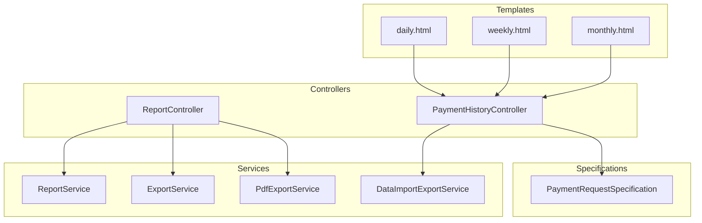
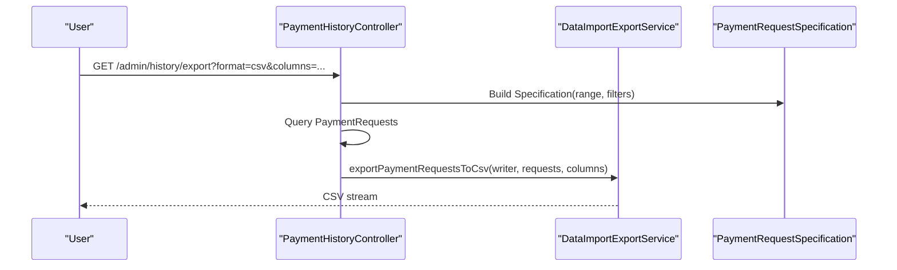
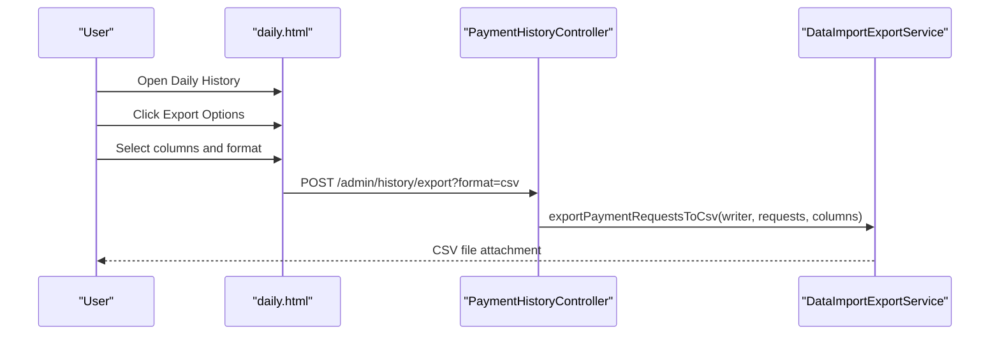
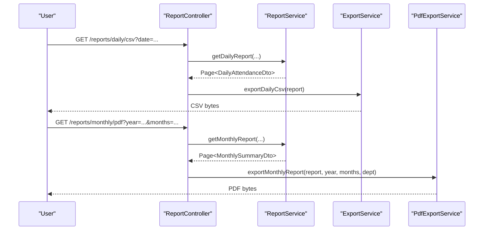
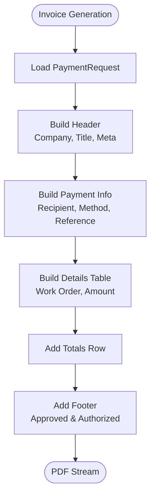
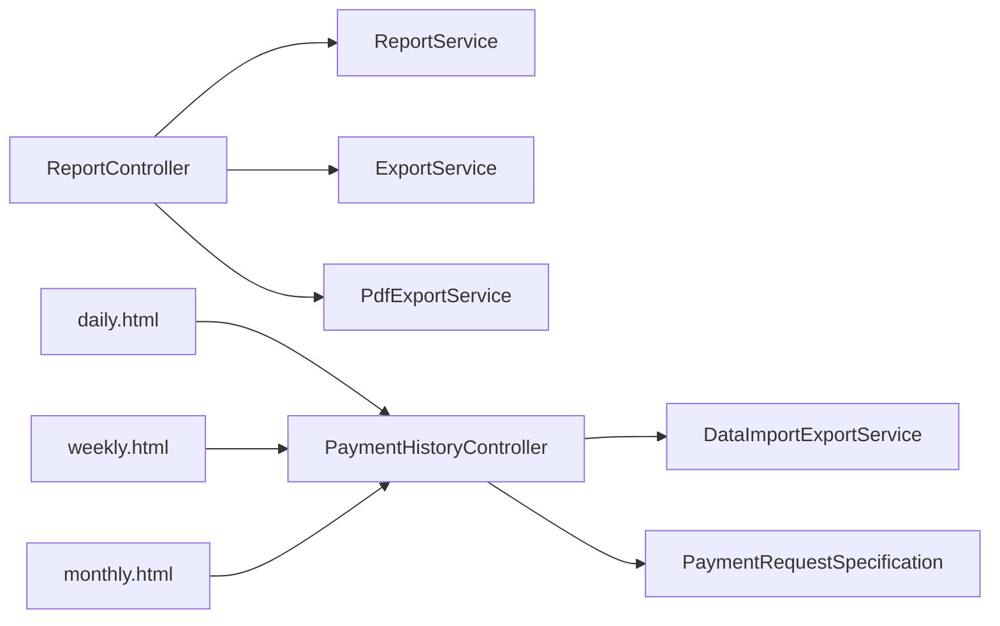

# Reporting and Export

<cite>
**Referenced Files in This Document**
- [ReportController.java](file://src/main/java/root/cyb/mh/attendancesystem/controller/ReportController.java)
- [ReportService.java](file://src/main/java/root/cyb/mh/attendancesystem/service/ReportService.java)
- [ExportService.java](file://src/main/java/root/cyb/mh/attendancesystem/service/ExportService.java)
- [PdfExportService.java](file://src/main/java/root/cyb/mh/attendancesystem/service/PdfExportService.java)
- [PaymentHistoryController.java](file://src/main/java/root/cyb/mh/attendancesystem/controller/PaymentHistoryController.java)
- [DataImportExportService.java](file://src/main/java/root/cyb/mh/attendancesystem/service/DataImportExportService.java)
- [PaymentRequestSpecification.java](file://src/main/java/root/cyb/mh/attendancesystem/specification/PaymentRequestSpecification.java)
- [daily.html](file://src/main/resources/templates/admin/history/daily.html)
- [weekly.html](file://src/main/resources/templates/admin/history/weekly.html)
- [monthly.html](file://src/main/resources/templates/admin/history/monthly.html)
</cite>

## Table of Contents
1. [Introduction](#introduction)
2. [Project Structure](#project-structure)
3. [Core Components](#core-components)
4. [Architecture Overview](#architecture-overview)
5. [Detailed Component Analysis](#detailed-component-analysis)
6. [Dependency Analysis](#dependency-analysis)
7. [Performance Considerations](#performance-considerations)
8. [Troubleshooting Guide](#troubleshooting-guide)
9. [Conclusion](#conclusion)

## Introduction
This document explains the reporting and export capabilities for payments and attendance within the backend system. It covers:
- Export formats (CSV and PDF) for daily, weekly, monthly, and range-based reports
- Column selection options and data filtering for exports
- Payment history reporting and invoice generation
- Batch processing and automation hooks
- Integration points with external accounting systems
- Performance considerations for large datasets

## Project Structure
The reporting and export features span controllers, services, specifications, and Thymeleaf templates:
- Controllers expose endpoints for report generation and export
- Services implement data retrieval, transformation, and export logic
- Specifications define filters for payment history queries
- Templates render UI filters and export modal options

**Diagram sources**
- [ReportController.java:1-754](file://src/main/java/root/cyb/mh/attendancesystem/controller/ReportController.java#L1-L754)
- [ReportService.java:1-800](file://src/main/java/root/cyb/mh/attendancesystem/service/ReportService.java#L1-L800)
- [ExportService.java:1-579](file://src/main/java/root/cyb/mh/attendancesystem/service/ExportService.java#L1-L579)
- [PdfExportService.java:1-485](file://src/main/java/root/cyb/mh/attendancesystem/service/PdfExportService.java#L1-L485)
- [PaymentHistoryController.java:1-265](file://src/main/java/root/cyb/mh/attendancesystem/controller/PaymentHistoryController.java#L1-L265)
- [DataImportExportService.java:1-925](file://src/main/java/root/cyb/mh/attendancesystem/service/DataImportExportService.java#L1-L925)
- [PaymentRequestSpecification.java:1-93](file://src/main/java/root/cyb/mh/attendancesystem/specification/PaymentRequestSpecification.java#L1-L93)
- [daily.html:1-299](file://src/main/resources/templates/admin/history/daily.html#L1-L299)
- [weekly.html:1-309](file://src/main/resources/templates/admin/history/weekly.html#L1-L309)
- [monthly.html:1-309](file://src/main/resources/templates/admin/history/monthly.html#L1-L309)

**Section sources**
- [ReportController.java:1-754](file://src/main/java/root/cyb/mh/attendancesystem/controller/ReportController.java#L1-L754)
- [PaymentHistoryController.java:1-265](file://src/main/java/root/cyb/mh/attendancesystem/controller/PaymentHistoryController.java#L1-L265)

## Core Components
- ReportController: Exposes endpoints for daily, weekly, monthly, and employee-specific reports; provides export endpoints for CSV and PDF.
- ReportService: Builds attendance-based DTOs, applies filters, and paginates results.
- ExportService: Generates CSV and Excel exports for daily, weekly, monthly, and employee detail reports.
- PdfExportService: Produces PDFs for daily, weekly, monthly, and individual monthly attendance reports; also generates official payslips.
- PaymentHistoryController: Renders payment history pages and exposes export endpoints for CSV/PDF with column selection and filters.
- DataImportExportService: Implements payment history export to CSV/PDF, invoice generation, and import utilities.
- PaymentRequestSpecification: Encapsulates JPA criteria for filtering payment requests by date range, contractor, client, payment method, work order, requester, priorities, statuses, and PPW update status.

**Section sources**
- [ReportController.java:23-754](file://src/main/java/root/cyb/mh/attendancesystem/controller/ReportController.java#L23-L754)
- [ReportService.java:47-800](file://src/main/java/root/cyb/mh/attendancesystem/service/ReportService.java#L47-L800)
- [ExportService.java:27-579](file://src/main/java/root/cyb/mh/attendancesystem/service/ExportService.java#L27-L579)
- [PdfExportService.java:34-485](file://src/main/java/root/cyb/mh/attendancesystem/service/PdfExportService.java#L34-L485)
- [PaymentHistoryController.java:39-102](file://src/main/java/root/cyb/mh/attendancesystem/controller/PaymentHistoryController.java#L39-L102)
- [DataImportExportService.java:214-406](file://src/main/java/root/cyb/mh/attendancesystem/service/DataImportExportService.java#L214-L406)
- [PaymentRequestSpecification.java:16-91](file://src/main/java/root/cyb/mh/attendancesystem/specification/PaymentRequestSpecification.java#L16-L91)

## Architecture Overview
The system separates concerns across controllers, services, and templates:
- Controllers orchestrate request handling and delegate to services for data retrieval and export.
- Services encapsulate business logic for report generation and export formatting.
- Templates provide UI filters and export modal options for column selection and format choice.

**Diagram sources**
- [PaymentHistoryController.java:39-102](file://src/main/java/root/cyb/mh/attendancesystem/controller/PaymentHistoryController.java#L39-L102)
- [DataImportExportService.java:234-257](file://src/main/java/root/cyb/mh/attendancesystem/service/DataImportExportService.java#L234-L257)
- [PaymentRequestSpecification.java:16-91](file://src/main/java/root/cyb/mh/attendancesystem/specification/PaymentRequestSpecification.java#L16-L91)

## Detailed Component Analysis

### Payment History Reporting and Export
- UI-driven export: The payment history pages include an export modal allowing users to select columns and choose CSV or PDF.
- Endpoint behavior: The export endpoint accepts format, column selections, and date range/filters, then streams the appropriate file.
- Column selection: The export supports selecting subsets of available columns (e.g., date, requester, work order, amount, contractor, method, client, priority, approval authority, reason, status, payment status, PPW update, reference number, internal notes).
- Filtering: The export leverages a specification that supports date range, contractor, client, payment method, work order number, requester name, priority, approval status, payment status, and PPW update status.

**Diagram sources**
- [daily.html:158-246](file://src/main/resources/templates/admin/history/daily.html#L158-L246)
- [PaymentHistoryController.java:39-102](file://src/main/java/root/cyb/mh/attendancesystem/controller/PaymentHistoryController.java#L39-L102)
- [DataImportExportService.java:234-257](file://src/main/java/root/cyb/mh/attendancesystem/service/DataImportExportService.java#L234-L257)

**Section sources**
- [daily.html:158-246](file://src/main/resources/templates/admin/history/daily.html#L158-L246)
- [weekly.html:166-254](file://src/main/resources/templates/admin/history/weekly.html#L166-L254)
- [monthly.html:167-255](file://src/main/resources/templates/admin/history/monthly.html#L167-L255)
- [PaymentHistoryController.java:39-102](file://src/main/java/root/cyb/mh/attendancesystem/controller/PaymentHistoryController.java#L39-L102)
- [DataImportExportService.java:214-406](file://src/main/java/root/cyb/mh/attendancesystem/service/DataImportExportService.java#L214-L406)
- [PaymentRequestSpecification.java:16-91](file://src/main/java/root/cyb/mh/attendancesystem/specification/PaymentRequestSpecification.java#L16-L91)

### Attendance Reports and Exports
- ReportController exposes endpoints for daily, weekly, monthly, and employee-specific reports.
- Export endpoints support CSV and PDF downloads for each report type.
- ExportService and PdfExportService implement formatting for Excel and PDF respectively.

**Diagram sources**
- [ReportController.java:328-425](file://src/main/java/root/cyb/mh/attendancesystem/controller/ReportController.java#L328-L425)
- [ReportService.java:47-100](file://src/main/java/root/cyb/mh/attendancesystem/service/ReportService.java#L47-L100)
- [ExportService.java:27-91](file://src/main/java/root/cyb/mh/attendancesystem/service/ExportService.java#L27-L91)
- [PdfExportService.java:34-209](file://src/main/java/root/cyb/mh/attendancesystem/service/PdfExportService.java#L34-L209)

**Section sources**
- [ReportController.java:328-754](file://src/main/java/root/cyb/mh/attendancesystem/controller/ReportController.java#L328-L754)
- [ReportService.java:47-800](file://src/main/java/root/cyb/mh/attendancesystem/service/ReportService.java#L47-L800)
- [ExportService.java:27-579](file://src/main/java/root/cyb/mh/attendancesystem/service/ExportService.java#L27-L579)
- [PdfExportService.java:34-485](file://src/main/java/root/cyb/mh/attendancesystem/service/PdfExportService.java#L34-L485)

### Invoice Generation
- DataImportExportService includes a dedicated method to generate an invoice PDF for a single payment request, including company metadata, recipient, payment method/reference, and totals.
- The invoice follows a structured layout with headers, payment details, and a footer.

**Diagram sources**
- [DataImportExportService.java:407-674](file://src/main/java/root/cyb/mh/attendancesystem/service/DataImportExportService.java#L407-L674)

**Section sources**
- [DataImportExportService.java:407-674](file://src/main/java/root/cyb/mh/attendancesystem/service/DataImportExportService.java#L407-L674)

### Column Selection and Data Filtering
- Column selection: The export modal allows choosing which columns to include in CSV/PDF exports.
- Data filtering: The payment history export endpoint accepts numerous filter parameters (contractor, client, payment method, work order number, requester name, priority, approval status, payment status, PPW update status) and applies them via a specification.

**Section sources**
- [daily.html:166-242](file://src/main/resources/templates/admin/history/daily.html#L166-L242)
- [weekly.html:175-251](file://src/main/resources/templates/admin/history/weekly.html#L175-L251)
- [monthly.html:176-252](file://src/main/resources/templates/admin/history/monthly.html#L176-L252)
- [PaymentHistoryController.java:39-102](file://src/main/java/root/cyb/mh/attendancesystem/controller/PaymentHistoryController.java#L39-L102)
- [PaymentRequestSpecification.java:16-91](file://src/main/java/root/cyb/mh/attendancesystem/specification/PaymentRequestSpecification.java#L16-L91)

### Batch Processing and Automation
- Batch-style exports: The payment history export endpoint can process large sets by streaming CSV/PDF directly to the response.
- Automated workflows: While the UI provides export modals, the underlying endpoints can be invoked programmatically to integrate with external systems or scheduled jobs.

**Section sources**
- [PaymentHistoryController.java:39-102](file://src/main/java/root/cyb/mh/attendancesystem/controller/PaymentHistoryController.java#L39-L102)
- [DataImportExportService.java:234-318](file://src/main/java/root/cyb/mh/attendancesystem/service/DataImportExportService.java#L234-L318)

## Dependency Analysis
The following diagram highlights key dependencies among components involved in reporting and export:

**Diagram sources**
- [ReportController.java:1-754](file://src/main/java/root/cyb/mh/attendancesystem/controller/ReportController.java#L1-L754)
- [ReportService.java:1-800](file://src/main/java/root/cyb/mh/attendancesystem/service/ReportService.java#L1-L800)
- [ExportService.java:1-579](file://src/main/java/root/cyb/mh/attendancesystem/service/ExportService.java#L1-L579)
- [PdfExportService.java:1-485](file://src/main/java/root/cyb/mh/attendancesystem/service/PdfExportService.java#L1-L485)
- [PaymentHistoryController.java:1-265](file://src/main/java/root/cyb/mh/attendancesystem/controller/PaymentHistoryController.java#L1-L265)
- [DataImportExportService.java:1-925](file://src/main/java/root/cyb/mh/attendancesystem/service/DataImportExportService.java#L1-L925)
- [PaymentRequestSpecification.java:1-93](file://src/main/java/root/cyb/mh/attendancesystem/specification/PaymentRequestSpecification.java#L1-L93)
- [daily.html:1-299](file://src/main/resources/templates/admin/history/daily.html#L1-L299)
- [weekly.html:1-309](file://src/main/resources/templates/admin/history/weekly.html#L1-L309)
- [monthly.html:1-309](file://src/main/resources/templates/admin/history/monthly.html#L1-L309)

**Section sources**
- [ReportController.java:1-754](file://src/main/java/root/cyb/mh/attendancesystem/controller/ReportController.java#L1-L754)
- [PaymentHistoryController.java:1-265](file://src/main/java/root/cyb/mh/attendancesystem/controller/PaymentHistoryController.java#L1-L265)

## Performance Considerations
- Pagination: Report endpoints use pagination to limit memory usage when exporting large datasets.
- Streaming: CSV/PDF exports are streamed directly to the response to avoid loading entire datasets into memory.
- Filtering: Payment history export applies database-side filtering via specifications to reduce result sizes.
- Export size limits: The report endpoints cap the page size for exports to prevent excessive resource consumption.

Recommendations:
- Prefer date-range filters to constrain result sets.
- Use column selection to minimize payload size for CSV exports.
- For very large exports, consider chunked processing or background jobs with progress tracking.

**Section sources**
- [ReportController.java:328-425](file://src/main/java/root/cyb/mh/attendancesystem/controller/ReportController.java#L328-L425)
- [ReportService.java:47-100](file://src/main/java/root/cyb/mh/attendancesystem/service/ReportService.java#L47-L100)
- [DataImportExportService.java:234-318](file://src/main/java/root/cyb/mh/attendancesystem/service/DataImportExportService.java#L234-L318)

## Troubleshooting Guide
Common issues and resolutions:
- Empty or unexpected export results:
  - Verify date range and filters applied in the export modal.
  - Confirm that the selected columns include required fields.
- Export errors:
  - Ensure the export endpoint receives valid parameters (format, columns).
  - Check server logs for exceptions thrown during CSV/PDF generation.
- Large dataset performance:
  - Narrow the date range or apply additional filters.
  - Reduce the number of selected columns to decrease payload size.

**Section sources**
- [daily.html:158-246](file://src/main/resources/templates/admin/history/daily.html#L158-L246)
- [weekly.html:166-254](file://src/main/resources/templates/admin/history/weekly.html#L166-L254)
- [monthly.html:167-255](file://src/main/resources/templates/admin/history/monthly.html#L167-L255)
- [PaymentHistoryController.java:39-102](file://src/main/java/root/cyb/mh/attendancesystem/controller/PaymentHistoryController.java#L39-L102)
- [DataImportExportService.java:234-318](file://src/main/java/root/cyb/mh/attendancesystem/service/DataImportExportService.java#L234-L318)

## Conclusion
The system provides robust reporting and export capabilities for both attendance and payment history. Users can filter and customize exports, while services handle efficient data retrieval and formatting for CSV and PDF. Integration with external accounting systems is supported through standardized CSV exports and invoice PDF generation. For large datasets, pagination and streaming help maintain performance.