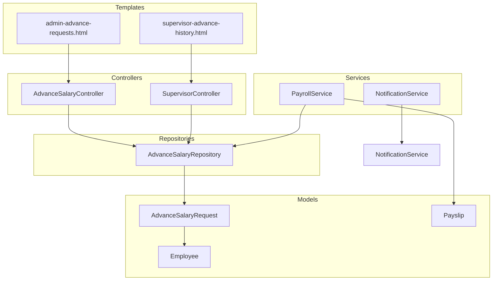
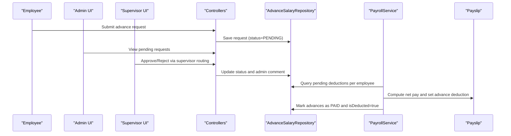
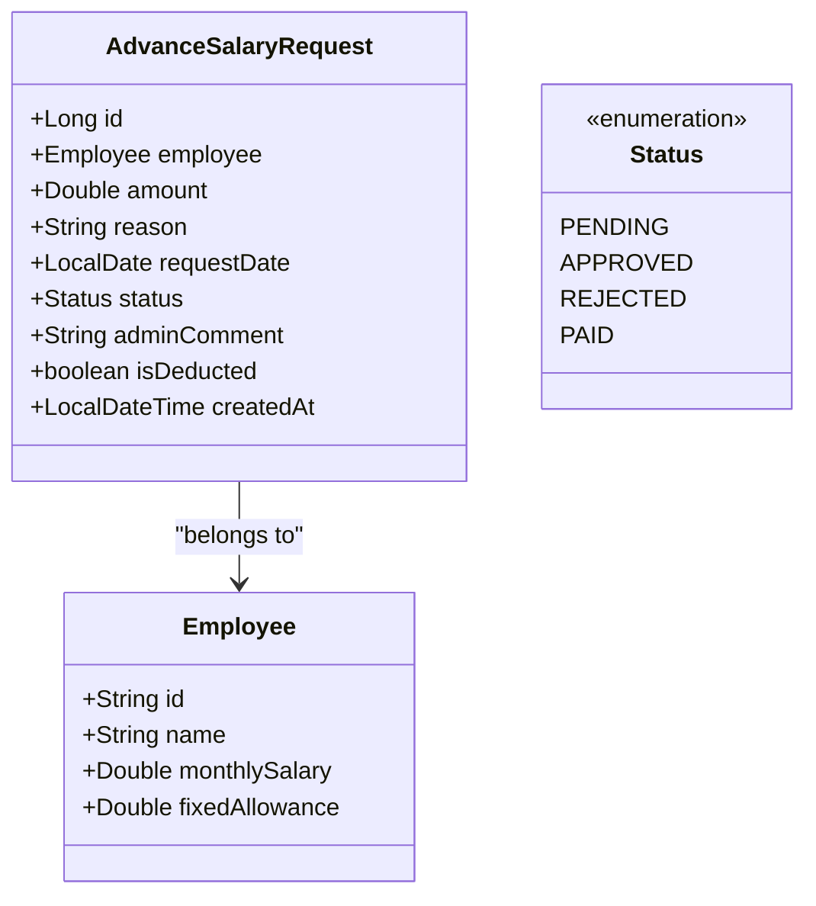
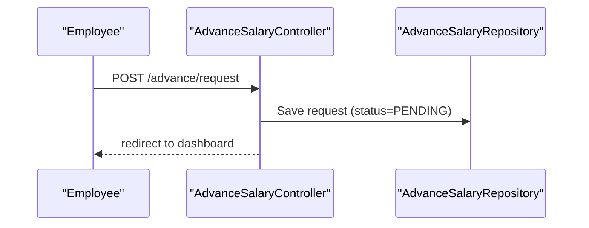
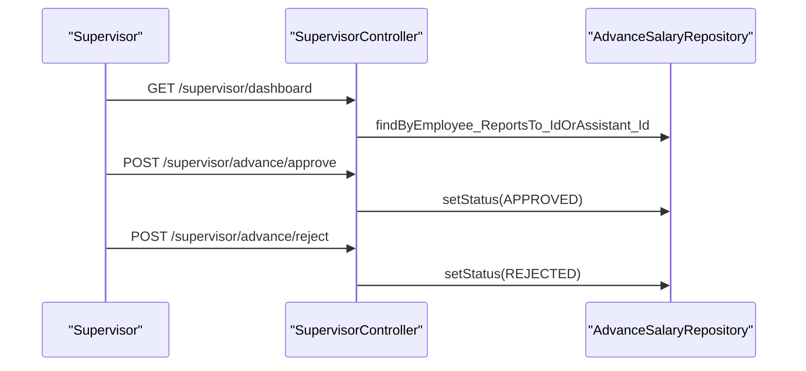
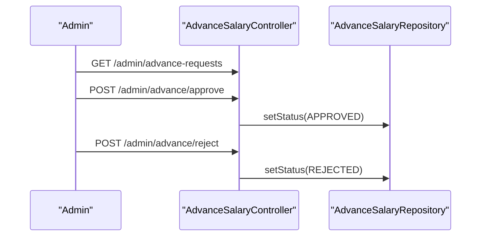
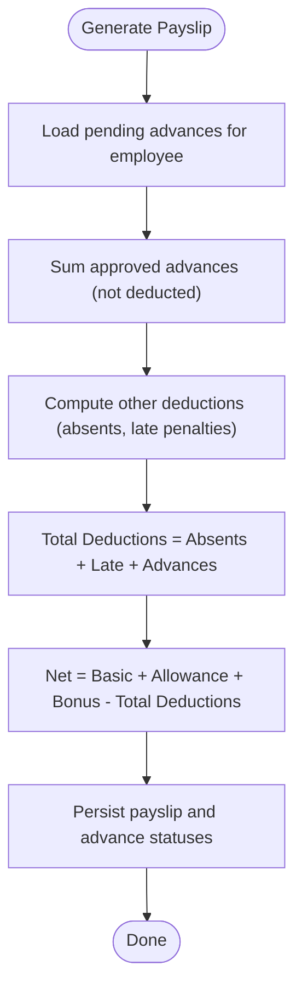
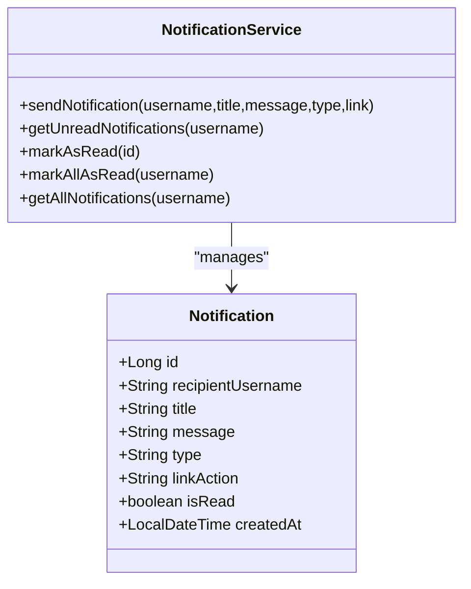
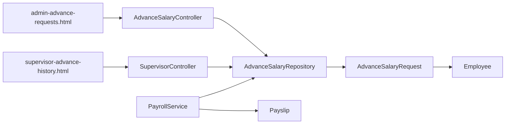

# Advance Salary Processing

<cite>
**Referenced Files in This Document**
- [AdvanceSalaryController.java](file://src/main/java/root/cyb/mh/attendancesystem/controller/AdvanceSalaryController.java)
- [SupervisorController.java](file://src/main/java/root/cyb/mh/attendancesystem/controller/SupervisorController.java)
- [AdvanceSalaryRequest.java](file://src/main/java/root/cyb/mh/attendancesystem/model/AdvanceSalaryRequest.java)
- [AdvanceSalaryRepository.java](file://src/main/java/root/cyb/mh/attendancesystem/repository/AdvanceSalaryRepository.java)
- [PayrollService.java](file://src/main/java/root/cyb/mh/attendancesystem/service/PayrollService.java)
- [Payslip.java](file://src/main/java/root/cyb/mh/attendancesystem/model/Payslip.java)
- [Employee.java](file://src/main/java/root/cyb/mh/attendancesystem/model/Employee.java)
- [NotificationService.java](file://src/main/java/root/cyb/mh/attendancesystem/service/NotificationService.java)
- [Notification.java](file://src/main/java/root/cyb/mh/attendancesystem/model/Notification.java)
- [admin-advance-requests.html](file://src/main/resources/templates/admin-advance-requests.html)
- [supervisor-advance-history.html](file://src/main/resources/templates/supervisor-advance-history.html)
</cite>

## Table of Contents
1. [Introduction](#introduction)
2. [Project Structure](#project-structure)
3. [Core Components](#core-components)
4. [Architecture Overview](#architecture-overview)
5. [Detailed Component Analysis](#detailed-component-analysis)
6. [Dependency Analysis](#dependency-analysis)
7. [Performance Considerations](#performance-considerations)
8. [Troubleshooting Guide](#troubleshooting-guide)
9. [Conclusion](#conclusion)

## Introduction
This document describes the complete advance salary processing functionality in the Skylink attendance system. It covers the end-to-end workflow for employee advance requests, from submission to approval and repayment through payroll deductions. It explains calculation methods, deduction integration with regular payroll, approval hierarchies, authorization limits, workflow automation, request forms, approval routing, notification systems, audit trails, and the impact on monthly salary calculations.

## Project Structure
The advance salary feature spans controllers, models, repositories, services, and Thymeleaf templates:
- Controllers handle HTTP endpoints for employee submissions and admin/supervisor approvals.
- Models define the data structures for requests and payroll integration.
- Repositories provide persistence and query capabilities.
- Services orchestrate payroll generation and deduction marking.
- Templates render admin and supervisor dashboards for approvals and histories.

**Diagram sources**
- [AdvanceSalaryController.java:1-83](file://src/main/java/root/cyb/mh/attendancesystem/controller/AdvanceSalaryController.java#L1-L83)
- [SupervisorController.java:1-215](file://src/main/java/root/cyb/mh/attendancesystem/controller/SupervisorController.java#L1-L215)
- [AdvanceSalaryRequest.java:1-49](file://src/main/java/root/cyb/mh/attendancesystem/model/AdvanceSalaryRequest.java#L1-L49)
- [AdvanceSalaryRepository.java:1-28](file://src/main/java/root/cyb/mh/attendancesystem/repository/AdvanceSalaryRepository.java#L1-L28)
- [PayrollService.java:1-318](file://src/main/java/root/cyb/mh/attendancesystem/service/PayrollService.java#L1-L318)
- [Payslip.java:1-57](file://src/main/java/root/cyb/mh/attendancesystem/model/Payslip.java#L1-L57)
- [Employee.java:1-64](file://src/main/java/root/cyb/mh/attendancesystem/model/Employee.java#L1-L64)
- [NotificationService.java:1-78](file://src/main/java/root/cyb/mh/attendancesystem/service/NotificationService.java#L1-L78)
- [admin-advance-requests.html:1-184](file://src/main/resources/templates/admin-advance-requests.html#L1-L184)
- [supervisor-advance-history.html:1-69](file://src/main/resources/templates/supervisor-advance-history.html#L1-L69)

**Section sources**
- [AdvanceSalaryController.java:1-83](file://src/main/java/root/cyb/mh/attendancesystem/controller/AdvanceSalaryController.java#L1-L83)
- [SupervisorController.java:1-215](file://src/main/java/root/cyb/mh/attendancesystem/controller/SupervisorController.java#L1-L215)
- [AdvanceSalaryRequest.java:1-49](file://src/main/java/root/cyb/mh/attendancesystem/model/AdvanceSalaryRequest.java#L1-L49)
- [AdvanceSalaryRepository.java:1-28](file://src/main/java/root/cyb/mh/attendancesystem/repository/AdvanceSalaryRepository.java#L1-L28)
- [PayrollService.java:1-318](file://src/main/java/root/cyb/mh/attendancesystem/service/PayrollService.java#L1-L318)
- [Payslip.java:1-57](file://src/main/java/root/cyb/mh/attendancesystem/model/Payslip.java#L1-L57)
- [Employee.java:1-64](file://src/main/java/root/cyb/mh/attendancesystem/model/Employee.java#L1-L64)
- [NotificationService.java:1-78](file://src/main/java/root/cyb/mh/attendancesystem/service/NotificationService.java#L1-L78)
- [admin-advance-requests.html:1-184](file://src/main/resources/templates/admin-advance-requests.html#L1-L184)
- [supervisor-advance-history.html:1-69](file://src/main/resources/templates/supervisor-advance-history.html#L1-L69)

## Core Components
- AdvanceSalaryRequest: Stores employee advance requests with status, amount, reason, timestamps, admin comments, and deduction flag.
- AdvanceSalaryRepository: Provides queries for pending approvals, history, and pending deductions per employee.
- PayrollService: Generates monthly payslips and integrates advance deductions; marks advances as paid upon finalization.
- Payslip: Captures financial breakdown including advance salary deduction and net pay.
- Employee: Contains payroll metadata used during payslip calculation.
- NotificationService: Supports notification delivery for approvals and rejections.
- Controllers: Expose endpoints for employee requests, admin approvals, and supervisor routing.

Key implementation references:
- Request lifecycle and endpoints: [AdvanceSalaryController.java:30-81](file://src/main/java/root/cyb/mh/attendancesystem/controller/AdvanceSalaryController.java#L30-L81)
- Approval routing and supervisor checks: [SupervisorController.java:173-210](file://src/main/java/root/cyb/mh/attendancesystem/controller/SupervisorController.java#L173-L210)
- Data model and statuses: [AdvanceSalaryRequest.java:14-47](file://src/main/java/root/cyb/mh/attendancesystem/model/AdvanceSalaryRequest.java#L14-L47)
- Queries for pending deductions and supervisor access: [AdvanceSalaryRepository.java:10-27](file://src/main/java/root/cyb/mh/attendancesystem/repository/AdvanceSalaryRepository.java#L10-L27)
- Payroll integration and deduction logic: [PayrollService.java:259-316](file://src/main/java/root/cyb/mh/attendancesystem/service/PayrollService.java#L259-L316)
- Payslip financial fields: [Payslip.java:49-50](file://src/main/java/root/cyb/mh/attendancesystem/model/Payslip.java#L49-L50)
- Employee payroll fields: [Employee.java:52-58](file://src/main/java/root/cyb/mh/attendancesystem/model/Employee.java#L52-L58)

**Section sources**
- [AdvanceSalaryController.java:1-83](file://src/main/java/root/cyb/mh/attendancesystem/controller/AdvanceSalaryController.java#L1-L83)
- [SupervisorController.java:173-210](file://src/main/java/root/cyb/mh/attendancesystem/controller/SupervisorController.java#L173-L210)
- [AdvanceSalaryRequest.java:1-49](file://src/main/java/root/cyb/mh/attendancesystem/model/AdvanceSalaryRequest.java#L1-L49)
- [AdvanceSalaryRepository.java:1-28](file://src/main/java/root/cyb/mh/attendancesystem/repository/AdvanceSalaryRepository.java#L1-L28)
- [PayrollService.java:259-316](file://src/main/java/root/cyb/mh/attendancesystem/service/PayrollService.java#L259-L316)
- [Payslip.java:1-57](file://src/main/java/root/cyb/mh/attendancesystem/model/Payslip.java#L1-L57)
- [Employee.java:1-64](file://src/main/java/root/cyb/mh/attendancesystem/model/Employee.java#L1-L64)

## Architecture Overview
The system implements a two-tier approval workflow:
- Employee submits an advance request.
- Supervisor approves or rejects based on authorization rules.
- Admin can review and manage all pending and historical requests.
- PayrollService aggregates approved advances and deducts them from the employee’s monthly net pay.
- Finalization marks advances as paid and prevents duplicate deductions.

**Diagram sources**
- [AdvanceSalaryController.java:30-45](file://src/main/java/root/cyb/mh/attendancesystem/controller/AdvanceSalaryController.java#L30-L45)
- [SupervisorController.java:173-210](file://src/main/java/root/cyb/mh/attendancesystem/controller/SupervisorController.java#L173-L210)
- [AdvanceSalaryRepository.java:10-27](file://src/main/java/root/cyb/mh/attendancesystem/repository/AdvanceSalaryRepository.java#L10-L27)
- [PayrollService.java:259-316](file://src/main/java/root/cyb/mh/attendancesystem/service/PayrollService.java#L259-L316)

## Detailed Component Analysis

### Advance Request Model and Lifecycle
- Fields include employee reference, amount, reason, request date, status, admin comment, and deduction flag.
- Status lifecycle: PENDING → APPROVED/REJECTED → PAID (processed).
- Deduction flag prevents repeated deductions across runs.

**Diagram sources**
- [AdvanceSalaryRequest.java:14-47](file://src/main/java/root/cyb/mh/attendancesystem/model/AdvanceSalaryRequest.java#L14-L47)
- [Employee.java:13-64](file://src/main/java/root/cyb/mh/attendancesystem/model/Employee.java#L13-L64)

**Section sources**
- [AdvanceSalaryRequest.java:1-49](file://src/main/java/root/cyb/mh/attendancesystem/model/AdvanceSalaryRequest.java#L1-L49)
- [Employee.java:1-64](file://src/main/java/root/cyb/mh/attendancesystem/model/Employee.java#L1-L64)

### Employee Submission Workflow
- Endpoint accepts employeeId, amount, and reason.
- Creates a new request with default status PENDING.
- Redirects to employee dashboard with feedback.

**Diagram sources**
- [AdvanceSalaryController.java:30-45](file://src/main/java/root/cyb/mh/attendancesystem/controller/AdvanceSalaryController.java#L30-L45)

**Section sources**
- [AdvanceSalaryController.java:30-45](file://src/main/java/root/cyb/mh/attendancesystem/controller/AdvanceSalaryController.java#L30-L45)

### Supervisor Approval Routing
- Supervisor dashboard lists pending advance requests assigned to them (primary or assistant).
- Approve/Reject actions update status and admin comment.
- Authorization enforced by checking reporting chain.

**Diagram sources**
- [SupervisorController.java:117-135](file://src/main/java/root/cyb/mh/attendancesystem/controller/SupervisorController.java#L117-L135)
- [SupervisorController.java:173-210](file://src/main/java/root/cyb/mh/attendancesystem/controller/SupervisorController.java#L173-L210)
- [AdvanceSalaryRepository.java:24-26](file://src/main/java/root/cyb/mh/attendancesystem/repository/AdvanceSalaryRepository.java#L24-L26)

**Section sources**
- [SupervisorController.java:117-135](file://src/main/java/root/cyb/mh/attendancesystem/controller/SupervisorController.java#L117-L135)
- [SupervisorController.java:173-210](file://src/main/java/root/cyb/mh/attendancesystem/controller/SupervisorController.java#L173-L210)
- [AdvanceSalaryRepository.java:24-26](file://src/main/java/root/cyb/mh/attendancesystem/repository/AdvanceSalaryRepository.java#L24-L26)

### Admin Management and Oversight
- Admin view lists pending and historical requests.
- Approve/Reject actions update status and admin comment.
- Provides modal-based rejection with required comment.

**Diagram sources**
- [AdvanceSalaryController.java:49-81](file://src/main/java/root/cyb/mh/attendancesystem/controller/AdvanceSalaryController.java#L49-L81)
- [admin-advance-requests.html:18-87](file://src/main/resources/templates/admin-advance-requests.html#L18-L87)

**Section sources**
- [AdvanceSalaryController.java:49-81](file://src/main/java/root/cyb/mh/attendancesystem/controller/AdvanceSalaryController.java#L49-L81)
- [admin-advance-requests.html:18-87](file://src/main/resources/templates/admin-advance-requests.html#L18-L87)

### Payroll Integration and Deduction Mechanics
- During payslip generation, the system aggregates all APPROVED advances not yet deducted for the employee.
- Deductions are included in the total deduction computation alongside absent days and late penalties.
- Upon finalization, all currently pending advances are marked as PAID and isDeducted=true.

**Diagram sources**
- [PayrollService.java:259-316](file://src/main/java/root/cyb/mh/attendancesystem/service/PayrollService.java#L259-L316)
- [Payslip.java:49-50](file://src/main/java/root/cyb/mh/attendancesystem/model/Payslip.java#L49-L50)
- [AdvanceSalaryRepository.java:20-22](file://src/main/java/root/cyb/mh/attendancesystem/repository/AdvanceSalaryRepository.java#L20-L22)

**Section sources**
- [PayrollService.java:259-316](file://src/main/java/root/cyb/mh/attendancesystem/service/PayrollService.java#L259-L316)
- [Payslip.java:49-50](file://src/main/java/root/cyb/mh/attendancesystem/model/Payslip.java#L49-L50)
- [AdvanceSalaryRepository.java:20-22](file://src/main/java/root/cyb/mh/attendancesystem/repository/AdvanceSalaryRepository.java#L20-L22)

### Audit Trail and Notification Systems
- Admin comments capture rationale for decisions.
- NotificationService supports persistent notifications and real-time delivery via WebSocket and web push.
- Templates display request history with status badges and timestamps.

**Diagram sources**
- [NotificationService.java:22-44](file://src/main/java/root/cyb/mh/attendancesystem/service/NotificationService.java#L22-L44)
- [Notification.java:14-42](file://src/main/java/root/cyb/mh/attendancesystem/model/Notification.java#L14-L42)

**Section sources**
- [NotificationService.java:1-78](file://src/main/java/root/cyb/mh/attendancesystem/service/NotificationService.java#L1-L78)
- [Notification.java:1-43](file://src/main/java/root/cyb/mh/attendancesystem/model/Notification.java#L1-L43)
- [admin-advance-requests.html:90-123](file://src/main/resources/templates/admin-advance-requests.html#L90-L123)
- [supervisor-advance-history.html:21-61](file://src/main/resources/templates/supervisor-advance-history.html#L21-L61)

## Dependency Analysis
- Controllers depend on repositories for persistence and on models for data transfer.
- PayrollService depends on repositories for employee, attendance, leaves, and advances.
- Templates depend on controllers/models for rendering pending and historical data.

**Diagram sources**
- [AdvanceSalaryController.java:1-83](file://src/main/java/root/cyb/mh/attendancesystem/controller/AdvanceSalaryController.java#L1-L83)
- [SupervisorController.java:1-215](file://src/main/java/root/cyb/mh/attendancesystem/controller/SupervisorController.java#L1-L215)
- [AdvanceSalaryRepository.java:1-28](file://src/main/java/root/cyb/mh/attendancesystem/repository/AdvanceSalaryRepository.java#L1-L28)
- [PayrollService.java:1-318](file://src/main/java/root/cyb/mh/attendancesystem/service/PayrollService.java#L1-L318)
- [Payslip.java:1-57](file://src/main/java/root/cyb/mh/attendancesystem/model/Payslip.java#L1-L57)
- [AdvanceSalaryRequest.java:1-49](file://src/main/java/root/cyb/mh/attendancesystem/model/AdvanceSalaryRequest.java#L1-L49)
- [Employee.java:1-64](file://src/main/java/root/cyb/mh/attendancesystem/model/Employee.java#L1-L64)
- [admin-advance-requests.html:1-184](file://src/main/resources/templates/admin-advance-requests.html#L1-L184)
- [supervisor-advance-history.html:1-69](file://src/main/resources/templates/supervisor-advance-history.html#L1-L69)

**Section sources**
- [AdvanceSalaryController.java:1-83](file://src/main/java/root/cyb/mh/attendancesystem/controller/AdvanceSalaryController.java#L1-L83)
- [SupervisorController.java:1-215](file://src/main/java/root/cyb/mh/attendancesystem/controller/SupervisorController.java#L1-L215)
- [AdvanceSalaryRepository.java:1-28](file://src/main/java/root/cyb/mh/attendancesystem/repository/AdvanceSalaryRepository.java#L1-L28)
- [PayrollService.java:1-318](file://src/main/java/root/cyb/mh/attendancesystem/service/PayrollService.java#L1-L318)
- [Payslip.java:1-57](file://src/main/java/root/cyb/mh/attendancesystem/model/Payslip.java#L1-L57)
- [AdvanceSalaryRequest.java:1-49](file://src/main/java/root/cyb/mh/attendancesystem/model/AdvanceSalaryRequest.java#L1-L49)
- [Employee.java:1-64](file://src/main/java/root/cyb/mh/attendancesystem/model/Employee.java#L1-L64)
- [admin-advance-requests.html:1-184](file://src/main/resources/templates/admin-advance-requests.html#L1-L184)
- [supervisor-advance-history.html:1-69](file://src/main/resources/templates/supervisor-advance-history.html#L1-L69)

## Performance Considerations
- Bulk data fetching: PayrollService loads attendance and leaves for all employees to minimize database round trips.
- Pending deduction query filters APPROVED advances not yet deducted per employee.
- Deduction aggregation occurs during draft payslip generation; finalization marks all pending advances as paid to prevent duplication.

[No sources needed since this section provides general guidance]

## Troubleshooting Guide
Common issues and resolutions:
- Duplicate deductions: Ensure finalization marks advances as paid and isDeducted=true; verify pending deduction query filters by isDeducted=false.
- Authorization failures: Supervisor actions require the approver to match the employee’s supervisor or assistant; confirm reporting chain setup.
- Missing advances in payslip: Confirm request status is APPROVED and isDeducted=false; verify employee ID alignment.
- Admin oversight gaps: Use admin dashboard to review all pending and historical requests; ensure rejection comments are captured.

**Section sources**
- [PayrollService.java:292-316](file://src/main/java/root/cyb/mh/attendancesystem/service/PayrollService.java#L292-L316)
- [AdvanceSalaryRepository.java:20-22](file://src/main/java/root/cyb/mh/attendancesystem/repository/AdvanceSalaryRepository.java#L20-L22)
- [SupervisorController.java:190-210](file://src/main/java/root/cyb/mh/attendancesystem/controller/SupervisorController.java#L190-L210)
- [AdvanceSalaryController.java:49-81](file://src/main/java/root/cyb/mh/attendancesystem/controller/AdvanceSalaryController.java#L49-L81)

## Conclusion
The Skylink system implements a clear, auditable, and automated advance salary workflow:
- Employees submit requests with reason and amount.
- Supervisor and admin approvals enforce hierarchical governance.
- PayrollService integrates advances into monthly calculations and prevents duplicate deductions via finalization.
- Notifications and templates support transparency and traceability.
This design balances flexibility with strong controls, enabling reliable advance processing aligned with regular payroll cycles.