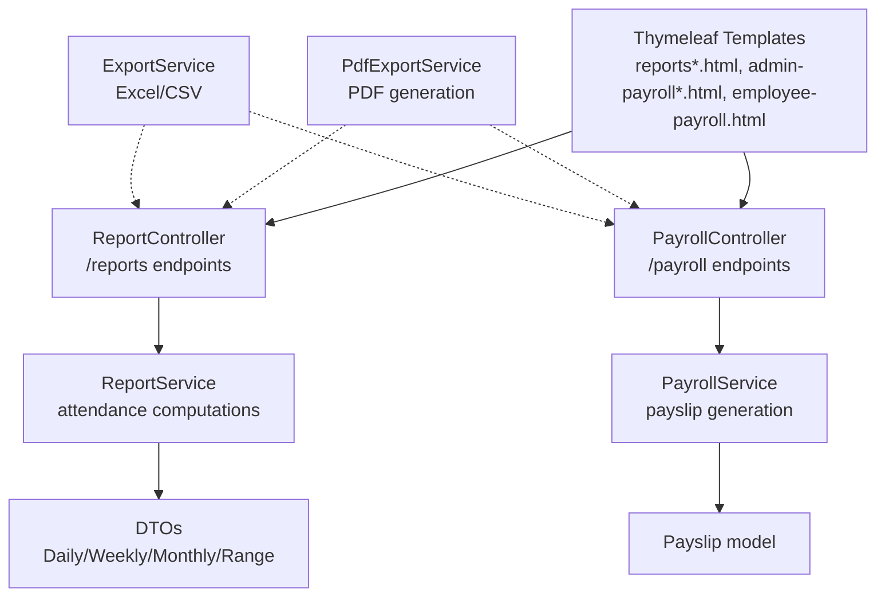
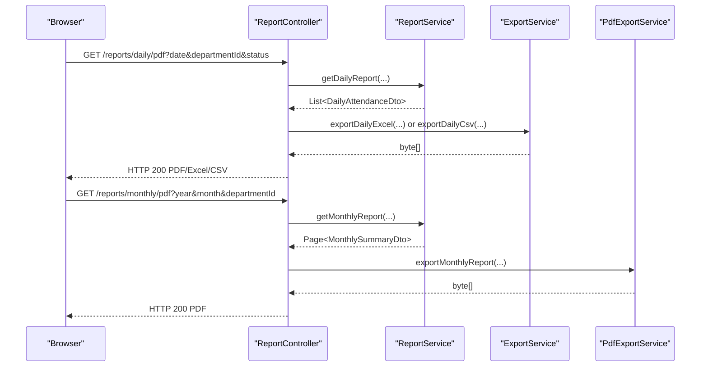
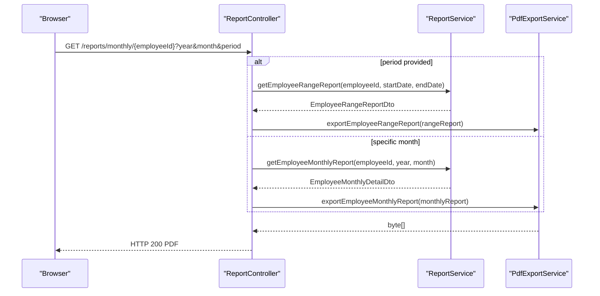
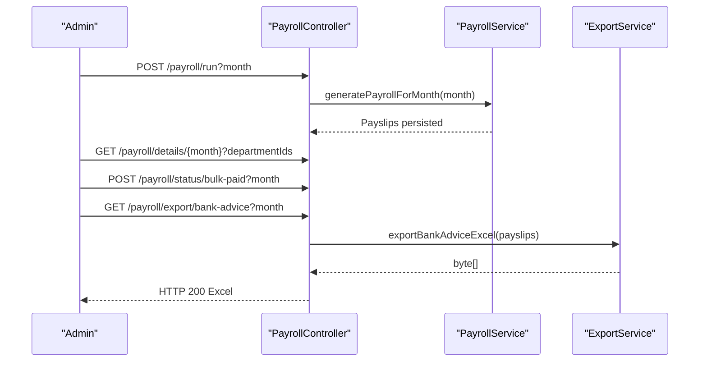
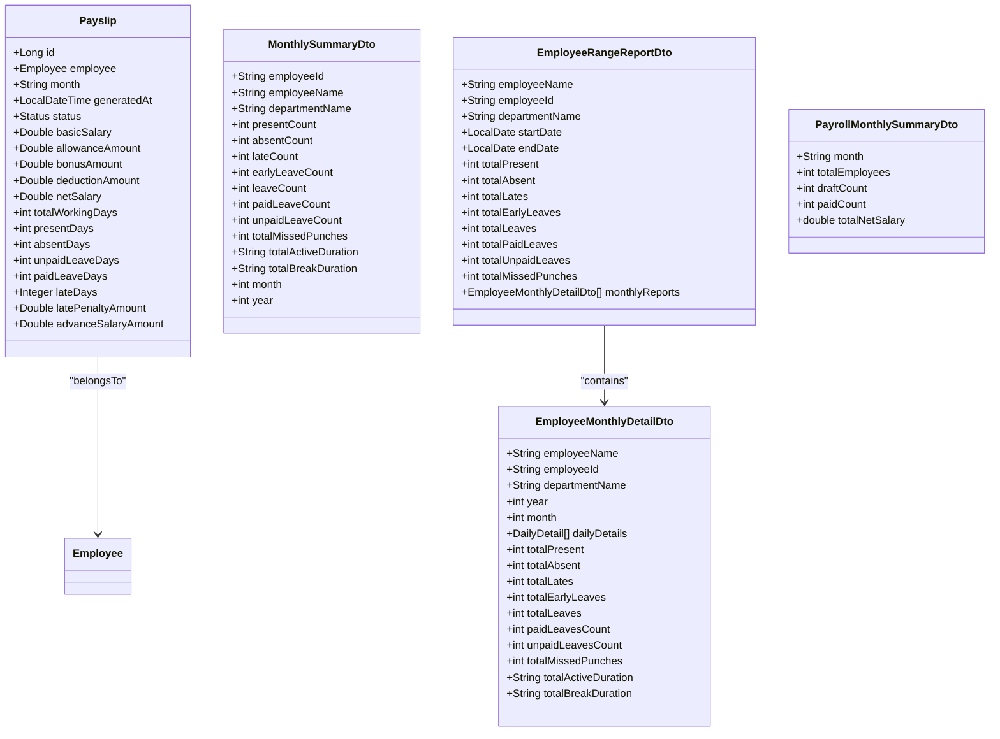
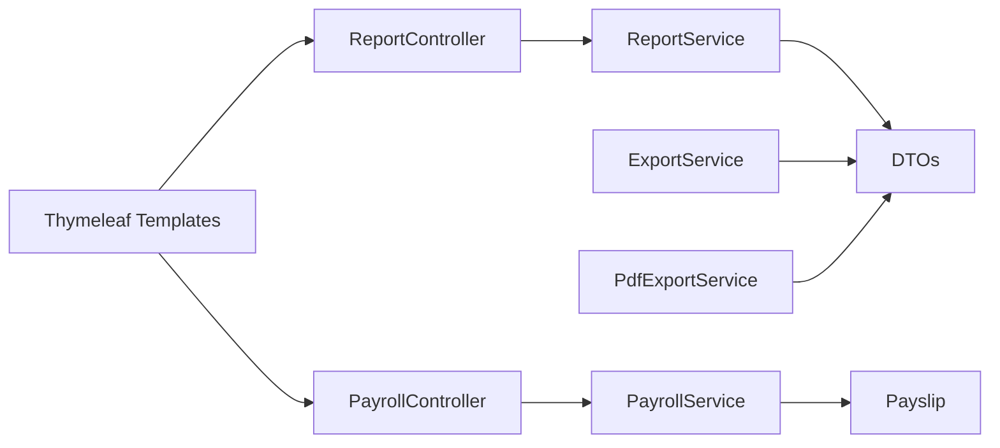

# Payroll Reporting

<cite>
**Referenced Files in This Document**
- [ReportController.java](file://src/main/java/root/cyb/mh/attendancesystem/controller/ReportController.java)
- [PayrollController.java](file://src/main/java/root/cyb/mh/attendancesystem/controller/PayrollController.java)
- [ReportService.java](file://src/main/java/root/cyb/mh/attendancesystem/service/ReportService.java)
- [PayrollService.java](file://src/main/java/root/cyb/mh/attendancesystem/service/PayrollService.java)
- [ExportService.java](file://src/main/java/root/cyb/mh/attendancesystem/service/ExportService.java)
- [PdfExportService.java](file://src/main/java/root/cyb/mh/attendancesystem/service/PdfExportService.java)
- [MonthlySummaryDto.java](file://src/main/java/root/cyb/mh/attendancesystem/dto/MonthlySummaryDto.java)
- [PayrollMonthlySummaryDto.java](file://src/main/java/root/cyb/mh/attendancesystem/dto/PayrollMonthlySummaryDto.java)
- [EmployeeMonthlyDetailDto.java](file://src/main/java/root/cyb/mh/attendancesystem/dto/EmployeeMonthlyDetailDto.java)
- [EmployeeRangeReportDto.java](file://src/main/java/root/cyb/mh/attendancesystem/dto/EmployeeRangeReportDto.java)
- [Payslip.java](file://src/main/java/root/cyb/mh/attendancesystem/model/Payslip.java)
- [reports.html](file://src/main/resources/templates/reports.html)
- [reports-monthly.html](file://src/main/resources/templates/reports-monthly.html)
- [admin-payroll-dashboard.html](file://src/main/resources/templates/admin-payroll-dashboard.html)
- [admin-payroll-details.html](file://src/main/resources/templates/admin-payroll-details.html)
- [employee-payroll.html](file://src/main/resources/templates/employee-payroll.html)
</cite>

## Table of Contents
1. [Introduction](#introduction)
2. [Project Structure](#project-structure)
3. [Core Components](#core-components)
4. [Architecture Overview](#architecture-overview)
5. [Detailed Component Analysis](#detailed-component-analysis)
6. [Dependency Analysis](#dependency-analysis)
7. [Performance Considerations](#performance-considerations)
8. [Troubleshooting Guide](#troubleshooting-guide)
9. [Conclusion](#conclusion)

## Introduction
This document describes the payroll reporting capabilities implemented in the system. It covers monthly payroll summaries, department-wise reports, individual employee statements, and financial insights dashboards. It also documents report generation workflows, filtering options, export capabilities, and administrative controls for payroll processing. Key metrics such as YTD earnings, bonus tracking, and income trends are explained alongside report customization, export formats, and integration points for bank advice exports.

## Project Structure
The payroll reporting system is organized around Spring MVC controllers, service-layer report generation, DTOs for data transfer, and Thymeleaf templates for rendering. Payroll-specific controllers manage both attendance-based reports and payroll processing, while dedicated services compute attendance statistics and generate payslips.

**Diagram sources**
- [ReportController.java:1-754](file://src/main/java/root/cyb/mh/attendancesystem/controller/ReportController.java#L1-L754)
- [PayrollController.java:1-223](file://src/main/java/root/cyb/mh/attendancesystem/controller/PayrollController.java#L1-L223)
- [ReportService.java:1-800](file://src/main/java/root/cyb/mh/attendancesystem/service/ReportService.java#L1-L800)
- [PayrollService.java:1-318](file://src/main/java/root/cyb/mh/attendancesystem/service/PayrollService.java#L1-L318)
- [ExportService.java:1-579](file://src/main/java/root/cyb/mh/attendancesystem/service/ExportService.java#L1-L579)
- [PdfExportService.java:1-485](file://src/main/java/root/cyb/mh/attendancesystem/service/PdfExportService.java#L1-L485)
- [reports.html:1-227](file://src/main/resources/templates/reports.html#L1-L227)
- [reports-monthly.html:1-298](file://src/main/resources/templates/reports-monthly.html#L1-L298)
- [admin-payroll-dashboard.html:1-255](file://src/main/resources/templates/admin-payroll-dashboard.html#L1-L255)
- [admin-payroll-details.html:1-530](file://src/main/resources/templates/admin-payroll-details.html#L1-L530)
- [employee-payroll.html:1-464](file://src/main/resources/templates/employee-payroll.html#L1-L464)

**Section sources**
- [ReportController.java:1-754](file://src/main/java/root/cyb/mh/attendancesystem/controller/ReportController.java#L1-L754)
- [PayrollController.java:1-223](file://src/main/java/root/cyb/mh/attendancesystem/controller/PayrollController.java#L1-L223)

## Core Components
- ReportController: Exposes REST endpoints for daily, weekly, and monthly attendance reports and individual employee statements. Provides export endpoints for PDF, Excel, and CSV.
- ReportService: Computes attendance metrics (present, absent, late, early, leave), integrates live work status, and generates paginated DTO lists.
- PayrollController: Manages payroll runs, displays payroll summaries, updates statuses, and exports bank advice.
- PayrollService: Generates payslips per month, computes attendance-based deductions, and applies late penalties and advance salary deductions.
- ExportService: Produces Excel and CSV exports for daily, weekly, monthly, and employee detail reports.
- PdfExportService: Produces PDFs for daily, weekly, monthly, and employee range reports, and official payslips.
- DTOs: Strongly typed data containers for monthly summaries, employee monthly details, and range reports.
- Payslip model: Persists payroll state, financials, and attendance snapshots.
- Thymeleaf templates: Render dashboards, filters, sorting, pagination, and export menus.

**Section sources**
- [ReportController.java:1-754](file://src/main/java/root/cyb/mh/attendancesystem/controller/ReportController.java#L1-L754)
- [ReportService.java:1-800](file://src/main/java/root/cyb/mh/attendancesystem/service/ReportService.java#L1-L800)
- [PayrollController.java:1-223](file://src/main/java/root/cyb/mh/attendancesystem/controller/PayrollController.java#L1-L223)
- [PayrollService.java:1-318](file://src/main/java/root/cyb/mh/attendancesystem/service/PayrollService.java#L1-L318)
- [ExportService.java:1-579](file://src/main/java/root/cyb/mh/attendancesystem/service/ExportService.java#L1-L579)
- [PdfExportService.java:1-485](file://src/main/java/root/cyb/mh/attendancesystem/service/PdfExportService.java#L1-L485)
- [MonthlySummaryDto.java:1-143](file://src/main/java/root/cyb/mh/attendancesystem/dto/MonthlySummaryDto.java#L1-L143)
- [PayrollMonthlySummaryDto.java:1-22](file://src/main/java/root/cyb/mh/attendancesystem/dto/PayrollMonthlySummaryDto.java#L1-L22)
- [EmployeeMonthlyDetailDto.java:1-159](file://src/main/java/root/cyb/mh/attendancesystem/dto/EmployeeMonthlyDetailDto.java#L1-L159)
- [EmployeeRangeReportDto.java:1-30](file://src/main/java/root/cyb/mh/attendancesystem/dto/EmployeeRangeReportDto.java#L1-L30)
- [Payslip.java:1-57](file://src/main/java/root/cyb/mh/attendancesystem/model/Payslip.java#L1-L57)

## Architecture Overview
The system follows a layered architecture:
- Presentation: Controllers expose endpoints and render Thymeleaf views.
- Services: Compute reports and payroll logic.
- Data Transfer: DTOs carry report data to views and exports.
- Persistence: Payslips and related entities are persisted for historical tracking.
- Export: Services produce Excel/CSV/PDF outputs for distribution.

**Diagram sources**
- [ReportController.java:328-425](file://src/main/java/root/cyb/mh/attendancesystem/controller/ReportController.java#L328-L425)
- [ReportService.java:47-100](file://src/main/java/root/cyb/mh/attendancesystem/service/ReportService.java#L47-L100)
- [ExportService.java:27-91](file://src/main/java/root/cyb/mh/attendancesystem/service/ExportService.java#L27-L91)
- [PdfExportService.java:34-67](file://src/main/java/root/cyb/mh/attendancesystem/service/PdfExportService.java#L34-L67)

## Detailed Component Analysis

### Attendance Reporting (Daily, Weekly, Monthly)
- Daily report: Filters by date and optional departments and status, sorts by configurable fields, and supports export to PDF/Excel/CSV.
- Weekly report: Aggregates attendance across a week, computes presence/absence/lates/early departures per employee, and supports export.
- Monthly report: Aggregates counts and durations across a month, supports multi-month selection, and supports export.
- Employee detail reports: Individual monthly and range (3M/6M/1Y) views with detailed daily breakdowns.

**Diagram sources**
- [ReportController.java:285-323](file://src/main/java/root/cyb/mh/attendancesystem/controller/ReportController.java#L285-L323)
- [ReportService.java:673-800](file://src/main/java/root/cyb/mh/attendancesystem/service/ReportService.java#L673-L800)
- [PdfExportService.java:225-273](file://src/main/java/root/cyb/mh/attendancesystem/service/PdfExportService.java#L225-L273)

**Section sources**
- [ReportController.java:23-323](file://src/main/java/root/cyb/mh/attendancesystem/controller/ReportController.java#L23-L323)
- [ReportService.java:47-800](file://src/main/java/root/cyb/mh/attendancesystem/service/ReportService.java#L47-L800)
- [reports.html:1-227](file://src/main/resources/templates/reports.html#L1-L227)
- [reports-monthly.html:1-298](file://src/main/resources/templates/reports-monthly.html#L1-L298)

### Payroll Processing and Dashboards
- Payroll dashboard: Shows aggregated monthly summaries with total cost, processed counts, and average net pay, plus a cost trend chart.
- Payroll details: Lists payslips per month, allows filtering by department, bulk marking as paid, updating bonuses, and exporting bank advice.
- Employee payroll: Displays personal payslips, YTD earnings, total bonuses, best month, and income trend chart.

**Diagram sources**
- [PayrollController.java:108-133](file://src/main/java/root/cyb/mh/attendancesystem/controller/PayrollController.java#L108-L133)
- [PayrollService.java:39-92](file://src/main/java/root/cyb/mh/attendancesystem/service/PayrollService.java#L39-L92)
- [ExportService.java:541-579](file://src/main/java/root/cyb/mh/attendancesystem/service/ExportService.java#L541-L579)
- [admin-payroll-dashboard.html:1-255](file://src/main/resources/templates/admin-payroll-dashboard.html#L1-L255)
- [admin-payroll-details.html:1-530](file://src/main/resources/templates/admin-payroll-details.html#L1-L530)
- [employee-payroll.html:1-464](file://src/main/resources/templates/employee-payroll.html#L1-L464)

**Section sources**
- [PayrollController.java:29-195](file://src/main/java/root/cyb/mh/attendancesystem/controller/PayrollController.java#L29-L195)
- [PayrollService.java:39-318](file://src/main/java/root/cyb/mh/attendancesystem/service/PayrollService.java#L39-L318)
- [admin-payroll-dashboard.html:1-255](file://src/main/resources/templates/admin-payroll-dashboard.html#L1-L255)
- [admin-payroll-details.html:1-530](file://src/main/resources/templates/admin-payroll-details.html#L1-L530)
- [employee-payroll.html:1-464](file://src/main/resources/templates/employee-payroll.html#L1-L464)

### Data Models and DTOs
- MonthlySummaryDto: Holds monthly attendance counts and durations per employee.
- EmployeeMonthlyDetailDto: Holds detailed daily breakdown for a single employee’s month.
- EmployeeRangeReportDto: Aggregates attendance across a date range with monthly breakdowns.
- PayrollMonthlySummaryDto: Aggregates payroll totals per month for the dashboard.
- Payslip: Persisted entity containing financials, attendance snapshot, and status.

**Diagram sources**
- [Payslip.java:1-57](file://src/main/java/root/cyb/mh/attendancesystem/model/Payslip.java#L1-L57)
- [MonthlySummaryDto.java:1-143](file://src/main/java/root/cyb/mh/attendancesystem/dto/MonthlySummaryDto.java#L1-L143)
- [EmployeeMonthlyDetailDto.java:1-159](file://src/main/java/root/cyb/mh/attendancesystem/dto/EmployeeMonthlyDetailDto.java#L1-L159)
- [EmployeeRangeReportDto.java:1-30](file://src/main/java/root/cyb/mh/attendancesystem/dto/EmployeeRangeReportDto.java#L1-L30)
- [PayrollMonthlySummaryDto.java:1-22](file://src/main/java/root/cyb/mh/attendancesystem/dto/PayrollMonthlySummaryDto.java#L1-L22)

**Section sources**
- [Payslip.java:1-57](file://src/main/java/root/cyb/mh/attendancesystem/model/Payslip.java#L1-L57)
- [MonthlySummaryDto.java:1-143](file://src/main/java/root/cyb/mh/attendancesystem/dto/MonthlySummaryDto.java#L1-L143)
- [EmployeeMonthlyDetailDto.java:1-159](file://src/main/java/root/cyb/mh/attendancesystem/dto/EmployeeMonthlyDetailDto.java#L1-L159)
- [EmployeeRangeReportDto.java:1-30](file://src/main/java/root/cyb/mh/attendancesystem/dto/EmployeeRangeReportDto.java#L1-L30)
- [PayrollMonthlySummaryDto.java:1-22](file://src/main/java/root/cyb/mh/attendancesystem/dto/PayrollMonthlySummaryDto.java#L1-L22)

## Dependency Analysis
- Controllers depend on services for computation and on export/PDF services for output generation.
- Services depend on repositories to fetch attendance logs, leaves, schedules, and employee data.
- DTOs decouple service outputs from persistence models for presentation and export.
- Templates bind to controllers’ model attributes and provide filtering/sorting/UI controls.

**Diagram sources**
- [ReportController.java:1-754](file://src/main/java/root/cyb/mh/attendancesystem/controller/ReportController.java#L1-L754)
- [PayrollController.java:1-223](file://src/main/java/root/cyb/mh/attendancesystem/controller/PayrollController.java#L1-L223)
- [ReportService.java:1-800](file://src/main/java/root/cyb/mh/attendancesystem/service/ReportService.java#L1-L800)
- [PayrollService.java:1-318](file://src/main/java/root/cyb/mh/attendancesystem/service/PayrollService.java#L1-L318)
- [ExportService.java:1-579](file://src/main/java/root/cyb/mh/attendancesystem/service/ExportService.java#L1-L579)
- [PdfExportService.java:1-485](file://src/main/java/root/cyb/mh/attendancesystem/service/PdfExportService.java#L1-L485)

**Section sources**
- [ReportController.java:1-754](file://src/main/java/root/cyb/mh/attendancesystem/controller/ReportController.java#L1-L754)
- [PayrollController.java:1-223](file://src/main/java/root/cyb/mh/attendancesystem/controller/PayrollController.java#L1-L223)
- [ReportService.java:1-800](file://src/main/java/root/cyb/mh/attendancesystem/service/ReportService.java#L1-L800)
- [PayrollService.java:1-318](file://src/main/java/root/cyb/mh/attendancesystem/service/PayrollService.java#L1-L318)
- [ExportService.java:1-579](file://src/main/java/root/cyb/mh/attendancesystem/service/ExportService.java#L1-L579)
- [PdfExportService.java:1-485](file://src/main/java/root/cyb/mh/attendancesystem/service/PdfExportService.java#L1-L485)

## Performance Considerations
- Pagination: Controllers use Pageable to limit report sizes for daily/weekly/monthly views.
- Efficient queries: Services fetch logs and leaves for the relevant periods to minimize repeated scans.
- Export batching: Export endpoints request larger pages (e.g., up to 10,000) to support export generation.
- Computation reuse: Monthly report aggregation reuses live work status and holiday data to compute durations and counts efficiently.

[No sources needed since this section provides general guidance]

## Troubleshooting Guide
- Empty reports: Verify date ranges, department selections, and month/year parameters. Ensure the requested period has attendance data.
- Export failures: Confirm the export endpoint parameters match the report view (e.g., date for daily, year/month/department for monthly).
- Duplicate or missing payslips: Check payroll run status and whether a payslip is already marked as PAID.
- Sorting and filtering: Use the provided sort links and filter forms on the report pages; ensure parameters are correctly passed.

**Section sources**
- [ReportController.java:328-425](file://src/main/java/root/cyb/mh/attendancesystem/controller/ReportController.java#L328-L425)
- [PayrollController.java:108-133](file://src/main/java/root/cyb/mh/attendancesystem/controller/PayrollController.java#L108-L133)

## Conclusion
The system provides comprehensive payroll reporting with attendance-based dashboards, detailed employee statements, and administrative payroll controls. It supports filtering, sorting, pagination, and multiple export formats (PDF, Excel, CSV). Payroll dashboards include YTD earnings, bonus tracking, and income trends for employees, while administrative views enable batch processing, bonus adjustments, and bank advice exports.