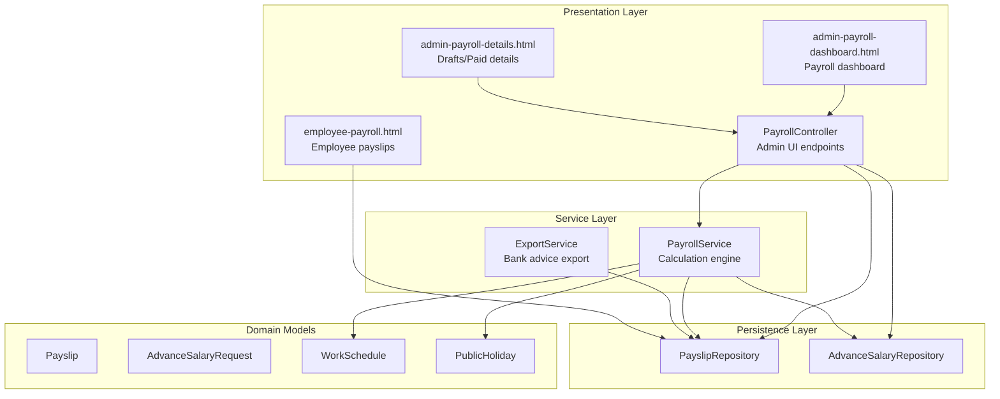
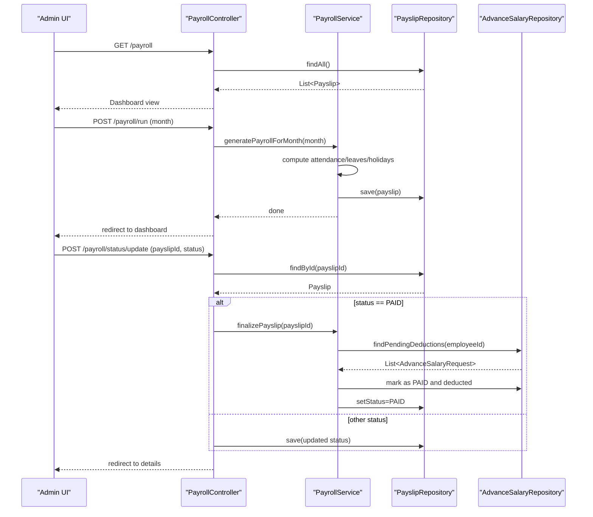
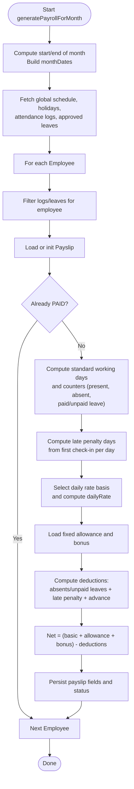
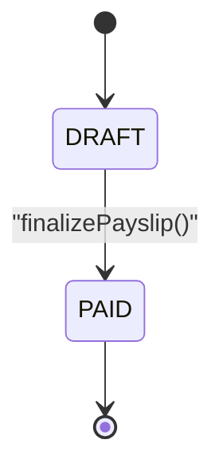
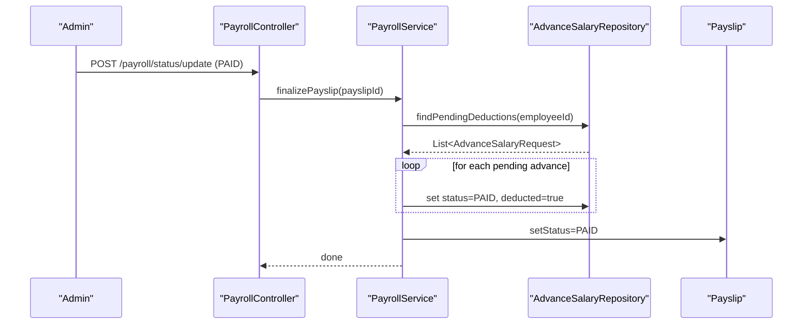
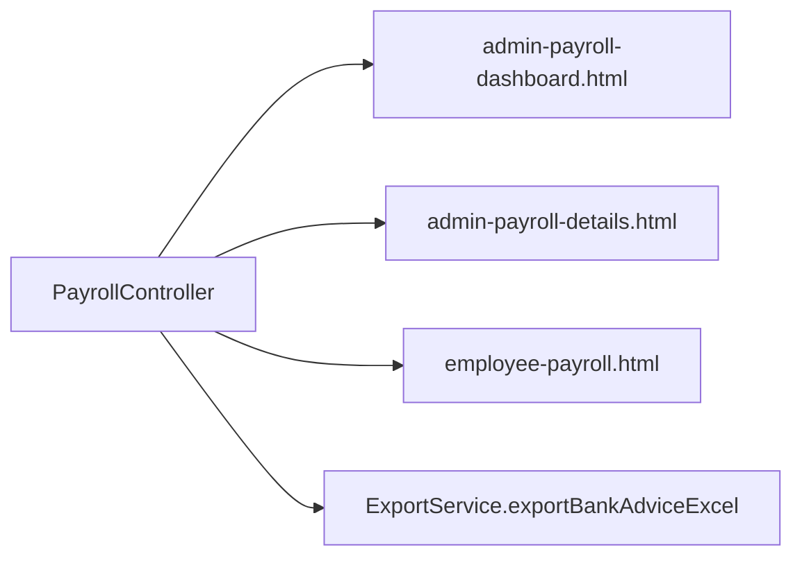
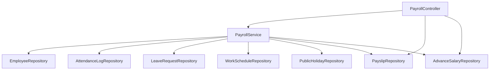

# Payroll System

<cite>
**Referenced Files in This Document**
- [PayrollController.java](file://src/main/java/root/cyb/mh/attendancesystem/controller/PayrollController.java)
- [PayrollService.java](file://src/main/java/root/cyb/mh/attendancesystem/service/PayrollService.java)
- [Payslip.java](file://src/main/java/root/cyb/mh/attendancesystem/model/Payslip.java)
- [AdvanceSalaryRequest.java](file://src/main/java/root/cyb/mh/attendancesystem/model/AdvanceSalaryRequest.java)
- [PayrollMonthlySummaryDto.java](file://src/main/java/root/cyb/mh/attendancesystem/dto/PayrollMonthlySummaryDto.java)
- [PayslipRepository.java](file://src/main/java/root/cyb/mh/attendancesystem/repository/PayslipRepository.java)
- [AdvanceSalaryRepository.java](file://src/main/java/root/cyb/mh/attendancesystem/repository/AdvanceSalaryRepository.java)
- [WorkSchedule.java](file://src/main/java/root/cyb/mh/attendancesystem/model/WorkSchedule.java)
- [PublicHoliday.java](file://src/main/java/root/cyb/mh/attendancesystem/model/PublicHoliday.java)
- [admin-payroll-dashboard.html](file://src/main/resources/templates/admin-payroll-dashboard.html)
- [admin-payroll-details.html](file://src/main/resources/templates/admin-payroll-details.html)
- [employee-payroll.html](file://src/main/resources/templates/employee-payroll.html)
- [ExportService.java](file://src/main/java/root/cyb/mh/attendancesystem/service/ExportService.java)
</cite>

## Table of Contents
1. [Introduction](#introduction)
2. [Project Structure](#project-structure)
3. [Core Components](#core-components)
4. [Architecture Overview](#architecture-overview)
5. [Detailed Component Analysis](#detailed-component-analysis)
6. [Dependency Analysis](#dependency-analysis)
7. [Performance Considerations](#performance-considerations)
8. [Troubleshooting Guide](#troubleshooting-guide)
9. [Conclusion](#conclusion)
10. [Appendices](#appendices)

## Introduction
This document describes the Skylink Custom Backend payroll system. It covers salary calculation algorithms, payslip generation, advance salary processing, payroll reporting, and integration with attendance and leave systems. It also documents payroll computation rules, tax considerations, deductions, batch processing, policy configuration, audit requirements, and compliance considerations.

## Project Structure
The payroll system spans controllers, services, repositories, models, DTOs, and Thymeleaf templates for administration and employee views. It integrates with attendance logs, leave requests, and public holidays to compute accurate monthly pay.

**Diagram sources**
- [PayrollController.java:16-223](file://src/main/java/root/cyb/mh/attendancesystem/controller/PayrollController.java#L16-L223)
- [PayrollService.java:15-318](file://src/main/java/root/cyb/mh/attendancesystem/service/PayrollService.java#L15-L318)
- [PayslipRepository.java:8-14](file://src/main/java/root/cyb/mh/attendancesystem/repository/PayslipRepository.java#L8-L14)
- [AdvanceSalaryRepository.java:10-27](file://src/main/java/root/cyb/mh/attendancesystem/repository/AdvanceSalaryRepository.java#L10-L27)
- [Payslip.java:14-56](file://src/main/java/root/cyb/mh/attendancesystem/model/Payslip.java#L14-L56)
- [AdvanceSalaryRequest.java:14-48](file://src/main/java/root/cyb/mh/attendancesystem/model/AdvanceSalaryRequest.java#L14-L48)
- [WorkSchedule.java:13-48](file://src/main/java/root/cyb/mh/attendancesystem/model/WorkSchedule.java#L13-L48)
- [PublicHoliday.java:12-19](file://src/main/java/root/cyb/mh/attendancesystem/model/PublicHoliday.java#L12-L19)
- [admin-payroll-dashboard.html:1-255](file://src/main/resources/templates/admin-payroll-dashboard.html#L1-L255)
- [admin-payroll-details.html:1-530](file://src/main/resources/templates/admin-payroll-details.html#L1-L530)
- [employee-payroll.html:1-464](file://src/main/resources/templates/employee-payroll.html#L1-L464)
- [ExportService.java:541-577](file://src/main/java/root/cyb/mh/attendancesystem/service/ExportService.java#L541-L577)

**Section sources**
- [PayrollController.java:16-223](file://src/main/java/root/cyb/mh/attendancesystem/controller/PayrollController.java#L16-L223)
- [PayrollService.java:15-318](file://src/main/java/root/cyb/mh/attendancesystem/service/PayrollService.java#L15-L318)
- [PayslipRepository.java:8-14](file://src/main/java/root/cyb/mh/attendancesystem/repository/PayslipRepository.java#L8-L14)
- [AdvanceSalaryRepository.java:10-27](file://src/main/java/root/cyb/mh/attendancesystem/repository/AdvanceSalaryRepository.java#L10-L27)
- [Payslip.java:14-56](file://src/main/java/root/cyb/mh/attendancesystem/model/Payslip.java#L14-L56)
- [AdvanceSalaryRequest.java:14-48](file://src/main/java/root/cyb/mh/attendancesystem/model/AdvanceSalaryRequest.java#L14-L48)
- [WorkSchedule.java:13-48](file://src/main/java/root/cyb/mh/attendancesystem/model/WorkSchedule.java#L13-L48)
- [PublicHoliday.java:12-19](file://src/main/java/root/cyb/mh/attendancesystem/model/PublicHoliday.java#L12-L19)
- [admin-payroll-dashboard.html:1-255](file://src/main/resources/templates/admin-payroll-dashboard.html#L1-L255)
- [admin-payroll-details.html:1-530](file://src/main/resources/templates/admin-payroll-details.html#L1-L530)
- [employee-payroll.html:1-464](file://src/main/resources/templates/employee-payroll.html#L1-L464)
- [ExportService.java:541-577](file://src/main/java/root/cyb/mh/attendancesystem/service/ExportService.java#L541-L577)

## Core Components
- PayrollController: Exposes endpoints for payroll dashboard, details, status updates, bulk finalize, bonus adjustments, deletion, bank advice export, and employee payslips.
- PayrollService: Orchestrates monthly payroll generation, computes attendance-based salary, applies deductions, and finalizes payslips.
- Payslip: Domain entity representing a single payslip with financials, attendance summary, and status.
- AdvanceSalaryRequest: Tracks approved advances linked to future payslip deductions.
- WorkSchedule and PublicHoliday: Provide daily rate basis, weekend days, late tolerance, and public holidays used in computation.
- Repositories: Persist Payslips and AdvanceSalaryRequests.
- ExportService: Generates bank advice exports for payroll disbursement.

**Section sources**
- [PayrollController.java:16-223](file://src/main/java/root/cyb/mh/attendancesystem/controller/PayrollController.java#L16-L223)
- [PayrollService.java:15-318](file://src/main/java/root/cyb/mh/attendancesystem/service/PayrollService.java#L15-L318)
- [Payslip.java:14-56](file://src/main/java/root/cyb/mh/attendancesystem/model/Payslip.java#L14-L56)
- [AdvanceSalaryRequest.java:14-48](file://src/main/java/root/cyb/mh/attendancesystem/model/AdvanceSalaryRequest.java#L14-L48)
- [WorkSchedule.java:13-48](file://src/main/java/root/cyb/mh/attendancesystem/model/WorkSchedule.java#L13-L48)
- [PublicHoliday.java:12-19](file://src/main/java/root/cyb/mh/attendancesystem/model/PublicHoliday.java#L12-L19)
- [PayslipRepository.java:8-14](file://src/main/java/root/cyb/mh/attendancesystem/repository/PayslipRepository.java#L8-L14)
- [AdvanceSalaryRepository.java:10-27](file://src/main/java/root/cyb/mh/attendancesystem/repository/AdvanceSalaryRepository.java#L10-L27)
- [ExportService.java:541-577](file://src/main/java/root/cyb/mh/attendancesystem/service/ExportService.java#L541-L577)

## Architecture Overview
The payroll system follows a layered architecture:
- Presentation: Controllers expose endpoints backed by Thymeleaf templates for admin and employee views.
- Service: PayrollService encapsulates business logic for computation and finalization.
- Persistence: Repositories manage data access for payslips and advance requests.
- Models: Domain entities define structure and status of payroll artifacts.

**Diagram sources**
- [PayrollController.java:29-113](file://src/main/java/root/cyb/mh/attendancesystem/controller/PayrollController.java#L29-L113)
- [PayrollService.java:39-116](file://src/main/java/root/cyb/mh/attendancesystem/service/PayrollService.java#L39-L116)
- [PayslipRepository.java:8-14](file://src/main/java/root/cyb/mh/attendancesystem/repository/PayslipRepository.java#L8-L14)
- [AdvanceSalaryRepository.java:20-22](file://src/main/java/root/cyb/mh/attendancesystem/repository/AdvanceSalaryRepository.java#L20-L22)

## Detailed Component Analysis

### Payroll Calculation Engine
The calculation engine derives attendance-based pay from:
- Monthly salary and fixed allowance
- Daily rate basis (standard 30 days, actual working days, or fixed days)
- Working days vs. eligible days (weekends and public holidays excluded)
- Attendance presence, leave types (paid/unpaid), and absence
- Late penalties computed from first check-in per day against tolerances
- Advance salary deductions from approved, pending requests

**Diagram sources**
- [PayrollService.java:39-290](file://src/main/java/root/cyb/mh/attendancesystem/service/PayrollService.java#L39-L290)
- [WorkSchedule.java:13-48](file://src/main/java/root/cyb/mh/attendancesystem/model/WorkSchedule.java#L13-L48)
- [PublicHoliday.java:12-19](file://src/main/java/root/cyb/mh/attendancesystem/model/PublicHoliday.java#L12-L19)

**Section sources**
- [PayrollService.java:39-290](file://src/main/java/root/cyb/mh/attendancesystem/service/PayrollService.java#L39-L290)
- [WorkSchedule.java:13-48](file://src/main/java/root/cyb/mh/attendancesystem/model/WorkSchedule.java#L13-L48)
- [PublicHoliday.java:12-19](file://src/main/java/root/cyb/mh/attendancesystem/model/PublicHoliday.java#L12-L19)

### Payslip Entity and Status Management
Payslips capture:
- Basic salary, allowance, bonus, total deductions, and net salary
- Attendance snapshot: total working days, present, absent, paid/unpaid leave
- Late penalty details and advance salary deduction
- Status lifecycle: DRAFT → PAID

Finalization marks payslips as PAID and updates linked advance requests as deducted.

**Diagram sources**
- [Payslip.java:52-55](file://src/main/java/root/cyb/mh/attendancesystem/model/Payslip.java#L52-L55)
- [PayrollService.java:292-316](file://src/main/java/root/cyb/mh/attendancesystem/service/PayrollService.java#L292-L316)

**Section sources**
- [Payslip.java:14-56](file://src/main/java/root/cyb/mh/attendancesystem/model/Payslip.java#L14-L56)
- [PayrollService.java:292-316](file://src/main/java/root/cyb/mh/attendancesystem/service/PayrollService.java#L292-L316)

### Advance Salary Processing
Approved advances are aggregated and applied as deductions during payslip finalization. The system assumes the calculated advance matches current pending deductions at the time of generation.

**Diagram sources**
- [PayrollController.java:80-93](file://src/main/java/root/cyb/mh/attendancesystem/controller/PayrollController.java#L80-L93)
- [PayrollService.java:292-316](file://src/main/java/root/cyb/mh/attendancesystem/service/PayrollService.java#L292-L316)
- [AdvanceSalaryRepository.java:20-22](file://src/main/java/root/cyb/mh/attendancesystem/repository/AdvanceSalaryRepository.java#L20-L22)

**Section sources**
- [PayrollService.java:259-267](file://src/main/java/root/cyb/mh/attendancesystem/service/PayrollService.java#L259-L267)
- [PayrollService.java:292-316](file://src/main/java/root/cyb/mh/attendancesystem/service/PayrollService.java#L292-L316)
- [AdvanceSalaryRepository.java:20-22](file://src/main/java/root/cyb/mh/attendancesystem/repository/AdvanceSalaryRepository.java#L20-L22)

### Payroll Reporting and UI
- Admin dashboard groups payslips by month and shows counts and total net salary.
- Details view filters by department, supports bulk “mark paid,” per-slip actions, bonus editing, and deletion.
- Employee view shows personal payslips, YTD earnings, total bonuses, best month, and income trend chart.
- Bank advice export generates an Excel file for payroll disbursement.

**Diagram sources**
- [PayrollController.java:29-113](file://src/main/java/root/cyb/mh/attendancesystem/controller/PayrollController.java#L29-L113)
- [admin-payroll-dashboard.html:1-255](file://src/main/resources/templates/admin-payroll-dashboard.html#L1-L255)
- [admin-payroll-details.html:1-530](file://src/main/resources/templates/admin-payroll-details.html#L1-L530)
- [employee-payroll.html:1-464](file://src/main/resources/templates/employee-payroll.html#L1-L464)
- [ExportService.java:541-577](file://src/main/java/root/cyb/mh/attendancesystem/service/ExportService.java#L541-L577)

**Section sources**
- [PayrollController.java:29-113](file://src/main/java/root/cyb/mh/attendancesystem/controller/PayrollController.java#L29-L113)
- [admin-payroll-dashboard.html:1-255](file://src/main/resources/templates/admin-payroll-dashboard.html#L1-L255)
- [admin-payroll-details.html:1-530](file://src/main/resources/templates/admin-payroll-details.html#L1-L530)
- [employee-payroll.html:1-464](file://src/main/resources/templates/employee-payroll.html#L1-L464)
- [ExportService.java:541-577](file://src/main/java/root/cyb/mh/attendancesystem/service/ExportService.java#L541-L577)

## Dependency Analysis
- PayrollController depends on PayrollService, PayslipRepository, DepartmentRepository, and ExportService.
- PayrollService depends on Employee, AttendanceLog, LeaveRequest, WorkSchedule, PublicHoliday, Payslip, and AdvanceSalary repositories.
- PayslipRepository and AdvanceSalaryRepository define persistence boundaries.
- WorkSchedule and PublicHoliday influence computation rules.

**Diagram sources**
- [PayrollController.java:19-26](file://src/main/java/root/cyb/mh/attendancesystem/controller/PayrollController.java#L19-L26)
- [PayrollService.java:18-37](file://src/main/java/root/cyb/mh/attendancesystem/service/PayrollService.java#L18-L37)

**Section sources**
- [PayrollController.java:19-26](file://src/main/java/root/cyb/mh/attendancesystem/controller/PayrollController.java#L19-L26)
- [PayrollService.java:18-37](file://src/main/java/root/cyb/mh/attendancesystem/service/PayrollService.java#L18-L37)

## Performance Considerations
- Bulk data retrieval: The service fetches attendance logs and approved leaves for the entire month upfront to minimize repeated queries per employee.
- Computation efficiency: Uses stream-based grouping and filtering; ensure indexes on join date, timestamps, and statuses for optimal performance.
- UI rendering: Dashboard and details pages group and sort data server-side; consider pagination for very large datasets.

[No sources needed since this section provides general guidance]

## Troubleshooting Guide
Common issues and resolutions:
- Duplicate or stale payslips: Regeneration is skipped for already PAID records; ensure status reset if reprocessing is required.
- Incorrect late penalty thresholds: Verify WorkSchedule late penalty threshold and deduction values.
- Advance deduction mismatch: During finalization, all currently pending advances are marked as paid; reconcile discrepancies by reviewing pending lists.
- Zero or negative net salary: Check daily rate basis, absence counts, and advance amounts.

**Section sources**
- [PayrollService.java:113-116](file://src/main/java/root/cyb/mh/attendancesystem/service/PayrollService.java#L113-L116)
- [PayrollService.java:222-227](file://src/main/java/root/cyb/mh/attendancesystem/service/PayrollService.java#L222-L227)
- [PayrollService.java:299-314](file://src/main/java/root/cyb/mh/attendancesystem/service/PayrollService.java#L299-L314)

## Conclusion
The Skylink payroll system integrates attendance, leave, and scheduling data to compute fair and transparent monthly compensation. It supports manual and batch processing, detailed payslips, and bank advice exports. Policies such as daily rate basis, weekend days, and late penalties are configurable via WorkSchedule, enabling compliance with organizational standards.

[No sources needed since this section summarizes without analyzing specific files]

## Appendices

### Payroll Computation Rules and Formulas
- Daily rate basis selection:
  - STANDARD_30: dailyRate = monthlySalary / 30
  - ACTUAL_WORKING_DAYS: dailyRate = monthlySalary / standardWorkingDays
  - FIXED_DAYS: dailyRate = monthlySalary / fixedDays
- Allowances and bonuses:
  - Fixed allowance from employee profile
  - One-time bonus editable per payslip
- Deductions:
  - Absent days + unpaid leave days × dailyRate
  - Late penalty: floor(lateCount / threshold) × deductionPerThreshold × dailyRate
  - Advance salary: sum of approved, pending advances
- Net salary:
  - Net = (basic + allowance + bonus) − totalDeductions
- Attendance counters:
  - totalWorkingDays: weekdays excluding public holidays
  - presentDays: days with attendance logs
  - absentDays: eligible days without logs and leave
  - paidLeaveDays / unpaidLeaveDays: derived from approved leave periods

**Section sources**
- [PayrollService.java:234-249](file://src/main/java/root/cyb/mh/attendancesystem/service/PayrollService.java#L234-L249)
- [PayrollService.java:255-271](file://src/main/java/root/cyb/mh/attendancesystem/service/PayrollService.java#L255-L271)
- [WorkSchedule.java:36-40](file://src/main/java/root/cyb/mh/attendancesystem/model/WorkSchedule.java#L36-L40)

### Payroll Policy Configuration
- WorkSchedule fields influencing payroll:
  - dailyRateBasis, dailyRateFixedValue
  - weekendDays
  - latePenaltyThreshold, latePenaltyDeduction
- PublicHoliday entries affect standard working days.
- Default annual leave quota impacts paid/unpaid leave accounting context.

**Section sources**
- [WorkSchedule.java:25-40](file://src/main/java/root/cyb/mh/attendancesystem/model/WorkSchedule.java#L25-L40)
- [PublicHoliday.java:12-19](file://src/main/java/root/cyb/mh/attendancesystem/model/PublicHoliday.java#L12-L19)

### Audit and Compliance Considerations
- Payslip status tracking (DRAFT/PAID) enables audit trails.
- Generated timestamp captured per payslip.
- Bank advice export includes employee identifiers and net amounts for payment reconciliation.
- Manual edits (bonus adjustments) and deletions are supported; maintain change logs externally if required.

**Section sources**
- [Payslip.java:24-26](file://src/main/java/root/cyb/mh/attendancesystem/model/Payslip.java#L24-L26)
- [Payslip.java:28-55](file://src/main/java/root/cyb/mh/attendancesystem/model/Payslip.java#L28-L55)
- [ExportService.java:541-577](file://src/main/java/root/cyb/mh/attendancesystem/service/ExportService.java#L541-L577)