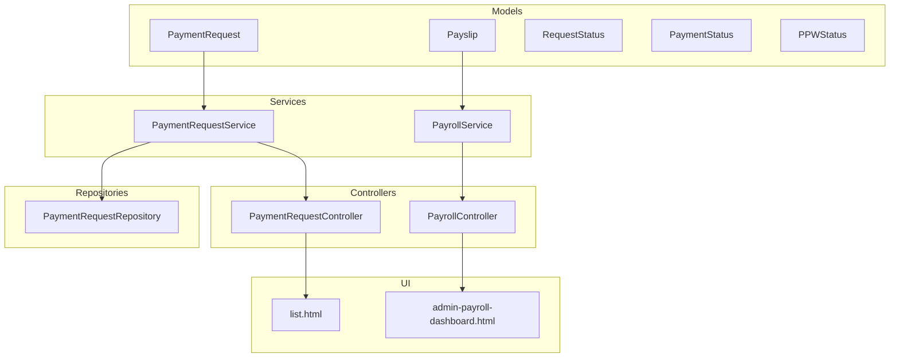
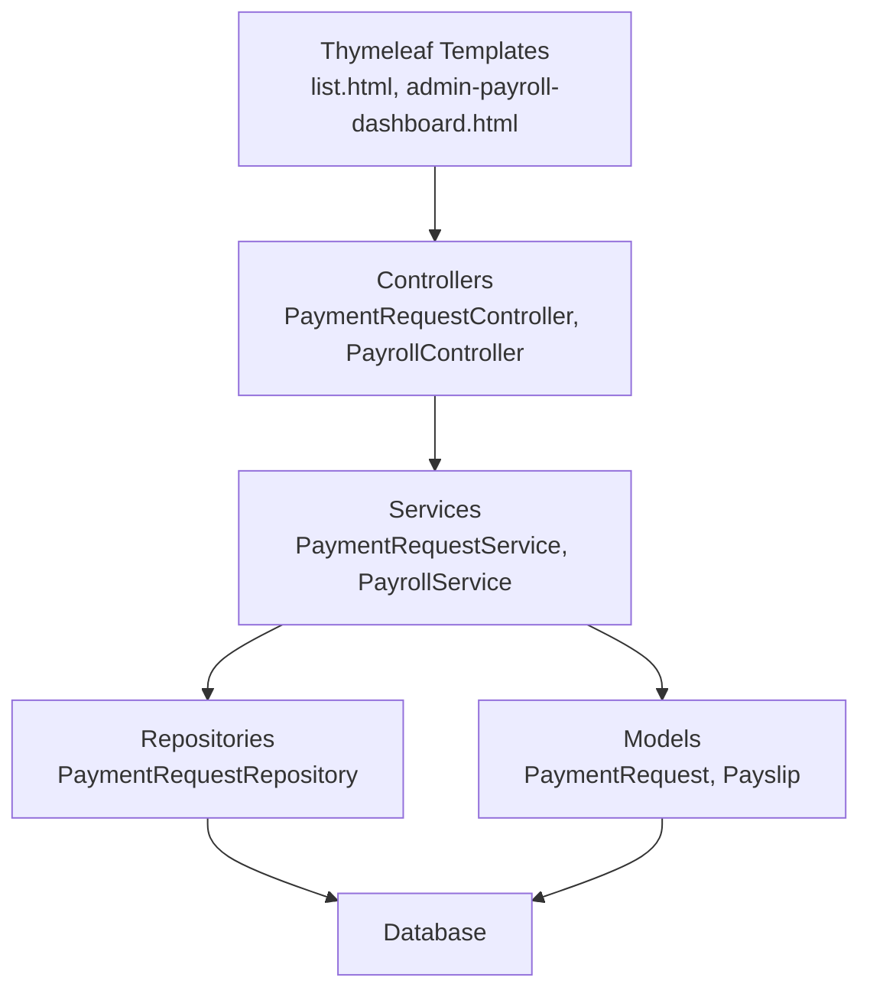
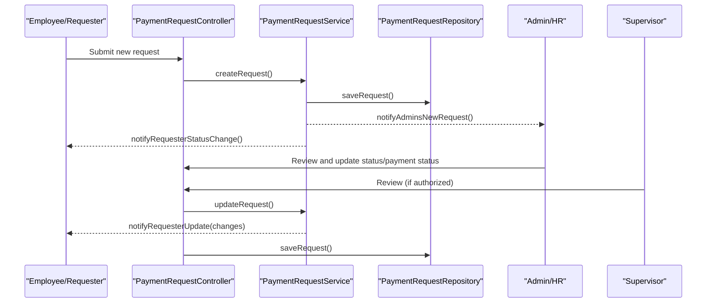
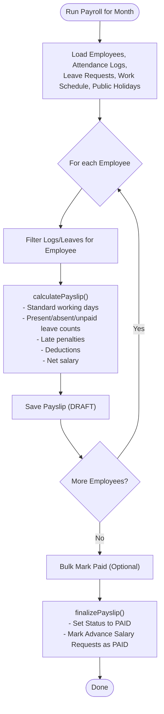
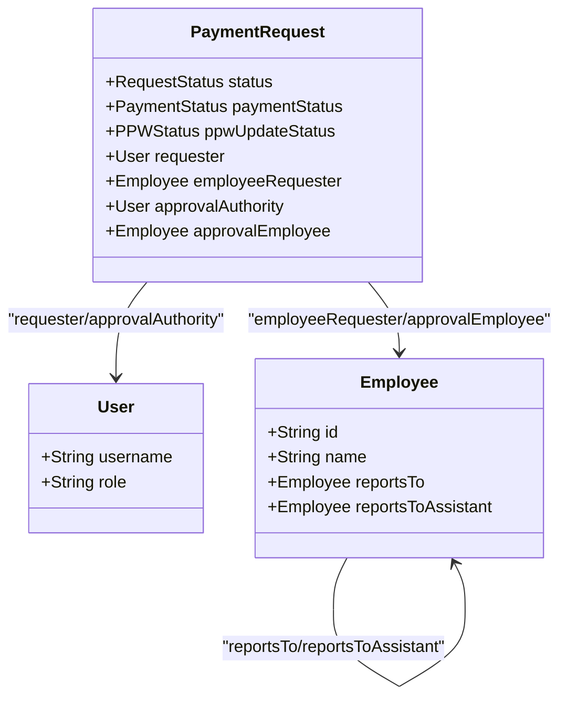
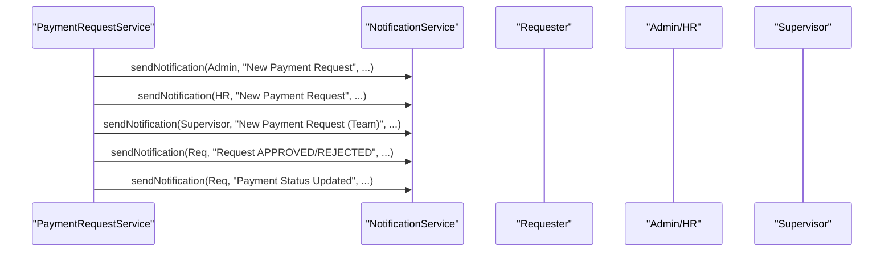
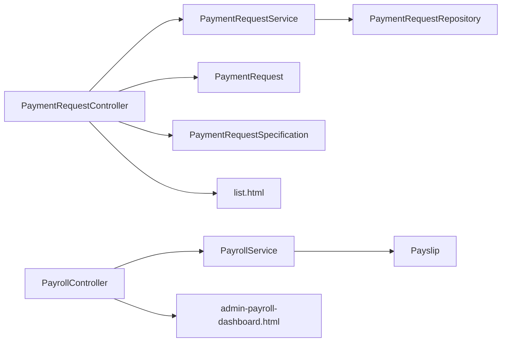

# Payroll Workflow Management

<cite>
**Referenced Files in This Document**
- [PaymentRequest.java](file://src/main/java/root/cyb/mh/attendancesystem/model/PaymentRequest.java)
- [Payslip.java](file://src/main/java/root/cyb/mh/attendancesystem/model/Payslip.java)
- [PPWStatus.java](file://src/main/java/root/cyb/mh/attendancesystem/model/enums/PPWStatus.java)
- [PaymentStatus.java](file://src/main/java/root/cyb/mh/attendancesystem/model/enums/PaymentStatus.java)
- [RequestStatus.java](file://src/main/java/root/cyb/mh/attendancesystem/model/enums/RequestStatus.java)
- [PaymentRequestService.java](file://src/main/java/root/cyb/mh/attendancesystem/service/PaymentRequestService.java)
- [PayrollService.java](file://src/main/java/root/cyb/mh/attendancesystem/service/PayrollService.java)
- [PaymentRequestController.java](file://src/main/java/root/cyb/mh/attendancesystem/controller/PaymentRequestController.java)
- [PayrollController.java](file://src/main/java/root/cyb/mh/attendancesystem/controller/PayrollController.java)
- [PaymentRequestRepository.java](file://src/main/java/root/cyb/mh/attendancesystem/repository/PaymentRequestRepository.java)
- [PaymentRequestSpecification.java](file://src/main/java/root/cyb/mh/attendancesystem/specification/PaymentRequestSpecification.java)
- [Employee.java](file://src/main/java/root/cyb/mh/attendancesystem/model/Employee.java)
- [WorkOrder.java](file://src/main/java/root/cyb/mh/attendancesystem/model/WorkOrder.java)
- [list.html](file://src/main/resources/templates/payment-request/list.html)
- [admin-payroll-dashboard.html](file://src/main/resources/templates/admin-payroll-dashboard.html)
</cite>

## Table of Contents
1. [Introduction](#introduction)
2. [Project Structure](#project-structure)
3. [Core Components](#core-components)
4. [Architecture Overview](#architecture-overview)
5. [Detailed Component Analysis](#detailed-component-analysis)
6. [Dependency Analysis](#dependency-analysis)
7. [Performance Considerations](#performance-considerations)
8. [Troubleshooting Guide](#troubleshooting-guide)
9. [Conclusion](#conclusion)

## Introduction
This document describes the complete payroll workflow management system, covering status tracking, approval processes, administrative controls, and end-to-end execution from draft creation through final payment. It explains bulk operations, status updates, workflow automation rules, role-based permissions, approval hierarchies, audit trails, monitoring, exception handling, recovery procedures, customization, escalation rules, and integration points with external approval systems. Examples of common workflow scenarios and troubleshooting guidance are included to support operational teams.

## Project Structure
The payroll workflow spans models, services, controllers, repositories, specifications, and UI templates:
- Models define domain entities and enumerations for statuses and priorities
- Services encapsulate business logic for approvals, payroll generation, and status transitions
- Controllers manage HTTP endpoints, filtering, sorting, and user interactions
- Repositories provide data access and analytical queries
- Specifications enable dynamic filtering for request lists
- Templates render dashboards and forms for administrators and employees

**Diagram sources**
- [PaymentRequest.java:1-117](file://src/main/java/root/cyb/mh/attendancesystem/model/PaymentRequest.java#L1-L117)
- [Payslip.java:1-57](file://src/main/java/root/cyb/mh/attendancesystem/model/Payslip.java#L1-L57)
- [RequestStatus.java:1-8](file://src/main/java/root/cyb/mh/attendancesystem/model/enums/RequestStatus.java#L1-L8)
- [PaymentStatus.java:1-9](file://src/main/java/root/cyb/mh/attendancesystem/model/enums/PaymentStatus.java#L1-L9)
- [PPWStatus.java:1-8](file://src/main/java/root/cyb/mh/attendancesystem/model/enums/PPWStatus.java#L1-L8)
- [PaymentRequestService.java:1-269](file://src/main/java/root/cyb/mh/attendancesystem/service/PaymentRequestService.java#L1-L269)
- [PayrollService.java:1-318](file://src/main/java/root/cyb/mh/attendancesystem/service/PayrollService.java#L1-L318)
- [PaymentRequestController.java:1-688](file://src/main/java/root/cyb/mh/attendancesystem/controller/PaymentRequestController.java#L1-L688)
- [PayrollController.java:1-223](file://src/main/java/root/cyb/mh/attendancesystem/controller/PayrollController.java#L1-L223)
- [PaymentRequestRepository.java:1-742](file://src/main/java/root/cyb/mh/attendancesystem/repository/PaymentRequestRepository.java#L1-L742)
- [list.html:1-431](file://src/main/resources/templates/payment-request/list.html#L1-L431)
- [admin-payroll-dashboard.html:1-255](file://src/main/resources/templates/admin-payroll-dashboard.html#L1-L255)

**Section sources**
- [PaymentRequest.java:1-117](file://src/main/java/root/cyb/mh/attendancesystem/model/PaymentRequest.java#L1-L117)
- [Payslip.java:1-57](file://src/main/java/root/cyb/mh/attendancesystem/model/Payslip.java#L1-L57)
- [PaymentRequestService.java:1-269](file://src/main/java/root/cyb/mh/attendancesystem/service/PaymentRequestService.java#L1-L269)
- [PayrollService.java:1-318](file://src/main/java/root/cyb/mh/attendancesystem/service/PayrollService.java#L1-L318)
- [PaymentRequestController.java:1-688](file://src/main/java/root/cyb/mh/attendancesystem/controller/PaymentRequestController.java#L1-L688)
- [PayrollController.java:1-223](file://src/main/java/root/cyb/mh/attendancesystem/controller/PayrollController.java#L1-L223)
- [PaymentRequestRepository.java:1-742](file://src/main/java/root/cyb/mh/attendancesystem/repository/PaymentRequestRepository.java#L1-L742)
- [list.html:1-431](file://src/main/resources/templates/payment-request/list.html#L1-L431)
- [admin-payroll-dashboard.html:1-255](file://src/main/resources/templates/admin-payroll-dashboard.html#L1-L255)

## Core Components
- PaymentRequest: Captures approval and payment lifecycle, requester identity, work order linkage, payment method/account, and audit fields
- Payslip: Represents monthly payroll drafts and final payments with attendance-driven calculations
- Enums: RequestStatus (PENDING, APPROVED, REJECTED), PaymentStatus (PAID, UNPAID, ISSUE, CASH_APP_REQUESTED), PPWStatus (UPDATED, NOT_UPDATED, DISPUTE)
- PaymentRequestService: Handles creation, notifications, sorting, and requester/supervisor notifications
- PayrollService: Generates payslips per month, applies attendance/leave/lates, computes deductions and net pay, and marks payslips as PAID
- Controllers: Expose endpoints for listing, filtering, reviewing, exporting, bulk actions, and payroll runs
- Repositories: Provide CRUD, search, and analytical aggregations for reporting and dashboards
- Specifications: Build dynamic filters for request listings

**Section sources**
- [PaymentRequest.java:1-117](file://src/main/java/root/cyb/mh/attendancesystem/model/PaymentRequest.java#L1-L117)
- [Payslip.java:1-57](file://src/main/java/root/cyb/mh/attendancesystem/model/Payslip.java#L1-L57)
- [RequestStatus.java:1-8](file://src/main/java/root/cyb/mh/attendancesystem/model/enums/RequestStatus.java#L1-L8)
- [PaymentStatus.java:1-9](file://src/main/java/root/cyb/mh/attendancesystem/model/enums/PaymentStatus.java#L1-L9)
- [PPWStatus.java:1-8](file://src/main/java/root/cyb/mh/attendancesystem/model/enums/PPWStatus.java#L1-L8)
- [PaymentRequestService.java:1-269](file://src/main/java/root/cyb/mh/attendancesystem/service/PaymentRequestService.java#L1-L269)
- [PayrollService.java:1-318](file://src/main/java/root/cyb/mh/attendancesystem/service/PayrollService.java#L1-L318)
- [PaymentRequestController.java:1-688](file://src/main/java/root/cyb/mh/attendancesystem/controller/PaymentRequestController.java#L1-L688)
- [PayrollController.java:1-223](file://src/main/java/root/cyb/mh/attendancesystem/controller/PayrollController.java#L1-L223)
- [PaymentRequestRepository.java:1-742](file://src/main/java/root/cyb/mh/attendancesystem/repository/PaymentRequestRepository.java#L1-L742)
- [PaymentRequestSpecification.java:1-93](file://src/main/java/root/cyb/mh/attendancesystem/specification/PaymentRequestSpecification.java#L1-L93)

## Architecture Overview
The system follows a layered architecture:
- Presentation: Controllers expose REST endpoints and serve Thymeleaf views
- Application: Services orchestrate business rules and coordinate with repositories
- Persistence: JPA repositories manage entities and analytical queries
- UI: Templates render dashboards, forms, and lists with filtering and sorting

**Diagram sources**
- [PaymentRequestController.java:1-688](file://src/main/java/root/cyb/mh/attendancesystem/controller/PaymentRequestController.java#L1-L688)
- [PayrollController.java:1-223](file://src/main/java/root/cyb/mh/attendancesystem/controller/PayrollController.java#L1-L223)
- [PaymentRequestService.java:1-269](file://src/main/java/root/cyb/mh/attendancesystem/service/PaymentRequestService.java#L1-L269)
- [PayrollService.java:1-318](file://src/main/java/root/cyb/mh/attendancesystem/service/PayrollService.java#L1-L318)
- [PaymentRequestRepository.java:1-742](file://src/main/java/root/cyb/mh/attendancesystem/repository/PaymentRequestRepository.java#L1-L742)
- [list.html:1-431](file://src/main/resources/templates/payment-request/list.html#L1-L431)
- [admin-payroll-dashboard.html:1-255](file://src/main/resources/templates/admin-payroll-dashboard.html#L1-L255)

## Detailed Component Analysis

### Payment Request Workflow
The payment request lifecycle includes creation, review/approval, status updates, and payment execution with notifications and audit trails.

**Diagram sources**
- [PaymentRequestController.java:260-281](file://src/main/java/root/cyb/mh/attendancesystem/controller/PaymentRequestController.java#L260-L281)
- [PaymentRequestService.java:29-60](file://src/main/java/root/cyb/mh/attendancesystem/service/PaymentRequestService.java#L29-L60)
- [PaymentRequestService.java:88-90](file://src/main/java/root/cyb/mh/attendancesystem/service/PaymentRequestService.java#L88-L90)
- [PaymentRequestService.java:92-125](file://src/main/java/root/cyb/mh/attendancesystem/service/PaymentRequestService.java#L92-L125)
- [PaymentRequestService.java:127-142](file://src/main/java/root/cyb/mh/attendancesystem/service/PaymentRequestService.java#L127-L142)
- [PaymentRequestService.java:164-204](file://src/main/java/root/cyb/mh/attendancesystem/service/PaymentRequestService.java#L164-L204)
- [PaymentRequestRepository.java:1-742](file://src/main/java/root/cyb/mh/attendancesystem/repository/PaymentRequestRepository.java#L1-L742)

Key workflow states and transitions:
- Creation: Request defaults to PENDING with current date and timestamp updates
- Review: Authorized users (Admin/HR or Supervisor) can update status, payment status, PPW status, and internal notes
- Notifications: Automated notifications on status change and payment status change
- Restrictions: Locked updates when payment status is PAID; update limits enforced for non-admin reviewers

Bulk operations:
- Export payment requests to CSV/PDF with selected columns and filters
- Delete REJECTED requests (Admin only)

**Section sources**
- [PaymentRequest.java:1-117](file://src/main/java/root/cyb/mh/attendancesystem/model/PaymentRequest.java#L1-L117)
- [RequestStatus.java:1-8](file://src/main/java/root/cyb/mh/attendancesystem/model/enums/RequestStatus.java#L1-L8)
- [PaymentStatus.java:1-9](file://src/main/java/root/cyb/mh/attendancesystem/model/enums/PaymentStatus.java#L1-L9)
- [PPWStatus.java:1-8](file://src/main/java/root/cyb/mh/attendancesystem/model/enums/PPWStatus.java#L1-L8)
- [PaymentRequestController.java:65-147](file://src/main/java/root/cyb/mh/attendancesystem/controller/PaymentRequestController.java#L65-L147)
- [PaymentRequestController.java:149-194](file://src/main/java/root/cyb/mh/attendancesystem/controller/PaymentRequestController.java#L149-L194)
- [PaymentRequestController.java:519-537](file://src/main/java/root/cyb/mh/attendancesystem/controller/PaymentRequestController.java#L519-L537)
- [PaymentRequestService.java:29-60](file://src/main/java/root/cyb/mh/attendancesystem/service/PaymentRequestService.java#L29-L60)
- [PaymentRequestService.java:127-142](file://src/main/java/root/cyb/mh/attendancesystem/service/PaymentRequestService.java#L127-L142)
- [PaymentRequestService.java:164-204](file://src/main/java/root/cyb/mh/attendancesystem/service/PaymentRequestService.java#L164-L204)
- [PaymentRequestRepository.java:1-742](file://src/main/java/root/cyb/mh/attendancesystem/repository/PaymentRequestRepository.java#L1-L742)
- [list.html:1-431](file://src/main/resources/templates/payment-request/list.html#L1-L431)

### Payroll Generation and Execution
Payroll generation computes monthly payslips from attendance, leave, and schedule data, then supports bulk marking as paid and individual status updates.

**Diagram sources**
- [PayrollService.java:39-70](file://src/main/java/root/cyb/mh/attendancesystem/service/PayrollService.java#L39-L70)
- [PayrollService.java:94-290](file://src/main/java/root/cyb/mh/attendancesystem/service/PayrollService.java#L94-L290)
- [PayrollService.java:292-316](file://src/main/java/root/cyb/mh/attendancesystem/service/PayrollService.java#L292-L316)
- [PayrollController.java:96-105](file://src/main/java/root/cyb/mh/attendancesystem/controller/PayrollController.java#L96-L105)
- [PayrollController.java:79-93](file://src/main/java/root/cyb/mh/attendancesystem/controller/PayrollController.java#L79-L93)

Workflow states:
- Payslip Status: DRAFT → PAID
- Attendance-driven computation: Actual vs. standard working days, leave types, lateness thresholds
- Deductions: Absences, unpaid leaves, late penalties, and advance salary deductions
- Net pay: Gross plus allowances and bonuses minus total deductions

Bulk operations:
- Bulk mark paid for all DRAFT payslips in a month
- Export bank advice for payment processing

**Section sources**
- [Payslip.java:1-57](file://src/main/java/root/cyb/mh/attendancesystem/model/Payslip.java#L1-L57)
- [PayrollService.java:94-290](file://src/main/java/root/cyb/mh/attendancesystem/service/PayrollService.java#L94-L290)
- [PayrollService.java:292-316](file://src/main/java/root/cyb/mh/attendancesystem/service/PayrollService.java#L292-L316)
- [PayrollController.java:96-105](file://src/main/java/root/cyb/mh/attendancesystem/controller/PayrollController.java#L96-L105)
- [PayrollController.java:108-113](file://src/main/java/root/cyb/mh/attendancesystem/controller/PayrollController.java#L108-L113)
- [admin-payroll-dashboard.html:1-255](file://src/main/resources/templates/admin-payroll-dashboard.html#L1-L255)

### Role-Based Permissions and Approval Hierarchies
Access control ensures only authorized users can review and approve requests:
- Admin/HR: Full access to review, update, export, and delete REJECTED requests
- Supervisor: Can review requests from subordinates (reports-to or assistant)
- Employee: Can add notes to PENDING requests and view invoices for PAID requests
- Restrictions: Locked fields when payment status is PAID; update limits for non-admin reviewers

**Diagram sources**
- [PaymentRequest.java:1-117](file://src/main/java/root/cyb/mh/attendancesystem/model/PaymentRequest.java#L1-L117)
- [Employee.java:1-64](file://src/main/java/root/cyb/mh/attendancesystem/model/Employee.java#L1-L64)
- [PaymentRequestController.java:283-331](file://src/main/java/root/cyb/mh/attendancesystem/controller/PaymentRequestController.java#L283-L331)
- [PaymentRequestController.java:333-517](file://src/main/java/root/cyb/mh/attendancesystem/controller/PaymentRequestController.java#L333-L517)

**Section sources**
- [PaymentRequestController.java:283-331](file://src/main/java/root/cyb/mh/attendancesystem/controller/PaymentRequestController.java#L283-L331)
- [PaymentRequestController.java:333-517](file://src/main/java/root/cyb/mh/attendancesystem/controller/PaymentRequestController.java#L333-L517)
- [Employee.java:1-64](file://src/main/java/root/cyb/mh/attendancesystem/model/Employee.java#L1-L64)

### Audit Trails and Monitoring
- Timestamps: Automatic lastModified updates on persistence
- Notifications: Email/SMS notifications for status changes and payment updates
- Export capabilities: CSV/PDF exports for compliance and reconciliation
- Dashboards: Request listing with filters, sorting, and export modal; payroll dashboard with charts and run history

**Diagram sources**
- [PaymentRequestService.java:92-125](file://src/main/java/root/cyb/mh/attendancesystem/service/PaymentRequestService.java#L92-L125)
- [PaymentRequestService.java:127-162](file://src/main/java/root/cyb/mh/attendancesystem/service/PaymentRequestService.java#L127-L162)
- [PaymentRequestService.java:164-204](file://src/main/java/root/cyb/mh/attendancesystem/service/PaymentRequestService.java#L164-L204)

**Section sources**
- [PaymentRequest.java:25-31](file://src/main/java/root/cyb/mh/attendancesystem/model/PaymentRequest.java#L25-L31)
- [PaymentRequestService.java:92-125](file://src/main/java/root/cyb/mh/attendancesystem/service/PaymentRequestService.java#L92-L125)
- [PaymentRequestService.java:127-162](file://src/main/java/root/cyb/mh/attendancesystem/service/PaymentRequestService.java#L127-L162)
- [list.html:1-431](file://src/main/resources/templates/payment-request/list.html#L1-L431)
- [admin-payroll-dashboard.html:1-255](file://src/main/resources/templates/admin-payroll-dashboard.html#L1-L255)

### Workflow Automation Rules
- Automatic timestamps on create/update
- Auto-population of deprecated fields for backward compatibility
- Auto-update of check status when a reviewer accesses a request
- Locked updates when payment status is PAID
- Update limits enforced via system setting for non-admin reviewers
- Bulk operations for payroll runs and batch status updates

**Section sources**
- [PaymentRequest.java:27-31](file://src/main/java/root/cyb/mh/attendancesystem/model/PaymentRequest.java#L27-L31)
- [PaymentRequestService.java:44-60](file://src/main/java/root/cyb/mh/attendancesystem/service/PaymentRequestService.java#L44-L60)
- [PaymentRequestController.java:311-317](file://src/main/java/root/cyb/mh/attendancesystem/controller/PaymentRequestController.java#L311-L317)
- [PaymentRequestController.java:414-425](file://src/main/java/root/cyb/mh/attendancesystem/controller/PaymentRequestController.java#L414-L425)
- [PayrollController.java:96-105](file://src/main/java/root/cyb/mh/attendancesystem/controller/PayrollController.java#L96-L105)

### Escalation Rules and External Approvals
- Hierarchical approvals: Admin/HR can approve directly; supervisors can approve subordinates
- Escalation: When supervisors lack authority, Admin/HR handles approvals
- External integrations: Payment method references and payment account details support external payment systems; invoice generation and email delivery facilitate external communication

**Section sources**
- [PaymentRequestController.java:355-383](file://src/main/java/root/cyb/mh/attendancesystem/controller/PaymentRequestController.java#L355-L383)
- [PaymentRequest.java:56-61](file://src/main/java/root/cyb/mh/attendancesystem/model/PaymentRequest.java#L56-L61)
- [PaymentRequestController.java:584-607](file://src/main/java/root/cyb/mh/attendancesystem/controller/PaymentRequestController.java#L584-L607)

### Common Workflow Scenarios
- Submit a payment request: Employee or user submits a request; system notifies Admin/HR and Supervisor
- Supervisor review: Supervisor approves or rejects; system enforces restrictions and update limits
- Admin override: Admin reviews and updates status/payment status; notifies requester
- Generate payroll: System computes payslips per employee; allows bulk mark paid and export
- Employee view: Employee sees personal payslips and financial insights

**Section sources**
- [PaymentRequestController.java:260-281](file://src/main/java/root/cyb/mh/attendancesystem/controller/PaymentRequestController.java#L260-L281)
- [PaymentRequestController.java:333-517](file://src/main/java/root/cyb/mh/attendancesystem/controller/PaymentRequestController.java#L333-L517)
- [PayrollController.java:108-113](file://src/main/java/root/cyb/mh/attendancesystem/controller/PayrollController.java#L108-L113)
- [PayrollController.java:143-195](file://src/main/java/root/cyb/mh/attendancesystem/controller/PayrollController.java#L143-L195)

## Dependency Analysis
The system exhibits clear separation of concerns with minimal coupling:
- Controllers depend on services and repositories
- Services depend on repositories and models
- Repositories encapsulate persistence and analytics
- UI templates depend on controllers for data binding

**Diagram sources**
- [PaymentRequestController.java:1-688](file://src/main/java/root/cyb/mh/attendancesystem/controller/PaymentRequestController.java#L1-L688)
- [PayrollController.java:1-223](file://src/main/java/root/cyb/mh/attendancesystem/controller/PayrollController.java#L1-L223)
- [PaymentRequestService.java:1-269](file://src/main/java/root/cyb/mh/attendancesystem/service/PaymentRequestService.java#L1-L269)
- [PayrollService.java:1-318](file://src/main/java/root/cyb/mh/attendancesystem/service/PayrollService.java#L1-L318)
- [PaymentRequestRepository.java:1-742](file://src/main/java/root/cyb/mh/attendancesystem/repository/PaymentRequestRepository.java#L1-L742)
- [PaymentRequestSpecification.java:1-93](file://src/main/java/root/cyb/mh/attendancesystem/specification/PaymentRequestSpecification.java#L1-L93)
- [list.html:1-431](file://src/main/resources/templates/payment-request/list.html#L1-L431)
- [admin-payroll-dashboard.html:1-255](file://src/main/resources/templates/admin-payroll-dashboard.html#L1-L255)

**Section sources**
- [PaymentRequestRepository.java:1-742](file://src/main/java/root/cyb/mh/attendancesystem/repository/PaymentRequestRepository.java#L1-L742)
- [PaymentRequestSpecification.java:1-93](file://src/main/java/root/cyb/mh/attendancesystem/specification/PaymentRequestSpecification.java#L1-L93)

## Performance Considerations
- Bulk data loading: PayrollService loads attendance and leave data in batches per month to reduce repeated queries
- Index-friendly queries: Repositories provide optimized JPQL and native queries for analytics and dashboards
- Sorting and filtering: UI supports server-side sorting and filtering to avoid large client-side rendering
- Export efficiency: Export endpoints stream CSV/PDF to reduce memory overhead

[No sources needed since this section provides general guidance]

## Troubleshooting Guide
Common issues and resolutions:
- Access denied: Ensure user roles include ADMIN or HR; supervisors must be linked to the requester’s hierarchy
- Locked status when PAID: Payment-related fields cannot be changed once payment status is PAID
- Update limit reached: Non-admin reviewers are restricted after exceeding configured update limit
- Export errors: Verify filters and column selections; ensure proper file permissions for CSV/PDF generation
- Invoice availability: Invoices are downloadable only for PAID requests

**Section sources**
- [PaymentRequestController.java:381-425](file://src/main/java/root/cyb/mh/attendancesystem/controller/PaymentRequestController.java#L381-L425)
- [PaymentRequestController.java:519-537](file://src/main/java/root/cyb/mh/attendancesystem/controller/PaymentRequestController.java#L519-L537)
- [PaymentRequestController.java:539-582](file://src/main/java/root/cyb/mh/attendancesystem/controller/PaymentRequestController.java#L539-L582)
- [PayrollController.java:96-105](file://src/main/java/root/cyb/mh/attendancesystem/controller/PayrollController.java#L96-L105)

## Conclusion
The payroll workflow management system provides a robust foundation for payment request approvals, payroll generation, and execution. It incorporates role-based permissions, audit trails, automation rules, and monitoring capabilities. The modular design enables customization, escalations, and integration with external payment systems while maintaining operational efficiency and compliance.