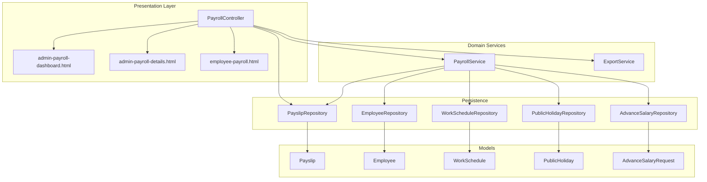
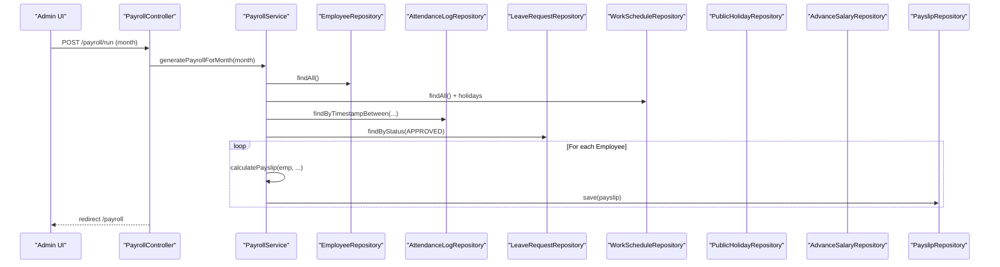
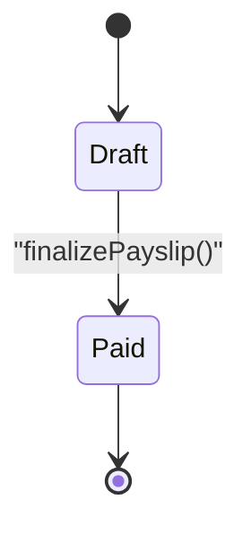
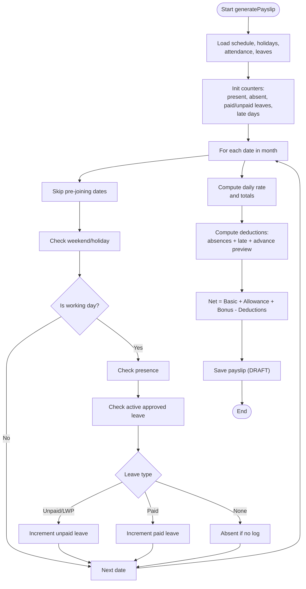
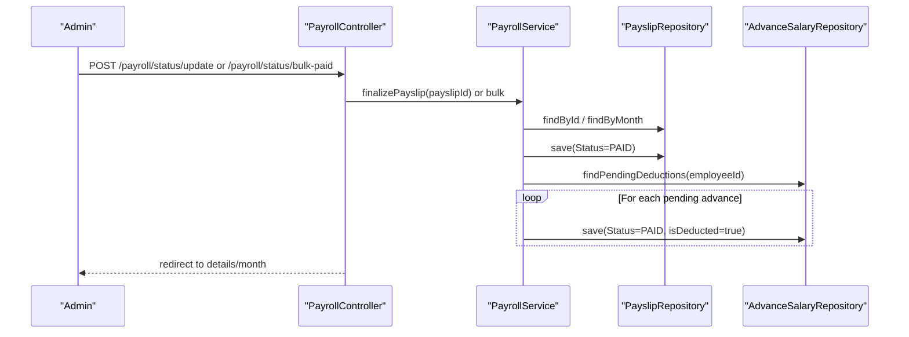
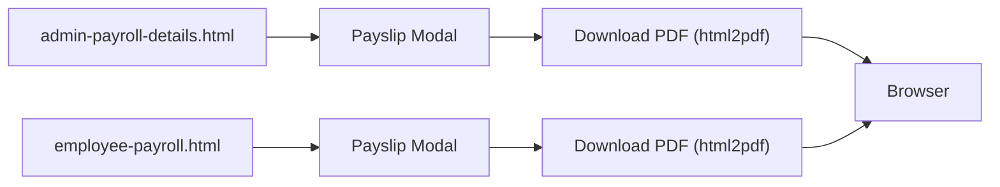
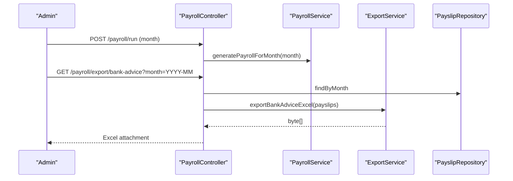
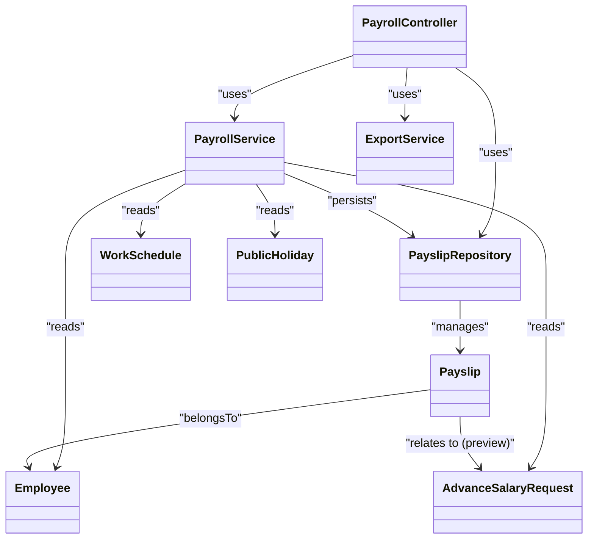

# Payslip Generation

<cite>
**Referenced Files in This Document**
- [Payslip.java](file://src/main/java/root/cyb/mh/attendancesystem/model/Payslip.java)
- [PayslipRepository.java](file://src/main/java/root/cyb/mh/attendancesystem/repository/PayslipRepository.java)
- [PayrollService.java](file://src/main/java/root/cyb/mh/attendancesystem/service/PayrollService.java)
- [PayrollController.java](file://src/main/java/root/cyb/mh/attendancesystem/controller/PayrollController.java)
- [admin-payroll-dashboard.html](file://src/main/resources/templates/admin-payroll-dashboard.html)
- [admin-payroll-details.html](file://src/main/resources/templates/admin-payroll-details.html)
- [employee-payroll.html](file://src/main/resources/templates/employee-payroll.html)
- [ExportService.java](file://src/main/java/root/cyb/mh/attendancesystem/service/ExportService.java)
- [Employee.java](file://src/main/java/root/cyb/mh/attendancesystem/model/Employee.java)
- [WorkSchedule.java](file://src/main/java/root/cyb/mh/attendancesystem/model/WorkSchedule.java)
- [PublicHoliday.java](file://src/main/java/root/cyb/mh/attendancesystem/model/PublicHoliday.java)
- [AdvanceSalaryRequest.java](file://src/main/java/root/cyb/mh/attendancesystem/model/AdvanceSalaryRequest.java)
- [PayrollMonthlySummaryDto.java](file://src/main/java/root/cyb/mh/attendancesystem/dto/PayrollMonthlySummaryDto.java)
</cite>

## Table of Contents
1. [Introduction](#introduction)
2. [Project Structure](#project-structure)
3. [Core Components](#core-components)
4. [Architecture Overview](#architecture-overview)
5. [Detailed Component Analysis](#detailed-component-analysis)
6. [Dependency Analysis](#dependency-analysis)
7. [Performance Considerations](#performance-considerations)
8. [Troubleshooting Guide](#troubleshooting-guide)
9. [Conclusion](#conclusion)

## Introduction
This document describes the payslip generation system end-to-end. It explains how raw payroll data is transformed into finalized payslips, including calculation rules, lifecycle stages, templates, PDF generation, batch processing, validation, and export capabilities. It also outlines approval workflows, branding hooks via templates, and operational guidance for reliability and compliance.

## Project Structure
The payslip system spans model entities, repositories, services, controllers, and Thymeleaf templates. The backend orchestrates generation and lifecycle updates, while templates render dashboards, details, and printable previews. Export services support bank advice exports.

**Diagram sources**
- [PayrollController.java:16-223](file://src/main/java/root/cyb/mh/attendancesystem/controller/PayrollController.java#L16-L223)
- [PayrollService.java:15-318](file://src/main/java/root/cyb/mh/attendancesystem/service/PayrollService.java#L15-L318)
- [PayslipRepository.java:8-15](file://src/main/java/root/cyb/mh/attendancesystem/repository/PayslipRepository.java#L8-L15)
- [Payslip.java:14-56](file://src/main/java/root/cyb/mh/attendancesystem/model/Payslip.java#L14-L56)
- [Employee.java:13-64](file://src/main/java/root/cyb/mh/attendancesystem/model/Employee.java#L13-L64)
- [WorkSchedule.java:13-49](file://src/main/java/root/cyb/mh/attendancesystem/model/WorkSchedule.java#L13-L49)
- [PublicHoliday.java:12-20](file://src/main/java/root/cyb/mh/attendancesystem/model/PublicHoliday.java#L12-L20)
- [AdvanceSalaryRequest.java:14-49](file://src/main/java/root/cyb/mh/attendancesystem/model/AdvanceSalaryRequest.java#L14-L49)
- [admin-payroll-dashboard.html:1-255](file://src/main/resources/templates/admin-payroll-dashboard.html#L1-L255)
- [admin-payroll-details.html:1-530](file://src/main/resources/templates/admin-payroll-details.html#L1-L530)
- [employee-payroll.html:1-464](file://src/main/resources/templates/employee-payroll.html#L1-L464)
- [ExportService.java:541-579](file://src/main/java/root/cyb/mh/attendancesystem/service/ExportService.java#L541-L579)

**Section sources**
- [PayrollController.java:16-223](file://src/main/java/root/cyb/mh/attendancesystem/controller/PayrollController.java#L16-L223)
- [PayrollService.java:15-318](file://src/main/java/root/cyb/mh/attendancesystem/service/PayrollService.java#L15-L318)
- [PayslipRepository.java:8-15](file://src/main/java/root/cyb/mh/attendancesystem/repository/PayslipRepository.java#L8-L15)
- [Payslip.java:14-56](file://src/main/java/root/cyb/mh/attendancesystem/model/Payslip.java#L14-L56)
- [admin-payroll-dashboard.html:1-255](file://src/main/resources/templates/admin-payroll-dashboard.html#L1-L255)
- [admin-payroll-details.html:1-530](file://src/main/resources/templates/admin-payroll-details.html#L1-L530)
- [employee-payroll.html:1-464](file://src/main/resources/templates/employee-payroll.html#L1-L464)
- [ExportService.java:541-579](file://src/main/java/root/cyb/mh/attendancesystem/service/ExportService.java#L541-L579)

## Core Components
- Payslip entity encapsulates the computed pay components, attendance snapshot, and lifecycle status.
- PayrollService performs batch and per-employee generation, applies attendance/leave rules, computes daily rates, and persists payslips.
- PayrollController exposes endpoints for triggering generation, viewing summaries, updating statuses, and exporting bank advice.
- Templates render dashboards, details, and preview modal with PDF export via browser-side conversion.
- ExportService generates bank advice spreadsheets for payroll disbursement.

Key responsibilities:
- Calculation engine: attendance, leaves, late penalties, daily rate basis, and advance salary preview.
- Lifecycle: DRAFT → PAID with optional batch finalize.
- Presentation: admin dashboards, employee self-service, and printable payslips.

**Section sources**
- [Payslip.java:14-56](file://src/main/java/root/cyb/mh/attendancesystem/model/Payslip.java#L14-L56)
- [PayrollService.java:39-290](file://src/main/java/root/cyb/mh/attendancesystem/service/PayrollService.java#L39-L290)
- [PayrollController.java:28-113](file://src/main/java/root/cyb/mh/attendancesystem/controller/PayrollController.java#L28-L113)
- [admin-payroll-details.html:282-410](file://src/main/resources/templates/admin-payroll-details.html#L282-L410)
- [ExportService.java:541-579](file://src/main/java/root/cyb/mh/attendancesystem/service/ExportService.java#L541-L579)

## Architecture Overview
The system follows a layered architecture:
- Controllers handle HTTP requests and delegate to services.
- Services orchestrate domain logic, repository access, and calculations.
- Repositories persist and query domain entities.
- Templates render dashboards and printable payslips with embedded JavaScript for PDF export.

**Diagram sources**
- [PayrollController.java:108-113](file://src/main/java/root/cyb/mh/attendancesystem/controller/PayrollController.java#L108-L113)
- [PayrollService.java:39-92](file://src/main/java/root/cyb/mh/attendancesystem/service/PayrollService.java#L39-L92)
- [PayslipRepository.java:8-15](file://src/main/java/root/cyb/mh/attendancesystem/repository/PayslipRepository.java#L8-L15)

## Detailed Component Analysis

### Payslip Entity and Lifecycle
- Fields include financials (basic, allowance, bonus, deductions, net), attendance snapshot (working days, present, absent, paid/unpaid leaves), late penalty counters, and advance salary preview.
- Status transitions: DRAFT → PAID. Paid payslips are locked from regeneration.

**Diagram sources**
- [Payslip.java:52-56](file://src/main/java/root/cyb/mh/attendancesystem/model/Payslip.java#L52-L56)
- [PayrollService.java:292-316](file://src/main/java/root/cyb/mh/attendancesystem/service/PayrollService.java#L292-L316)

**Section sources**
- [Payslip.java:14-56](file://src/main/java/root/cyb/mh/attendancesystem/model/Payslip.java#L14-L56)
- [PayrollService.java:109-122](file://src/main/java/root/cyb/mh/attendancesystem/service/PayrollService.java#L109-L122)

### Payroll Calculation Engine
Core computation steps:
- Determine standard monthly working days from schedule weekends and public holidays.
- Iterate month dates to compute presence, leave types (paid/unpaid), and absence.
- Compute late penalty using first check-in per day against schedule tolerance.
- Select daily rate basis (standard 30-day, actual working days, or fixed days).
- Aggregate allowances, bonuses, and deductions (absences, late penalties, advance preview).
- Round monetary values to two decimals.
- Persist payslip in DRAFT status.

**Diagram sources**
- [PayrollService.java:94-290](file://src/main/java/root/cyb/mh/attendancesystem/service/PayrollService.java#L94-L290)
- [WorkSchedule.java:13-49](file://src/main/java/root/cyb/mh/attendancesystem/model/WorkSchedule.java#L13-L49)
- [PublicHoliday.java:12-20](file://src/main/java/root/cyb/mh/attendancesystem/model/PublicHoliday.java#L12-L20)
- [Employee.java:52-58](file://src/main/java/root/cyb/mh/attendancesystem/model/Employee.java#L52-L58)

**Section sources**
- [PayrollService.java:127-290](file://src/main/java/root/cyb/mh/attendancesystem/service/PayrollService.java#L127-L290)
- [WorkSchedule.java:32-47](file://src/main/java/root/cyb/mh/attendancesystem/model/WorkSchedule.java#L32-L47)
- [PublicHoliday.java:12-20](file://src/main/java/root/cyb/mh/attendancesystem/model/PublicHoliday.java#L12-L20)
- [Employee.java:52-58](file://src/main/java/root/cyb/mh/attendancesystem/model/Employee.java#L52-L58)

### Lifecycle Management (Draft → Paid)
- Admin can update a single payslip status to PAID or revert to DRAFT.
- Batch finalize marks all DRAFT payslips for a month as PAID.
- On finalization, pending advance salary requests linked to the employee are marked as paid/deducted.

**Diagram sources**
- [PayrollController.java:79-105](file://src/main/java/root/cyb/mh/attendancesystem/controller/PayrollController.java#L79-L105)
- [PayrollService.java:292-316](file://src/main/java/root/cyb/mh/attendancesystem/service/PayrollService.java#L292-L316)
- [AdvanceSalaryRequest.java:14-49](file://src/main/java/root/cyb/mh/attendancesystem/model/AdvanceSalaryRequest.java#L14-L49)

**Section sources**
- [PayrollController.java:79-105](file://src/main/java/root/cyb/mh/attendancesystem/controller/PayrollController.java#L79-L105)
- [PayrollService.java:292-316](file://src/main/java/root/cyb/mh/attendancesystem/service/PayrollService.java#L292-L316)
- [AdvanceSalaryRequest.java:37-47](file://src/main/java/root/cyb/mh/attendancesystem/model/AdvanceSalaryRequest.java#L37-L47)

### Templates, Branding, and PDF Generation
- Admin dashboards and details pages render payslips with tabs for drafts and paid history.
- Employee self-service lists payslips and shows financial insights.
- Payslip preview modal displays earnings and deductions split view and prints/download PDF.
- PDF export uses browser-side conversion with html2pdf and jsPDF, applying a print-friendly container.

**Diagram sources**
- [admin-payroll-details.html:282-410](file://src/main/resources/templates/admin-payroll-details.html#L282-L410)
- [employee-payroll.html:153-302](file://src/main/resources/templates/employee-payroll.html#L153-L302)

**Section sources**
- [admin-payroll-dashboard.html:1-255](file://src/main/resources/templates/admin-payroll-dashboard.html#L1-L255)
- [admin-payroll-details.html:1-530](file://src/main/resources/templates/admin-payroll-details.html#L1-L530)
- [employee-payroll.html:1-464](file://src/main/resources/templates/employee-payroll.html#L1-L464)

### Batch Processing and Export
- Batch generation runs for all employees in a given month.
- Bank advice export produces an Excel sheet with employee identifiers, bank details, and net salary for payment processing.

**Diagram sources**
- [PayrollController.java:108-113](file://src/main/java/root/cyb/mh/attendancesystem/controller/PayrollController.java#L108-L113)
- [PayrollController.java:200-220](file://src/main/java/root/cyb/mh/attendancesystem/controller/PayrollController.java#L200-L220)
- [ExportService.java:541-579](file://src/main/java/root/cyb/mh/attendancesystem/service/ExportService.java#L541-L579)
- [PayrollService.java:39-70](file://src/main/java/root/cyb/mh/attendancesystem/service/PayrollService.java#L39-L70)

**Section sources**
- [PayrollController.java:108-113](file://src/main/java/root/cyb/mh/attendancesystem/controller/PayrollController.java#L108-L113)
- [PayrollController.java:200-220](file://src/main/java/root/cyb/mh/attendancesystem/controller/PayrollController.java#L200-L220)
- [ExportService.java:541-579](file://src/main/java/root/cyb/mh/attendancesystem/service/ExportService.java#L541-L579)

### Validation Rules and Compliance Notes
- Payslips are skipped for guest employees and future joiners whose joining date is after the end of the target month.
- Paid payslips are not regenerated; they are locked from recalculation.
- Deductions are computed from absence days, unpaid leave days, late penalties, and advance salary preview.
- Monetary amounts are rounded to two decimals for consistency.
- Bank advice export filters out zero-net payslips and includes only non-zero entries suitable for payment.

**Section sources**
- [PayrollService.java:101-107](file://src/main/java/root/cyb/mh/attendancesystem/service/PayrollService.java#L101-L107)
- [PayrollService.java:113-116](file://src/main/java/root/cyb/mh/attendancesystem/service/PayrollService.java#L113-L116)
- [PayrollService.java:255-277](file://src/main/java/root/cyb/mh/attendancesystem/service/PayrollService.java#L255-L277)
- [PayrollController.java:208-210](file://src/main/java/root/cyb/mh/attendancesystem/controller/PayrollController.java#L208-L210)

## Dependency Analysis
- PayrollService depends on Employee, AttendanceLog, LeaveRequest, WorkSchedule, PublicHoliday, Payslip, and AdvanceSalary repositories.
- PayrollController depends on PayrollService and ExportService and renders Thymeleaf templates.
- PayslipRepository provides lookup by month and employee for reporting and lifecycle operations.

**Diagram sources**
- [PayrollController.java:19-26](file://src/main/java/root/cyb/mh/attendancesystem/controller/PayrollController.java#L19-L26)
- [PayrollService.java:18-37](file://src/main/java/root/cyb/mh/attendancesystem/service/PayrollService.java#L18-L37)
- [PayslipRepository.java:8-15](file://src/main/java/root/cyb/mh/attendancesystem/repository/PayslipRepository.java#L8-L15)
- [Payslip.java:20-22](file://src/main/java/root/cyb/mh/attendancesystem/model/Payslip.java#L20-L22)
- [Employee.java:13-64](file://src/main/java/root/cyb/mh/attendancesystem/model/Employee.java#L13-L64)
- [WorkSchedule.java:13-49](file://src/main/java/root/cyb/mh/attendancesystem/model/WorkSchedule.java#L13-L49)
- [PublicHoliday.java:12-20](file://src/main/java/root/cyb/mh/attendancesystem/model/PublicHoliday.java#L12-L20)
- [AdvanceSalaryRequest.java:14-49](file://src/main/java/root/cyb/mh/attendancesystem/model/AdvanceSalaryRequest.java#L14-L49)

**Section sources**
- [PayrollService.java:18-37](file://src/main/java/root/cyb/mh/attendancesystem/service/PayrollService.java#L18-L37)
- [PayslipRepository.java:8-15](file://src/main/java/root/cyb/mh/attendancesystem/repository/PayslipRepository.java#L8-L15)

## Performance Considerations
- Bulk data loading: Attendance logs and approved leaves are fetched in bulk per month to minimize repeated queries.
- Per-employee filtering reduces memory footprint and improves throughput.
- Late penalty thresholding aggregates penalties efficiently using integer division.
- Monetary rounding prevents floating-point drift and ensures consistent display.

Recommendations:
- Index database columns used in filters (employee_id, timestamps, statuses).
- Consider pagination for large payroll histories.
- Cache global schedule and holiday lists for the run window.
- Monitor repository query counts and optimize joins if needed.

**Section sources**
- [PayrollService.java:51-68](file://src/main/java/root/cyb/mh/attendancesystem/service/PayrollService.java#L51-L68)
- [PayrollService.java:222-227](file://src/main/java/root/cyb/mh/attendancesystem/service/PayrollService.java#L222-L227)

## Troubleshooting Guide
Common issues and resolutions:
- Duplicate or stale payslips: Ensure the system does not regenerate PAID payslips; verify status checks before saving.
- Incorrect absence/leave counts: Verify employee joining date, weekend configuration, and approved leave periods.
- Late penalty discrepancies: Confirm first check-in per day logic and schedule tolerance minutes.
- Zero-net payslips in exports: Bank advice export intentionally excludes zero-net entries; adjust expectations or filter criteria.
- PDF export failures: Ensure html2pdf and jsPDF libraries are loaded; check browser console for errors.

Operational tips:
- Use the “New Run” modal to select month and trigger generation.
- Review draft tab before batch finalization.
- Use “Finalize Batch” to quickly approve all DRAFT payslips for a month.

**Section sources**
- [PayrollService.java:113-116](file://src/main/java/root/cyb/mh/attendancesystem/service/PayrollService.java#L113-L116)
- [PayrollController.java:16-223](file://src/main/java/root/cyb/mh/attendancesystem/controller/PayrollController.java#L16-L223)
- [admin-payroll-dashboard.html:168-199](file://src/main/resources/templates/admin-payroll-dashboard.html#L168-L199)
- [admin-payroll-details.html:132-142](file://src/main/resources/templates/admin-payroll-details.html#L132-L142)
- [PayrollController.java:208-210](file://src/main/java/root/cyb/mh/attendancesystem/controller/PayrollController.java#L208-L210)

## Conclusion
The payslip generation system integrates attendance, leave, and compensation data into accurate, printable payslips with a clear lifecycle from draft to paid. It supports batch processing, admin approvals, and export-ready formats for payroll disbursement. The modular design enables straightforward maintenance, extension for additional fields, and robustness through validation and rounding rules.