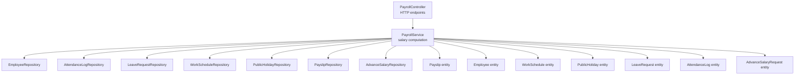
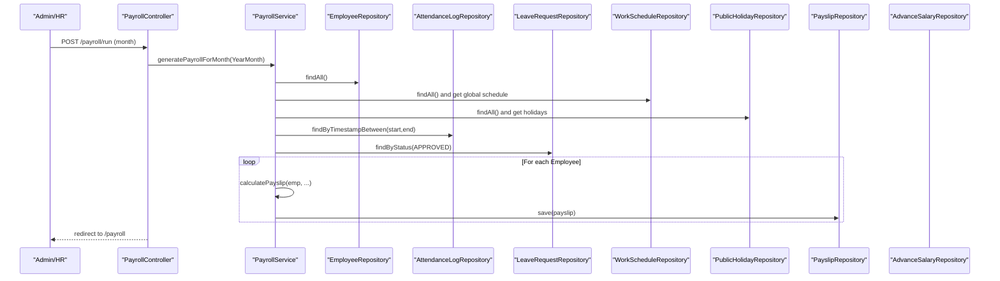
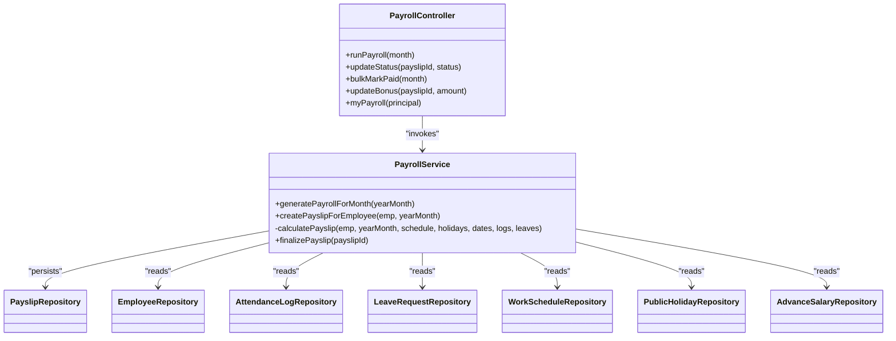
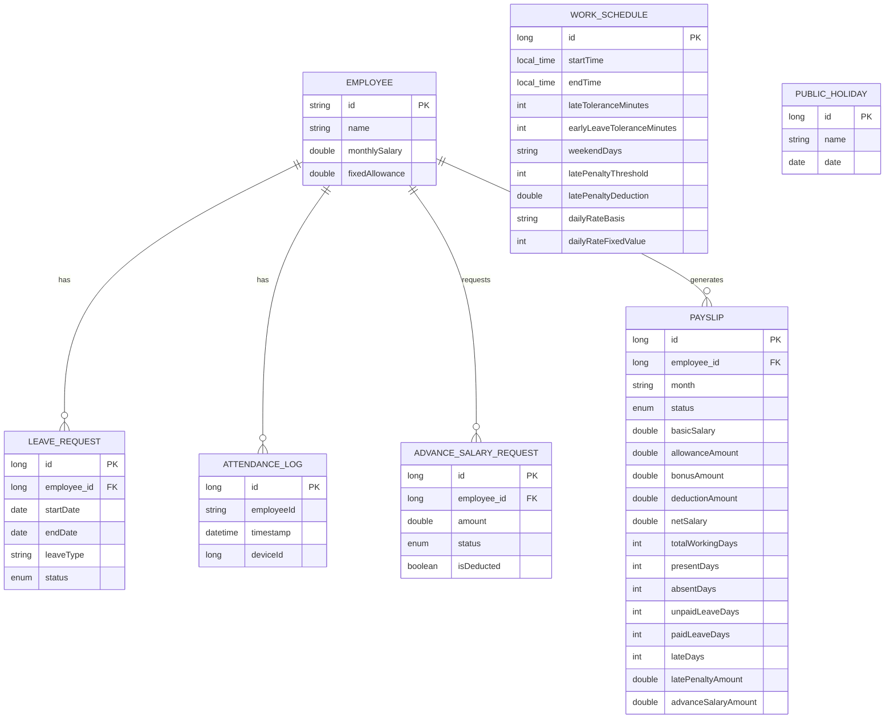
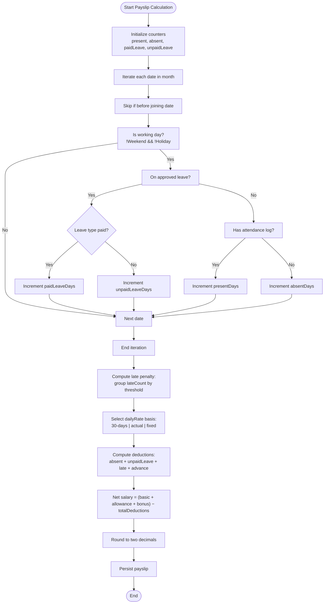

# Salary Calculation Engine

<cite>
**Referenced Files in This Document**
- [PayrollService.java](file://src/main/java/root/cyb/mh/attendancesystem/service/PayrollService.java)
- [PayrollController.java](file://src/main/java/root/cyb/mh/attendancesystem/controller/PayrollController.java)
- [Payslip.java](file://src/main/java/root/cyb/mh/attendancesystem/model/Payslip.java)
- [Employee.java](file://src/main/java/root/cyb/mh/attendancesystem/model/Employee.java)
- [WorkSchedule.java](file://src/main/java/root/cyb/mh/attendancesystem/model/WorkSchedule.java)
- [PublicHoliday.java](file://src/main/java/root/cyb/mh/attendancesystem/model/PublicHoliday.java)
- [LeaveRequest.java](file://src/main/java/root/cyb/mh/attendancesystem/model/LeaveRequest.java)
- [AttendanceLog.java](file://src/main/java/root/cyb/mh/attendancesystem/model/AttendanceLog.java)
- [AdvanceSalaryRequest.java](file://src/main/java/root/cyb/mh/attendancesystem/model/AdvanceSalaryRequest.java)
- [PayslipRepository.java](file://src/main/java/root/cyb/mh/attendancesystem/repository/PayslipRepository.java)
- [PayrollMonthlySummaryDto.java](file://src/main/java/root/cyb/mh/attendancesystem/dto/PayrollMonthlySummaryDto.java)
</cite>

## Table of Contents
1. [Introduction](#introduction)
2. [Project Structure](#project-structure)
3. [Core Components](#core-components)
4. [Architecture Overview](#architecture-overview)
5. [Detailed Component Analysis](#detailed-component-analysis)
6. [Dependency Analysis](#dependency-analysis)
7. [Performance Considerations](#performance-considerations)
8. [Troubleshooting Guide](#troubleshooting-guide)
9. [Conclusion](#conclusion)
10. [Appendices](#appendices)

## Introduction
This document describes the salary calculation engine responsible for computing employee compensation based on attendance, leave, and contractual terms. It covers the algorithms for basic salary calculation, attendance-based adjustments, leave impact computations, and penalties for lateness. It also documents integration points with attendance logs, leave requests, and employee contracts, along with configurable parameters, rounding rules, and edge case handling. Examples of different salary structures and calculation scenarios are included to illustrate practical usage.

## Project Structure
The salary calculation engine is implemented as a Spring service with supporting models, repositories, controllers, and DTOs. The core logic resides in the payroll service, which orchestrates data retrieval, computation, and persistence of payslips.

**Diagram sources**
- [PayrollController.java:1-223](file://src/main/java/root/cyb/mh/attendancesystem/controller/PayrollController.java#L1-L223)
- [PayrollService.java:1-318](file://src/main/java/root/cyb/mh/attendancesystem/service/PayrollService.java#L1-L318)
- [Payslip.java:1-57](file://src/main/java/root/cyb/mh/attendancesystem/model/Payslip.java#L1-L57)
- [Employee.java:1-64](file://src/main/java/root/cyb/mh/attendancesystem/model/Employee.java#L1-L64)
- [WorkSchedule.java:1-49](file://src/main/java/root/cyb/mh/attendancesystem/model/WorkSchedule.java#L1-L49)
- [PublicHoliday.java:1-20](file://src/main/java/root/cyb/mh/attendancesystem/model/PublicHoliday.java#L1-L20)
- [LeaveRequest.java:1-54](file://src/main/java/root/cyb/mh/attendancesystem/model/LeaveRequest.java#L1-L54)
- [AttendanceLog.java:1-27](file://src/main/java/root/cyb/mh/attendancesystem/model/AttendanceLog.java#L1-L27)
- [AdvanceSalaryRequest.java:1-49](file://src/main/java/root/cyb/mh/attendancesystem/model/AdvanceSalaryRequest.java#L1-L49)

**Section sources**
- [PayrollController.java:1-223](file://src/main/java/root/cyb/mh/attendancesystem/controller/PayrollController.java#L1-L223)
- [PayrollService.java:1-318](file://src/main/java/root/cyb/mh/attendancesystem/service/PayrollService.java#L1-L318)

## Core Components
- PayrollService: Central computation engine that generates payslips for a given month, integrating attendance, leave, schedule, and holiday data.
- PayrollController: Exposes endpoints for payroll generation, status updates, bonus adjustments, and exports.
- Payslip: Persistable payslip entity capturing computed financials and attendance metrics.
- Employee: Contains monthly salary and fixed allowance used in computation.
- WorkSchedule: Defines daily rate basis, weekend days, tolerance windows, and penalty thresholds.
- PublicHoliday: Provides holiday dates to exclude from working days.
- LeaveRequest: Captures approved leaves affecting pay computation.
- AttendanceLog: Records employee check-ins used to compute presence and lateness.
- AdvanceSalaryRequest: Tracks advances that reduce net pay upon finalization.

Key computation areas:
- Standard monthly working days calculation
- Attendance tallying (present, absent, paid/unpaid leave)
- Late arrival penalty computation
- Daily wage calculation under different bases
- Deduction aggregation and net pay computation
- Rounding to two decimal places

**Section sources**
- [PayrollService.java:39-290](file://src/main/java/root/cyb/mh/attendancesystem/service/PayrollService.java#L39-L290)
- [Payslip.java:31-55](file://src/main/java/root/cyb/mh/attendancesystem/model/Payslip.java#L31-L55)
- [Employee.java:52-55](file://src/main/java/root/cyb/mh/attendancesystem/model/Employee.java#L52-L55)
- [WorkSchedule.java:32-40](file://src/main/java/root/cyb/mh/attendancesystem/model/WorkSchedule.java#L32-L40)
- [PublicHoliday.java:17-18](file://src/main/java/root/cyb/mh/attendancesystem/model/PublicHoliday.java#L17-L18)
- [LeaveRequest.java:31-31](file://src/main/java/root/cyb/mh/attendancesystem/model/LeaveRequest.java#L31-L31)
- [AttendanceLog.java:23-24](file://src/main/java/root/cyb/mh/attendancesystem/model/AttendanceLog.java#L23-L24)
- [AdvanceSalaryRequest.java:24-24](file://src/main/java/root/cyb/mh/attendancesystem/model/AdvanceSalaryRequest.java#L24-L24)

## Architecture Overview
The engine follows a batch processing pattern for monthly payroll runs. It fetches consolidated data for the target month, computes per-employee payslips, persists them, and supports subsequent finalization and payment marking.

**Diagram sources**
- [PayrollController.java:107-113](file://src/main/java/root/cyb/mh/attendancesystem/controller/PayrollController.java#L107-L113)
- [PayrollService.java:39-92](file://src/main/java/root/cyb/mh/attendancesystem/service/PayrollService.java#L39-L92)

## Detailed Component Analysis

### Basic Salary Calculation and Daily Wage Basis
The daily wage is derived from the monthly salary using one of three configurable bases:
- STANDARD_30: dailyRate = monthlySalary / 30.0
- ACTUAL_WORKING_DAYS: dailyRate = monthlySalary / standardMonthlyWorkingDays (when > 0)
- FIXED_DAYS: dailyRate = monthlySalary / N (default 30 if N <= 0)

The standard monthly working days are computed by iterating through the month’s calendar dates, excluding weekends and public holidays as defined by the global schedule and holiday list.

Edge cases:
- If standardMonthlyWorkingDays is zero, dailyRate defaults to 0 for ACTUAL_WORKING_DAYS.
- If FIXED_DAYS value is not set or non-positive, a fallback of 30 is used.

Rounding:
- Daily rate is computed as a floating-point value.
- Deductions and net salary are rounded to two decimal places before persistence.

**Section sources**
- [PayrollService.java:127-136](file://src/main/java/root/cyb/mh/attendancesystem/service/PayrollService.java#L127-L136)
- [PayrollService.java:234-249](file://src/main/java/root/cyb/mh/attendancesystem/service/PayrollService.java#L234-L249)
- [WorkSchedule.java:36-40](file://src/main/java/root/cyb/mh/attendancesystem/model/WorkSchedule.java#L36-L40)

### Attendance-Based Adjustments
The engine tallies:
- Present days: days with at least one attendance log
- Absent days: working days without attendance and without approved leave
- Paid leave days: working days during approved leaves categorized as paid
- Unpaid leave days: working days during approved leaves categorized as unpaid

Leave classification:
- LeaveRequest statuses considered: APPROVED
- Leave types compared uppercase; unpaid categories recognized by "UNPAID" or "LWP"

Joining date handling:
- Skips days prior to the employee’s joining date

Weekend and holiday exclusion:
- Uses WorkSchedule weekendDays and PublicHoliday list to determine working days

**Section sources**
- [PayrollService.java:145-194](file://src/main/java/root/cyb/mh/attendancesystem/service/PayrollService.java#L145-L194)
- [LeaveRequest.java:48-52](file://src/main/java/root/cyb/mh/attendancesystem/model/LeaveRequest.java#L48-L52)

### Late Arrival Penalty Processing
Late penalty logic:
- For each day, the earliest attendance log is taken as the daily first check-in.
- Late threshold is startTime + lateToleranceMinutes.
- If the first check-in time is after the late limit, the day is counted as late.
- Penalty days are computed via integer division: floor(lateCount / latePenaltyThreshold) * latePenaltyDeduction.
- latePenaltyThreshold must be positive; otherwise, no penalty grouping applies.

Penalty amount:
- latePenaltyAmount = penaltyDays * dailyRate

Rounding:
- Late penalty amount is included in totalDeductions and net salary, rounded to two decimals.

**Section sources**
- [PayrollService.java:196-227](file://src/main/java/root/cyb/mh/attendancesystem/service/PayrollService.java#L196-L227)
- [WorkSchedule.java:32-34](file://src/main/java/root/cyb/mh/attendancesystem/model/WorkSchedule.java#L32-L34)

### Leave Impact Calculations
Leave handling:
- Approved leaves overlapping a working day contribute to either paidLeaveDays or unpaidLeaveDays depending on leave type.
- Unpaid categories include "UNPAID" and "LWP".
- Paid categories include other approved leaves not marked as unpaid.

Absence vs. leave:
- If a working day has no attendance and no qualifying approved leave, it counts as absent.

**Section sources**
- [PayrollService.java:160-194](file://src/main/java/root/cyb/mh/attendancesystem/service/PayrollService.java#L160-L194)
- [LeaveRequest.java:31-31](file://src/main/java/root/cyb/mh/attendancesystem/model/LeaveRequest.java#L31-L31)

### Overtime Processing
Current implementation does not include dedicated overtime computation. The bonus field exists for one-time payments and is integrated into net salary calculation. If overtime is required, it should be modeled similarly to bonuses and added to earnings before deductions.

**Section sources**
- [PayrollService.java:251-253](file://src/main/java/root/cyb/mh/attendancesystem/service/PayrollService.java#L251-L253)
- [Payslip.java:34-34](file://src/main/java/root/cyb/mh/attendancesystem/model/Payslip.java#L34-L34)

### Deduction Algorithms
Deductions aggregated per employee:
- Absent deduction = (absentDays + unpaidLeaveDays) * dailyRate
- Late penalty amount = penaltyDays * dailyRate
- Advance deduction preview = sum of pending advances for the employee (not marked as deducted until finalization)

Total deductions = absentDeduction + latePenaltyAmount + advanceDeduction

Net salary formula:
- netSalary = (basicSalary + allowanceAmount + bonusAmount) − totalDeductions
- Rounded to two decimal places

Finalization:
- On finalization, payslip status becomes PAID.
- Pending advance requests are marked as PAID and deducted.

**Section sources**
- [PayrollService.java:255-268](file://src/main/java/root/cyb/mh/attendancesystem/service/PayrollService.java#L255-L268)
- [PayrollService.java:292-316](file://src/main/java/root/cyb/mh/attendancesystem/service/PayrollService.java#L292-L316)
- [Payslip.java:35-36](file://src/main/java/root/cyb/mh/attendancesystem/model/Payslip.java#L35-L36)

### Mathematical Formulas and Precedence
- Daily rate selection:
  - STANDARD_30: dailyRate = monthlySalary / 30.0
  - ACTUAL_WORKING_DAYS: dailyRate = monthlySalary / standardMonthlyWorkingDays (if > 0), else 0
  - FIXED_DAYS: dailyRate = monthlySalary / max(dailyRateFixedValue, 1)
- Working day determination: exclude weekends and public holidays
- Attendance tallying: present, absent, paidLeave, unpaidLeave
- Late penalty grouping: lateCount ÷ latePenaltyThreshold → penaltyDays
- Deductions: absentDeduction + latePenaltyAmount + advanceDeduction
- Net salary: basic + allowance + bonus − totalDeductions
- Rounding: two decimal places for deductionAmount and netSalary

**Section sources**
- [PayrollService.java:127-136](file://src/main/java/root/cyb/mh/attendancesystem/service/PayrollService.java#L127-L136)
- [PayrollService.java:234-249](file://src/main/java/root/cyb/mh/attendancesystem/service/PayrollService.java#L234-L249)
- [PayrollService.java:255-277](file://src/main/java/root/cyb/mh/attendancesystem/service/PayrollService.java#L255-L277)

### Rounding Rules
- Deduction amount and net salary are rounded to two decimal places before saving to the payslip entity.

**Section sources**
- [PayrollService.java:276-277](file://src/main/java/root/cyb/mh/attendancesystem/service/PayrollService.java#L276-L277)

### Edge Case Handling
- Guest employees: skipped during payroll generation
- Future joiners: employees whose joiningDate is after the end of the target month are skipped
- Duplicate payslips: if a payslip already exists and is PAID, it is not regenerated
- Zero or negative standard working days: dailyRate defaults to 0 for ACTUAL_WORKING_DAYS
- Missing global schedule: defaults are applied for start/end times and tolerances
- Pending advances: previewed in draft; marked as deducted only upon finalization

**Section sources**
- [PayrollService.java:101-117](file://src/main/java/root/cyb/mh/attendancesystem/service/PayrollService.java#L101-L117)
- [PayrollService.java:234-249](file://src/main/java/root/cyb/mh/attendancesystem/service/PayrollService.java#L234-L249)
- [PayrollService.java:292-316](file://src/main/java/root/cyb/mh/attendancesystem/service/PayrollService.java#L292-L316)

### Configurable Parameters
- Daily rate basis: STANDARD_30 | ACTUAL_WORKING_DAYS | FIXED_DAYS
- FIXED_DAYS value: dailyRateFixedValue (fallback 30 if invalid)
- Weekend days: comma-separated numeric day-of-week values
- Late tolerance minutes: lateToleranceMinutes
- Late penalty threshold: latePenaltyThreshold (grouping window)
- Late penalty deduction: latePenaltyDeduction (days to deduct per group)
- Public holidays: PublicHoliday.date entries
- Employee monthly salary: Employee.monthlySalary
- Employee fixed allowance: Employee.fixedAllowance
- Bonus amount: Payslip.bonusAmount (editable via controller)

**Section sources**
- [WorkSchedule.java:18-40](file://src/main/java/root/cyb/mh/attendancesystem/model/WorkSchedule.java#L18-L40)
- [Employee.java:52-55](file://src/main/java/root/cyb/mh/attendancesystem/model/Employee.java#L52-L55)
- [PayrollController.java:115-133](file://src/main/java/root/cyb/mh/attendancesystem/controller/PayrollController.java#L115-L133)

### Integration Points
- Attendance logs: filtered by date range and grouped by date to determine first check-in
- Leave requests: filtered by APPROVED status and checked for overlap with each working day
- Employee contracts: monthlySalary and fixedAllowance used in computation
- Advance salary: pending advances previewed in draft; finalized when payslip is marked PAID

**Section sources**
- [PayrollService.java:52-68](file://src/main/java/root/cyb/mh/attendancesystem/service/PayrollService.java#L52-L68)
- [PayrollService.java:81-89](file://src/main/java/root/cyb/mh/attendancesystem/service/PayrollService.java#L81-L89)
- [PayrollService.java:261-266](file://src/main/java/root/cyb/mh/attendancesystem/service/PayrollService.java#L261-L266)

### Examples of Different Salary Structures and Scenarios
- Standard 30-day basis:
  - monthlySalary = 60000, dailyRate = 60000 / 30.0
  - absentDays = 2, unpaidLeaveDays = 1 → absentDeduction = (2+1) * dailyRate
- Actual working days basis:
  - monthlySalary = 60000, standardMonthlyWorkingDays = 22 → dailyRate = 60000 / 22
- Fixed days basis:
  - monthlySalary = 60000, dailyRateFixedValue = 26 → dailyRate = 60000 / 26
- Penalty grouping:
  - latePenaltyThreshold = 3, latePenaltyDeduction = 0.5 → every 3 late days deducts 0.5 days’ worth of dailyRate
- Bonus adjustment:
  - Editable via controller endpoint; recalculates net salary with two-decimal rounding

**Section sources**
- [PayrollService.java:234-249](file://src/main/java/root/cyb/mh/attendancesystem/service/PayrollService.java#L234-L249)
- [PayrollService.java:222-227](file://src/main/java/root/cyb/mh/attendancesystem/service/PayrollService.java#L222-L227)
- [PayrollController.java:115-133](file://src/main/java/root/cyb/mh/attendancesystem/controller/PayrollController.java#L115-L133)

## Dependency Analysis
The PayrollService depends on repositories for employees, attendance logs, leave requests, schedules, holidays, payslips, and advances. The controller coordinates generation, status updates, and exports.

**Diagram sources**
- [PayrollService.java:1-318](file://src/main/java/root/cyb/mh/attendancesystem/service/PayrollService.java#L1-L318)
- [PayrollController.java:1-223](file://src/main/java/root/cyb/mh/attendancesystem/controller/PayrollController.java#L1-L223)
- [PayslipRepository.java:1-15](file://src/main/java/root/cyb/mh/attendancesystem/repository/PayslipRepository.java#L1-L15)

**Section sources**
- [PayrollService.java:18-37](file://src/main/java/root/cyb/mh/attendancesystem/service/PayrollService.java#L18-L37)
- [PayrollController.java:19-26](file://src/main/java/root/cyb/mh/attendancesystem/controller/PayrollController.java#L19-L26)

## Performance Considerations
- Bulk data fetching: Attendance logs and approved leaves are fetched once per run for all employees to minimize repeated queries.
- Early exits: Guest employees and future joiners are skipped to avoid unnecessary computation.
- Single-pass counting: Working days, presence, leaves, and lateness are computed in a single pass through the month’s dates.
- Integer division for penalties: Efficient grouping of late days avoids per-minute comparisons.

Recommendations:
- Index database columns used in filtering (timestamps, employeeId, status, dates).
- Consider partitioning or materialized views for frequently accessed date ranges.
- Batch process payslips in smaller chunks if memory pressure occurs.

**Section sources**
- [PayrollService.java:52-68](file://src/main/java/root/cyb/mh/attendancesystem/service/PayrollService.java#L52-L68)
- [PayrollService.java:101-117](file://src/main/java/root/cyb/mh/attendancesystem/service/PayrollService.java#L101-L117)

## Troubleshooting Guide
Common issues and resolutions:
- Duplicate or stale payslips:
  - Verify existing payslips and status before regeneration.
  - Ensure finalization marks payslips as PAID and advances as deducted.
- Incorrect absent/unpaid leave counts:
  - Confirm approved leave overlaps and types.
  - Check that joiningDate exclusions are applied.
- Late penalty not applied:
  - Verify latePenaltyThreshold and latePenaltyDeduction are set.
  - Ensure first check-in per day is correctly identified.
- Daily rate anomalies:
  - Validate dailyRateBasis and dailyRateFixedValue.
  - Confirm standardMonthlyWorkingDays is greater than zero for ACTUAL_WORKING_DAYS.
- Rounding discrepancies:
  - Deductions and net salary are rounded to two decimals; confirm UI displays match backend values.

**Section sources**
- [PayrollService.java:101-117](file://src/main/java/root/cyb/mh/attendancesystem/service/PayrollService.java#L101-L117)
- [PayrollService.java:222-227](file://src/main/java/root/cyb/mh/attendancesystem/service/PayrollService.java#L222-L227)
- [PayrollService.java:276-277](file://src/main/java/root/cyb/mh/attendancesystem/service/PayrollService.java#L276-L277)

## Conclusion
The salary calculation engine provides a robust, configurable framework for monthly payroll computation. It integrates attendance, leave, and schedule data to produce accurate payslips with clear deduction breakdowns. The design supports multiple daily wage bases, configurable penalties, and extensible bonus mechanisms. With proper configuration and monitoring, it can accommodate diverse salary structures while maintaining transparency and compliance.

## Appendices

### Data Model Overview

**Diagram sources**
- [Employee.java:15-55](file://src/main/java/root/cyb/mh/attendancesystem/model/Employee.java#L15-L55)
- [WorkSchedule.java:14-40](file://src/main/java/root/cyb/mh/attendancesystem/model/WorkSchedule.java#L14-L40)
- [PublicHoliday.java:14-18](file://src/main/java/root/cyb/mh/attendancesystem/model/PublicHoliday.java#L14-L18)
- [LeaveRequest.java:17-42](file://src/main/java/root/cyb/mh/attendancesystem/model/LeaveRequest.java#L17-L42)
- [AttendanceLog.java:19-26](file://src/main/java/root/cyb/mh/attendancesystem/model/AttendanceLog.java#L19-L26)
- [AdvanceSalaryRequest.java:16-41](file://src/main/java/root/cyb/mh/attendancesystem/model/AdvanceSalaryRequest.java#L16-L41)
- [Payslip.java:16-55](file://src/main/java/root/cyb/mh/attendancesystem/model/Payslip.java#L16-L55)

### Calculation Flowchart

**Diagram sources**
- [PayrollService.java:145-194](file://src/main/java/root/cyb/mh/attendancesystem/service/PayrollService.java#L145-L194)
- [PayrollService.java:196-227](file://src/main/java/root/cyb/mh/attendancesystem/service/PayrollService.java#L196-L227)
- [PayrollService.java:234-249](file://src/main/java/root/cyb/mh/attendancesystem/service/PayrollService.java#L234-L249)
- [PayrollService.java:255-277](file://src/main/java/root/cyb/mh/attendancesystem/service/PayrollService.java#L255-L277)