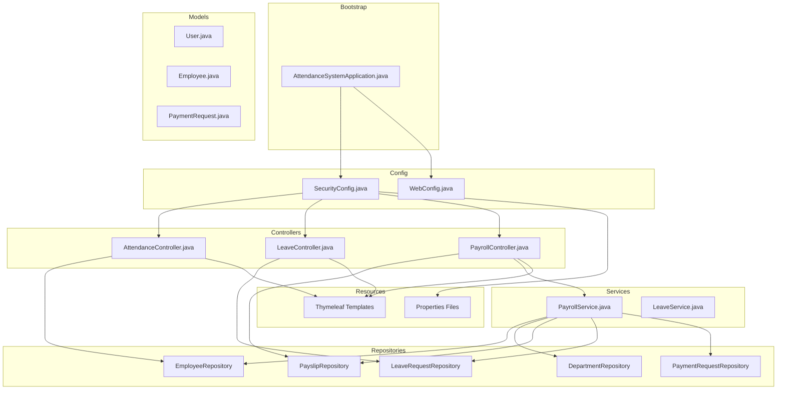
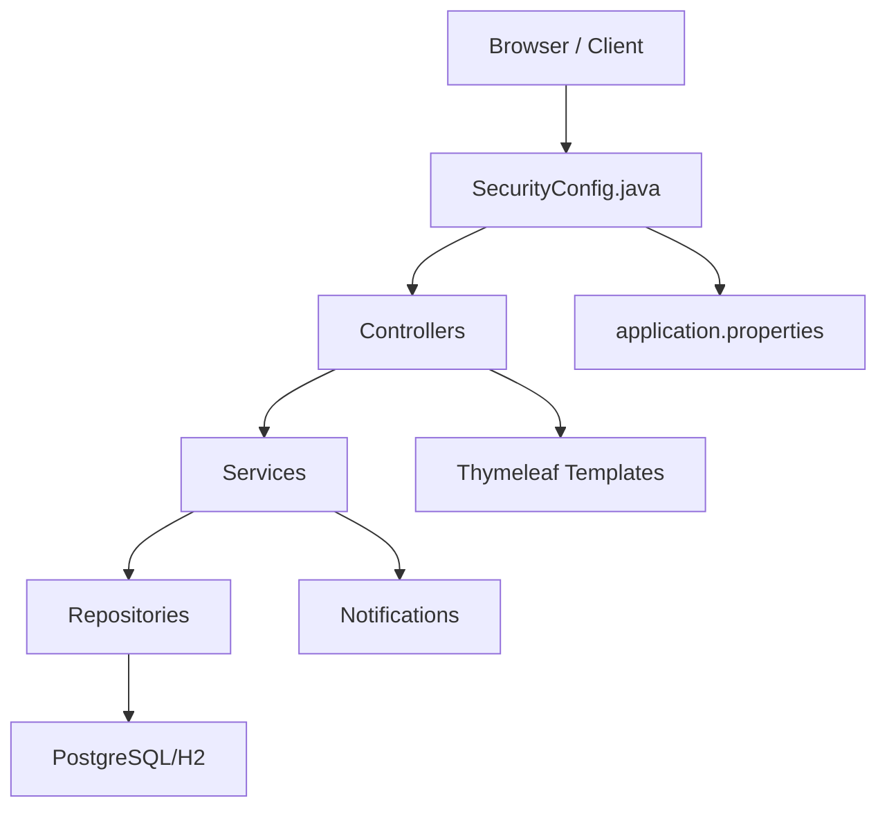
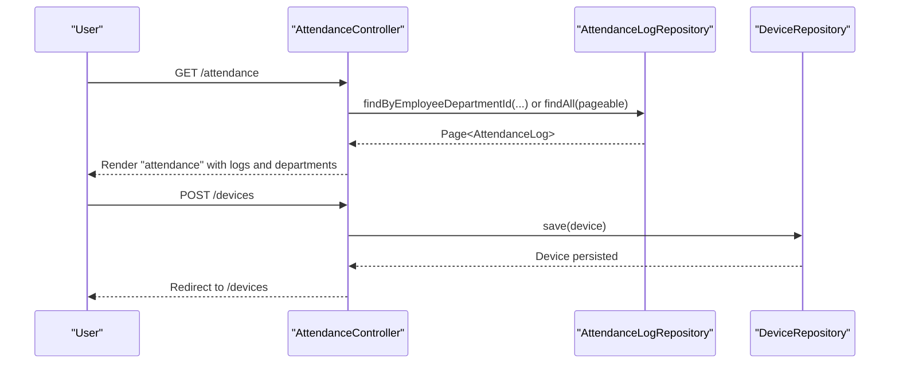
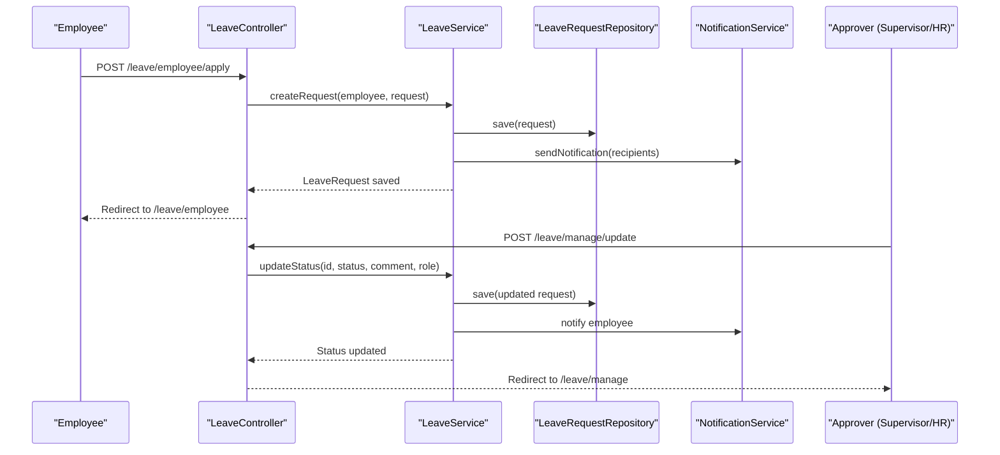
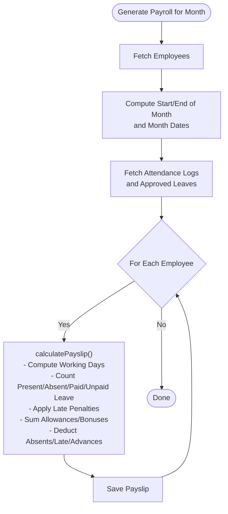
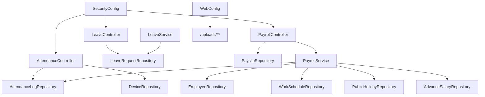

# Project Overview

<cite>
**Referenced Files in This Document**
- [README.md](file://README.md)
- [AttendanceSystemApplication.java](file://src/main/java/root/cyb/mh/attendancesystem/AttendanceSystemApplication.java)
- [build.gradle](file://build.gradle)
- [settings.gradle](file://settings.gradle)
- [application.properties](file://src/main/resources/application.properties)
- [SecurityConfig.java](file://src/main/java/root/cyb/mh/attendancesystem/config/SecurityConfig.java)
- [WebConfig.java](file://src/main/java/root/cyb/mh/attendancesystem/config/WebConfig.java)
- [User.java](file://src/main/java/root/cyb/mh/attendancesystem/model/User.java)
- [Employee.java](file://src/main/java/root/cyb/mh/attendancesystem/model/Employee.java)
- [PaymentRequest.java](file://src/main/java/root/cyb/mh/attendancesystem/model/PaymentRequest.java)
- [AttendanceController.java](file://src/main/java/root/cyb/mh/attendancesystem/controller/AttendanceController.java)
- [LeaveController.java](file://src/main/java/root/cyb/mh/attendancesystem/controller/LeaveController.java)
- [PayrollController.java](file://src/main/java/root/cyb/mh/attendancesystem/controller/PayrollController.java)
- [PayrollService.java](file://src/main/java/root/cyb/mh/attendancesystem/service/PayrollService.java)
- [LeaveService.java](file://src/main/java/root/cyb/mh/attendancesystem/service/LeaveService.java)
</cite>

## Table of Contents
1. [Introduction](#introduction)
2. [Project Structure](#project-structure)
3. [Core Components](#core-components)
4. [Architecture Overview](#architecture-overview)
5. [Detailed Component Analysis](#detailed-component-analysis)
6. [Dependency Analysis](#dependency-analysis)
7. [Performance Considerations](#performance-considerations)
8. [Troubleshooting Guide](#troubleshooting-guide)
9. [Conclusion](#conclusion)
10. [Appendices](#appendices)

## Introduction
Skylink Custom Backend is an integrated Human Resources and Attendance Management Platform built with Spring Boot 3.4.0 and Java 21. It centralizes HR operations including user and role management, attendance tracking, leave management, payroll processing, and payment workflows. The system targets organizations requiring real-time dashboards, role-based access, and automated workflows for approvals and reporting.

Key capabilities include:
- Role-based dashboards for ADMIN, EMPLOYEE, SUPERVISOR, and COMPANY users
- Attendance tracking with device integration and historical reporting
- Leave lifecycle management with calendar visibility
- Payroll generation with allowances, bonuses, penalties, and advance salary deductions
- Payment request tracking with master data for companies, clients, and contractors
- Real-time notifications via web push and email

Target audience:
- Organizations managing workforce attendance and payroll
- Operations teams needing visibility into leave and payment workflows
- Administrators and HR personnel overseeing policy enforcement and approvals

Benefits:
- Unified platform reducing manual reconciliation across systems
- Automated calculations and audit trails for payroll and leave
- Streamlined approvals and notifications for timely processing
- Scalable architecture supporting future extensions

**Section sources**
- [README.md:1-88](file://README.md#L1-L88)

## Project Structure
The backend follows a layered Spring MVC architecture with clear separation of concerns:
- Application bootstrap and scheduling enablement
- Configuration for security, web, and WebSocket support
- Controllers for HTTP and Thymeleaf templates
- Services encapsulating business logic
- Repositories for persistence via Spring Data JPA
- Models representing domain entities
- DTOs for API and template boundaries
- Resources for templates, static assets, and configuration

**Diagram sources**
- [AttendanceSystemApplication.java:1-16](file://src/main/java/root/cyb/mh/attendancesystem/AttendanceSystemApplication.java#L1-L16)
- [SecurityConfig.java:1-91](file://src/main/java/root/cyb/mh/attendancesystem/config/SecurityConfig.java#L1-L91)
- [WebConfig.java:1-18](file://src/main/java/root/cyb/mh/attendancesystem/config/WebConfig.java#L1-L18)
- [AttendanceController.java:1-132](file://src/main/java/root/cyb/mh/attendancesystem/controller/AttendanceController.java#L1-L132)
- [LeaveController.java:1-176](file://src/main/java/root/cyb/mh/attendancesystem/controller/LeaveController.java#L1-L176)
- [PayrollController.java:1-223](file://src/main/java/root/cyb/mh/attendancesystem/controller/PayrollController.java#L1-L223)
- [PayrollService.java:1-318](file://src/main/java/root/cyb/mh/attendancesystem/service/PayrollService.java#L1-L318)
- [User.java:1-24](file://src/main/java/root/cyb/mh/attendancesystem/model/User.java#L1-L24)
- [Employee.java:1-64](file://src/main/java/root/cyb/mh/attendancesystem/model/Employee.java#L1-L64)
- [PaymentRequest.java:1-117](file://src/main/java/root/cyb/mh/attendancesystem/model/PaymentRequest.java#L1-L117)

**Section sources**
- [README.md:81-88](file://README.md#L81-L88)
- [settings.gradle:1-2](file://settings.gradle#L1-L2)
- [application.properties:1-1](file://src/main/resources/application.properties#L1-L1)

## Core Components
- Application bootstrap: Initializes the Spring Boot context and enables scheduling.
- Security configuration: Defines role-based access control, login/logout, and remember-me.
- Web configuration: Serves static uploads from the local filesystem.
- Controllers: Expose endpoints for attendance, leave, payroll, and related dashboards.
- Services: Encapsulate business logic for payroll calculations and leave lifecycle.
- Models: Define core entities such as User, Employee, and PaymentRequest.
- Repositories: Provide JPA access for persistence.

Technology stack highlights:
- Backend framework: Spring Boot 3.4.0 with Java 21 toolchain
- Database: PostgreSQL with H2 runtime for development
- ORM: Spring Data JPA and Hibernate
- Security: Spring Security 6 with form login and custom success handler
- Templating: Thymeleaf with Spring Security dialects
- Integrations: WebSocket, Email SMTP, Web Push Notifications, PDF/Excel generation

**Section sources**
- [build.gradle:1-60](file://build.gradle#L1-L60)
- [SecurityConfig.java:18-91](file://src/main/java/root/cyb/mh/attendancesystem/config/SecurityConfig.java#L18-L91)
- [WebConfig.java:10-17](file://src/main/java/root/cyb/mh/attendancesystem/config/WebConfig.java#L10-L17)
- [README.md:5-18](file://README.md#L5-L18)

## Architecture Overview
The system employs a classic layered architecture:
- Presentation layer: Controllers render Thymeleaf templates and handle HTTP requests
- Application layer: Services orchestrate business rules and data transformations
- Persistence layer: Repositories abstract database operations
- Security layer: Centralized configuration governs authentication and authorization
- Infrastructure: Properties and profiles manage environment-specific settings

**Diagram sources**
- [SecurityConfig.java:18-91](file://src/main/java/root/cyb/mh/attendancesystem/config/SecurityConfig.java#L18-L91)
- [application.properties:1-1](file://src/main/resources/application.properties#L1-L1)
- [PayrollController.java:1-223](file://src/main/java/root/cyb/mh/attendancesystem/controller/PayrollController.java#L1-L223)
- [LeaveController.java:1-176](file://src/main/java/root/cyb/mh/attendancesystem/controller/LeaveController.java#L1-L176)
- [AttendanceController.java:1-132](file://src/main/java/root/cyb/mh/attendancesystem/controller/AttendanceController.java#L1-L132)
- [PayrollService.java:1-318](file://src/main/java/root/cyb/mh/attendancesystem/service/PayrollService.java#L1-L318)
- [LeaveService.java:1-127](file://src/main/java/root/cyb/mh/attendancesystem/service/LeaveService.java#L1-L127)

## Detailed Component Analysis

### Attendance Management
Responsibilities:
- Device management and synchronization commands
- Attendance log listing with filtering and sorting
- Integration with external devices (ADMS) via dedicated endpoints

Key flows:
- Device listing and CRUD operations
- Manual synchronization triggers
- Attendance listing with pagination and department filters

**Diagram sources**
- [AttendanceController.java:88-130](file://src/main/java/root/cyb/mh/attendancesystem/controller/AttendanceController.java#L88-L130)
- [AttendanceController.java:33-56](file://src/main/java/root/cyb/mh/attendancesystem/controller/AttendanceController.java#L33-L56)

**Section sources**
- [AttendanceController.java:1-132](file://src/main/java/root/cyb/mh/attendancesystem/controller/AttendanceController.java#L1-L132)

### Leave Management
Responsibilities:
- Employee leave application and history
- Approver workflows for supervisors and HR/Admin
- Calendar view for approved leaves

Key flows:
- Employee applies for leave; notifications sent to supervisors and HR
- Supervisors approve/reject within team scope
- HR can enforce status changes for pending requests
- Calendar renders approved leaves with color-coded categories

**Diagram sources**
- [LeaveController.java:46-124](file://src/main/java/root/cyb/mh/attendancesystem/controller/LeaveController.java#L46-L124)
- [LeaveService.java:24-121](file://src/main/java/root/cyb/mh/attendancesystem/service/LeaveService.java#L24-L121)

**Section sources**
- [LeaveController.java:1-176](file://src/main/java/root/cyb/mh/attendancesystem/controller/LeaveController.java#L1-L176)
- [LeaveService.java:1-127](file://src/main/java/root/cyb/mh/attendancesystem/service/LeaveService.java#L1-L127)

### Payroll Processing
Responsibilities:
- Monthly payroll generation aggregating attendance, leaves, and policies
- Payslip creation with allowances, bonuses, penalties, and deductions
- Finalization and bulk marking as paid
- Export to bank advice (Excel)

Key flows:
- Generate payroll for a given month
- Compute daily rates, present/absent/paid/unpaid leave, late penalties
- Aggregate advance salary deductions
- Persist payslips and finalize upon payment

**Diagram sources**
- [PayrollService.java:39-92](file://src/main/java/root/cyb/mh/attendancesystem/service/PayrollService.java#L39-L92)
- [PayrollService.java:94-290](file://src/main/java/root/cyb/mh/attendancesystem/service/PayrollService.java#L94-L290)

**Section sources**
- [PayrollController.java:1-223](file://src/main/java/root/cyb/mh/attendancesystem/controller/PayrollController.java#L1-L223)
- [PayrollService.java:1-318](file://src/main/java/root/cyb/mh/attendancesystem/service/PayrollService.java#L1-L318)

### Payment Requests and Master Data
Responsibilities:
- Track payment requests with requester, contractor, company, and client associations
- Manage priorities, statuses, and review metadata
- Support exports and dashboards for payment operations

Representative entity:
- PaymentRequest captures request metadata, amounts, payment method, and status tracking

**Section sources**
- [PaymentRequest.java:1-117](file://src/main/java/root/cyb/mh/attendancesystem/model/PaymentRequest.java#L1-L117)

### User and Role Management
Responsibilities:
- Centralized authentication and role-based access control
- Distinct dashboards for ADMIN, EMPLOYEE, SUPERVISOR, and COMPANY
- Secure form login with remember-me and custom success handling

Representative entities:
- User model defines username/password/role
- Employee model integrates with departments and supervisors

**Section sources**
- [SecurityConfig.java:18-91](file://src/main/java/root/cyb/mh/attendancesystem/config/SecurityConfig.java#L18-L91)
- [User.java:1-24](file://src/main/java/root/cyb/mh/attendancesystem/model/User.java#L1-L24)
- [Employee.java:1-64](file://src/main/java/root/cyb/mh/attendancesystem/model/Employee.java#L1-L64)

## Dependency Analysis
High-level dependencies:
- Controllers depend on Services and Repositories
- Services depend on Repositories and shared models
- Security configuration governs access to controllers
- Web configuration exposes local upload storage
- Build configuration defines Spring Boot 3.4.0, Java 21, and integrations

**Diagram sources**
- [AttendanceController.java:1-132](file://src/main/java/root/cyb/mh/attendancesystem/controller/AttendanceController.java#L1-L132)
- [LeaveController.java:1-176](file://src/main/java/root/cyb/mh/attendancesystem/controller/LeaveController.java#L1-L176)
- [PayrollController.java:1-223](file://src/main/java/root/cyb/mh/attendancesystem/controller/PayrollController.java#L1-L223)
- [PayrollService.java:18-38](file://src/main/java/root/cyb/mh/attendancesystem/service/PayrollService.java#L18-L38)
- [SecurityConfig.java:18-91](file://src/main/java/root/cyb/mh/attendancesystem/config/SecurityConfig.java#L18-L91)
- [WebConfig.java:10-17](file://src/main/java/root/cyb/mh/attendancesystem/config/WebConfig.java#L10-L17)

**Section sources**
- [build.gradle:34-55](file://build.gradle#L34-L55)
- [SecurityConfig.java:18-91](file://src/main/java/root/cyb/mh/attendancesystem/config/SecurityConfig.java#L18-L91)

## Performance Considerations
- Bulk data fetching: PayrollService optimizes by preloading attendance logs and approved leaves for the target period.
- Pagination and sorting: Controllers use Pageable and Sort to limit payload sizes for lists.
- Conditional processing: PayrollService skips guests and future joiners to reduce unnecessary computation.
- Late penalty aggregation: Uses grouping by date to compute first check-ins efficiently.

Recommendations:
- Index frequently filtered columns (e.g., employeeId, departmentId, status) in repositories.
- Consider caching for static configurations (work schedules, public holidays).
- Monitor database queries during payroll runs and add targeted indexes as needed.

[No sources needed since this section provides general guidance]

## Troubleshooting Guide
Common issues and resolutions:
- Database connectivity: Verify PostgreSQL credentials and port in application properties; ensure the server is running.
- Static asset serving: Confirm upload directory exists and is writable; WebConfig maps /uploads/** to file:uploads/.
- Authentication errors: Check SecurityConfig matcher rules and ensure roles match User/Employee records.
- CSRF-related POST failures: CSRF is disabled in SecurityConfig for compatibility; ensure forms are properly configured if re-enabling.

**Section sources**
- [application.properties:1-1](file://src/main/resources/application.properties#L1-L1)
- [WebConfig.java:10-17](file://src/main/java/root/cyb/mh/attendancesystem/config/WebConfig.java#L10-L17)
- [SecurityConfig.java:18-91](file://src/main/java/root/cyb/mh/attendancesystem/config/SecurityConfig.java#L18-L91)

## Conclusion
Skylink Custom Backend delivers a cohesive HR and attendance solution with strong role-based security, automated workflows, and scalable architecture. Its modular design supports future enhancements while maintaining clear separation between presentation, business logic, and persistence layers.

[No sources needed since this section summarizes without analyzing specific files]

## Appendices

### Technology Stack Reference
- Backend framework: Spring Boot 3.4.0, Java 21
- Database: PostgreSQL (runtime: H2 for dev)
- ORM: Spring Data JPA + Hibernate
- Security: Spring Security 6 (form login, remember-me)
- Templating: Thymeleaf with Spring Security dialects
- Integrations: WebSocket, Email SMTP, Web Push Notifications, OpenPDF, Apache POI, Commons CSV

**Section sources**
- [README.md:5-18](file://README.md#L5-L18)
- [build.gradle:34-55](file://build.gradle#L34-L55)