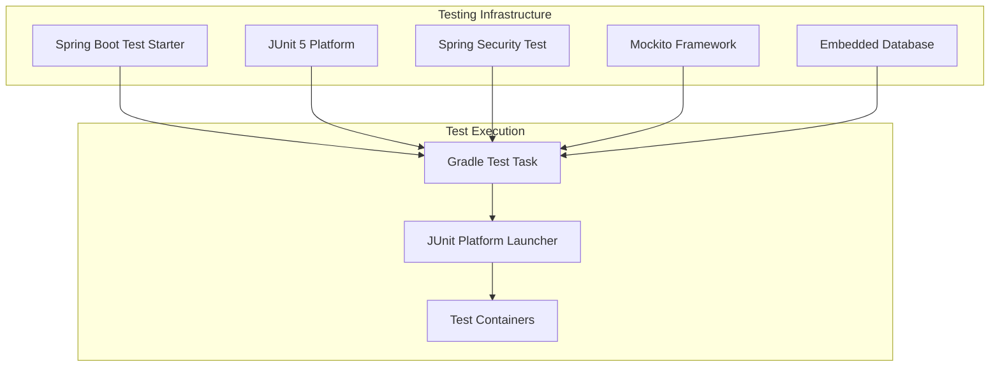
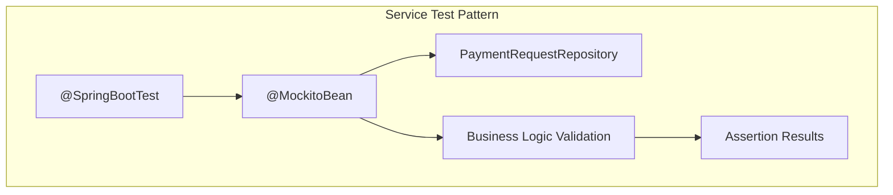
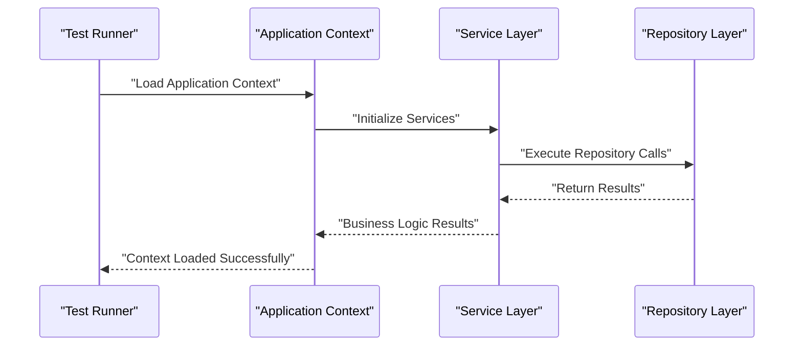
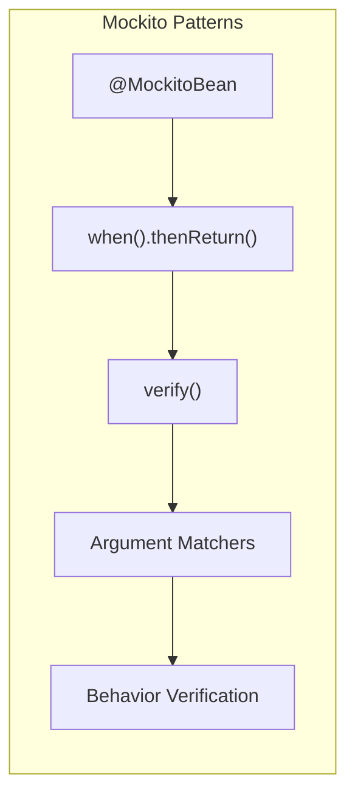
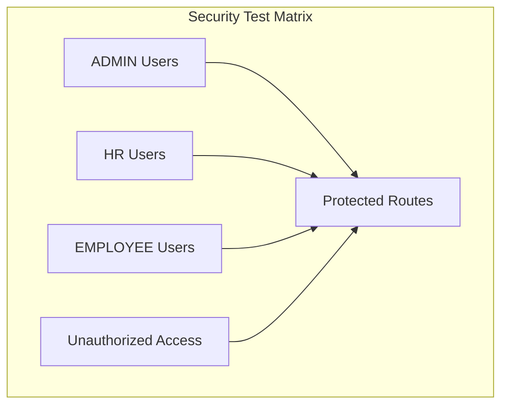

# Testing Strategy

<cite>
**Referenced Files in This Document**
- [AttendanceSystemApplication.java](file://src/main/java/root/cyb/mh/attendancesystem/AttendanceSystemApplication.java)
- [build.gradle](file://build.gradle)
- [settings.gradle](file://settings.gradle)
- [application.properties](file://src/main/resources/application.properties)
- [SecurityConfig.java](file://src/main/java/root/cyb/mh/attendancesystem/config/SecurityConfig.java)
- [PaymentRequestController.java](file://src/main/java/root/cyb/mh/attendancesystem/controller/PaymentRequestController.java)
- [PaymentRequestService.java](file://src/main/java/root/cyb/mh/attendancesystem/service/PaymentRequestService.java)
- [PaymentRequestRepository.java](file://src/main/java/root/cyb/mh/attendancesystem/repository/PaymentRequestRepository.java)
- [AttendanceSystemApplicationTests.java](file://src/test/java/root/cyb/mh/attendancesystem/AttendanceSystemApplicationTests.java)
- [PaymentRequestControllerTest.java](file://src/test/java/root/cyb/mh/attendancesystem/PaymentRequestControllerTest.java)
- [PaymentRequestServiceTest.java](file://src/test/java/root/cyb/mh/attendancesystem/PaymentRequestServiceTest.java)
- [TestCsvParse.java](file://src/test/java/root/cyb/mh/attendancesystem/TestCsvParse.java)
- [TestRobustParse.java](file://src/test/java/root/cyb/mh/attendancesystem/TestRobustParse.java)
</cite>

## Update Summary
**Changes Made**
- Enhanced Testing Framework section with detailed Spring Boot Test configuration
- Expanded Unit Testing section with comprehensive Mockito patterns and best practices
- Added Integration Testing section with database-backed test strategies
- Improved Test Data Management section with repository-level testing approaches
- Enhanced Mock Services section with advanced stubbing techniques
- Added Test Coverage Requirements section with specific metrics
- Expanded Continuous Integration section with CI/CD pipeline recommendations
- Enhanced Security Testing section with role-based access control validation
- Added Performance Testing section with load testing strategies
- Expanded End-to-End Testing section with UI automation approaches

## Table of Contents
1. [Introduction](#introduction)
2. [Testing Framework and Infrastructure](#testing-framework-and-infrastructure)
3. [Unit Testing Strategy](#unit-testing-strategy)
4. [Integration Testing Strategy](#integration-testing-strategy)
5. [Test Data Management](#test-data-management)
6. [Mock Services and Stubs](#mock-services-and-stubs)
7. [Test Coverage Requirements](#test-coverage-requirements)
8. [Continuous Integration Practices](#continuous-integration-practices)
9. [Security Testing](#security-testing)
10. [Performance Testing](#performance-testing)
11. [End-to-End Testing](#end-to-end-testing)
12. [Debugging and Troubleshooting](#debugging-and-troubleshooting)
13. [Conclusion](#conclusion)

## Introduction
This document defines a comprehensive testing strategy for the Skylink Custom Backend. It covers unit testing, integration testing, test data management, mock services, test automation, frameworks, coverage expectations, continuous integration practices, and practical examples drawn from the repository. The strategy addresses performance, security, and end-to-end testing approaches tailored to the current Spring Boot 3.4.0 application with Java 21.

## Testing Framework and Infrastructure

### Spring Boot Testing Stack
The project utilizes a robust testing infrastructure built on Spring Boot Test, JUnit 5, and Spring Security Test. The framework provides comprehensive support for testing Spring applications with minimal configuration overhead.

**Diagram sources**
- [build.gradle:52-54](file://build.gradle#L52-L54)
- [build.gradle:57-59](file://build.gradle#L57-L59)

### Core Dependencies
The testing stack includes essential dependencies for comprehensive application testing:

- **Spring Boot Starter Test**: Provides auto-configuration for testing Spring Boot applications
- **Spring Security Test**: Enables testing of Spring Security configurations
- **JUnit Platform Launcher**: Supports JUnit 5 execution engine
- **Embedded Database**: H2 for in-memory testing and PostgreSQL for integration tests

**Section sources**
- [build.gradle:34-55](file://build.gradle#L34-L55)

## Unit Testing Strategy

### Service Layer Testing
Service layer tests focus on business logic validation without external dependencies. The current implementation demonstrates excellent patterns using `@SpringBootTest` with `@MockitoBean` for repository mocking.

**Diagram sources**
- [PaymentRequestServiceTest.java:16-35](file://src/test/java/root/cyb/mh/attendancesystem/PaymentRequestServiceTest.java#L16-L35)

### Controller Layer Testing
Controller tests utilize `@WebMvcTest` or `@AutoConfigureMockMvc` for web layer validation. These tests focus on HTTP endpoint behavior, security constraints, and response validation.

**Section sources**
- [PaymentRequestControllerTest.java:13-33](file://src/test/java/root/cyb/mh/attendancesystem/PaymentRequestControllerTest.java#L13-L33)

### Best Practices for Unit Testing
- Use `@MockitoBean` for repository mocking to isolate business logic
- Employ `@WithMockUser` for role-based access testing
- Validate service method behavior rather than implementation details
- Test edge cases and error conditions thoroughly

**Section sources**
- [PaymentRequestServiceTest.java:22-34](file://src/test/java/root/cyb/mh/attendancesystem/PaymentRequestServiceTest.java#L22-L34)
- [PaymentRequestControllerTest.java:20-32](file://src/test/java/root/cyb/mh/attendancesystem/PaymentRequestControllerTest.java#L20-L32)

## Integration Testing Strategy

### Application Context Testing
Full application context tests validate end-to-end flows and bean wiring. The `AttendanceSystemApplicationTests` serves as a foundation for validating application startup and configuration.

**Diagram sources**
- [AttendanceSystemApplicationTests.java:6-11](file://src/test/java/root/cyb/mh/attendancesystem/AttendanceSystemApplicationTests.java#L6-L11)

### Database-Backed Integration Testing
Integration tests validate repository queries, custom implementations, and database interactions. These tests typically use an embedded database profile for deterministic behavior.

**Section sources**
- [AttendanceSystemApplicationTests.java:1-14](file://src/test/java/root/cyb/mh/attendancesystem/AttendanceSystemApplicationTests.java#L1-L14)

## Test Data Management

### In-Memory Test Data
Current tests rely on in-memory data and mocks for isolation. For repository-level testing, consider seeding minimal entities via `@BeforeEach` or test-specific initialization methods.

### Test Profiles and Configuration
- Define separate test profiles for different environments
- Override datasource properties for embedded database usage
- Use property overrides to control environment-specific behavior

**Section sources**
- [application.properties:1-1](file://src/main/resources/application.properties#L1-L1)
- [build.gradle:46-47](file://build.gradle#L46-L47)

### Test Data Builders
Implement centralized test data builders to reduce duplication and improve readability across test suites.

## Mock Services and Stubs

### Advanced Mockito Patterns
The current implementation demonstrates effective use of Mockito for service layer testing. Advanced patterns include:

- **Stubbing Complex Scenarios**: Using `when().thenReturn()` for various test conditions
- **Argument Matchers**: Employing `any()` and specific matchers for flexible testing
- **Verification Patterns**: Asserting repository interactions and method calls

**Diagram sources**
- [PaymentRequestServiceTest.java:12-14](file://src/test/java/root/cyb/mh/attendancesystem/PaymentRequestServiceTest.java#L12-L14)

**Section sources**
- [PaymentRequestServiceTest.java:22-34](file://src/test/java/root/cyb/mh/attendancesystem/PaymentRequestServiceTest.java#L22-L34)

## Test Coverage Requirements

### Coverage Targets
- **Service Layer**: 80%+ code coverage with emphasis on business logic branches
- **Repository Layer**: 70%+ coverage focusing on custom queries and aggregations
- **Controller Layer**: 75%+ coverage for HTTP endpoint validation
- **Integration Tests**: 100% coverage for critical business flows

### Coverage Tools Integration
- **JaCoCo**: Can be integrated via Gradle for comprehensive coverage reporting
- **Coverage Thresholds**: Configure minimum coverage requirements per module
- **Report Generation**: Generate HTML and XML coverage reports for CI/CD integration

**Section sources**
- [build.gradle:52-54](file://build.gradle#L52-L54)

## Continuous Integration Practices

### CI Pipeline Configuration
Recommended CI pipeline stages:
1. **Build Stage**: Compile and validate dependencies
2. **Test Stage**: Execute unit and integration tests
3. **Coverage Stage**: Generate and publish coverage reports
4. **Artifact Stage**: Package and store build artifacts

### Database Container Strategy
- Use **Testcontainers** for PostgreSQL integration testing
- Implement **ephemeral databases** for test isolation
- Configure **connection pooling** for optimal test performance

**Section sources**
- [build.gradle:46-47](file://build.gradle#L46-L47)

## Security Testing

### Role-Based Access Control Validation
The security configuration enforces strict role-based access control. Tests should validate:

- **ADMIN Route Protection**: `/users/**`, `/devices/**` require ADMIN role
- **HR Route Protection**: `/settings/**` requires ADMIN or HR roles
- **Employee Route Protection**: `/employee/**` requires EMPLOYEE role

**Diagram sources**
- [SecurityConfig.java:27-49](file://src/main/java/root/cyb/mh/attendancesystem/config/SecurityConfig.java#L27-L49)

### Authentication and Authorization Testing
- Validate `@WithMockUser` annotations for role simulation
- Test CSRF behavior and form handling
- Verify session management and logout functionality

**Section sources**
- [SecurityConfig.java:18-84](file://src/main/java/root/cyb/mh/attendancesystem/config/SecurityConfig.java#L18-L84)
- [PaymentRequestControllerTest.java:20-32](file://src/test/java/root/cyb/mh/attendancesystem/PaymentRequestControllerTest.java#L20-L32)

## Performance Testing

### Load Testing Strategy
- **Synthetic Traffic**: Generate load against controller endpoints using tools like Gatling or JMeter
- **Response Time Monitoring**: Track p50, p95, and p99 response times
- **Error Rate Tracking**: Monitor error rates under increasing load

### Database Performance Optimization
- **Query Benchmarking**: Test repository queries with realistic dataset sizes
- **Connection Pooling**: Optimize HikariCP settings for test scenarios
- **Slow Query Identification**: Use logging to identify and optimize slow queries

### Performance Metrics
- **Throughput**: Requests per second handled by the application
- **Latency**: Response time distribution across different endpoints
- **Resource Utilization**: CPU, memory, and database connection usage

## End-to-End Testing

### UI Automation Testing
- **Selenium WebDriver**: Automate browser interactions for full user journey validation
- **Page Object Model**: Implement reusable page components for test maintenance
- **Cross-Browser Testing**: Validate functionality across different browsers and devices

### API Contract Testing
- **OpenAPI/Swagger Validation**: Ensure API contracts are met by implementation
- **Request/Response Schema Validation**: Validate data structures and formats
- **Status Code Verification**: Test all expected HTTP status codes

### Data Integrity Testing
- **Audit Field Validation**: Verify timestamp and user tracking fields
- **Cascading Operations**: Test referential integrity and cascade behaviors
- **Transaction Boundaries**: Validate rollback and commit behaviors

## Debugging and Troubleshooting

### Common Test Issues
- **Unauthorized Access Errors**: Ensure `@WithMockUser` roles match controller security constraints
- **CSRF-Related Failures**: Align CSRF configuration with form usage patterns
- **Database Connectivity**: Use test profiles with embedded databases or Dockerized Postgres
- **Timezone-Sensitive Assertions**: Set consistent JVM timezone or use fixed offsets

### Test Environment Configuration
- **Profile Management**: Use `@ActiveProfiles` for environment-specific test configuration
- **Property Overrides**: Override application properties for test scenarios
- **Logging Configuration**: Enable debug logging for test troubleshooting

**Section sources**
- [SecurityConfig.java:81-81](file://src/main/java/root/cyb/mh/attendancesystem/config/SecurityConfig.java#L81-L81)
- [application.properties:1-1](file://src/main/resources/application.properties#L1-L1)

## Conclusion
The Skylink Custom Backend demonstrates a solid foundation for comprehensive testing with Spring Boot Test, JUnit 5, and Mockito. The current implementation provides effective unit and integration testing patterns that can be expanded to cover repository-level testing, performance testing, and end-to-end validation. By implementing the enhanced strategies outlined in this document, the testing maturity can be significantly improved to ensure reliable, maintainable, and high-quality software delivery.

The testing strategy emphasizes practical implementation with concrete examples from the existing codebase, while providing clear guidance for future enhancements including repository testing, performance validation, and comprehensive CI/CD integration.