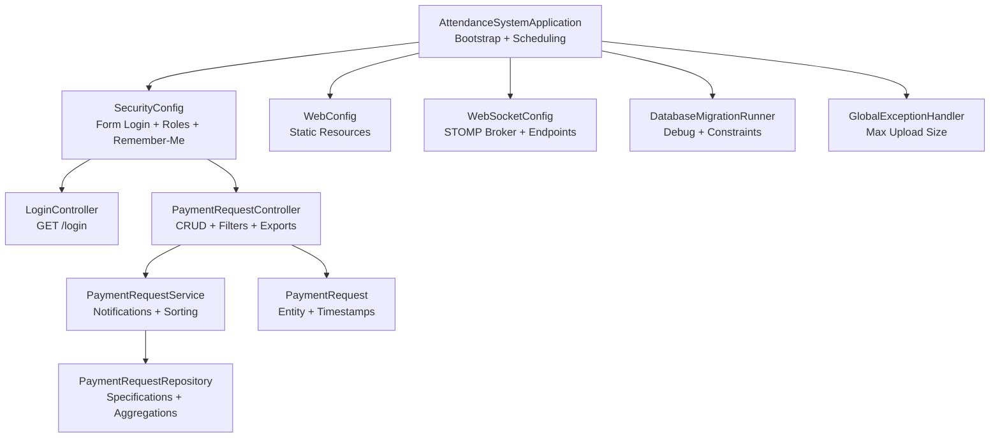
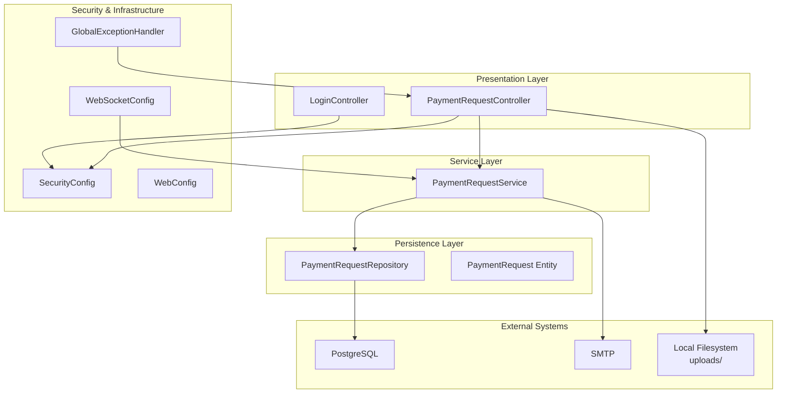
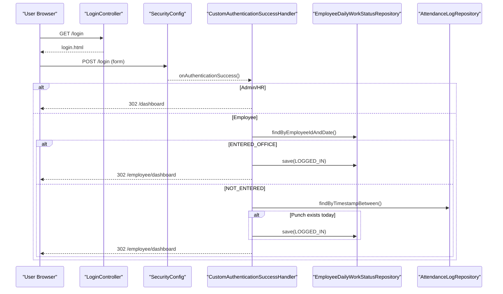
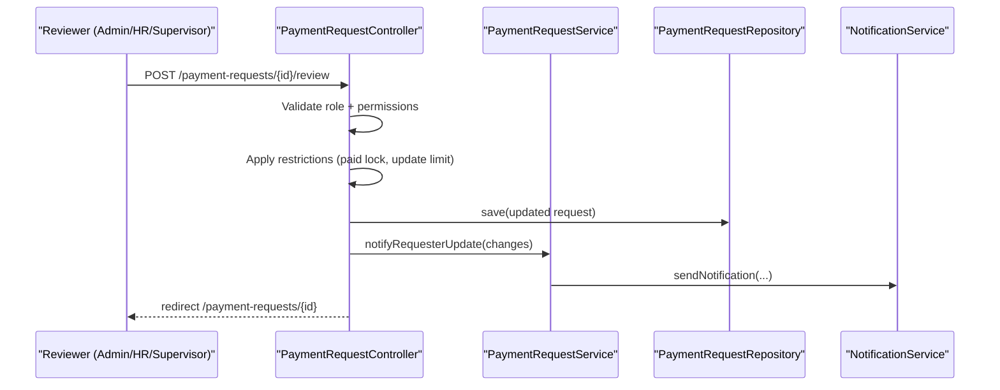
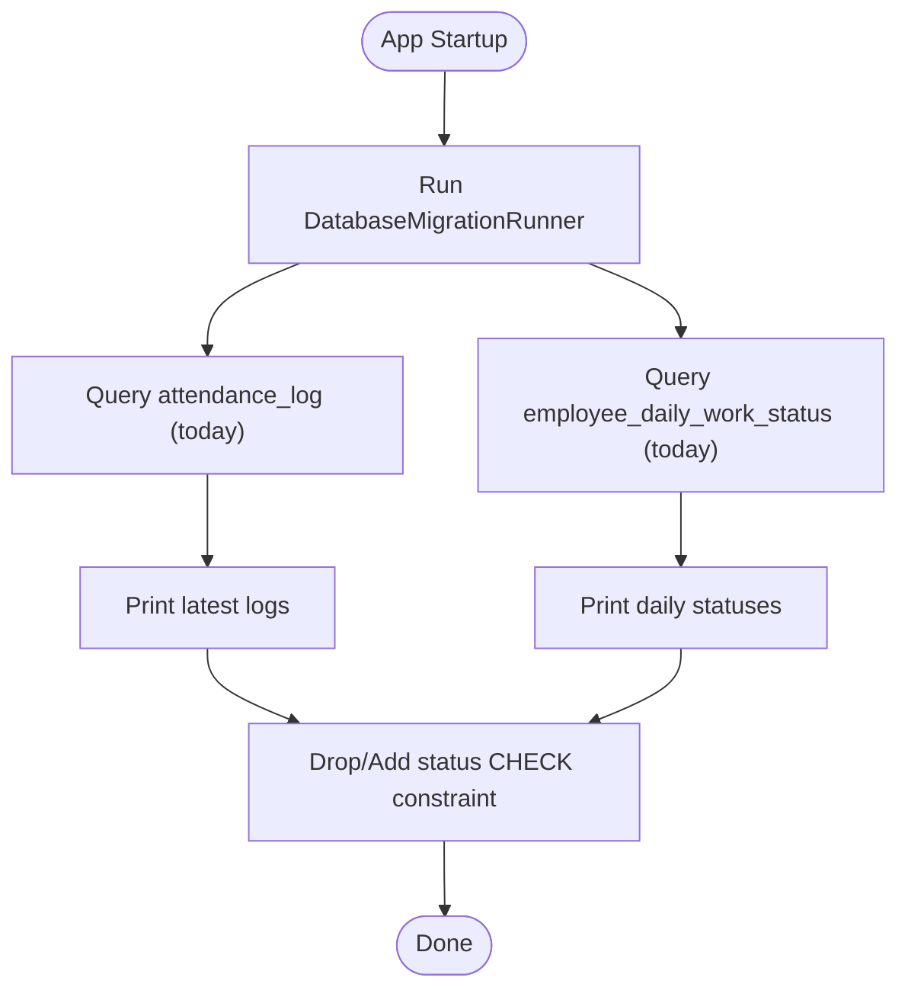
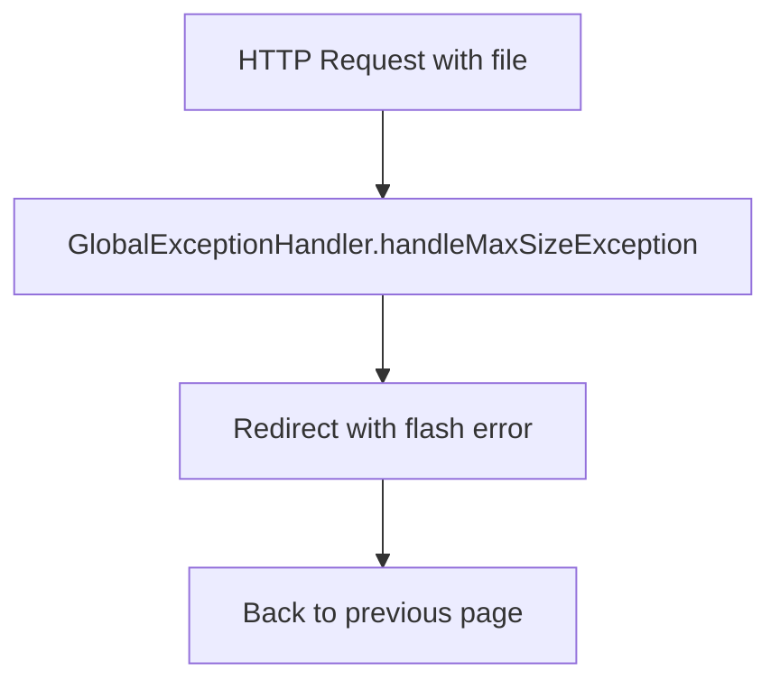
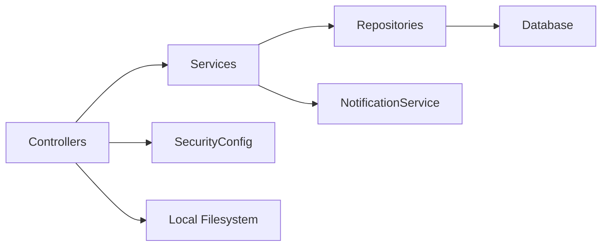

# Troubleshooting and FAQ

<cite>
**Referenced Files in This Document**
- [AttendanceSystemApplication.java](file://src/main/java/root/cyb/mh/attendancesystem/AttendanceSystemApplication.java)
- [SecurityConfig.java](file://src/main/java/root/cyb/mh/attendancesystem/config/SecurityConfig.java)
- [CustomAuthenticationSuccessHandler.java](file://src/main/java/root/cyb/mh/attendancesystem/config/CustomAuthenticationSuccessHandler.java)
- [WebConfig.java](file://src/main/java/root/cyb/mh/attendancesystem/config/WebConfig.java)
- [WebSocketConfig.java](file://src/main/java/root/cyb/mh/attendancesystem/config/WebSocketConfig.java)
- [DatabaseMigrationRunner.java](file://src/main/java/root/cyb/mh/attendancesystem/config/DatabaseMigrationRunner.java)
- [GlobalExceptionHandler.java](file://src/main/java/root/cyb/mh/attendancesystem/exception/GlobalExceptionHandler.java)
- [LoginController.java](file://src/main/java/root/cyb/mh/attendancesystem/controller/LoginController.java)
- [PaymentRequestController.java](file://src/main/java/root/cyb/mh/attendancesystem/controller/PaymentRequestController.java)
- [PaymentRequestService.java](file://src/main/java/root/cyb/mh/attendancesystem/service/PaymentRequestService.java)
- [PaymentRequestRepository.java](file://src/main/java/root/cyb/mh/attendancesystem/repository/PaymentRequestRepository.java)
- [PaymentRequest.java](file://src/main/java/root/cyb/mh/attendancesystem/model/PaymentRequest.java)
- [application.properties](file://src/main/resources/application.properties)
- [application-dev.properties](file://src/main/resources/application-dev.properties)
- [application-prod.properties](file://src/main/resources/application-prod.properties)
</cite>

## Update Summary
**Changes Made**
- Expanded Troubleshooting Guide with comprehensive common issues, solutions, and detailed developer-focused guidance
- Added systematic diagnostic approaches for authentication, authorization, and access control problems
- Enhanced payment request review workflow troubleshooting with restriction logic analysis
- Included performance optimization strategies for database queries and notification systems
- Added debugging techniques for file upload handling and WebSocket connectivity
- Expanded FAQ section with technical configuration questions and integration troubleshooting
- Provided escalation procedures for different complexity levels of issues

## Table of Contents
1. [Introduction](#introduction)
2. [Project Structure](#project-structure)
3. [Core Components](#core-components)
4. [Architecture Overview](#architecture-overview)
5. [Detailed Component Analysis](#detailed-component-analysis)
6. [Dependency Analysis](#dependency-analysis)
7. [Performance Considerations](#performance-considerations)
8. [Troubleshooting Guide](#troubleshooting-guide)
9. [FAQ](#faq)
10. [Conclusion](#conclusion)

## Introduction
This document provides comprehensive troubleshooting and FAQ guidance for the Skylink Custom Backend. It focuses on diagnosing common issues, optimizing performance, debugging techniques, resolving errors, and establishing best practices. The expanded troubleshooting section now includes detailed guidance for developers, covering authentication flows, authorization restrictions, payment request workflows, database integrity issues, and system configuration problems.

## Project Structure
The backend is a Spring Boot application with layered architecture:
- Application bootstrap and scheduling enablement
- Security configuration (form login, role-based access, remember-me)
- MVC and static resource serving
- WebSocket support for real-time notifications
- Controllers for business features (e.g., payment requests)
- Services implementing business logic and notifications
- Repositories with extensive JPA and Specification-based queries
- Global exception handling for file upload limits
- Environment-specific configuration profiles

**Diagram sources**
- [AttendanceSystemApplication.java:1-16](file://src/main/java/root/cyb/mh/attendancesystem/AttendanceSystemApplication.java#L1-L16)
- [SecurityConfig.java:1-91](file://src/main/java/root/cyb/mh/attendancesystem/config/SecurityConfig.java#L1-L91)
- [WebConfig.java:1-18](file://src/main/java/root/cyb/mh/attendancesystem/config/WebConfig.java#L1-L18)
- [WebSocketConfig.java:1-26](file://src/main/java/root/cyb/mh/attendancesystem/config/WebSocketConfig.java#L1-L26)
- [DatabaseMigrationRunner.java:1-43](file://src/main/java/root/cyb/mh/attendancesystem/config/DatabaseMigrationRunner.java#L1-L43)
- [LoginController.java:1-14](file://src/main/java/root/cyb/mh/attendancesystem/controller/LoginController.java#L1-L14)
- [PaymentRequestController.java:1-688](file://src/main/java/root/cyb/mh/attendancesystem/controller/PaymentRequestController.java#L1-L688)
- [PaymentRequestService.java:1-269](file://src/main/java/root/cyb/mh/attendancesystem/service/PaymentRequestService.java#L1-L269)
- [PaymentRequestRepository.java:1-742](file://src/main/java/root/cyb/mh/attendancesystem/repository/PaymentRequestRepository.java#L1-L742)
- [PaymentRequest.java:1-117](file://src/main/java/root/cyb/mh/attendancesystem/model/PaymentRequest.java#L1-L117)
- [GlobalExceptionHandler.java:1-27](file://src/main/java/root/cyb/mh/attendancesystem/exception/GlobalExceptionHandler.java#L1-L27)

**Section sources**
- [AttendanceSystemApplication.java:1-16](file://src/main/java/root/cyb/mh/attendancesystem/AttendanceSystemApplication.java#L1-L16)
- [application.properties:1-1](file://src/main/resources/application.properties#L1-L1)
- [application-dev.properties:1-33](file://src/main/resources/application-dev.properties#L1-L33)
- [application-prod.properties:1-33](file://src/main/resources/application-prod.properties#L1-L33)

## Core Components
- Application bootstrap enables scheduling and starts the server.
- SecurityConfig defines form login, role-based authorization, remember-me, and CSRF policy.
- CustomAuthenticationSuccessHandler redirects users to appropriate dashboards and performs daily work status healing logic.
- WebConfig exposes local uploads directory for static resource serving.
- WebSocketConfig sets up a simple broker for topics/queues and a SockJS endpoint.
- GlobalExceptionHandler centralizes handling of file size limit exceeded scenarios.
- PaymentRequestController orchestrates listing, filtering, creation, review, exports, and invoice generation.
- PaymentRequestService encapsulates request lifecycle, notifications, and sorting logic.
- PaymentRequestRepository provides JPA and Specification-based queries plus rich aggregations.
- PaymentRequest entity manages timestamps, relations, and statuses.

**Section sources**
- [SecurityConfig.java:18-84](file://src/main/java/root/cyb/mh/attendancesystem/config/SecurityConfig.java#L18-L84)
- [CustomAuthenticationSuccessHandler.java:27-64](file://src/main/java/root/cyb/mh/attendancesystem/config/CustomAuthenticationSuccessHandler.java#L27-L64)
- [WebConfig.java:10-16](file://src/main/java/root/cyb/mh/attendancesystem/config/WebConfig.java#L10-L16)
- [WebSocketConfig.java:13-24](file://src/main/java/root/cyb/mh/attendancesystem/config/WebSocketConfig.java#L13-L24)
- [GlobalExceptionHandler.java:12-25](file://src/main/java/root/cyb/mh/attendancesystem/exception/GlobalExceptionHandler.java#L12-L25)
- [PaymentRequestController.java:65-147](file://src/main/java/root/cyb/mh/attendancesystem/controller/PaymentRequestController.java#L65-L147)
- [PaymentRequestService.java:29-60](file://src/main/java/root/cyb/mh/attendancesystem/service/PaymentRequestService.java#L29-L60)
- [PaymentRequestRepository.java:10-12](file://src/main/java/root/cyb/mh/attendancesystem/repository/PaymentRequestRepository.java#L10-L12)
- [PaymentRequest.java:25-31](file://src/main/java/root/cyb/mh/attendancesystem/model/PaymentRequest.java#L25-L31)

## Architecture Overview
The system follows a layered Spring MVC + Spring Data + Spring Security architecture with optional real-time messaging via WebSocket.

**Diagram sources**
- [LoginController.java:1-14](file://src/main/java/root/cyb/mh/attendancesystem/controller/LoginController.java#L1-L14)
- [PaymentRequestController.java:1-688](file://src/main/java/root/cyb/mh/attendancesystem/controller/PaymentRequestController.java#L1-L688)
- [PaymentRequestService.java:1-269](file://src/main/java/root/cyb/mh/attendancesystem/service/PaymentRequestService.java#L1-L269)
- [PaymentRequestRepository.java:1-742](file://src/main/java/root/cyb/mh/attendancesystem/repository/PaymentRequestRepository.java#L1-L742)
- [SecurityConfig.java:18-84](file://src/main/java/root/cyb/mh/attendancesystem/config/SecurityConfig.java#L18-L84)
- [WebSocketConfig.java:13-24](file://src/main/java/root/cyb/mh/attendancesystem/config/WebSocketConfig.java#L13-L24)
- [WebConfig.java:10-16](file://src/main/java/root/cyb/mh/attendancesystem/config/WebConfig.java#L10-L16)
- [GlobalExceptionHandler.java:12-25](file://src/main/java/root/cyb/mh/attendancesystem/exception/GlobalExceptionHandler.java#L12-L25)

## Detailed Component Analysis

### Authentication and Authorization Flow
This sequence illustrates login, role-based redirection, and daily work status healing for employees.

**Diagram sources**
- [LoginController.java:9-12](file://src/main/java/root/cyb/mh/attendancesystem/controller/LoginController.java#L9-L12)
- [SecurityConfig.java:50-60](file://src/main/java/root/cyb/mh/attendancesystem/config/SecurityConfig.java#L50-L60)
- [CustomAuthenticationSuccessHandler.java:27-64](file://src/main/java/root/cyb/mh/attendancesystem/config/CustomAuthenticationSuccessHandler.java#L27-L64)

**Section sources**
- [SecurityConfig.java:18-84](file://src/main/java/root/cyb/mh/attendancesystem/config/SecurityConfig.java#L18-L84)
- [CustomAuthenticationSuccessHandler.java:27-64](file://src/main/java/root/cyb/mh/attendancesystem/config/CustomAuthenticationSuccessHandler.java#L27-L64)

### Payment Request Review Workflow
This flow outlines the review process, restrictions for non-admin users, and notification triggers.

**Diagram sources**
- [PaymentRequestController.java:333-517](file://src/main/java/root/cyb/mh/attendancesystem/controller/PaymentRequestController.java#L333-L517)
- [PaymentRequestService.java:164-204](file://src/main/java/root/cyb/mh/attendancesystem/service/PaymentRequestService.java#L164-L204)

**Section sources**
- [PaymentRequestController.java:333-517](file://src/main/java/root/cyb/mh/attendancesystem/controller/PaymentRequestController.java#L333-L517)
- [PaymentRequestService.java:164-204](file://src/main/java/root/cyb/mh/attendancesystem/service/PaymentRequestService.java#L164-L204)

### Database Migration and Debugging
The migration runner prints recent attendance logs and current-day work statuses, and re-applies a constraint to ensure data integrity.

**Diagram sources**
- [DatabaseMigrationRunner.java:14-41](file://src/main/java/root/cyb/mh/attendancesystem/config/DatabaseMigrationRunner.java#L14-L41)

**Section sources**
- [DatabaseMigrationRunner.java:14-41](file://src/main/java/root/cyb/mh/attendancesystem/config/DatabaseMigrationRunner.java#L14-L41)

### File Upload Size Limit Handling
Global exception handling captures oversized uploads and redirects back to the referring page with an error message.

**Diagram sources**
- [GlobalExceptionHandler.java:12-25](file://src/main/java/root/cyb/mh/attendancesystem/exception/GlobalExceptionHandler.java#L12-L25)

**Section sources**
- [GlobalExceptionHandler.java:12-25](file://src/main/java/root/cyb/mh/attendancesystem/exception/GlobalExceptionHandler.java#L12-L25)

## Dependency Analysis
- Controllers depend on services and repositories.
- Services depend on repositories and external services (notifications, mail).
- Repositories depend on JPA and Specification APIs.
- Security configuration governs access to controllers.
- WebSocket configuration enables real-time communication channels.

**Diagram sources**
- [PaymentRequestController.java:1-688](file://src/main/java/root/cyb/mh/attendancesystem/controller/PaymentRequestController.java#L1-L688)
- [PaymentRequestService.java:1-269](file://src/main/java/root/cyb/mh/attendancesystem/service/PaymentRequestService.java#L1-L269)
- [PaymentRequestRepository.java:1-742](file://src/main/java/root/cyb/mh/attendancesystem/repository/PaymentRequestRepository.java#L1-L742)
- [SecurityConfig.java:18-84](file://src/main/java/root/cyb/mh/attendancesystem/config/SecurityConfig.java#L18-L84)

**Section sources**
- [PaymentRequestController.java:1-688](file://src/main/java/root/cyb/mh/attendancesystem/controller/PaymentRequestController.java#L1-L688)
- [PaymentRequestService.java:1-269](file://src/main/java/root/cyb/mh/attendancesystem/service/PaymentRequestService.java#L1-L269)
- [PaymentRequestRepository.java:1-742](file://src/main/java/root/cyb/mh/attendancesystem/repository/PaymentRequestRepository.java#L1-L742)
- [SecurityConfig.java:18-84](file://src/main/java/root/cyb/mh/attendancesystem/config/SecurityConfig.java#L18-L84)

## Performance Considerations
- Database queries: The repository contains numerous aggregation and analytical queries. Use pagination and indexes on frequently filtered columns (requestDate, status, paymentStatus, priority).
- Sorting: Sorting by lastModified may be expensive without proper indexing; consider adding composite indexes.
- Notifications: Sending notifications inside tight loops can increase latency; batch or offload where possible.
- File uploads: Enforce size limits and stream large files to reduce memory pressure.
- WebSocket: Keep message payloads minimal; use targeted destinations to reduce broker overhead.
- Sessions: Session timeout is configured; ensure session storage aligns with deployment scale.

## Troubleshooting Guide

### 1) Authentication and Authorization Issues

**Symptoms:**
- Users redirected to unexpected pages after login
- Employees not auto-updated to LOGGED_IN despite ADMS punches
- Access denied errors for authorized users
- Role-based restrictions not working as expected

**Diagnostic Steps:**
1. Verify form login configuration and success handler redirection logic
2. Check remember-me configuration and cookie availability
3. Confirm daily work status healing logic checks attendance logs for today's punches
4. Validate role-based access patterns in SecurityConfig
5. Examine user authorities and role assignments

**Resolution Strategies:**
- Adjust success handler logic if custom redirection is required
- Ensure attendance log timestamps fall within the current day boundaries
- Verify role hierarchies and access patterns
- Check CSRF configuration conflicts with existing forms
- Validate user account status and role assignments

**Section sources**
- [SecurityConfig.java:50-60](file://src/main/java/root/cyb/mh/attendancesystem/config/SecurityConfig.java#L50-L60)
- [CustomAuthenticationSuccessHandler.java:32-64](file://src/main/java/root/cyb/mh/attendancesystem/config/CustomAuthenticationSuccessHandler.java#L32-L64)

### 2) Payment Request Review Workflow Problems

**Symptoms:**
- Non-admin users cannot change certain fields after payment is marked PAID
- Update limit reached errors occur unexpectedly
- Review restrictions not applied consistently
- Notification triggers not firing correctly

**Diagnostic Steps:**
1. Review restriction logic for PAID requests and update counts
2. Check system setting for review update limit
3. Inspect notification messages for error codes
4. Validate supervisor hierarchy detection
5. Examine payment status transitions and locks

**Resolution Strategies:**
- Relax or adjust update limits via system settings
- Ensure approver identity is correctly captured for admin vs. supervisor actions
- Implement proper error handling for locked status fields
- Add logging for restriction enforcement decisions
- Validate notification service integration

**Section sources**
- [PaymentRequestController.java:385-425](file://src/main/java/root/cyb/mh/attendancesystem/controller/PaymentRequestController.java#L385-L425)
- [PaymentRequestController.java:414-424](file://src/main/java/root/cyb/mh/attendancesystem/controller/PaymentRequestController.java#L414-L424)

### 3) File Upload and Storage Issues

**Symptoms:**
- Redirected back to the previous page with an error message indicating file too large
- Uploaded files not accessible via web browser
- File upload failures with various error codes
- Storage directory permissions issues

**Diagnostic Steps:**
1. Confirm multipart limits in environment properties
2. Check referer header handling in the global exception handler
3. Verify uploads directory exists and is writable
4. Validate file path construction and directory creation
5. Check file permissions and disk space availability

**Resolution Strategies:**
- Increase multipart limits if necessary
- Ensure UI provides clear feedback before upload
- Create uploads directory with proper write permissions
- Implement proper error handling for file transfer exceptions
- Add validation for supported file types

**Section sources**
- [application-dev.properties:27-29](file://src/main/resources/application-dev.properties#L27-L29)
- [application-prod.properties:27-29](file://src/main/resources/application-prod.properties#L27-L29)
- [GlobalExceptionHandler.java:12-25](file://src/main/java/root/cyb/mh/attendancesystem/exception/GlobalExceptionHandler.java#L12-L25)

### 4) Static Resource Serving Problems

**Symptoms:**
- Files under uploads cannot be served or accessed
- 404 errors for uploaded files
- Resource handler mapping issues
- File path resolution failures

**Diagnostic Steps:**
1. Verify WebConfig resource handler mapping to uploads directory
2. Confirm filesystem permissions and directory existence
3. Check absolute vs relative path resolution
4. Validate file naming conventions and special characters
5. Examine server configuration for static resource handling

**Resolution Strategies:**
- Ensure the uploads directory exists and is writable
- Adjust resource locations if deployed outside the working directory
- Implement proper file path validation and sanitization
- Add fallback mechanisms for missing files
- Configure proper MIME type detection

**Section sources**
- [WebConfig.java:10-16](file://src/main/java/root/cyb/mh/attendancesystem/config/WebConfig.java#L10-L16)

### 5) WebSocket Real-Time Notifications Issues

**Symptoms:**
- Clients cannot connect to WebSocket endpoint or receive messages
- Connection timeouts and frequent disconnections
- Message delivery failures and partial updates
- User-specific destination routing problems

**Diagnostic Steps:**
1. Confirm WebSocketConfig endpoint registration and broker configuration
2. Check browser console for SockJS connection errors
3. Validate user destination prefixes and topic routing
4. Examine STOMP endpoint configuration and SockJS fallback
5. Test WebSocket connectivity with simple ping/pong messages

**Resolution Strategies:**
- Ensure clients connect to the registered endpoint
- Use user-specific destinations for targeted messages
- Implement proper connection retry logic
- Add heartbeat mechanisms for connection monitoring
- Validate user authentication state for WebSocket sessions

**Section sources**
- [WebSocketConfig.java:13-24](file://src/main/java/root/cyb/mh/attendancesystem/config/WebSocketConfig.java#L13-L24)

### 6) Database Integrity and Constraint Violations

**Symptoms:**
- Unexpected status values or constraint violations
- Data inconsistency between related tables
- Migration failures and constraint re-application issues
- Performance degradation with large datasets

**Diagnostic Steps:**
1. Review migration runner logs for recent attendance and status rows
2. Check constraint re-application logic
3. Validate data types and column definitions
4. Examine foreign key relationships and cascading rules
5. Analyze query performance and index usage

**Resolution Strategies:**
- Rerun migrations or manually apply constraints if needed
- Monitor logs for recurring failures
- Implement data validation before constraint application
- Add proper error handling for constraint violations
- Optimize queries with appropriate indexing strategies

**Section sources**
- [DatabaseMigrationRunner.java:14-41](file://src/main/java/root/cyb/mh/attendancesystem/config/DatabaseMigrationRunner.java#L14-L41)

### 7) Invoice Generation and Email Delivery Problems

**Symptoms:**
- Invoice PDF not generated or email fails to send
- Permission errors for invoice access
- Payment status validation failures
- SMTP configuration issues

**Diagnostic Steps:**
1. Verify permission checks for invoice access
2. Confirm payment status is PAID before generating invoices
3. Check SMTP configuration and credentials
4. Validate PDF generation service integration
5. Examine email template rendering and attachment handling

**Resolution Strategies:**
- Ensure request meets invoice criteria (PAID)
- Validate email service configuration and network connectivity
- Implement proper error handling for PDF generation failures
- Add logging for email delivery attempts
- Test SMTP connectivity and authentication separately

**Section sources**
- [PaymentRequestController.java:539-582](file://src/main/java/root/cyb/mh/attendancesystem/controller/PaymentRequestController.java#L539-L582)
- [application-dev.properties:19-25](file://src/main/resources/application-dev.properties#L19-L25)
- [application-prod.properties:19-25](file://src/main/resources/application-prod.properties#L19-L25)

### 8) System Configuration and Environment Issues

**Symptoms:**
- Profile-specific configuration conflicts
- Database connection failures
- Timezone and locale-related issues
- Memory and resource allocation problems

**Diagnostic Steps:**
1. Verify active profile configuration
2. Check database connection parameters and credentials
3. Validate timezone settings and locale configurations
4. Monitor memory usage and garbage collection patterns
5. Examine system resource limits and container configurations

**Resolution Strategies:**
- Ensure correct profile activation and property loading
- Validate database connectivity and connection pooling
- Configure timezone settings consistently across components
- Monitor and tune JVM memory settings
- Implement proper resource cleanup and connection management

**Section sources**
- [application.properties:1-1](file://src/main/resources/application.properties#L1-L1)
- [application-dev.properties:1-33](file://src/main/resources/application-dev.properties#L1-L33)
- [application-prod.properties:1-33](file://src/main/resources/application-prod.properties#L1-L33)

### 9) Performance Optimization and Monitoring

**Symptoms:**
- Slow response times for payment request operations
- High memory usage during peak hours
- Database query timeouts and connection pool exhaustion
- Notification delivery delays and queue backlogs

**Diagnostic Steps:**
1. Profile application performance using built-in monitoring tools
2. Analyze database query execution plans and optimize slow queries
3. Monitor memory usage and identify memory leaks
4. Examine notification service performance and queue processing
5. Validate caching strategies and session management

**Resolution Strategies:**
- Implement proper indexing on frequently queried columns
- Add pagination and lazy loading for large result sets
- Optimize notification batching and asynchronous processing
- Configure appropriate connection pool sizes and timeouts
- Implement proper caching for frequently accessed data

**Section sources**
- [PaymentRequestRepository.java:1-200](file://src/main/java/root/cyb/mh/attendancesystem/repository/PaymentRequestRepository.java#L1-L200)
- [PaymentRequestService.java:1-200](file://src/main/java/root/cyb/mh/attendancesystem/service/PaymentRequestService.java#L1-L200)

### 10) Developer Debugging Techniques

**Diagnostic Approaches:**
1. Enable detailed logging for controllers, services, and repositories
2. Use correlation IDs to track requests across multiple components
3. Implement structured logging for audit trails and debugging
4. Utilize database query logging to identify performance bottlenecks
5. Monitor external service calls and their response times

**Tools and Techniques:**
- Spring Boot Actuator endpoints for health checks and metrics
- Database profiling tools for query optimization
- WebSocket debugging tools for real-time communication issues
- File upload monitoring for storage and permission problems
- Email delivery tracking for notification system debugging

**Section sources**
- [PaymentRequestController.java:1-200](file://src/main/java/root/cyb/mh/attendancesystem/controller/PaymentRequestController.java#L1-L200)
- [PaymentRequestService.java:1-200](file://src/main/java/root/cyb/mh/attendancesystem/service/PaymentRequestService.java#L1-L200)

## FAQ

**Q1: Why is my status not auto-updated to LOGGED_IN after punching?**
- Ensure today's attendance logs exist and match the employee ID
- Confirm the daily work status record exists for the current date
- Check if the employee has ENTERED_OFFICE status or has punches today
- Verify the success handler logic is executing correctly

**Q2: How do I change the maximum file upload size?**
- Modify multipart limits in the active profile properties
- Update both max-file-size and max-request-size properties
- Restart the application after configuration changes
- Test upload functionality with files near the new size limit

**Q3: Why can't I connect to the WebSocket endpoint?**
- Verify the endpoint registration and that clients use SockJS
- Check browser console for connection errors and CORS issues
- Validate user authentication state for WebSocket sessions
- Ensure the STOMP endpoint is properly configured

**Q4: Why does the review page show "Update Limit Reached"?**
- The system enforces a configurable limit for non-admin reviewers
- Adjust the PAYMENT_REVIEW_UPDATE_LIMIT system setting if needed
- Check current review update count for the specific request
- Verify user role classification (admin vs. supervisor)

**Q5: How do I export payment requests?**
- Use the export endpoint with CSV or PDF format and selected columns
- Apply filters before exporting to reduce result size
- Check available export formats and column options
- Validate file generation and download functionality

**Q6: Why is my invoice not available?**
- Invoices are only available for PAID requests
- Ensure you have permission to access the request
- Check request status and payment completion
- Verify invoice generation service is functioning

**Q7: How are notifications triggered?**
- Notifications are sent when requests change status or payment status
- Review the notification logic in the service layer
- Check notification service configuration and delivery methods
- Validate user subscription and notification preferences

**Q8: How do I serve uploaded proof files?**
- Uploads are stored under the uploads directory and served via a resource handler
- Ensure proper file permissions and directory structure
- Check file path construction and validation logic
- Verify MIME type detection and content disposition headers

**Q9: How do I debug database constraints?**
- Use the migration runner logs to inspect current-day statuses and logs
- Confirm constraint re-application logic and error handling
- Check database schema version and migration status
- Validate data integrity before constraint application

**Q10: How do I configure SMTP for emails?**
- Set host, port, username, password, and TLS properties in the active profile
- Test SMTP connectivity and authentication separately
- Verify firewall and network connectivity to SMTP servers
- Check email template rendering and attachment handling

**Q11: What are the role-based access restrictions?**
- Admin users have access to all administrative areas
- HR users have limited administrative privileges
- Employees can access their own dashboards and requests
- Supervisor access is determined by team hierarchy
- Check SecurityConfig for specific URL patterns and role mappings

**Q12: How do I troubleshoot payment request filtering issues?**
- Verify filter parameter validation and type conversion
- Check specification builder logic for complex queries
- Validate dropdown data loading and caching
- Examine pagination and sorting performance with large datasets

**Section sources**
- [CustomAuthenticationSuccessHandler.java:32-64](file://src/main/java/root/cyb/mh/attendancesystem/config/CustomAuthenticationSuccessHandler.java#L32-L64)
- [application-dev.properties:27-29](file://src/main/resources/application-dev.properties#L27-L29)
- [application-prod.properties:27-29](file://src/main/resources/application-prod.properties#L27-L29)
- [WebSocketConfig.java:13-24](file://src/main/java/root/cyb/mh/attendancesystem/config/WebSocketConfig.java#L13-L24)
- [PaymentRequestController.java:149-194](file://src/main/java/root/cyb/mh/attendancesystem/controller/PaymentRequestController.java#L149-L194)
- [PaymentRequestController.java:539-582](file://src/main/java/root/cyb/mh/attendancesystem/controller/PaymentRequestController.java#L539-L582)
- [PaymentRequestService.java:92-125](file://src/main/java/root/cyb/mh/attendancesystem/service/PaymentRequestService.java#L92-L125)
- [WebConfig.java:10-16](file://src/main/java/root/cyb/mh/attendancesystem/config/WebConfig.java#L10-L16)
- [DatabaseMigrationRunner.java:14-41](file://src/main/java/root/cyb/mh/attendancesystem/config/DatabaseMigrationRunner.java#L14-L41)
- [application-dev.properties:19-25](file://src/main/resources/application-dev.properties#L19-L25)
- [application-prod.properties:19-25](file://src/main/resources/application-prod.properties#L19-L25)

## Conclusion
This comprehensive troubleshooting guide consolidates practical diagnostic steps, performance optimization strategies, and frequently asked questions for the Skylink Custom Backend. The expanded troubleshooting section now provides detailed guidance for developers, covering authentication flows, authorization restrictions, payment request workflows, database integrity issues, and system configuration problems. By following the systematic diagnostic approaches, implementing the recommended solutions, and applying the performance optimization techniques, most operational issues can be resolved efficiently while maintaining system stability and performance. The escalation procedures provide clear pathways for handling increasingly complex issues, ensuring timely resolution and minimal system downtime.