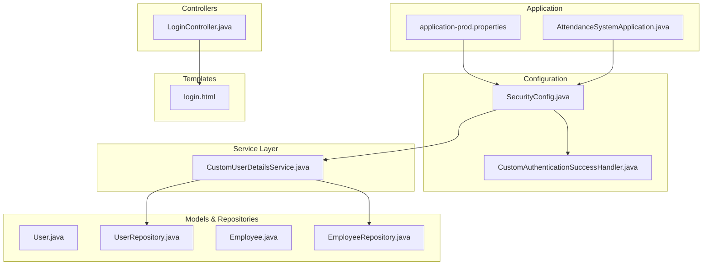
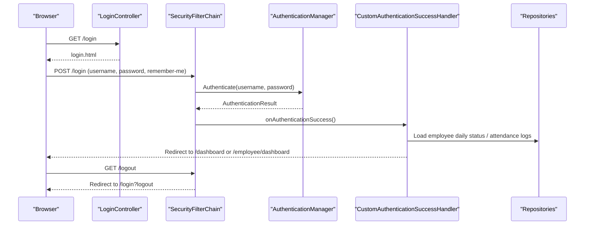
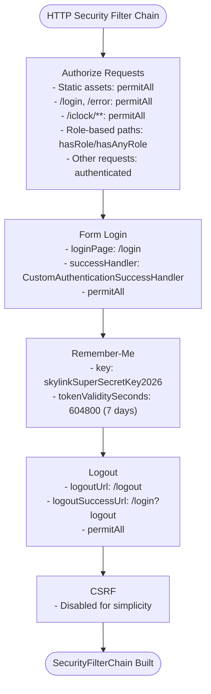
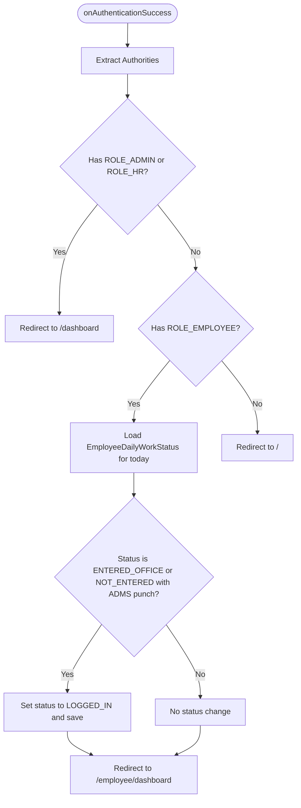
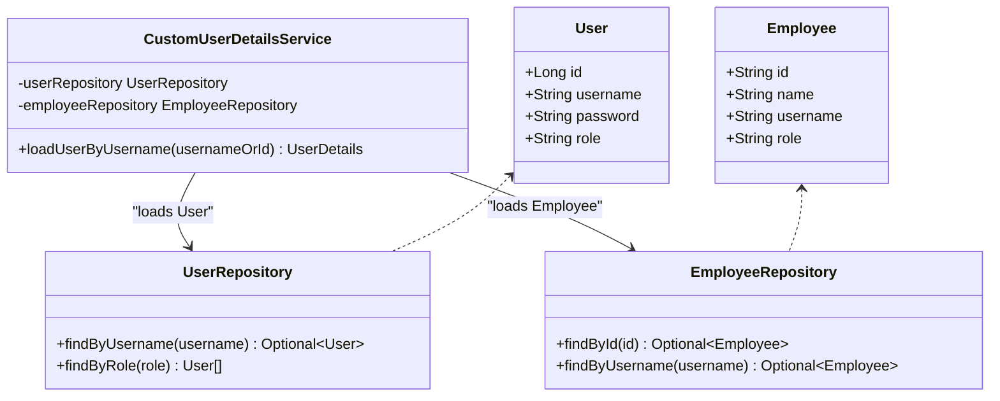
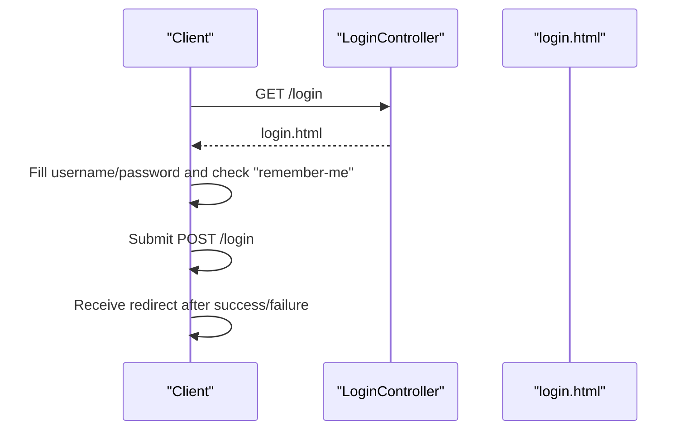
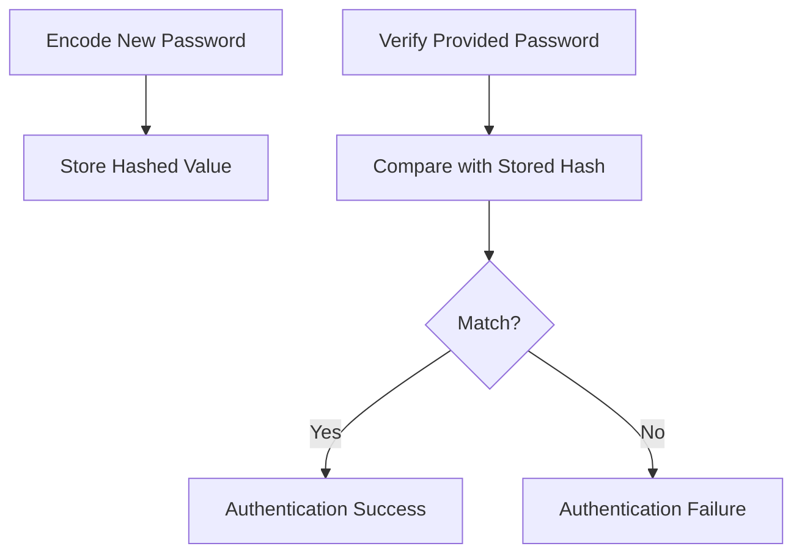
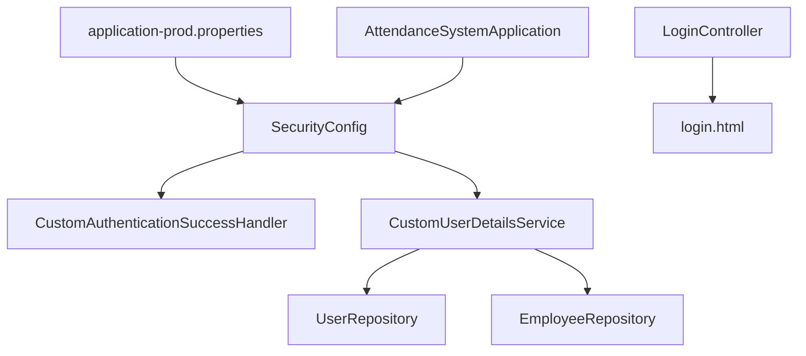

# Authentication System

<cite>
**Referenced Files in This Document**
- [SecurityConfig.java](file://src/main/java/root/cyb/mh/attendancesystem/config/SecurityConfig.java)
- [CustomAuthenticationSuccessHandler.java](file://src/main/java/root/cyb/mh/attendancesystem/config/CustomAuthenticationSuccessHandler.java)
- [LoginController.java](file://src/main/java/root/cyb/mh/attendancesystem/controller/LoginController.java)
- [CustomUserDetailsService.java](file://src/main/java/root/cyb/mh/attendancesystem/service/CustomUserDetailsService.java)
- [User.java](file://src/main/java/root/cyb/mh/attendancesystem/model/User.java)
- [UserRepository.java](file://src/main/java/root/cyb/mh/attendancesystem/repository/UserRepository.java)
- [Employee.java](file://src/main/java/root/cyb/mh/attendancesystem/model/Employee.java)
- [EmployeeRepository.java](file://src/main/java/root/cyb/mh/attendancesystem/repository/EmployeeRepository.java)
- [login.html](file://src/main/resources/templates/login.html)
- [application-prod.properties](file://src/main/resources/application-prod.properties)
- [AttendanceSystemApplication.java](file://src/main/java/root/cyb/mh/attendancesystem/AttendanceSystemApplication.java)
</cite>

## Table of Contents
1. [Introduction](#introduction)
2. [Project Structure](#project-structure)
3. [Core Components](#core-components)
4. [Architecture Overview](#architecture-overview)
5. [Detailed Component Analysis](#detailed-component-analysis)
6. [Dependency Analysis](#dependency-analysis)
7. [Performance Considerations](#performance-considerations)
8. [Troubleshooting Guide](#troubleshooting-guide)
9. [Conclusion](#conclusion)

## Introduction
This document provides comprehensive documentation for the authentication system component. It covers Spring Security configuration, form-based authentication, custom authentication success handling, login/logout processes, remember-me functionality, BCrypt password encoding, session management, and security filter chain configuration. Practical authentication flows, security configurations, and integration with the login controller are explained alongside security best practices, credential validation, and authentication failure handling.

## Project Structure
The authentication system spans several packages:
- Configuration: Security filter chain, password encoder, and custom success handler
- Service: Custom user details service for loading users and employees
- Controller: Login page controller
- Model/Repository: User and Employee entities with repositories
- Templates: Login page with Thymeleaf integration
- Application Properties: Session timeout and database configuration

**Diagram sources**
- [SecurityConfig.java:1-91](file://src/main/java/root/cyb/mh/attendancesystem/config/SecurityConfig.java#L1-L91)
- [CustomAuthenticationSuccessHandler.java:1-66](file://src/main/java/root/cyb/mh/attendancesystem/config/CustomAuthenticationSuccessHandler.java#L1-L66)
- [LoginController.java:1-14](file://src/main/java/root/cyb/mh/attendancesystem/controller/LoginController.java#L1-L14)
- [CustomUserDetailsService.java:1-54](file://src/main/java/root/cyb/mh/attendancesystem/service/CustomUserDetailsService.java#L1-L54)
- [User.java:1-24](file://src/main/java/root/cyb/mh/attendancesystem/model/User.java#L1-L24)
- [UserRepository.java:1-12](file://src/main/java/root/cyb/mh/attendancesystem/repository/UserRepository.java#L1-L12)
- [Employee.java:1-64](file://src/main/java/root/cyb/mh/attendancesystem/model/Employee.java#L1-L64)
- [EmployeeRepository.java:1-32](file://src/main/java/root/cyb/mh/attendancesystem/repository/EmployeeRepository.java#L1-L32)
- [login.html:1-96](file://src/main/resources/templates/login.html#L1-L96)
- [application-prod.properties:1-33](file://src/main/resources/application-prod.properties#L1-L33)
- [AttendanceSystemApplication.java:1-16](file://src/main/java/root/cyb/mh/attendancesystem/AttendanceSystemApplication.java#L1-L16)

**Section sources**
- [SecurityConfig.java:1-91](file://src/main/java/root/cyb/mh/attendancesystem/config/SecurityConfig.java#L1-L91)
- [CustomAuthenticationSuccessHandler.java:1-66](file://src/main/java/root/cyb/mh/attendancesystem/config/CustomAuthenticationSuccessHandler.java#L1-L66)
- [LoginController.java:1-14](file://src/main/java/root/cyb/mh/attendancesystem/controller/LoginController.java#L1-L14)
- [CustomUserDetailsService.java:1-54](file://src/main/java/root/cyb/mh/attendancesystem/service/CustomUserDetailsService.java#L1-L54)
- [User.java:1-24](file://src/main/java/root/cyb/mh/attendancesystem/model/User.java#L1-L24)
- [UserRepository.java:1-12](file://src/main/java/root/cyb/mh/attendancesystem/repository/UserRepository.java#L1-L12)
- [Employee.java:1-64](file://src/main/java/root/cyb/mh/attendancesystem/model/Employee.java#L1-L64)
- [EmployeeRepository.java:1-32](file://src/main/java/root/cyb/mh/attendancesystem/repository/EmployeeRepository.java#L1-L32)
- [login.html:1-96](file://src/main/resources/templates/login.html#L1-L96)
- [application-prod.properties:1-33](file://src/main/resources/application-prod.properties#L1-L33)
- [AttendanceSystemApplication.java:1-16](file://src/main/java/root/cyb/mh/attendancesystem/AttendanceSystemApplication.java#L1-L16)

## Core Components
- Security Filter Chain: Defines URL authorization rules, form login, remember-me, logout, and CSRF configuration.
- Custom Authentication Success Handler: Redirects users based on roles and performs employee-specific login updates.
- Custom User Details Service: Loads credentials from User or Employee entities and maps roles.
- Login Controller: Exposes the login page endpoint.
- Login Template: Provides the Thymeleaf login form with error and logout messages.
- Password Encoder: BCrypt encoder bean for secure password hashing.
- Session Management: Configured via application properties with a 1-day session timeout.

**Section sources**
- [SecurityConfig.java:18-90](file://src/main/java/root/cyb/mh/attendancesystem/config/SecurityConfig.java#L18-L90)
- [CustomAuthenticationSuccessHandler.java:19-66](file://src/main/java/root/cyb/mh/attendancesystem/config/CustomAuthenticationSuccessHandler.java#L19-L66)
- [CustomUserDetailsService.java:16-54](file://src/main/java/root/cyb/mh/attendancesystem/service/CustomUserDetailsService.java#L16-L54)
- [LoginController.java:7-13](file://src/main/java/root/cyb/mh/attendancesystem/controller/LoginController.java#L7-L13)
- [login.html:61-90](file://src/main/resources/templates/login.html#L61-L90)
- [application-prod.properties:17-17](file://src/main/resources/application-prod.properties#L17-L17)

## Architecture Overview
The authentication system integrates Spring Security with custom components to provide role-based access control, form-based login, remember-me sessions, and logout redirection. The flow begins at the login page, proceeds through Spring Security’s form authentication, invokes the custom success handler, and redirects users to role-appropriate dashboards.

**Diagram sources**
- [LoginController.java:9-12](file://src/main/java/root/cyb/mh/attendancesystem/controller/LoginController.java#L9-L12)
- [SecurityConfig.java:50-61](file://src/main/java/root/cyb/mh/attendancesystem/config/SecurityConfig.java#L50-L61)
- [CustomAuthenticationSuccessHandler.java:27-64](file://src/main/java/root/cyb/mh/attendancesystem/config/CustomAuthenticationSuccessHandler.java#L27-L64)
- [login.html:68-90](file://src/main/resources/templates/login.html#L68-L90)

## Detailed Component Analysis

### Security Filter Chain Configuration
The security filter chain defines:
- URL authorization rules grouped by roles and endpoints
- Form login with custom success handler and login page
- Remember-me configuration with a secret key and 7-day validity
- Logout configuration with success URL
- CSRF disabled for simplicity in the current project context

**Diagram sources**
- [SecurityConfig.java:19-84](file://src/main/java/root/cyb/mh/attendancesystem/config/SecurityConfig.java#L19-L84)

**Section sources**
- [SecurityConfig.java:19-84](file://src/main/java/root/cyb/mh/attendancesystem/config/SecurityConfig.java#L19-L84)

### Custom Authentication Success Handler
The success handler:
- Reads user authorities to determine role
- Redirects administrators and HR to the dashboard
- For employees, checks daily work status and attendance logs to set appropriate status and redirects to the employee dashboard
- Falls back to home page for unknown roles

**Diagram sources**
- [CustomAuthenticationSuccessHandler.java:27-64](file://src/main/java/root/cyb/mh/attendancesystem/config/CustomAuthenticationSuccessHandler.java#L27-L64)

**Section sources**
- [CustomAuthenticationSuccessHandler.java:19-66](file://src/main/java/root/cyb/mh/attendancesystem/config/CustomAuthenticationSuccessHandler.java#L19-L66)

### Custom User Details Service
The service loads authentication principals from:
- User entity by username (Admin/HR) with mapped role authority
- Employee entity by ID (Employee login) with ROLE_EMPLOYEE authority
- Throws UsernameNotFoundException if neither is found

**Diagram sources**
- [CustomUserDetailsService.java:16-54](file://src/main/java/root/cyb/mh/attendancesystem/service/CustomUserDetailsService.java#L16-L54)
- [User.java:9-23](file://src/main/java/root/cyb/mh/attendancesystem/model/User.java#L9-L23)
- [UserRepository.java:7-11](file://src/main/java/root/cyb/mh/attendancesystem/repository/UserRepository.java#L7-L11)
- [Employee.java:15-39](file://src/main/java/root/cyb/mh/attendancesystem/model/Employee.java#L15-L39)
- [EmployeeRepository.java:12-31](file://src/main/java/root/cyb/mh/attendancesystem/repository/EmployeeRepository.java#L12-L31)

**Section sources**
- [CustomUserDetailsService.java:24-52](file://src/main/java/root/cyb/mh/attendancesystem/service/CustomUserDetailsService.java#L24-L52)
- [User.java:9-23](file://src/main/java/root/cyb/mh/attendancesystem/model/User.java#L9-L23)
- [UserRepository.java:7-11](file://src/main/java/root/cyb/mh/attendancesystem/repository/UserRepository.java#L7-L11)
- [Employee.java:15-39](file://src/main/java/root/cyb/mh/attendancesystem/model/Employee.java#L15-L39)
- [EmployeeRepository.java:12-31](file://src/main/java/root/cyb/mh/attendancesystem/repository/EmployeeRepository.java#L12-L31)

### Login Controller and Template Integration
- LoginController exposes the GET /login endpoint returning the login template
- The login template renders Thymeleaf form with action "@{/login}", username/password fields, and remember-me checkbox
- Displays error and logout messages based on URL parameters

**Diagram sources**
- [LoginController.java:9-12](file://src/main/java/root/cyb/mh/attendancesystem/controller/LoginController.java#L9-L12)
- [login.html:68-90](file://src/main/resources/templates/login.html#L68-L90)

**Section sources**
- [LoginController.java:7-13](file://src/main/java/root/cyb/mh/attendancesystem/controller/LoginController.java#L7-L13)
- [login.html:61-90](file://src/main/resources/templates/login.html#L61-L90)

### BCrypt Password Encoding Implementation
- A BCryptPasswordEncoder bean is defined for secure password hashing
- The User entity stores hashed passwords
- The Employee entity uses its username field as the hashed password for login
- Password changes for employees are handled by re-encoding the new password

**Diagram sources**
- [SecurityConfig.java:86-89](file://src/main/java/root/cyb/mh/attendancesystem/config/SecurityConfig.java#L86-L89)
- [User.java:18-19](file://src/main/java/root/cyb/mh/attendancesystem/model/User.java#L18-L19)
- [Employee.java:35-39](file://src/main/java/root/cyb/mh/attendancesystem/model/Employee.java#L35-L39)

**Section sources**
- [SecurityConfig.java:86-89](file://src/main/java/root/cyb/mh/attendancesystem/config/SecurityConfig.java#L86-L89)
- [User.java:18-19](file://src/main/java/root/cyb/mh/attendancesystem/model/User.java#L18-L19)
- [Employee.java:35-39](file://src/main/java/root/cyb/mh/attendancesystem/model/Employee.java#L35-L39)

### Session Management
- Session timeout is configured to 1 day via application properties
- Combined with remember-me, this provides extended access for authenticated users

**Section sources**
- [application-prod.properties:17-17](file://src/main/resources/application-prod.properties#L17-L17)

### Security Best Practices
- Role-based access control is enforced via explicit URL patterns and role checks
- Remember-me uses a strong secret key and a reasonable validity period
- CSRF is disabled for simplicity; consider enabling CSRF for production environments requiring robust protection against cross-site request forgery
- Passwords are securely hashed using BCrypt
- Credentials are loaded from two distinct sources (User and Employee) with clear fallback behavior

**Section sources**
- [SecurityConfig.java:21-49](file://src/main/java/root/cyb/mh/attendancesystem/config/SecurityConfig.java#L21-L49)
- [SecurityConfig.java:54-56](file://src/main/java/root/cyb/mh/attendancesystem/config/SecurityConfig.java#L54-L56)
- [SecurityConfig.java:81-81](file://src/main/java/root/cyb/mh/attendancesystem/config/SecurityConfig.java#L81-L81)
- [CustomUserDetailsService.java:24-52](file://src/main/java/root/cyb/mh/attendancesystem/service/CustomUserDetailsService.java#L24-L52)

## Dependency Analysis
The authentication system exhibits clear separation of concerns:
- SecurityConfig depends on CustomAuthenticationSuccessHandler and defines the filter chain
- CustomUserDetailsService depends on UserRepository and EmployeeRepository
- LoginController depends on the login template
- Application properties configure session timeout and database connectivity

**Diagram sources**
- [SecurityConfig.java:15-16](file://src/main/java/root/cyb/mh/attendancesystem/config/SecurityConfig.java#L15-L16)
- [CustomAuthenticationSuccessHandler.java:21-25](file://src/main/java/root/cyb/mh/attendancesystem/config/CustomAuthenticationSuccessHandler.java#L21-L25)
- [CustomUserDetailsService.java:18-22](file://src/main/java/root/cyb/mh/attendancesystem/service/CustomUserDetailsService.java#L18-L22)
- [LoginController.java:9-12](file://src/main/java/root/cyb/mh/attendancesystem/controller/LoginController.java#L9-L12)
- [application-prod.properties:1-33](file://src/main/resources/application-prod.properties#L1-L33)
- [AttendanceSystemApplication.java:7-8](file://src/main/java/root/cyb/mh/attendancesystem/AttendanceSystemApplication.java#L7-L8)

**Section sources**
- [SecurityConfig.java:15-16](file://src/main/java/root/cyb/mh/attendancesystem/config/SecurityConfig.java#L15-L16)
- [CustomAuthenticationSuccessHandler.java:21-25](file://src/main/java/root/cyb/mh/attendancesystem/config/CustomAuthenticationSuccessHandler.java#L21-L25)
- [CustomUserDetailsService.java:18-22](file://src/main/java/root/cyb/mh/attendancesystem/service/CustomUserDetailsService.java#L18-L22)
- [LoginController.java:9-12](file://src/main/java/root/cyb/mh/attendancesystem/controller/LoginController.java#L9-L12)
- [application-prod.properties:1-33](file://src/main/resources/application-prod.properties#L1-L33)
- [AttendanceSystemApplication.java:7-8](file://src/main/java/root/cyb/mh/attendancesystem/AttendanceSystemApplication.java#L7-L8)

## Performance Considerations
- Authorization rules are evaluated per request; grouping similar endpoints reduces overhead
- Remember-me reduces repeated authentication prompts but increases cookie-based session persistence
- Using BCrypt for password hashing is computationally intensive; ensure adequate server resources
- Session timeout of 1 day balances convenience with security; adjust based on organizational policy

[No sources needed since this section provides general guidance]

## Troubleshooting Guide
Common issues and resolutions:
- Authentication failures: Verify username/password combinations and ensure the correct login source (User vs Employee). Check for UsernameNotFoundException if credentials are not found.
- Remember-me not persisting: Confirm the remember-me key and token validity settings; ensure browser accepts cookies.
- CSRF errors: If CSRF is enabled, ensure forms include CSRF tokens; otherwise, keep CSRF disabled for existing simple forms.
- Logout not redirecting: Verify logout URL and success URL configuration.
- Role-based access denied: Review authorization rules for the requested endpoint and user role.

**Section sources**
- [CustomUserDetailsService.java:51-51](file://src/main/java/root/cyb/mh/attendancesystem/service/CustomUserDetailsService.java#L51-L51)
- [SecurityConfig.java:54-60](file://src/main/java/root/cyb/mh/attendancesystem/config/SecurityConfig.java#L54-L60)
- [login.html:61-66](file://src/main/resources/templates/login.html#L61-L66)

## Conclusion
The authentication system integrates Spring Security with custom components to deliver secure, role-based access control. It supports form-based login, remember-me sessions, and logout redirection, while leveraging BCrypt for password hashing and a 1-day session timeout. The system is structured for maintainability and can be enhanced with CSRF protection and stricter authorization policies as needed.