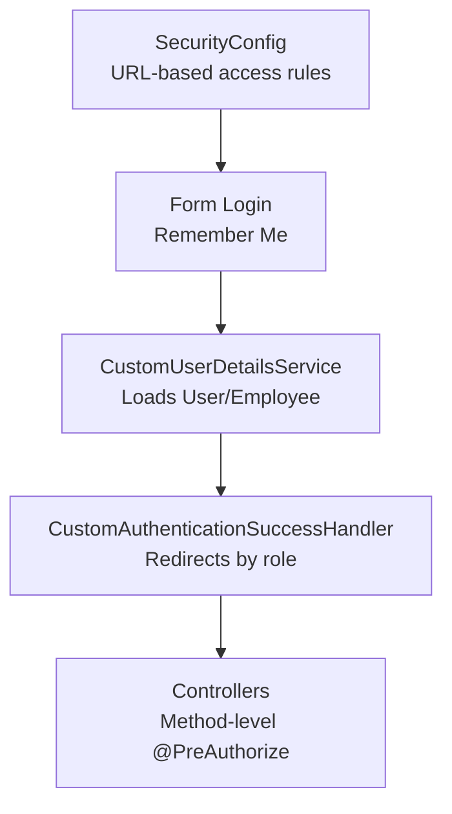
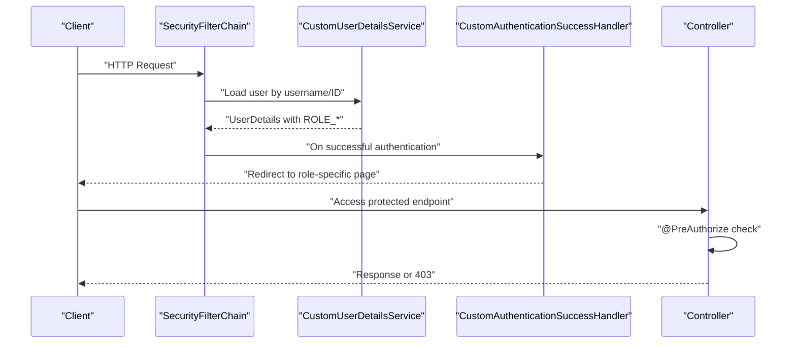
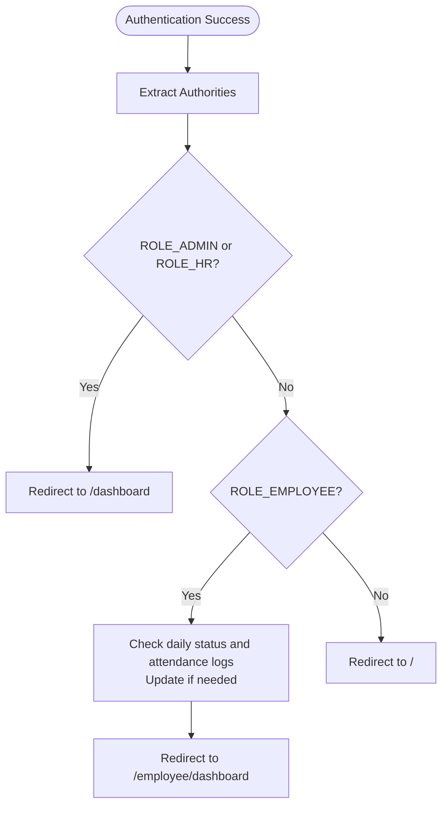
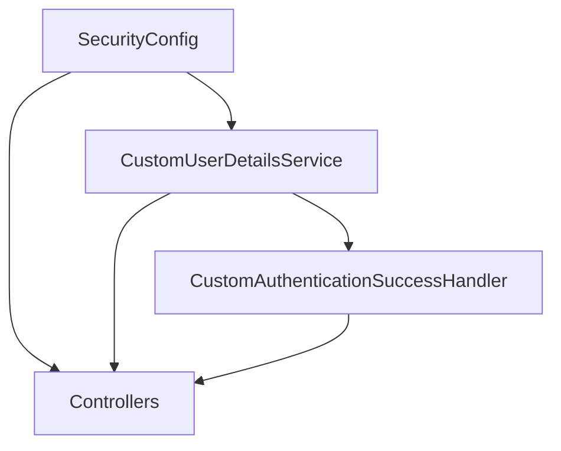

# Authorization and Roles

<cite>
**Referenced Files in This Document**
- [SecurityConfig.java](file://src/main/java/root/cyb/mh/attendancesystem/config/SecurityConfig.java)
- [CustomAuthenticationSuccessHandler.java](file://src/main/java/root/cyb/mh/attendancesystem/config/CustomAuthenticationSuccessHandler.java)
- [CustomUserDetailsService.java](file://src/main/java/root/cyb/mh/attendancesystem/service/CustomUserDetailsService.java)
- [User.java](file://src/main/java/root/cyb/mh/attendancesystem/model/User.java)
- [Employee.java](file://src/main/java/root/cyb/mh/attendancesystem/model/Employee.java)
- [MasterDataController.java](file://src/main/java/root/cyb/mh/attendancesystem/controller/MasterDataController.java)
- [AdminWorkStatusController.java](file://src/main/java/root/cyb/mh/attendancesystem/controller/AdminWorkStatusController.java)
</cite>

## Table of Contents
1. [Introduction](#introduction)
2. [Project Structure](#project-structure)
3. [Core Components](#core-components)
4. [Architecture Overview](#architecture-overview)
5. [Detailed Component Analysis](#detailed-component-analysis)
6. [Dependency Analysis](#dependency-analysis)
7. [Performance Considerations](#performance-considerations)
8. [Troubleshooting Guide](#troubleshooting-guide)
9. [Conclusion](#conclusion)

## Introduction
This document describes the authorization and role-based access control (RBAC) system implemented in the backend. It details the five user roles (ADMIN, HR, SUPERVISOR, EMPLOYEE, COMPANY), their permissions and access levels, the role hierarchy, the permission matrix, and URL-based access control patterns. It also explains role-based method security, custom access decision mechanisms, and dynamic permission checking across system modules. Practical examples illustrate role assignments, permission enforcement, and access control scenarios.

## Project Structure
The RBAC system spans configuration, authentication, authorization, and controller layers:
- Security configuration defines URL-level access rules.
- Custom authentication success handler redirects users to appropriate dashboards and performs lightweight runtime adjustments for employees.
- Custom user details service loads credentials and authorities for both administrative users and employees.
- Controllers enforce method-level security via annotations and implement dynamic checks for specialized scenarios.

**Diagram sources**
- [SecurityConfig.java:18-84](file://src/main/java/root/cyb/mh/attendancesystem/config/SecurityConfig.java#L18-L84)
- [CustomUserDetailsService.java:24-52](file://src/main/java/root/cyb/mh/attendancesystem/service/CustomUserDetailsService.java#L24-L52)
- [CustomAuthenticationSuccessHandler.java:27-64](file://src/main/java/root/cyb/mh/attendancesystem/config/CustomAuthenticationSuccessHandler.java#L27-L64)

**Section sources**
- [SecurityConfig.java:18-84](file://src/main/java/root/cyb/mh/attendancesystem/config/SecurityConfig.java#L18-L84)
- [CustomUserDetailsService.java:15-54](file://src/main/java/root/cyb/mh/attendancesystem/service/CustomUserDetailsService.java#L15-L54)
- [CustomAuthenticationSuccessHandler.java:18-66](file://src/main/java/root/cyb/mh/attendancesystem/config/CustomAuthenticationSuccessHandler.java#L18-L66)

## Core Components
- Role model and storage:
  - Administrative users store a role field mapped to “ADMIN” or “HR”.
  - Employees are authenticated using their ID as the principal and a hashed “username” field as the password; they are granted the “EMPLOYEE” role.
- URL-based access control:
  - Static assets, login, and device communication endpoints are publicly accessible.
  - Administrative areas require ADMIN.
  - HR-accessible areas include settings and certain employee management endpoints.
  - Some endpoints are open to ADMIN, HR, and EMPLOYEE.
  - Employee-only areas require EMPLOYEE.
  - Dashboard access is restricted to ADMIN and HR.
- Method-level security:
  - Controllers use @PreAuthorize annotations to enforce roles at the endpoint level.
- Dynamic permission checks:
  - Controllers sometimes inspect authorities at runtime to tailor visibility and actions (e.g., contractor dashboard access differs for ADMIN/HR vs. EMPLOYEE).

**Section sources**
- [User.java:21-22](file://src/main/java/root/cyb/mh/attendancesystem/model/User.java#L21-L22)
- [Employee.java:35-40](file://src/main/java/root/cyb/mh/attendancesystem/model/Employee.java#L35-L40)
- [SecurityConfig.java:20-49](file://src/main/java/root/cyb/mh/attendancesystem/config/SecurityConfig.java#L20-L49)
- [CustomUserDetailsService.java:24-52](file://src/main/java/root/cyb/mh/attendancesystem/service/CustomUserDetailsService.java#L24-L52)
- [MasterDataController.java:39-41](file://src/main/java/root/cyb/mh/attendancesystem/controller/MasterDataController.java#L39-L41)
- [AdminWorkStatusController.java:24](file://src/main/java/root/cyb/mh/attendancesystem/controller/AdminWorkStatusController.java#L24)

## Architecture Overview
The authorization pipeline integrates Spring Security’s filter chain, custom authentication success handling, and method-level checks.

**Diagram sources**
- [SecurityConfig.java:18-84](file://src/main/java/root/cyb/mh/attendancesystem/config/SecurityConfig.java#L18-L84)
- [CustomUserDetailsService.java:24-52](file://src/main/java/root/cyb/mh/attendancesystem/service/CustomUserDetailsService.java#L24-L52)
- [CustomAuthenticationSuccessHandler.java:27-64](file://src/main/java/root/cyb/mh/attendancesystem/config/CustomAuthenticationSuccessHandler.java#L27-L64)
- [AdminWorkStatusController.java:24](file://src/main/java/root/cyb/mh/attendancesystem/controller/AdminWorkStatusController.java#L24)

## Detailed Component Analysis

### Role Definitions and Storage
- ADMIN and HR:
  - Stored in the administrative user entity with a role field.
  - Granted via authorities prefixed with “ROLE_ADMIN” and “ROLE_HR” respectively.
- EMPLOYEE:
  - Authenticated using employee ID as principal and hashed “username” as password.
  - Granted “ROLE_EMPLOYEE”.
- SUPERVISOR and COMPANY:
  - SUPERVISOR is modeled as an Employee relationship (reports-to hierarchy) but is not a dedicated Spring Security role in the current configuration.
  - COMPANY is not represented as a Spring Security role in the current configuration.

**Section sources**
- [User.java:21-22](file://src/main/java/root/cyb/mh/attendancesystem/model/User.java#L21-L22)
- [Employee.java:20](file://src/main/java/root/cyb/mh/attendancesystem/model/Employee.java#L20)
- [CustomUserDetailsService.java:30-48](file://src/main/java/root/cyb/mh/attendancesystem/service/CustomUserDetailsService.java#L30-L48)

### URL-Based Access Control Matrix
The following matrix summarizes URL patterns and the roles permitted to access them. The rules are enforced by the security filter chain.

- Public
  - Static assets: /css/**, /js/**, /images/**, /webjars/**
  - Login and error pages: /login, /error
  - Device communication: /iclock/**
- ADMIN only
  - /users/**
  - /devices/**
  - /admin/work-orders/**
  - /departments/add, /departments/delete/**
  - /master-data/** (except specific exceptions noted below)
- ADMIN and HR
  - /settings/**
  - /employees/add, /employees/edit/**, /employees/delete/**
  - /admin/shifts/**
  - /master-data/contractors/**, /master-data/api/**
- ADMIN, HR, and EMPLOYEE
  - /master-data/** (with exceptions)
  - /leave/manage/**
- EMPLOYEE only
  - /employee/**
- ADMIN and HR only
  - /dashboard

Notes:
- Some endpoints under /master-data are open to ADMIN, HR, and EMPLOYEE, while others are ADMIN/HR only.
- The dashboard is restricted to ADMIN and HR.

**Section sources**
- [SecurityConfig.java:20-49](file://src/main/java/root/cyb/mh/attendancesystem/config/SecurityConfig.java#L20-L49)

### Role-Based Method Security
Controllers enforce authorization at the method level using @PreAuthorize. Examples:
- Admin-only controller endpoints:
  - AdminWorkStatusController requires ADMIN or HR.
- Master data endpoints:
  - Listing and viewing contractors: ADMIN, HR, or EMPLOYEE.
  - Creating/updating contractors: ADMIN or HR.
  - Clients listing and creation: ADMIN or HR.
  - Payment methods listing and creation: ADMIN or HR.
  - Contractor enable/disable toggles: ADMIN or HR.
  - Contractor dashboard: ADMIN, HR, or EMPLOYEE with dynamic filtering based on authority.

These annotations complement URL-level rules and ensure fine-grained protection for business operations.

**Section sources**
- [AdminWorkStatusController.java:24](file://src/main/java/root/cyb/mh/attendancesystem/controller/AdminWorkStatusController.java#L24)
- [MasterDataController.java:39-41](file://src/main/java/root/cyb/mh/attendancesystem/controller/MasterDataController.java#L39-L41)
- [MasterDataController.java:90-91](file://src/main/java/root/cyb/mh/attendancesystem/controller/MasterDataController.java#L90-L91)
- [MasterDataController.java:138-139](file://src/main/java/root/cyb/mh/attendancesystem/controller/MasterDataController.java#L138-L139)
- [MasterDataController.java:307-308](file://src/main/java/root/cyb/mh/attendancesystem/controller/MasterDataController.java#L307-L308)
- [MasterDataController.java:348-349](file://src/main/java/root/cyb/mh/attendancesystem/controller/MasterDataController.java#L348-L349)
- [MasterDataController.java:365-366](file://src/main/java/root/cyb/mh/attendancesystem/controller/MasterDataController.java#L365-L366)

### Dynamic Permission Checking
Some controllers implement runtime checks to tailor behavior:
- Contractor dashboard:
  - ADMIN/HR see all payment requests for a contractor.
  - EMPLOYEE sees only those requests they submitted.
- These checks inspect the authenticated user’s authorities and adjust queries accordingly.

This pattern allows a single endpoint to serve multiple roles with differentiated views.

**Section sources**
- [MasterDataController.java:378-395](file://src/main/java/root/cyb/mh/attendancesystem/controller/MasterDataController.java#L378-L395)

### Authentication Flow and Role-Based Redirection
Upon successful authentication, the custom success handler inspects authorities and redirects:
- ADMIN or HR → /dashboard
- EMPLOYEE → /employee/dashboard
- Other cases → home page

Additionally, for EMPLOYEE, the handler updates daily work status based on office entry or device punches.

**Diagram sources**
- [CustomAuthenticationSuccessHandler.java:27-64](file://src/main/java/root/cyb/mh/attendancesystem/config/CustomAuthenticationSuccessHandler.java#L27-L64)

**Section sources**
- [CustomAuthenticationSuccessHandler.java:27-64](file://src/main/java/root/cyb/mh/attendancesystem/config/CustomAuthenticationSuccessHandler.java#L27-L64)

### Practical Scenarios and Examples
- Assigning roles:
  - Administrative users: set role to “ADMIN” or “HR” in the user record.
  - Employees: authenticate using their ID as principal and hashed “username” as password; they receive “EMPLOYEE” role.
- Enforcing permissions:
  - URL-level: accessing /users/** requires ADMIN.
  - Method-level: creating clients requires ADMIN or HR.
  - Dynamic: contractor dashboard shows filtered data depending on whether the user is ADMIN/HR or EMPLOYEE.
- Access control across modules:
  - Master data: contractor and client management restricted to ADMIN/HR; contractor listing open to ADMIN/HR/EMPLOYEE.
  - Leave management: open to ADMIN/HR/EMPLOYEE.
  - Dashboard: ADMIN/HR only.

**Section sources**
- [SecurityConfig.java:20-49](file://src/main/java/root/cyb/mh/attendancesystem/config/SecurityConfig.java#L20-L49)
- [MasterDataController.java:39-41](file://src/main/java/root/cyb/mh/attendancesystem/controller/MasterDataController.java#L39-L41)
- [MasterDataController.java:138-139](file://src/main/java/root/cyb/mh/attendancesystem/controller/MasterDataController.java#L138-L139)
- [CustomUserDetailsService.java:30-48](file://src/main/java/root/cyb/mh/attendancesystem/service/CustomUserDetailsService.java#L30-L48)

## Dependency Analysis
The RBAC system depends on:
- SecurityConfig for URL-level rules.
- CustomUserDetailsService for loading credentials and authorities.
- CustomAuthenticationSuccessHandler for post-authentication redirection and minor runtime adjustments.
- Controllers for method-level enforcement and dynamic checks.

**Diagram sources**
- [SecurityConfig.java:18-84](file://src/main/java/root/cyb/mh/attendancesystem/config/SecurityConfig.java#L18-L84)
- [CustomUserDetailsService.java:15-54](file://src/main/java/root/cyb/mh/attendancesystem/service/CustomUserDetailsService.java#L15-L54)
- [CustomAuthenticationSuccessHandler.java:18-66](file://src/main/java/root/cyb/mh/attendancesystem/config/CustomAuthenticationSuccessHandler.java#L18-L66)

**Section sources**
- [SecurityConfig.java:18-84](file://src/main/java/root/cyb/mh/attendancesystem/config/SecurityConfig.java#L18-L84)
- [CustomUserDetailsService.java:15-54](file://src/main/java/root/cyb/mh/attendancesystem/service/CustomUserDetailsService.java#L15-L54)
- [CustomAuthenticationSuccessHandler.java:18-66](file://src/main/java/root/cyb/mh/attendancesystem/config/CustomAuthenticationSuccessHandler.java#L18-L66)

## Performance Considerations
- URL-level rules are evaluated early in the filter chain; grouping similar paths reduces overhead.
- Method-level checks occur per request; ensure minimal computation inside @PreAuthorize blocks.
- Dynamic checks in controllers should leverage efficient repository queries and avoid redundant database hits.

## Troubleshooting Guide
Common issues and resolutions:
- 403 Forbidden on POST:
  - CSRF is disabled in the current configuration. If you re-enable CSRF, ensure forms include CSRF tokens.
- Unexpected redirects:
  - Verify authority prefixes (“ROLE_ADMIN”, “ROLE_HR”, “ROLE_EMPLOYEE”) match the loaded authorities.
- Employee login problems:
  - Confirm employee ID is used as the principal and the “username” field is hashed and stored as the password.

**Section sources**
- [SecurityConfig.java:81](file://src/main/java/root/cyb/mh/attendancesystem/config/SecurityConfig.java#L81)
- [CustomUserDetailsService.java:30-48](file://src/main/java/root/cyb/mh/attendancesystem/service/CustomUserDetailsService.java#L30-L48)

## Conclusion
The system enforces a clear RBAC model with ADMIN and HR having broad administrative privileges, EMPLOYEE access to self-service and HR-managed features, and URL/method-level controls ensuring least privilege. Dynamic checks further refine access in specialized contexts. The current configuration does not define SUPERVISOR or COMPANY as dedicated roles; supervisors are modeled as employees with reporting relationships, and COMPANY is not represented in the security model.