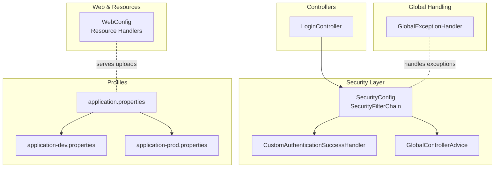
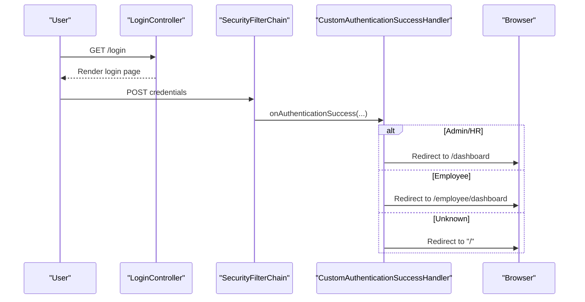
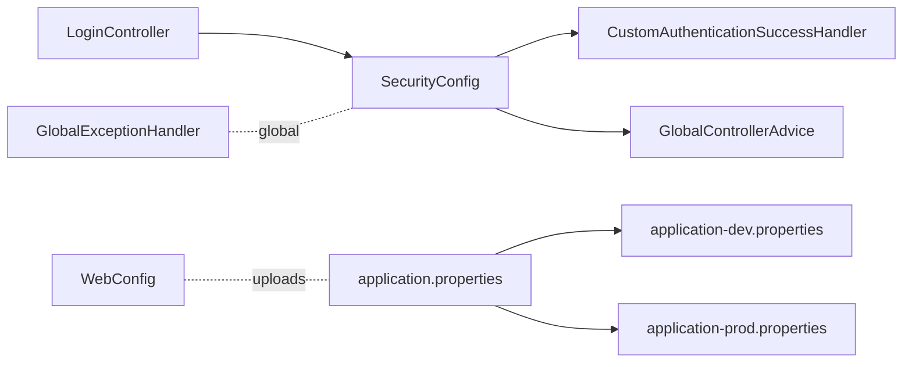

# Security Configurations

<cite>
**Referenced Files in This Document**
- [SecurityConfig.java](file://src/main/java/root/cyb/mh/attendancesystem/config/SecurityConfig.java)
- [CustomAuthenticationSuccessHandler.java](file://src/main/java/root/cyb/mh/attendancesystem/config/CustomAuthenticationSuccessHandler.java)
- [GlobalControllerAdvice.java](file://src/main/java/root/cyb/mh/attendancesystem/config/GlobalControllerAdvice.java)
- [GlobalExceptionHandler.java](file://src/main/java/root/cyb/mh/attendancesystem/exception/GlobalExceptionHandler.java)
- [LoginController.java](file://src/main/java/root/cyb/mh/attendancesystem/controller/LoginController.java)
- [WebConfig.java](file://src/main/java/root/cyb/mh/attendancesystem/config/WebConfig.java)
- [application.properties](file://src/main/resources/application.properties)
- [application-dev.properties](file://src/main/resources/application-dev.properties)
- [application-prod.properties](file://src/main/resources/application-prod.properties)
- [AttendanceSystemApplication.java](file://src/main/java/root/cyb/mh/attendancesystem/AttendanceSystemApplication.java)
</cite>

## Table of Contents
1. [Introduction](#introduction)
2. [Project Structure](#project-structure)
3. [Core Components](#core-components)
4. [Architecture Overview](#architecture-overview)
5. [Detailed Component Analysis](#detailed-component-analysis)
6. [Dependency Analysis](#dependency-analysis)
7. [Performance Considerations](#performance-considerations)
8. [Troubleshooting Guide](#troubleshooting-guide)
9. [Conclusion](#conclusion)
10. [Appendices](#appendices)

## Introduction
This document provides comprehensive documentation for the security configuration and related settings in the Attendance System backend. It focuses on the Spring Security filter chain configuration, CSRF protection, session and remember-me settings, role-based access control, and global exception handling for security-related scenarios. It also outlines best practices for securing the application, mitigating threats, and integrating with external services such as push notification VAPID keys and device communication endpoints.

## Project Structure
Security-related configuration is primarily centralized in the configuration package, with controllers and global advice supporting authentication flows and cross-cutting concerns. Application profiles define environment-specific settings, including database connectivity, mail configuration, and file upload limits.

**Diagram sources**
- [SecurityConfig.java:18-84](file://src/main/java/root/cyb/mh/attendancesystem/config/SecurityConfig.java#L18-L84)
- [CustomAuthenticationSuccessHandler.java:18-65](file://src/main/java/root/cyb/mh/attendancesystem/config/CustomAuthenticationSuccessHandler.java#L18-L65)
- [GlobalControllerAdvice.java:12-37](file://src/main/java/root/cyb/mh/attendancesystem/config/GlobalControllerAdvice.java#L12-L37)
- [LoginController.java:6-13](file://src/main/java/root/cyb/mh/attendancesystem/controller/LoginController.java#L6-L13)
- [GlobalExceptionHandler.java:9-26](file://src/main/java/root/cyb/mh/attendancesystem/exception/GlobalExceptionHandler.java#L9-L26)
- [WebConfig.java:7-16](file://src/main/java/root/cyb/mh/attendancesystem/config/WebConfig.java#L7-L16)
- [application.properties:1](file://src/main/resources/application.properties#L1)
- [application-dev.properties:1-33](file://src/main/resources/application-dev.properties#L1-L33)
- [application-prod.properties:1-33](file://src/main/resources/application-prod.properties#L1-L33)

**Section sources**
- [SecurityConfig.java:18-84](file://src/main/java/root/cyb/mh/attendancesystem/config/SecurityConfig.java#L18-L84)
- [application.properties:1](file://src/main/resources/application.properties#L1)
- [application-dev.properties:1-33](file://src/main/resources/application-dev.properties#L1-L33)
- [application-prod.properties:1-33](file://src/main/resources/application-prod.properties#L1-L33)

## Core Components
- SecurityFilterChain: Defines URL-level authorization rules, form login, remember-me, logout, and CSRF policy.
- CustomAuthenticationSuccessHandler: Implements role-aware redirection and initial employee status updates after login.
- GlobalControllerAdvice: Exposes security-aware model attributes to templates (e.g., supervisor flag).
- GlobalExceptionHandler: Handles file upload size violations globally.
- LoginController: Provides the login page endpoint.
- WebConfig: Serves uploaded files from the filesystem.
- Profiles: Configure environment-specific settings including database, mail, timeouts, and VAPID keys.

**Section sources**
- [SecurityConfig.java:18-84](file://src/main/java/root/cyb/mh/attendancesystem/config/SecurityConfig.java#L18-L84)
- [CustomAuthenticationSuccessHandler.java:18-65](file://src/main/java/root/cyb/mh/attendancesystem/config/CustomAuthenticationSuccessHandler.java#L18-L65)
- [GlobalControllerAdvice.java:12-37](file://src/main/java/root/cyb/mh/attendancesystem/config/GlobalControllerAdvice.java#L12-L37)
- [GlobalExceptionHandler.java:9-26](file://src/main/java/root/cyb/mh/attendancesystem/exception/GlobalExceptionHandler.java#L9-L26)
- [LoginController.java:6-13](file://src/main/java/root/cyb/mh/attendancesystem/controller/LoginController.java#L6-L13)
- [WebConfig.java:7-16](file://src/main/java/root/cyb/mh/attendancesystem/config/WebConfig.java#L7-L16)
- [application-dev.properties:17-29](file://src/main/resources/application-dev.properties#L17-L29)
- [application-prod.properties:17-29](file://src/main/resources/application-prod.properties#L17-L29)

## Architecture Overview
The security architecture centers on Spring Security’s declarative HTTP security configuration. Requests are evaluated against a set of permit-all and role-gated patterns. Successful authentication triggers a custom success handler that redirects users by role and performs initial employee status reconciliation. Logout and remember-me are configured for convenience. CSRF is disabled to avoid breaking existing forms; however, the code comments indicate a preference to enable CSRF and update forms accordingly.

**Diagram sources**
- [LoginController.java:6-13](file://src/main/java/root/cyb/mh/attendancesystem/controller/LoginController.java#L6-L13)
- [SecurityConfig.java:18-60](file://src/main/java/root/cyb/mh/attendancesystem/config/SecurityConfig.java#L18-L60)
- [CustomAuthenticationSuccessHandler.java:27-64](file://src/main/java/root/cyb/mh/attendancesystem/config/CustomAuthenticationSuccessHandler.java#L27-L64)

## Detailed Component Analysis

### Security Filter Chain Configuration
- URL Authorization:
  - Static assets and public endpoints are permitted without authentication.
  - Device communication endpoint is permitted for ADMS devices.
  - Administrative areas require ADMIN role.
  - HR-accessible areas require ADMIN or HR roles.
  - Employee-only areas require EMPLOYEE role.
  - Leave management is open to ADMIN, HR, and EMPLOYEE.
  - All other requests require authentication.
- Form Login:
  - Login page is mapped to a dedicated endpoint.
  - Uses a custom success handler for role-aware redirection.
- Remember Me:
  - Enabled with a secret key and 7-day validity.
- Logout:
  - Defined logout URL and post-logout landing page.
- CSRF:
  - Explicitly disabled in the current configuration to avoid 403 errors on existing forms. Comments indicate a preference to enable CSRF and update forms.

Recommendations:
- Enable CSRF and ensure all forms include CSRF tokens. Update any non-Thymeleaf forms to include tokens to prevent CSRF attacks.
- Consider adding security headers (e.g., Content-Security-Policy, X-Frame-Options) via a filter or web security configuration.

**Section sources**
- [SecurityConfig.java:18-84](file://src/main/java/root/cyb/mh/attendancesystem/config/SecurityConfig.java#L18-L84)

### CSRF Protection Settings
- Current Status: CSRF is disabled.
- Rationale: To avoid breaking existing forms during transition.
- Recommended Action: Enable CSRF and update all forms to include tokens. This reduces the risk of cross-site request forgery.

**Section sources**
- [SecurityConfig.java:61-81](file://src/main/java/root/cyb/mh/attendancesystem/config/SecurityConfig.java#L61-L81)

### CORS Configuration
- No explicit CORS bean or configuration is present in the codebase.
- Recommendation: Define a CORS configuration for APIs that may be consumed from browsers, specifying allowed origins, methods, headers, and exposed headers as appropriate.

**Section sources**
- [SecurityConfig.java:18-84](file://src/main/java/root/cyb/mh/attendancesystem/config/SecurityConfig.java#L18-L84)

### Security Headers
- No explicit header configuration is present in the codebase.
- Recommendation: Add security headers such as Content-Security-Policy, X-Content-Type-Options, X-Frame-Options, Referrer-Policy, and Permissions-Policy. These can be applied via a filter or Spring Security web configuration.

**Section sources**
- [SecurityConfig.java:18-84](file://src/main/java/root/cyb/mh/attendancesystem/config/SecurityConfig.java#L18-L84)

### Global Exception Handling for Security-Related Errors
- GlobalExceptionHandler handles file upload size violations and redirects back to the referring page with a flash error message.
- Recommendation: Extend the global exception handling to capture authentication failures, access denied exceptions, and CSRF violations, and map them to user-friendly messages or standardized error pages.

**Section sources**
- [GlobalExceptionHandler.java:9-26](file://src/main/java/root/cyb/mh/attendancesystem/exception/GlobalExceptionHandler.java#L9-L26)

### Custom Security Configuration and Authentication Success Handling
- CustomAuthenticationSuccessHandler:
  - Redirects ADMIN/HR to the dashboard.
  - Redirects EMPLOYEE to their dashboard.
  - Performs initial employee daily status reconciliation based on device logs.
- GlobalControllerAdvice:
  - Exposes a supervisor flag derived from the current authentication and repository checks.

**Section sources**
- [CustomAuthenticationSuccessHandler.java:18-65](file://src/main/java/root/cyb/mh/attendancesystem/config/CustomAuthenticationSuccessHandler.java#L18-L65)
- [GlobalControllerAdvice.java:12-37](file://src/main/java/root/cyb/mh/attendancesystem/config/GlobalControllerAdvice.java#L12-L37)

### Integration with External Services
- VAPID Keys:
  - Public and private VAPID keys and subject are configured in application profiles for push notification support.
- Device Communication:
  - The /iclock/** endpoint is permitted to allow device communication with the attendance system.

**Section sources**
- [application-dev.properties:30-32](file://src/main/resources/application-dev.properties#L30-L32)
- [application-prod.properties:27-32](file://src/main/resources/application-prod.properties#L27-L32)
- [SecurityConfig.java:24-26](file://src/main/java/root/cyb/mh/attendancesystem/config/SecurityConfig.java#L24-L26)

### Session and Remember-Me Configuration
- Session timeout is configured per profile.
- Remember-me is enabled with a fixed key and 7-day validity.

**Section sources**
- [application-dev.properties:17](file://src/main/resources/application-dev.properties#L17)
- [application-prod.properties:17](file://src/main/resources/application-prod.properties#L17)
- [SecurityConfig.java:54-56](file://src/main/java/root/cyb/mh/attendancesystem/config/SecurityConfig.java#L54-L56)

### Password Encoding
- BCryptPasswordEncoder is defined as a bean for secure password hashing.

**Section sources**
- [SecurityConfig.java:86-89](file://src/main/java/root/cyb/mh/attendancesystem/config/SecurityConfig.java#L86-L89)

### File Upload and Resource Serving
- Max file size and request size are configured in profiles.
- Uploaded files are served from the filesystem via a resource handler.

**Section sources**
- [application-dev.properties:27-29](file://src/main/resources/application-dev.properties#L27-L29)
- [application-prod.properties:27-29](file://src/main/resources/application-prod.properties#L27-L29)
- [WebConfig.java:10-16](file://src/main/java/root/cyb/mh/attendancesystem/config/WebConfig.java#L10-L16)

## Dependency Analysis
The security configuration depends on:
- CustomAuthenticationSuccessHandler for role-aware redirection and status reconciliation.
- GlobalControllerAdvice for exposing security-aware attributes to views.
- LoginController for the login endpoint.
- Profiles for environment-specific settings.

**Diagram sources**
- [SecurityConfig.java:18-84](file://src/main/java/root/cyb/mh/attendancesystem/config/SecurityConfig.java#L18-L84)
- [CustomAuthenticationSuccessHandler.java:18-65](file://src/main/java/root/cyb/mh/attendancesystem/config/CustomAuthenticationSuccessHandler.java#L18-L65)
- [GlobalControllerAdvice.java:12-37](file://src/main/java/root/cyb/mh/attendancesystem/config/GlobalControllerAdvice.java#L12-L37)
- [LoginController.java:6-13](file://src/main/java/root/cyb/mh/attendancesystem/controller/LoginController.java#L6-L13)
- [GlobalExceptionHandler.java:9-26](file://src/main/java/root/cyb/mh/attendancesystem/exception/GlobalExceptionHandler.java#L9-L26)
- [WebConfig.java:7-16](file://src/main/java/root/cyb/mh/attendancesystem/config/WebConfig.java#L7-L16)
- [application.properties:1](file://src/main/resources/application.properties#L1)
- [application-dev.properties:1-33](file://src/main/resources/application-dev.properties#L1-L33)
- [application-prod.properties:1-33](file://src/main/resources/application-prod.properties#L1-L33)

**Section sources**
- [SecurityConfig.java:18-84](file://src/main/java/root/cyb/mh/attendancesystem/config/SecurityConfig.java#L18-L84)
- [CustomAuthenticationSuccessHandler.java:18-65](file://src/main/java/root/cyb/mh/attendancesystem/config/CustomAuthenticationSuccessHandler.java#L18-L65)
- [GlobalControllerAdvice.java:12-37](file://src/main/java/root/cyb/mh/attendancesystem/config/GlobalControllerAdvice.java#L12-L37)
- [LoginController.java:6-13](file://src/main/java/root/cyb/mh/attendancesystem/controller/LoginController.java#L6-L13)
- [GlobalExceptionHandler.java:9-26](file://src/main/java/root/cyb/mh/attendancesystem/exception/GlobalExceptionHandler.java#L9-L26)
- [WebConfig.java:7-16](file://src/main/java/root/cyb/mh/attendancesystem/config/WebConfig.java#L7-L16)
- [application.properties:1](file://src/main/resources/application.properties#L1)
- [application-dev.properties:1-33](file://src/main/resources/application-dev.properties#L1-L33)
- [application-prod.properties:1-33](file://src/main/resources/application-prod.properties#L1-L33)

## Performance Considerations
- Role-based authorization is evaluated per request; ensure role checks remain efficient and avoid heavy computations in filters.
- Remember-me token validation occurs on subsequent requests; consider tuning token validity to balance usability and security.
- Serving static assets and uploads efficiently reduces overhead.

[No sources needed since this section provides general guidance]

## Troubleshooting Guide
- CSRF 403 Errors:
  - Symptom: POST requests fail with 403.
  - Resolution: Enable CSRF and ensure all forms include CSRF tokens. Alternatively, keep CSRF disabled if immediate compatibility is required.
- Authentication Redirection Issues:
  - Symptom: Users redirected incorrectly after login.
  - Resolution: Verify role assignments and the custom success handler logic.
- Access Denied:
  - Symptom: Users receive access denied for protected endpoints.
  - Resolution: Confirm role mappings and ensure users have the required roles.
- File Upload Failures:
  - Symptom: Large files rejected.
  - Resolution: Adjust max file size and request size in profiles; the global exception handler already provides feedback.

**Section sources**
- [SecurityConfig.java:61-81](file://src/main/java/root/cyb/mh/attendancesystem/config/SecurityConfig.java#L61-L81)
- [CustomAuthenticationSuccessHandler.java:27-64](file://src/main/java/root/cyb/mh/attendancesystem/config/CustomAuthenticationSuccessHandler.java#L27-L64)
- [GlobalExceptionHandler.java:9-26](file://src/main/java/root/cyb/mh/attendancesystem/exception/GlobalExceptionHandler.java#L9-L26)
- [application-dev.properties:27-29](file://src/main/resources/application-dev.properties#L27-L29)
- [application-prod.properties:27-29](file://src/main/resources/application-prod.properties#L27-L29)

## Conclusion
The current security configuration establishes role-based access control, a custom authentication success flow, and remember-me support. CSRF is disabled to maintain compatibility with existing forms, but enabling CSRF and updating forms is strongly recommended. Additional improvements include adding CORS and security headers, extending global exception handling for security events, and integrating VAPID keys for push notifications. These steps will strengthen the application’s defenses while maintaining operational continuity.

[No sources needed since this section summarizes without analyzing specific files]

## Appendices

### Best Practices Checklist
- Enable CSRF and ensure all forms include tokens.
- Add CORS configuration for browser APIs.
- Implement security headers (e.g., CSP, X-Frame-Options).
- Extend global exception handling for authentication and access-denied scenarios.
- Review and refine authorization rules regularly.
- Monitor and log security events for auditing and incident response.

[No sources needed since this section provides general guidance]