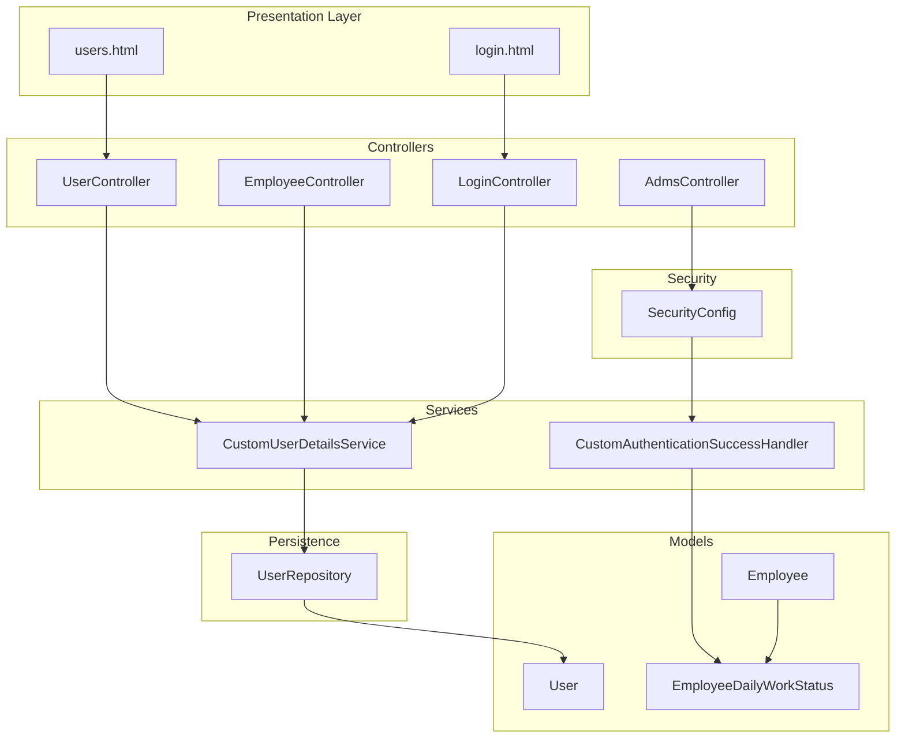
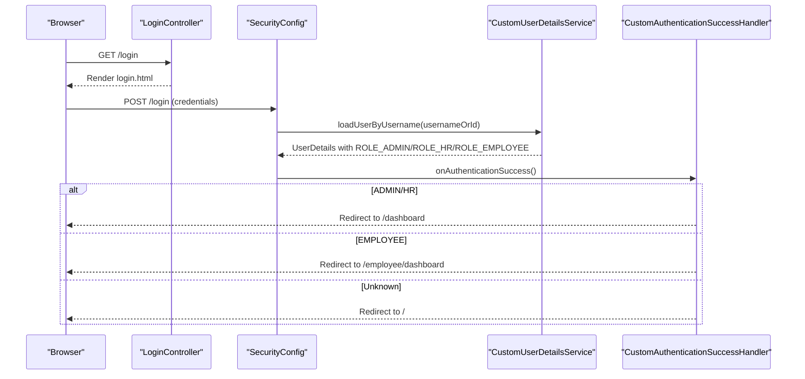
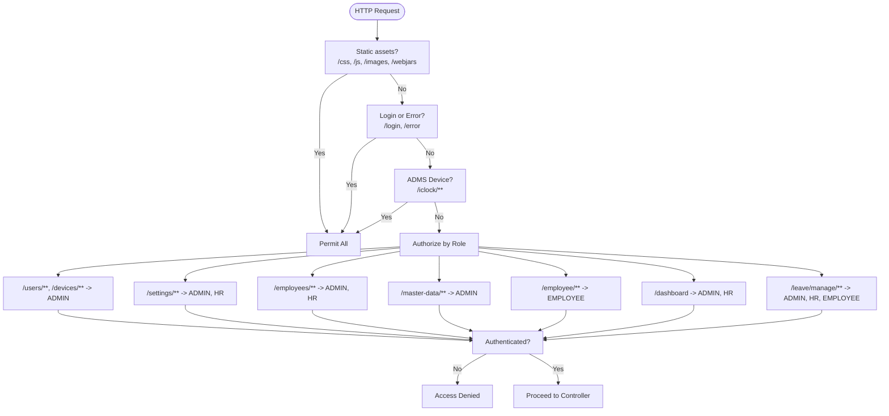
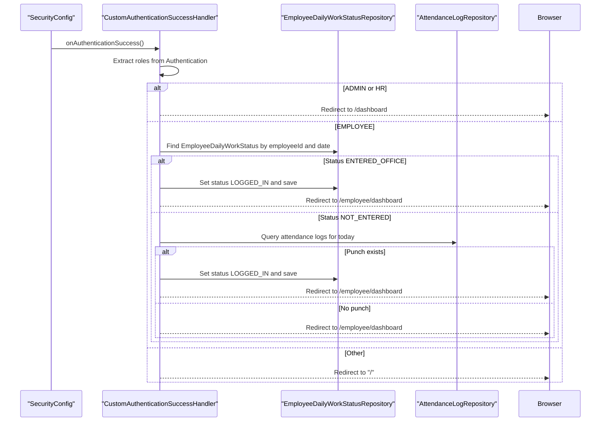
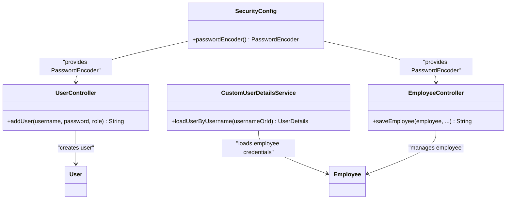
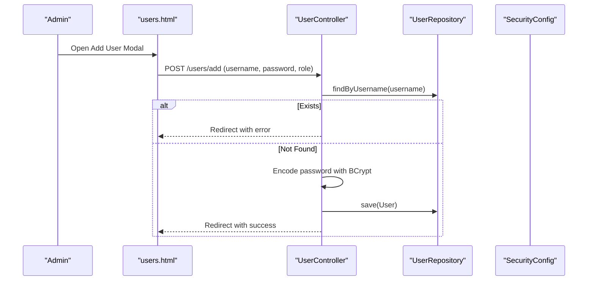
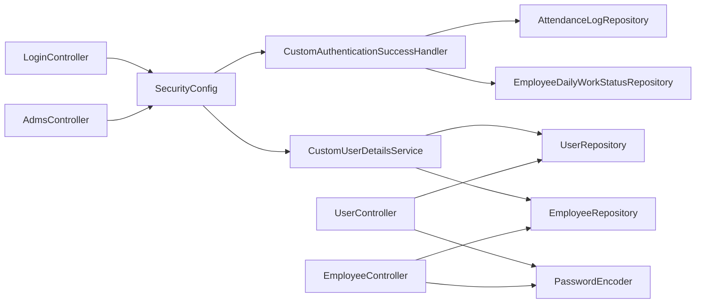

# User Management System

<cite>
**Referenced Files in This Document**
- [User.java](file://src/main/java/root/cyb/mh/attendancesystem/model/User.java)
- [UserController.java](file://src/main/java/root/cyb/mh/attendancesystem/controller/UserController.java)
- [SecurityConfig.java](file://src/main/java/root/cyb/mh/attendancesystem/config/SecurityConfig.java)
- [CustomAuthenticationSuccessHandler.java](file://src/main/java/root/cyb/mh/attendancesystem/config/CustomAuthenticationSuccessHandler.java)
- [CustomUserDetailsService.java](file://src/main/java/root/cyb/mh/attendancesystem/service/CustomUserDetailsService.java)
- [UserRepository.java](file://src/main/java/root/cyb/mh/attendancesystem/repository/UserRepository.java)
- [Employee.java](file://src/main/java/root/cyb/mh/attendancesystem/model/Employee.java)
- [EmployeeController.java](file://src/main/java/root/cyb/mh/attendancesystem/controller/EmployeeController.java)
- [EmployeeDashboardController.java](file://src/main/java/root/cyb/mh/attendancesystem/controller/EmployeeDashboardController.java)
- [LoginController.java](file://src/main/java/root/cyb/mh/attendancesystem/controller/LoginController.java)
- [AdmsController.java](file://src/main/java/root/cyb/mh/attendancesystem/controller/AdmsController.java)
- [EmployeeDailyWorkStatus.java](file://src/main/java/root/cyb/mh/attendancesystem/model/EmployeeDailyWorkStatus.java)
- [users.html](file://src/main/resources/templates/users.html)
- [login.html](file://src/main/resources/templates/login.html)
- [application.properties](file://src/main/resources/application.properties)
</cite>

## Table of Contents
1. [Introduction](#introduction)
2. [Project Structure](#project-structure)
3. [Core Components](#core-components)
4. [Architecture Overview](#architecture-overview)
5. [Detailed Component Analysis](#detailed-component-analysis)
6. [Dependency Analysis](#dependency-analysis)
7. [Performance Considerations](#performance-considerations)
8. [Troubleshooting Guide](#troubleshooting-guide)
9. [Conclusion](#conclusion)

## Introduction
This document describes the user management system for the Skylink Custom Backend, focusing on authentication and authorization, role-based access control (RBAC), custom authentication success handling, password encryption with BCrypt, and session management. It also covers user registration, profile management, role assignment, and security configurations. Practical examples of user workflows and integration points with other system components are included to help administrators and developers deploy and maintain the system securely.

## Project Structure
The user management system spans several layers:
- Data model: User entity and Employee entity
- Security configuration: Spring Security filter chain, password encoder, and custom success handler
- Services: Custom user details service supporting dual login modes (standard users and employees)
- Controllers: User management, employee management, login, and device integration
- Templates: Thymeleaf pages for user administration and login
- Repositories: JPA repositories for persistence

**Diagram sources**
- [UserController.java:1-57](file://src/main/java/root/cyb/mh/attendancesystem/controller/UserController.java#L1-L57)
- [EmployeeController.java:1-213](file://src/main/java/root/cyb/mh/attendancesystem/controller/EmployeeController.java#L1-L213)
- [LoginController.java:1-14](file://src/main/java/root/cyb/mh/attendancesystem/controller/LoginController.java#L1-L14)
- [AdmsController.java:1-65](file://src/main/java/root/cyb/mh/attendancesystem/controller/AdmsController.java#L1-L65)
- [CustomUserDetailsService.java:1-54](file://src/main/java/root/cyb/mh/attendancesystem/service/CustomUserDetailsService.java#L1-L54)
- [CustomAuthenticationSuccessHandler.java:1-66](file://src/main/java/root/cyb/mh/attendancesystem/config/CustomAuthenticationSuccessHandler.java#L1-L66)
- [SecurityConfig.java:1-91](file://src/main/java/root/cyb/mh/attendancesystem/config/SecurityConfig.java#L1-L91)
- [UserRepository.java:1-12](file://src/main/java/root/cyb/mh/attendancesystem/repository/UserRepository.java#L1-L12)
- [User.java:1-24](file://src/main/java/root/cyb/mh/attendancesystem/model/User.java#L1-L24)
- [Employee.java:1-64](file://src/main/java/root/cyb/mh/attendancesystem/model/Employee.java#L1-L64)
- [EmployeeDailyWorkStatus.java:1-45](file://src/main/java/root/cyb/mh/attendancesystem/model/EmployeeDailyWorkStatus.java#L1-L45)
- [users.html:1-125](file://src/main/resources/templates/users.html#L1-L125)
- [login.html:1-96](file://src/main/resources/templates/login.html#L1-L96)

**Section sources**
- [User.java:1-24](file://src/main/java/root/cyb/mh/attendancesystem/model/User.java#L1-L24)
- [Employee.java:1-64](file://src/main/java/root/cyb/mh/attendancesystem/model/Employee.java#L1-L64)
- [SecurityConfig.java:1-91](file://src/main/java/root/cyb/mh/attendancesystem/config/SecurityConfig.java#L1-L91)
- [CustomUserDetailsService.java:1-54](file://src/main/java/root/cyb/mh/attendancesystem/service/CustomUserDetailsService.java#L1-L54)
- [CustomAuthenticationSuccessHandler.java:1-66](file://src/main/java/root/cyb/mh/attendancesystem/config/CustomAuthenticationSuccessHandler.java#L1-L66)
- [UserController.java:1-57](file://src/main/java/root/cyb/mh/attendancesystem/controller/UserController.java#L1-L57)
- [EmployeeController.java:1-213](file://src/main/java/root/cyb/mh/attendancesystem/controller/EmployeeController.java#L1-L213)
- [LoginController.java:1-14](file://src/main/java/root/cyb/mh/attendancesystem/controller/LoginController.java#L1-L14)
- [AdmsController.java:1-65](file://src/main/java/root/cyb/mh/attendancesystem/controller/AdmsController.java#L1-L65)
- [users.html:1-125](file://src/main/resources/templates/users.html#L1-L125)
- [login.html:1-96](file://src/main/resources/templates/login.html#L1-L96)

## Core Components
- User entity: Stores credentials and role for administrative users.
- Employee entity: Supports employee login via employee ID and a hashed "password" stored in the username field.
- CustomUserDetailsService: Loads users either from the User table (ADMIN/HR) or from the Employee table (EMPLOYEE), assigning appropriate roles.
- SecurityConfig: Defines RBAC rules, form login, remember-me, logout, and disables CSRF for compatibility with existing forms.
- CustomAuthenticationSuccessHandler: Redirects users after login and updates employee daily work status.
- UserController: Provides user CRUD operations with BCrypt password hashing.
- EmployeeController: Manages employee profiles, including password hashing for employee login credentials.
- LoginController: Renders the login page.
- AdmsController: Exposes endpoints for device communication, permitted by the security configuration.

**Section sources**
- [User.java:1-24](file://src/main/java/root/cyb/mh/attendancesystem/model/User.java#L1-L24)
- [Employee.java:1-64](file://src/main/java/root/cyb/mh/attendancesystem/model/Employee.java#L1-L64)
- [CustomUserDetailsService.java:1-54](file://src/main/java/root/cyb/mh/attendancesystem/service/CustomUserDetailsService.java#L1-L54)
- [SecurityConfig.java:1-91](file://src/main/java/root/cyb/mh/attendancesystem/config/SecurityConfig.java#L1-L91)
- [CustomAuthenticationSuccessHandler.java:1-66](file://src/main/java/root/cyb/mh/attendancesystem/config/CustomAuthenticationSuccessHandler.java#L1-L66)
- [UserController.java:1-57](file://src/main/java/root/cyb/mh/attendancesystem/controller/UserController.java#L1-L57)
- [EmployeeController.java:1-213](file://src/main/java/root/cyb/mh/attendancesystem/controller/EmployeeController.java#L1-L213)
- [LoginController.java:1-14](file://src/main/java/root/cyb/mh/attendancesystem/controller/LoginController.java#L1-L14)
- [AdmsController.java:1-65](file://src/main/java/root/cyb/mh/attendancesystem/controller/AdmsController.java#L1-L65)

## Architecture Overview
The system enforces role-based access control at the HTTP request level and supports two login modes:
- Standard user login: ADMIN/HR users from the User table
- Employee login: Employees identified by ID with a hashed credential

On successful authentication, the custom success handler redirects users to appropriate dashboards and performs employee-specific status updates.

**Diagram sources**
- [LoginController.java:1-14](file://src/main/java/root/cyb/mh/attendancesystem/controller/LoginController.java#L1-L14)
- [SecurityConfig.java:1-91](file://src/main/java/root/cyb/mh/attendancesystem/config/SecurityConfig.java#L1-L91)
- [CustomUserDetailsService.java:1-54](file://src/main/java/root/cyb/mh/attendancesystem/service/CustomUserDetailsService.java#L1-L54)
- [CustomAuthenticationSuccessHandler.java:1-66](file://src/main/java/root/cyb/mh/attendancesystem/config/CustomAuthenticationSuccessHandler.java#L1-L66)
- [login.html:1-96](file://src/main/resources/templates/login.html#L1-L96)

## Detailed Component Analysis

### Authentication and Authorization
- Role definitions:
  - ADMIN: Full administrative access
  - HR: Read-only administrative access
  - EMPLOYEE: Employee portal access
- RBAC enforcement:
  - Administrative areas (/users, /devices) require ADMIN
  - Settings and HR-managed areas require ADMIN or HR
  - Employee management requires ADMIN or HR
  - Dashboards and leave management have granular role requirements
  - Employee area (/employee) requires EMPLOYEE
- Session management:
  - Form login with custom success handler
  - Remember-me configured with a secret key and 7-day validity
  - Logout configured with a success URL
  - CSRF disabled for compatibility with existing forms

**Diagram sources**
- [SecurityConfig.java:1-91](file://src/main/java/root/cyb/mh/attendancesystem/config/SecurityConfig.java#L1-L91)

**Section sources**
- [SecurityConfig.java:1-91](file://src/main/java/root/cyb/mh/attendancesystem/config/SecurityConfig.java#L1-L91)

### Custom Authentication Success Handler
The handler performs role-based redirection and, for employees, attempts to upgrade their daily work status if they have entered the office or have an attendance punch for the day.

**Diagram sources**
- [CustomAuthenticationSuccessHandler.java:1-66](file://src/main/java/root/cyb/mh/attendancesystem/config/CustomAuthenticationSuccessHandler.java#L1-L66)
- [EmployeeDailyWorkStatus.java:1-45](file://src/main/java/root/cyb/mh/attendancesystem/model/EmployeeDailyWorkStatus.java#L1-L45)

**Section sources**
- [CustomAuthenticationSuccessHandler.java:1-66](file://src/main/java/root/cyb/mh/attendancesystem/config/CustomAuthenticationSuccessHandler.java#L1-L66)
- [EmployeeDailyWorkStatus.java:1-45](file://src/main/java/root/cyb/mh/attendancesystem/model/EmployeeDailyWorkStatus.java#L1-L45)

### Password Encryption with BCrypt
- PasswordEncoder bean uses BCrypt.
- UserController hashes passwords during user creation.
- EmployeeController hashes passwords when creating/updating employees.
- CustomUserDetailsService loads employee credentials from the username field (hashed) and assigns ROLE_EMPLOYEE.

**Diagram sources**
- [SecurityConfig.java:1-91](file://src/main/java/root/cyb/mh/attendancesystem/config/SecurityConfig.java#L1-L91)
- [UserController.java:1-57](file://src/main/java/root/cyb/mh/attendancesystem/controller/UserController.java#L1-L57)
- [EmployeeController.java:1-213](file://src/main/java/root/cyb/mh/attendancesystem/controller/EmployeeController.java#L1-L213)
- [CustomUserDetailsService.java:1-54](file://src/main/java/root/cyb/mh/attendancesystem/service/CustomUserDetailsService.java#L1-L54)

**Section sources**
- [SecurityConfig.java:1-91](file://src/main/java/root/cyb/mh/attendancesystem/config/SecurityConfig.java#L1-L91)
- [UserController.java:1-57](file://src/main/java/root/cyb/mh/attendancesystem/controller/UserController.java#L1-L57)
- [EmployeeController.java:1-213](file://src/main/java/root/cyb/mh/attendancesystem/controller/EmployeeController.java#L1-L213)
- [CustomUserDetailsService.java:1-54](file://src/main/java/root/cyb/mh/attendancesystem/service/CustomUserDetailsService.java#L1-L54)

### User Registration and Profile Management
- User registration:
  - Uses the users page modal to submit username, password, and role.
  - Duplicate usernames are prevented; otherwise, the user is created with a hashed password.
- Employee profile management:
  - Employees can update personal details and change their login credential (hashed).
  - Supervisory relationships and department assignments are supported.
- Self-service password change for employees:
  - Validates old password against the hashed credential and updates to a new hashed credential.

**Diagram sources**
- [users.html:1-125](file://src/main/resources/templates/users.html#L1-L125)
- [UserController.java:1-57](file://src/main/java/root/cyb/mh/attendancesystem/controller/UserController.java#L1-L57)
- [UserRepository.java:1-12](file://src/main/java/root/cyb/mh/attendancesystem/repository/UserRepository.java#L1-L12)
- [SecurityConfig.java:1-91](file://src/main/java/root/cyb/mh/attendancesystem/config/SecurityConfig.java#L1-L91)

**Section sources**
- [users.html:1-125](file://src/main/resources/templates/users.html#L1-L125)
- [UserController.java:1-57](file://src/main/java/root/cyb/mh/attendancesystem/controller/UserController.java#L1-L57)
- [UserRepository.java:1-12](file://src/main/java/root/cyb/mh/attendancesystem/repository/UserRepository.java#L1-L12)

### Role Assignment and Access Control
- Roles are enforced per endpoint:
  - ADMIN-only: /users/**, /devices/**
  - ADMIN/HR: /settings/**, /employees/**, /admin/shifts/**, /master-data/** (except contractor APIs)
  - ADMIN/HR/EMPLOYEE: /master-data/contractors/**, /master-data/api/**
  - EMPLOYEE: /employee/**
  - ADMIN/HR: /dashboard
  - ADMIN/HR/EMPLOYEE: /leave/manage/**
- Remember-me token is valid for 7 days.

**Section sources**
- [SecurityConfig.java:1-91](file://src/main/java/root/cyb/mh/attendancesystem/config/SecurityConfig.java#L1-L91)

### Integration with Device Communication
- ADMS device endpoints are permitted without authentication to support device-to-server communication.
- Endpoints include handshake, data push, command requests, registry checks, and command result handling.

**Section sources**
- [AdmsController.java:1-65](file://src/main/java/root/cyb/mh/attendancesystem/controller/AdmsController.java#L1-L65)
- [SecurityConfig.java:1-91](file://src/main/java/root/cyb/mh/attendancesystem/config/SecurityConfig.java#L1-L91)

## Dependency Analysis
The following diagram shows key dependencies among components involved in user management and authentication.

**Diagram sources**
- [SecurityConfig.java:1-91](file://src/main/java/root/cyb/mh/attendancesystem/config/SecurityConfig.java#L1-L91)
- [CustomUserDetailsService.java:1-54](file://src/main/java/root/cyb/mh/attendancesystem/service/CustomUserDetailsService.java#L1-L54)
- [CustomAuthenticationSuccessHandler.java:1-66](file://src/main/java/root/cyb/mh/attendancesystem/config/CustomAuthenticationSuccessHandler.java#L1-L66)
- [UserController.java:1-57](file://src/main/java/root/cyb/mh/attendancesystem/controller/UserController.java#L1-L57)
- [EmployeeController.java:1-213](file://src/main/java/root/cyb/mh/attendancesystem/controller/EmployeeController.java#L1-L213)
- [LoginController.java:1-14](file://src/main/java/root/cyb/mh/attendancesystem/controller/LoginController.java#L1-L14)
- [AdmsController.java:1-65](file://src/main/java/root/cyb/mh/attendancesystem/controller/AdmsController.java#L1-L65)
- [UserRepository.java:1-12](file://src/main/java/root/cyb/mh/attendancesystem/repository/UserRepository.java#L1-L12)

**Section sources**
- [SecurityConfig.java:1-91](file://src/main/java/root/cyb/mh/attendancesystem/config/SecurityConfig.java#L1-L91)
- [CustomUserDetailsService.java:1-54](file://src/main/java/root/cyb/mh/attendancesystem/service/CustomUserDetailsService.java#L1-L54)
- [CustomAuthenticationSuccessHandler.java:1-66](file://src/main/java/root/cyb/mh/attendancesystem/config/CustomAuthenticationSuccessHandler.java#L1-L66)
- [UserController.java:1-57](file://src/main/java/root/cyb/mh/attendancesystem/controller/UserController.java#L1-L57)
- [EmployeeController.java:1-213](file://src/main/java/root/cyb/mh/attendancesystem/controller/EmployeeController.java#L1-L213)
- [LoginController.java:1-14](file://src/main/java/root/cyb/mh/attendancesystem/controller/LoginController.java#L1-L14)
- [AdmsController.java:1-65](file://src/main/java/root/cyb/mh/attendancesystem/controller/AdmsController.java#L1-L65)
- [UserRepository.java:1-12](file://src/main/java/root/cyb/mh/attendancesystem/repository/UserRepository.java#L1-L12)

## Performance Considerations
- Password hashing with BCrypt is computationally intensive; ensure the server has adequate CPU capacity for concurrent logins.
- Minimize database queries by leveraging caching where appropriate and avoiding redundant lookups in custom success handler logic.
- Keep CSRF disabled only if necessary; enabling CSRF improves protection against cross-site request forgery attacks.

[No sources needed since this section provides general guidance]

## Troubleshooting Guide
- Login fails or redirects incorrectly:
  - Verify the success handler logic and ensure roles are correctly mapped.
  - Confirm the login page renders properly and credentials are submitted to the configured login processing URL.
- Employee cannot log in:
  - Ensure the employee record exists and the username field contains a valid hashed credential.
  - Check that the employee ID is used as the username during login.
- User deletion issues:
  - Self-deletion is blocked; ensure the logged-in user is not attempting to delete their own account.
- Remember-me not working:
  - Confirm the remember-me key and token validity are configured and cookies are accepted by the browser.

**Section sources**
- [CustomAuthenticationSuccessHandler.java:1-66](file://src/main/java/root/cyb/mh/attendancesystem/config/CustomAuthenticationSuccessHandler.java#L1-L66)
- [CustomUserDetailsService.java:1-54](file://src/main/java/root/cyb/mh/attendancesystem/service/CustomUserDetailsService.java#L1-L54)
- [UserController.java:1-57](file://src/main/java/root/cyb/mh/attendancesystem/controller/UserController.java#L1-L57)
- [login.html:1-96](file://src/main/resources/templates/login.html#L1-L96)

## Conclusion
The Skylink Custom Backend implements a robust user management system with role-based access control, secure password handling using BCrypt, and flexible login modes for administrators and employees. The custom success handler enhances user experience by redirecting appropriately and updating employee work statuses. Administrators can manage users and employees through dedicated controllers and templates, while device integration remains unrestricted for operational needs. Proper configuration of security settings and adherence to best practices will ensure a secure and efficient deployment.