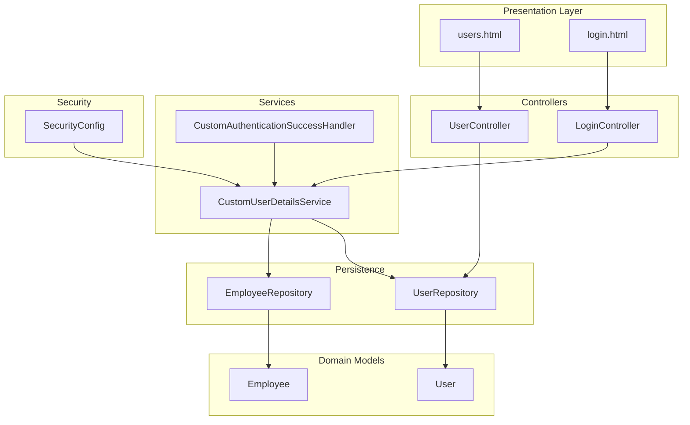
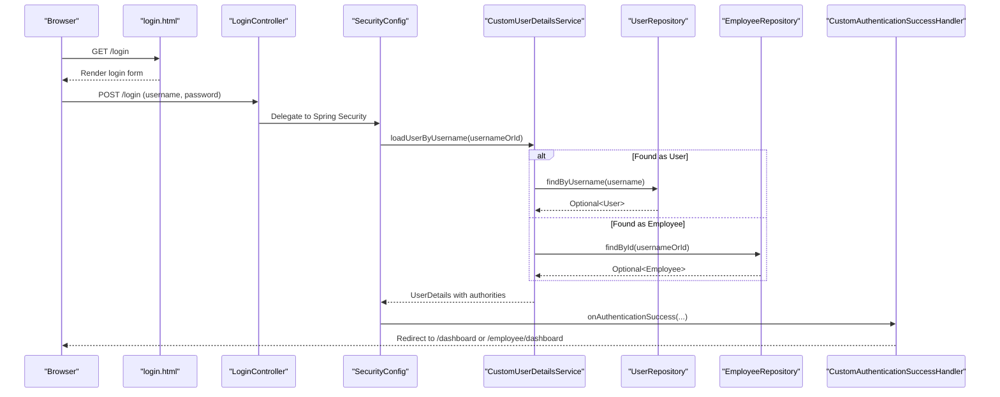
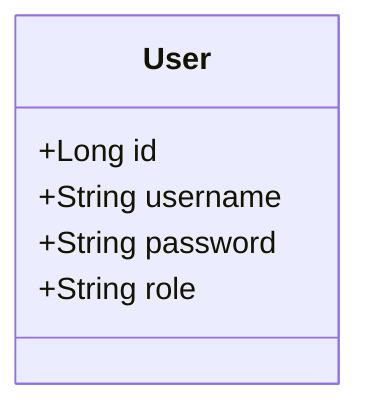
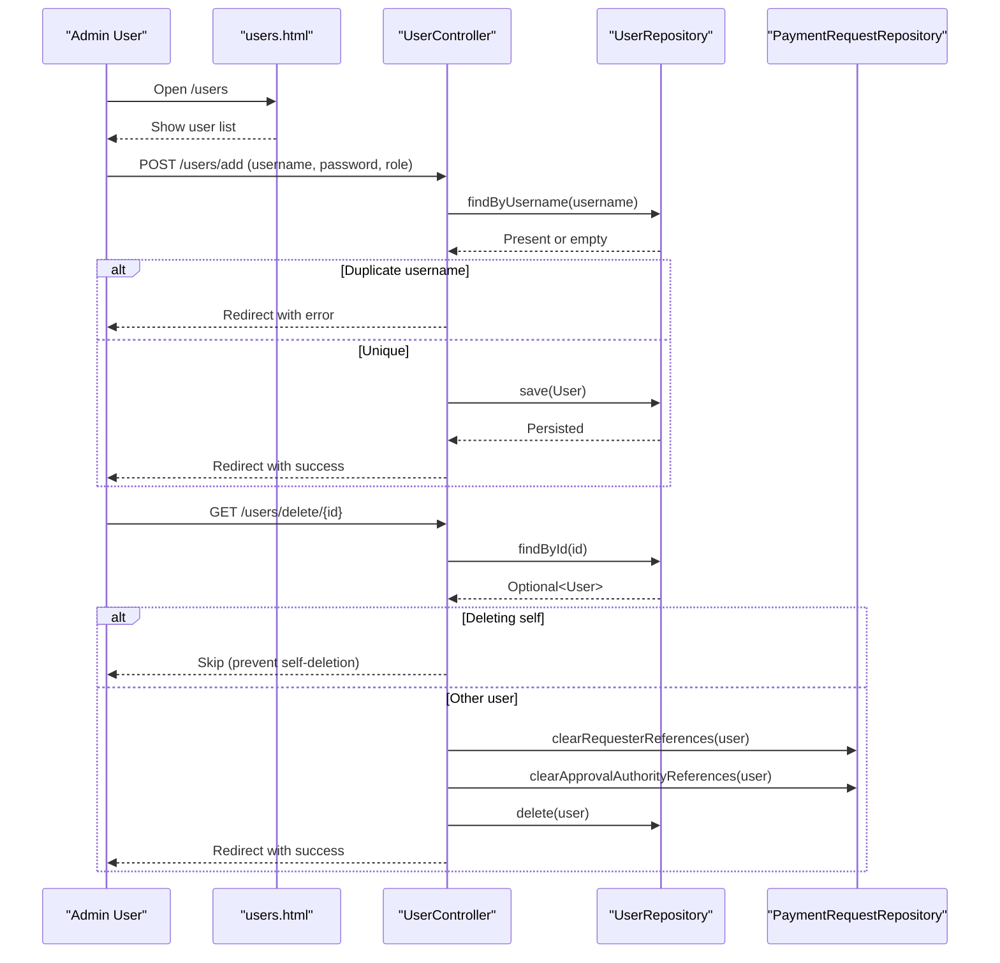
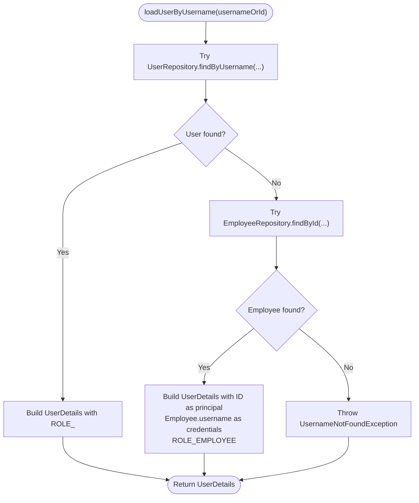
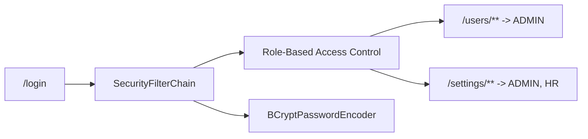
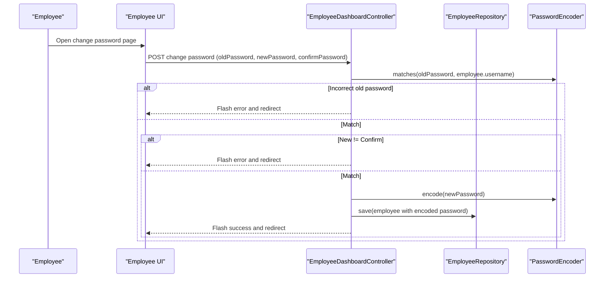
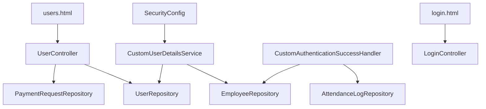

# User Profile Management

<cite>
**Referenced Files in This Document**
- [User.java](file://src/main/java/root/cyb/mh/attendancesystem/model/User.java)
- [UserController.java](file://src/main/java/root/cyb/mh/attendancesystem/controller/UserController.java)
- [UserRepository.java](file://src/main/java/root/cyb/mh/attendancesystem/repository/UserRepository.java)
- [CustomUserDetailsService.java](file://src/main/java/root/cyb/mh/attendancesystem/service/CustomUserDetailsService.java)
- [SecurityConfig.java](file://src/main/java/root/cyb/mh/attendancesystem/config/SecurityConfig.java)
- [users.html](file://src/main/resources/templates/users.html)
- [login.html](file://src/main/resources/templates/login.html)
- [Employee.java](file://src/main/java/root/cyb/mh/attendancesystem/model/Employee.java)
- [EmployeeRepository.java](file://src/main/java/root/cyb/mh/attendancesystem/repository/EmployeeRepository.java)
- [CustomAuthenticationSuccessHandler.java](file://src/main/java/root/cyb/mh/attendancesystem/config/CustomAuthenticationSuccessHandler.java)
- [LoginController.java](file://src/main/java/root/cyb/mh/attendancesystem/controller/LoginController.java)
</cite>

## Table of Contents
1. [Introduction](#introduction)
2. [Project Structure](#project-structure)
3. [Core Components](#core-components)
4. [Architecture Overview](#architecture-overview)
5. [Detailed Component Analysis](#detailed-component-analysis)
6. [Dependency Analysis](#dependency-analysis)
7. [Performance Considerations](#performance-considerations)
8. [Troubleshooting Guide](#troubleshooting-guide)
9. [Conclusion](#conclusion)

## Introduction
This document describes the user profile management functionality of the Skylink attendance system. It covers user CRUD operations, registration workflows, profile update processes, data validation, and security controls. It also explains the User entity structure, field mappings, and relationships with the Employee entity, along with integration points for user details and authentication. Practical examples illustrate how administrators manage users and how employees change their passwords. Administrative capabilities are scoped to ADMIN and HR roles, while employee-facing features are role-restricted accordingly.

## Project Structure
The user management domain spans model, repository, controller, service, configuration, and template layers. The following diagram shows the high-level structure and key interactions.

**Diagram sources**
- [users.html](file://src/main/resources/templates/users.html)
- [login.html](file://src/main/resources/templates/login.html)
- [UserController.java](file://src/main/java/root/cyb/mh/attendancesystem/controller/UserController.java)
- [LoginController.java](file://src/main/java/root/cyb/mh/attendancesystem/controller/LoginController.java)
- [CustomUserDetailsService.java](file://src/main/java/root/cyb/mh/attendancesystem/service/CustomUserDetailsService.java)
- [CustomAuthenticationSuccessHandler.java](file://src/main/java/root/cyb/mh/attendancesystem/config/CustomAuthenticationSuccessHandler.java)
- [SecurityConfig.java](file://src/main/java/root/cyb/mh/attendancesystem/config/SecurityConfig.java)
- [UserRepository.java](file://src/main/java/root/cyb/mh/attendancesystem/repository/UserRepository.java)
- [EmployeeRepository.java](file://src/main/java/root/cyb/mh/attendancesystem/repository/EmployeeRepository.java)
- [User.java](file://src/main/java/root/cyb/mh/attendancesystem/model/User.java)
- [Employee.java](file://src/main/java/root/cyb/mh/attendancesystem/model/Employee.java)

**Section sources**
- [User.java](file://src/main/java/root/cyb/mh/attendancesystem/model/User.java)
- [UserController.java](file://src/main/java/root/cyb/mh/attendancesystem/controller/UserController.java)
- [UserRepository.java](file://src/main/java/root/cyb/mh/attendancesystem/repository/UserRepository.java)
- [CustomUserDetailsService.java](file://src/main/java/root/cyb/mh/attendancesystem/service/CustomUserDetailsService.java)
- [SecurityConfig.java](file://src/main/java/root/cyb/mh/attendancesystem/config/SecurityConfig.java)
- [users.html](file://src/main/resources/templates/users.html)
- [login.html](file://src/main/resources/templates/login.html)
- [Employee.java](file://src/main/java/root/cyb/mh/attendancesystem/model/Employee.java)
- [EmployeeRepository.java](file://src/main/java/root/cyb/mh/attendancesystem/repository/EmployeeRepository.java)
- [CustomAuthenticationSuccessHandler.java](file://src/main/java/root/cyb/mh/attendancesystem/config/CustomAuthenticationSuccessHandler.java)
- [LoginController.java](file://src/main/java/root/cyb/mh/attendancesystem/controller/LoginController.java)

## Core Components
- User entity: Represents administrative users with username, encoded password, and role (ADMIN or HR). Stored in a dedicated table with unique constraints on username.
- UserController: Exposes GET and POST endpoints for listing users and adding new users, and a DELETE endpoint for removing users with safeguards against self-deletion.
- UserRepository: JPA repository providing lookup by username and filtering by role.
- CustomUserDetailsService: Loads user details for authentication, supporting both standard User accounts and Employee accounts (using Employee ID as the principal name and Employee username field as the password hash).
- SecurityConfig: Defines role-based access control, login/logout, remember-me, and password encoding.
- Template pages: users.html provides the admin UI for listing, adding, and deleting users; login.html provides the login page.

**Section sources**
- [User.java](file://src/main/java/root/cyb/mh/attendancesystem/model/User.java)
- [UserController.java](file://src/main/java/root/cyb/mh/attendancesystem/controller/UserController.java)
- [UserRepository.java](file://src/main/java/root/cyb/mh/attendancesystem/repository/UserRepository.java)
- [CustomUserDetailsService.java](file://src/main/java/root/cyb/mh/attendancesystem/service/CustomUserDetailsService.java)
- [SecurityConfig.java](file://src/main/java/root/cyb/mh/attendancesystem/config/SecurityConfig.java)
- [users.html](file://src/main/resources/templates/users.html)
- [login.html](file://src/main/resources/templates/login.html)

## Architecture Overview
The user management flow integrates Spring MVC, Spring Security, and Thymeleaf. Authentication is handled by loading user details from either the User or Employee domain, while authorization is enforced via role-based path rules.

**Diagram sources**
- [login.html](file://src/main/resources/templates/login.html)
- [LoginController.java](file://src/main/java/root/cyb/mh/attendancesystem/controller/LoginController.java)
- [SecurityConfig.java](file://src/main/java/root/cyb/mh/attendancesystem/config/SecurityConfig.java)
- [CustomUserDetailsService.java](file://src/main/java/root/cyb/mh/attendancesystem/service/CustomUserDetailsService.java)
- [UserRepository.java](file://src/main/java/root/cyb/mh/attendancesystem/repository/UserRepository.java)
- [EmployeeRepository.java](file://src/main/java/root/cyb/mh/attendancesystem/repository/EmployeeRepository.java)
- [CustomAuthenticationSuccessHandler.java](file://src/main/java/root/cyb/mh/attendancesystem/config/CustomAuthenticationSuccessHandler.java)

## Detailed Component Analysis

### User Entity and Field Mappings
The User entity defines the core attributes for administrative accounts:
- id: auto-generated primary key
- username: unique, non-null
- password: non-null, stored as encoded text
- role: non-null, values ADMIN or HR

**Diagram sources**
- [User.java](file://src/main/java/root/cyb/mh/attendancesystem/model/User.java)

**Section sources**
- [User.java](file://src/main/java/root/cyb/mh/attendancesystem/model/User.java)

### User CRUD Operations
- List users: GET /users renders the users.html page and populates a list of all users.
- Add user: POST /users/add validates uniqueness of username, encodes the password, sets role, and persists the record.
- Delete user: GET /users/delete/{id} prevents self-deletion, clears related payment request references, and deletes the user.

**Diagram sources**
- [users.html](file://src/main/resources/templates/users.html)
- [UserController.java](file://src/main/java/root/cyb/mh/attendancesystem/controller/UserController.java)
- [UserRepository.java](file://src/main/java/root/cyb/mh/attendancesystem/repository/UserRepository.java)

**Section sources**
- [UserController.java](file://src/main/java/root/cyb/mh/attendancesystem/controller/UserController.java)
- [UserRepository.java](file://src/main/java/root/cyb/mh/attendancesystem/repository/UserRepository.java)
- [users.html](file://src/main/resources/templates/users.html)

### User Registration Workflow
Registration is performed by administrators via the users.html UI:
- Open the user management page.
- Click “Add User” and fill in username, password, and role.
- Submit to POST /users/add, which triggers validation and persistence.

Practical example steps:
- Navigate to /users.
- Fill the modal with username, password, and select ADMIN or HR.
- Submit to create the user.

**Section sources**
- [users.html](file://src/main/resources/templates/users.html)
- [UserController.java](file://src/main/java/root/cyb/mh/attendancesystem/controller/UserController.java)

### Profile Update Processes
- Administrative updates: The current implementation focuses on creation and deletion. There is no dedicated endpoint for updating user profile fields (e.g., role) in the UserController. Administrators would need to extend the controller to support updates if required.
- Employee password change: Employees change their password via the employee module using the Employee model’s username field as the hashed password storage.

Note: The User entity does not include fields for personal profile customization (e.g., email, full name). If such fields are needed, extend the User entity and add corresponding UI and validation.

**Section sources**
- [UserController.java](file://src/main/java/root/cyb/mh/attendancesystem/controller/UserController.java)
- [Employee.java](file://src/main/java/root/cyb/mh/attendancesystem/model/Employee.java)

### User Data Validation
- Username uniqueness: Enforced during user creation by checking UserRepository.findByUsername.
- Role validation: Role values are ADMIN or HR; enforcement occurs in the controller when setting the role.
- Password encoding: PasswordEncoder is used to encode plaintext passwords before saving.

**Section sources**
- [UserController.java](file://src/main/java/root/cyb/mh/attendancesystem/controller/UserController.java)
- [UserRepository.java](file://src/main/java/root/cyb/mh/attendancesystem/repository/UserRepository.java)
- [SecurityConfig.java](file://src/main/java/root/cyb/mh/attendancesystem/config/SecurityConfig.java)

### User Details Service Integration
CustomUserDetailsService supports dual login sources:
- Standard User: loads by username, constructs UserDetails with ROLE_{user.role}.
- Employee: loads by ID, uses Employee.username (hashed) as credentials and assigns ROLE_EMPLOYEE.

**Diagram sources**
- [CustomUserDetailsService.java](file://src/main/java/root/cyb/mh/attendancesystem/service/CustomUserDetailsService.java)
- [UserRepository.java](file://src/main/java/root/cyb/mh/attendancesystem/repository/UserRepository.java)
- [EmployeeRepository.java](file://src/main/java/root/cyb/mh/attendancesystem/repository/EmployeeRepository.java)

**Section sources**
- [CustomUserDetailsService.java](file://src/main/java/root/cyb/mh/attendancesystem/service/CustomUserDetailsService.java)
- [UserRepository.java](file://src/main/java/root/cyb/mh/attendancesystem/repository/UserRepository.java)
- [EmployeeRepository.java](file://src/main/java/root/cyb/mh/attendancesystem/repository/EmployeeRepository.java)

### Authentication and Authorization
- Login page: login.html submits credentials to the security filter chain.
- Security rules: Role-based access control restricts access to administrative areas (/users/**, /devices/**) to ADMIN, and to /settings/** to ADMIN and HR.
- Password encoding: BCryptPasswordEncoder is configured globally.

**Diagram sources**
- [login.html](file://src/main/resources/templates/login.html)
- [SecurityConfig.java](file://src/main/java/root/cyb/mh/attendancesystem/config/SecurityConfig.java)
- [SecurityConfig.java](file://src/main/java/root/cyb/mh/attendancesystem/config/SecurityConfig.java)

**Section sources**
- [login.html](file://src/main/resources/templates/login.html)
- [SecurityConfig.java](file://src/main/java/root/cyb/mh/attendancesystem/config/SecurityConfig.java)

### Administrative User Management Capabilities
- Listing users: Available to authorized users.
- Adding users: Restricted to ADMIN.
- Deleting users: Restricted to ADMIN; prevents self-deletion and cleans up related references.

Access control examples:
- /users/** requires ADMIN.
- /settings/** requires ADMIN or HR.

**Section sources**
- [users.html](file://src/main/resources/templates/users.html)
- [UserController.java](file://src/main/java/root/cyb/mh/attendancesystem/controller/UserController.java)
- [SecurityConfig.java](file://src/main/java/root/cyb/mh/attendancesystem/config/SecurityConfig.java)

### Employee Password Change (Profile Update)
Employees change their password using the Employee model’s username field as the hashed password. The process validates the old password, ensures new password confirmation matches, encodes the new password, and saves the Employee record.

**Diagram sources**
- [CustomUserDetailsService.java](file://src/main/java/root/cyb/mh/attendancesystem/service/CustomUserDetailsService.java)
- [EmployeeRepository.java](file://src/main/java/root/cyb/mh/attendancesystem/repository/EmployeeRepository.java)

**Section sources**
- [CustomUserDetailsService.java](file://src/main/java/root/cyb/mh/attendancesystem/service/CustomUserDetailsService.java)
- [EmployeeRepository.java](file://src/main/java/root/cyb/mh/attendancesystem/repository/EmployeeRepository.java)

## Dependency Analysis
The following diagram shows the main dependencies among components involved in user management.

**Diagram sources**
- [UserController.java](file://src/main/java/root/cyb/mh/attendancesystem/controller/UserController.java)
- [UserRepository.java](file://src/main/java/root/cyb/mh/attendancesystem/repository/UserRepository.java)
- [CustomUserDetailsService.java](file://src/main/java/root/cyb/mh/attendancesystem/service/CustomUserDetailsService.java)
- [CustomAuthenticationSuccessHandler.java](file://src/main/java/root/cyb/mh/attendancesystem/config/CustomAuthenticationSuccessHandler.java)
- [users.html](file://src/main/resources/templates/users.html)
- [login.html](file://src/main/resources/templates/login.html)
- [LoginController.java](file://src/main/java/root/cyb/mh/attendancesystem/controller/LoginController.java)

**Section sources**
- [UserController.java](file://src/main/java/root/cyb/mh/attendancesystem/controller/UserController.java)
- [CustomUserDetailsService.java](file://src/main/java/root/cyb/mh/attendancesystem/service/CustomUserDetailsService.java)
- [CustomAuthenticationSuccessHandler.java](file://src/main/java/root/cyb/mh/attendancesystem/config/CustomAuthenticationSuccessHandler.java)
- [users.html](file://src/main/resources/templates/users.html)
- [login.html](file://src/main/resources/templates/login.html)
- [LoginController.java](file://src/main/java/root/cyb/mh/attendancesystem/controller/LoginController.java)

## Performance Considerations
- Password hashing: Using BCrypt is secure but computationally intensive; ensure batch operations avoid unnecessary re-hashing.
- Query patterns: findByUsername and role-based queries are efficient with proper indexing on username and role columns.
- Transaction boundaries: Deletion includes cleanup of related references; keep transaction scopes minimal to reduce contention.

## Troubleshooting Guide
- Duplicate username on add: The controller checks for existing usernames and redirects with an error parameter. Verify the username is unique before submission.
- Self-deletion prevention: Attempting to delete the currently logged-in user is blocked; ensure administrators use another account for deletions.
- Authentication failures: Ensure credentials match the chosen source (User.username/password or Employee.id/Employee.username). The login page displays invalid credentials feedback.
- Authorization errors: Access to /users/** requires ADMIN; to access settings, the user must have ADMIN or HR role.

**Section sources**
- [UserController.java](file://src/main/java/root/cyb/mh/attendancesystem/controller/UserController.java)
- [login.html](file://src/main/resources/templates/login.html)
- [SecurityConfig.java](file://src/main/java/root/cyb/mh/attendancesystem/config/SecurityConfig.java)

## Conclusion
The user profile management subsystem provides a focused set of administrative capabilities for managing administrative users (ADMIN/HR) with secure authentication and authorization. The design leverages a dedicated User entity and repository, integrates with a broader Employee domain for employee logins, and enforces role-based access control. Extending the system to support additional user profile fields, update operations, and synchronization with external systems would involve enhancing the User entity, controller endpoints, and associated templates while preserving security and validation.